# 预测 AFL 匹配结果(第 1 部分)

> 原文：<https://medium.com/analytics-vidhya/predicting-afl-match-outcomes-part-1-650df6c7cd40?source=collection_archive---------13----------------------->

## 介绍 Wilma，这是一个 Elo 风格的模型，用于评定 AFL 团队的实力和质量

[*" File:2018 AFL Grand Final panorama . jpg "*](https://commons.wikimedia.org/w/index.php?curid=73293843)*BY*[*闪烁不定*](https://commons.wikimedia.org/wiki/User:Flickerd) *授权于*[*CC BY-SA 4.0*](https://creativecommons.org/licenses/by-sa/4.0/?ref=ccsearch&atype=rich)

在这篇文章中，我们介绍了第一个针对 AFL 团队实力和质量的评级系统 **Wilma** 。Wilma 是一个 Elo 风格的模型，它比较不同时期的团队实力和质量。威尔玛预测比赛获胜者的记录在整个 AFL 历史上的准确率为 68.2%，在截至 2019 赛季结束的 20 年里的准确率为 65.8%。

*   **模型构建**我们使用时间序列嵌套交叉验证来校准 Wilma 对实际比赛结果、主队调整和赛季结转因素的反应灵敏度。
*   **绩效**根据每个校准参数的功效以及预测结果的准确性和成功率进行评估。
*   Wilma 可用于反映最近的团队表现，以及预测即将到来的比赛和赛季结果。

Wilma 的表现将被用作评估未来模型质量的基准 KPI。本文的其余部分将讨论用于构建模型、评估性能以及如何使用其预测的方法。

## 什么是 Elo 系统？

对比赛中的运动员技能进行评级的最常见的系统之一是 Elo 系统，该系统最初被实现为国际象棋评级系统，并且已经被扩展为用于诸如团队运动的多人比赛的评级系统。Elo 模型使用以下原则计算每个团队(或球员)的评分。

*   Elo 的核心假设是，表现遵循正态分布，虽然表现可能会因游戏而异，但团队表现的平均值只会随着时间的推移而缓慢变化。Elo 系统中的表现是根据对其他球队的胜败和平局来推断的。
*   这个系统是零和的；因此，根据赛前评级，球队的得失取决于结果的出乎意料程度。球队赢得冷门会得到更多的分数，反之亦然。
*   评级是建立在逐场比赛而不是逐赛季的基础上，并跟踪一年中球队“状态”的变化。

用于在每场比赛后更新团队 Elo 评级的公式为:

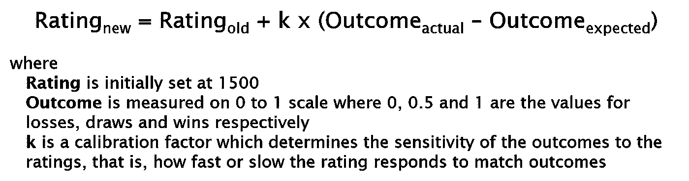

当一个团队的实际得分超过其预期得分时，Elo 系统会将此作为该团队评级过低的证据，需要通过线性调整向上调整(反之亦然)。在任一方向上的最大可能调整等于 k 系数。

虽然实际结果只有三种可能状态，但预期结果表示为 0 到 1 之间的(连续)获胜概率，并使用标准国际象棋实现进行计算:

***n*** 的值与 ***k*** 相关——这样在 n=400，k=40 的实现中，如果 A 队比 B 队多了 ***n*** 个 Elo 点，那么他们的技能是 B 队的 10 倍。

## 模型构建

在开发一个基线模型的同时，我们也试图理解 Elo 模型在 AFL 历史的不同时期是如何工作的。为此，我们使用[网格搜索](https://en.wikipedia.org/wiki/Hyperparameter_optimization#Grid_search)对每个 10 年培训窗口的常规回合评估模型输出。

我们使用 R 中的 [elo 包来计算 elo 评级。模型的形式被设置为返回主队获胜概率作为结果。为了将 Elo 模型校准到 AFL 的细微之处，我们指定了三个要调整的因子——k 因子、赛季结转 c 因子和主队调整 h 因子。](https://cran.r-project.org/web/packages/elo/vignettes/elo.html)

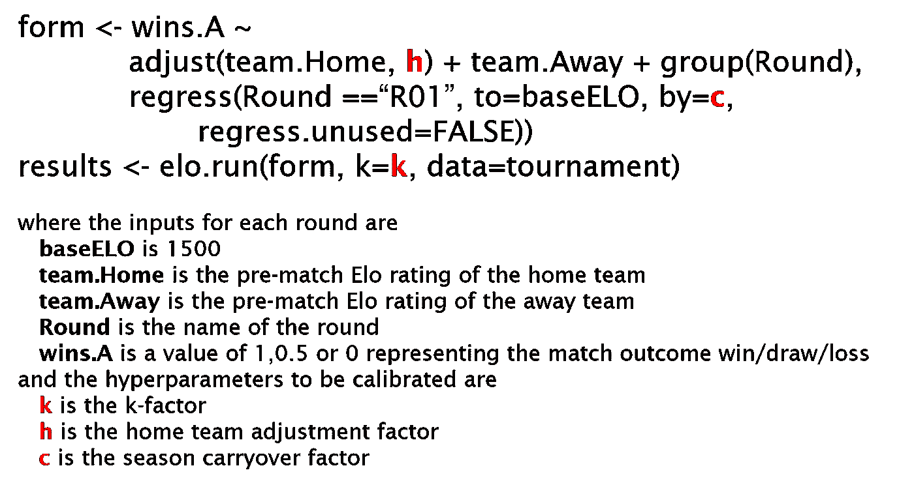

**误差度量**使用[对数损失](https://conorsdatablog.wordpress.com/2018/03/03/log-loss-a-short-note/)评估 Wilma 模型的功效，对数损失是二元分类的成本函数。此外，我们还计算正确的成功预测百分比作为模型 KPI。

**交叉验证**模型性能分别使用 10 年和 2 年的样本期内和样本期外进行评估。初始测试中的这些样本期使我们能够理解(1)在给定有限历史的情况下，模型从初始评级适应的速度有多快(2)模型参数在长期历史中的稳定性，以及(3)纳入团队表现的周期以及游戏随时间的演变— [之前的研究](/@denisewong1/a-closer-look-at-afl-stats-conversion-rates-d2b393eb3b0c)表明，自从首次使用 AFL 以来，得分差距有所增加，得分镜头的组成也发生了变化。

使用[嵌套时间序列交叉验证](https://towardsdatascience.com/time-series-nested-cross-validation-76adba623eb9)计算与超参数相关的性能。

*   对于每个 10 年周期和给定的超参数值，我们计算 1 至 8 年训练数据中每一年的误差，以及与紧接训练数据集结束后的 2 年相关的验证误差。
*   计算每个滚动周期的训练和验证误差的平均值，选择与验证集的最低平均误差*相关的超参数值，并将其应用于 2 年测试数据集。*
*   这种方法通过使用一个数据集校准参数和一个单独的未知数据集进行预测，确保最大限度地利用可用数据，同时避免数据泄漏。

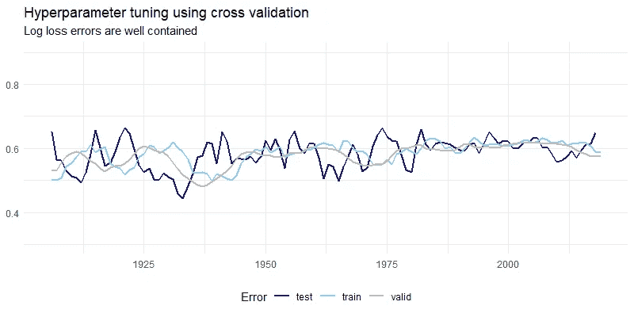

敏感性检验表明，58.5% 模型产生的**测井损失误差与[同行](https://www.betfair.com.au/hub/how-to-build-an-afl-model/)进行的模拟在同一数量级。**

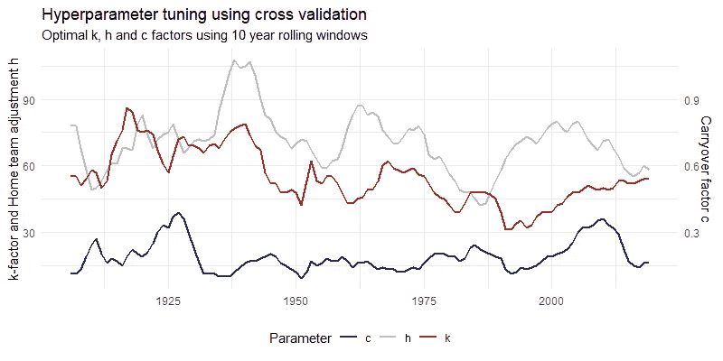

## 绩效和结果

假定保持时间序列顺序是必要的，并且超参数相互依赖，则使用网格搜索为每个滚动窗口同时优化超参数。每个超参数的目的和功效如下所述。

**k 因子**决定了比赛结果对排名的敏感度，即排名对比赛结果的反应快慢。历史上的 k 系数从 75 到 50 呈下降趋势，目前反映了每个赛季比赛轮数的增加——趋势的存在支持使用滚动窗口计算以获得更高的准确性。

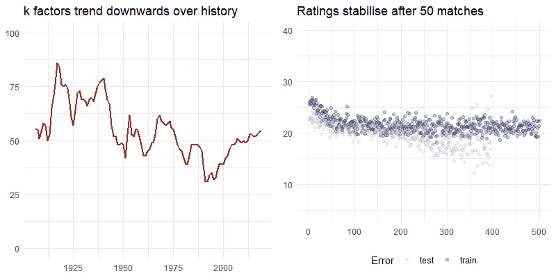

在 Elo 模型稳定下来，评级开始纳入一个球队预期表现的更完整的图景之前，评级稳定(定义为每场比赛 Elo 评级的绝对变化)最初发生在 50 场比赛之后——在今天的 10 个赛季的训练数据集内大约 5 轮比赛。

**主队调整 h** 调整主队的 Elo 评级——研究表明，场地熟悉度、旅行距离、人群和裁判等因素中的一个或多个因素会影响主队相对于中立场地比赛的获胜概率。主队调整相对稳定，这意味着 Elo 评分提高了 60 到 80 分。

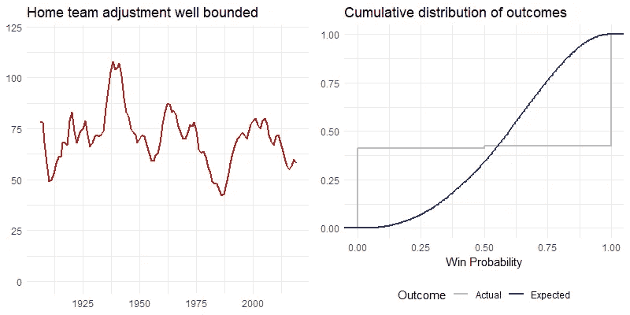

纳入主队因素是为了改善预期获胜概率相对于实际概率的分布。如上所示，主队输掉了大约 40%的比赛，这主要是由 h 因素造成的。

现行模式中，采用固定主场球队调整；我们将在未来的研究中使用更复杂的调整方法进行调查。例如，将球队分为维多利亚队和非维多利亚队——因为比赛主要在墨尔本进行——显示，在 1320 以上的评分范围内，非维多利亚队主场获胜的概率大约高出 5%。

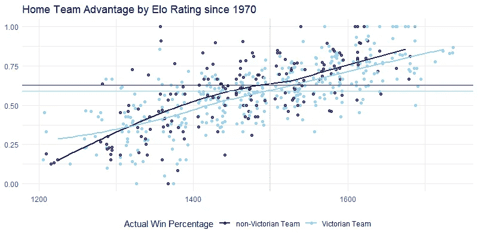

**结转系数 c** 用于校准之前 Elo 评级的百分比，该百分比将回归到 6 个月 AFL 淡季的平均值。赛季结转系数 c 相对稳定，一般在之前 Elo 评级的 0.15-0.25 之间。

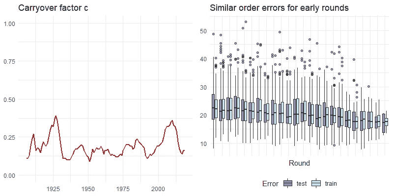

如上所示，结转因子校准 Elo 评级，以便第一轮的误差与赛季剩余轮的误差更加一致。

进一步的研究可以考虑使用衰减模型来校准季内收视率，以便通过 k 因子更新模型，或者初始收视率随着赛季的进行而下降。

**初始 Elo 评级**结果也会受到用于新参赛团队的初始 Elo 的影响；在这种情况下，我们将所有值设置为基础值 1500，因为在实践中很难客观地评估新团队的预期绩效。

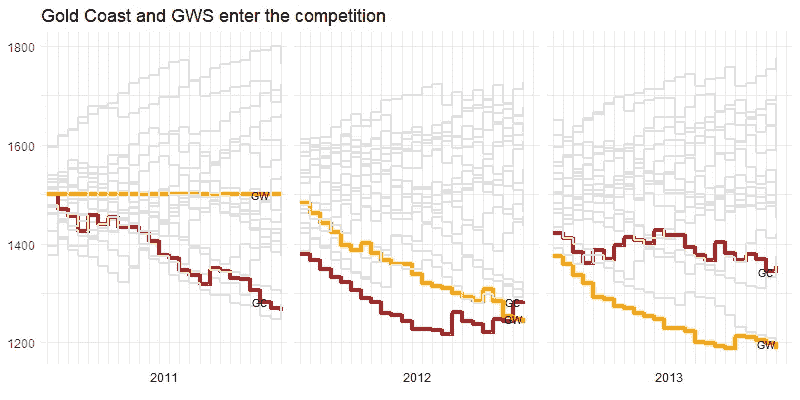

黄金海岸太阳队和 GWS 巨人队分别在 2011 年和 2012 年参加了比赛，两队在最初的赛季表现不佳。回想起来，我们可以指定一个低于 1500 的值作为他们的起始 Elo 未来研究的一个主题是观察新团队的初始表现。

**性能**对于输入和输出样本数据集显示，测试集不可能比训练集表现得更好或更差；然而，测试集的误差可变性更高。

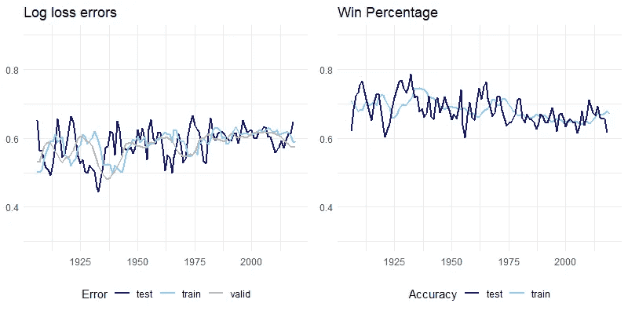

**Wilma 是一个简单的赢输模型，在样本外数据中的平均赢率为 68.2%。**在 AFL 的漫长历史中，使用交叉验证来校准参数的整体模型性能是稳定的。

用于训练、验证和测试数据集(10/2/2)的季节数的选择似乎为模型提供了合理的结果；回想起来，鉴于模型似乎在 5 轮后“稳定下来”，可以考虑低至 2-5 年的较小训练数据集。

**分类准确性**可以通过将概率预测与实际获胜概率进行比较来验证。例如，如果根据模型预测一个团队有 75%的胜算，那么他们平均胜算会是 75%吗？

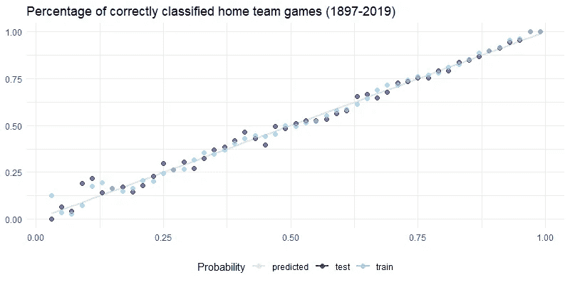

如上图所示，在训练集和测试集结果中，该模型通常以 15%以上的概率执行预期。

## **应用**

Elo ratings 让我们可以看到里士满和 GWS 巨人队进入 2019 年 AFL 总决赛的道路。

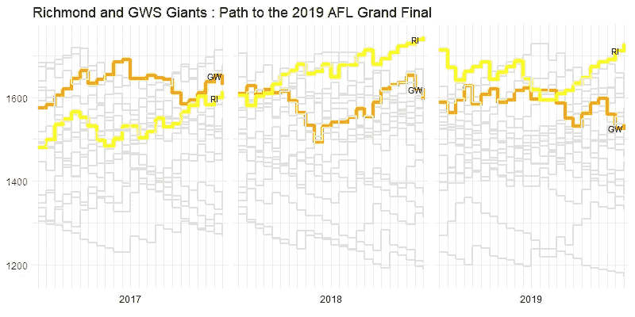

按 Elo 评分的队伍顺序类似于 [AFL 阶梯](https://afltables.com/afl/seas/ladders/laddersyby.html)；这两者都不能准确预测总决赛的赢家。这与其说是预测模型的缺陷，不如说是展示了 AFL 竞争的兴衰。

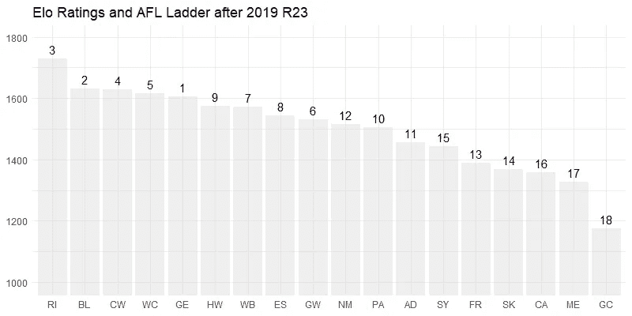

各组团队之间的 Elo 评分非常小。例如，不包括里士满在内的上半区球队在评级上几乎没有差异——主队调整 60 到 80 Elo 分是特定球队赢得后续比赛概率更高的最可能因素。

Elo 和 AFL 排名之间的差异的一个可能的解释是由于弱胜场数(以微弱优势获胜)无法被**威尔玛**获得。我们将在未来的模型中对此进行研究，这些模型旨在包含评分结果。

**预测**最近发布的 2020 年 AFL 赛程提供了一个机会，利用蒙特卡洛模拟预测第一轮比赛的结果和决赛的争夺者。

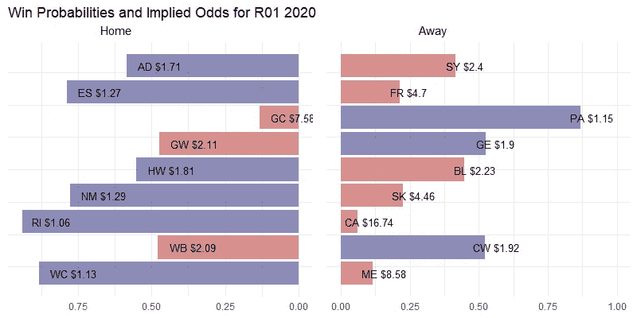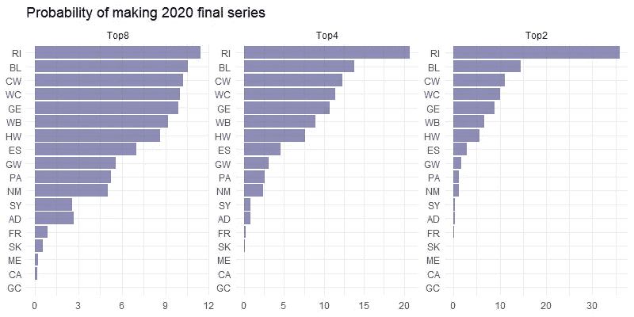

我们将监测每一轮的 Elo 评分，以便更好地评估 Wilma 的表现，从而评估需要改进的地方。

## 反光

Wilma**评级模型将每个团队的预期结果映射为两种状态之一——赢或输。预期结果测量的变化允许连续的概率函数，这使得 Elo 评级能够正确地分割记分牌上的分数，并允许纳入特定运动的微妙之处。这些在 538 型号中最著名的变化包括:**

*   由于赛程强度(如比赛重要性、主客场偏差)而产生的变化，以反映球队在中立地点比赛的结果。
*   团队比赛风格的变化——如临时记分牌结果、比赛的位置和效率以及进攻或防守表现的实力——通常是观察到的比赛统计数据的函数。
*   因具体的团队组成和个别球员的贡献而产生的变化，如对地面时间和伤病的调整。

使用连续函数意味着预期结果可以映射到胜率和投注赔率，使我们能够进行更精细的预测，如比赛和赛季结果以及进入决赛的机会。

在未来的研究中，我们将根据我们的 **Wilma** 基线模型，使用上述建议的变化来调查改进的数量。

## **参考文献**

(1)538—我们如何计算 Elo 评级([链接](https://fivethirtyeight.com/features/how-we-calculate-nba-elo-ratings/))

(2)斯科特·麦基的《Elo 背后的数学》

(3)维基百科中的 Elo 评级系统([链接](https://en.wikipedia.org/wiki/Elo_rating_system)

(Courtney Cochrane 的时间序列嵌套交叉验证([链接](https://towardsdatascience.com/time-series-nested-cross-validation-76adba623eb9))

(5)模型选择和验证 1:Ryan Tibshirani([链接](https://www.stat.cmu.edu/~ryantibs/datamining/lectures/18-val1.pdf))的交叉验证

(6)来自 AFL 表的数据([链接](http://www.afltables.com))

(7)伊森·海因森的 elo 包([链接](https://cran.r-project.org/web/packages/elo/vignettes/elo.html))