# 预测洛杉矶 Airbnb 的价格

> 原文：<https://medium.com/analytics-vidhya/predicting-airbnb-prices-in-los-angeles-14758afc47e?source=collection_archive---------11----------------------->

端到端的机器学习项目，以及我遇到的一些问题的解释和解决方案。

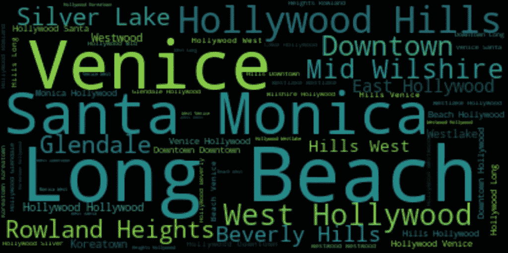

# 关于项目

在这个项目中，我将指导你在洛杉矶 Airbnb 的数据集上处理一个端到端的机器学习问题。数据集是从 Airbnb 内部获取的([链接](http://insideairbnb.com/get-the-data.html))。

**价格将是我的目标向量**，因为我将预测 Airbnb 在洛杉矶的夜间价格，考虑几个独立变量，如邻居、卧室数量、保证金等。

这是一个**监督学习回归**问题，因为我们有一个标签，它是连续的。

考虑到数据集中离群值的数量，我将使用**平均绝对误差作为评估指标**。与均方误差不同，平均绝对误差度量对异常值不敏感。

# 项目的布局

该项目按以下步骤进行:

1.  探索性数据分析
2.  准备数据
3.  分割数据集
4.  基线模型
5.  转换管道
6.  入围的有前途的模型
7.  微调潜在模型
8.  排列重要性
9.  使用图来解释最终模型的预测

# 探索性数据分析

使用 pandas 加载数据集后，最好花些时间浏览数据集，寻找缺失值，并研究每个属性及其特征。数据集的形状为(35757，106)。

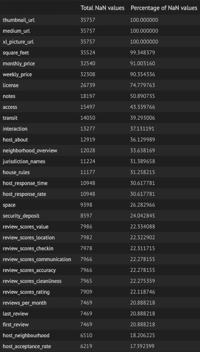

在研究这些数据时，我发现了一组独特的独立变量，有些变量的空值比例很高。然后，我能够删除许多似乎没有增加任何价值的变量。

有相当多的变量需要进一步研究，以便更好地理解它们的目的。在这个过程中，我删除了另一组属性，这些属性或者是它们之间高度相关的，或者是基数很高的。我最终保留了一些高基数变量，如描述、便利设施、属性类型和邻域，这些变量似乎包含有用的信息，我可以在特性工程期间提取这些信息。

我当时很好奇，想看看直方图和散点图，因为它们非常有助于获得洞察力。因为我有一个很长的变量列表要查看，所以我把它们分成了两个散点图。

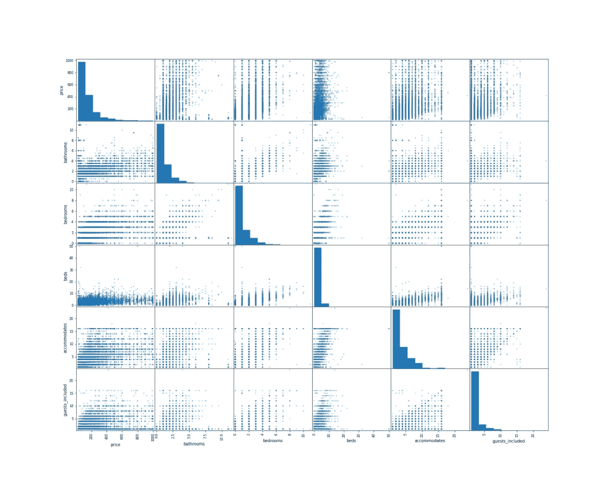

*价格、浴室、卧室、床、住宿、客人包括在内*

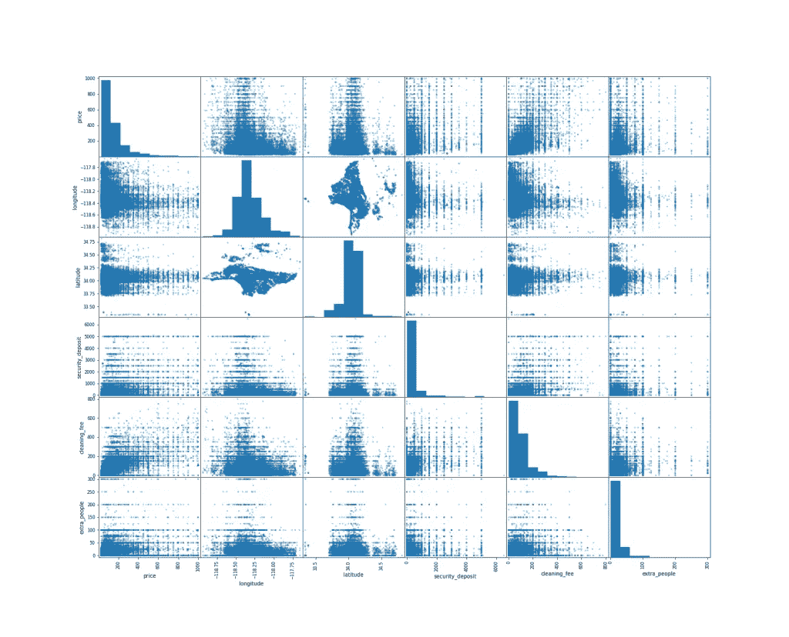

*价格、经度、纬度、保证金、清洁费、额外人员*

## 观察结果:

1.  数据集有很多异常值
2.  我们的目标变量是高度倾斜的
3.  经度和纬度是唯一没有偏斜的变量
4.  浴室、卧室、住宿、包括的客人、保证金、清洁费与我们的目标向量价格高度相关；离群值很难看出。

## 准备数据

我将数据准备分为以下几个步骤:

1.  修复高基数特性
2.  修复或移除异常值
3.  特征选择
4.  特征工程

## 修复高基数特性

为了修复对我们的模型来说太有价值而不能删除的高基数属性，我将所有权重不高的值放在“Other”下，这大大减少了唯一值的数量。

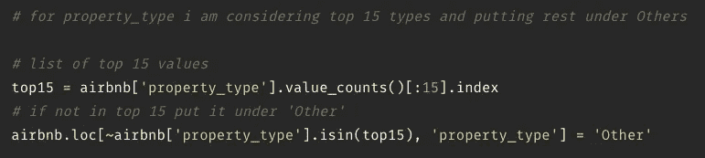

## 修复或移除异常值

很难相信有人会花 25000 美元在 Airbnb 上租一晚。这些异常值可能是由许多可能的原因造成的。我只考虑了每晚不到 1000 美元的酒店。下图显示了过滤异常值前后的箱线图之间的比较。

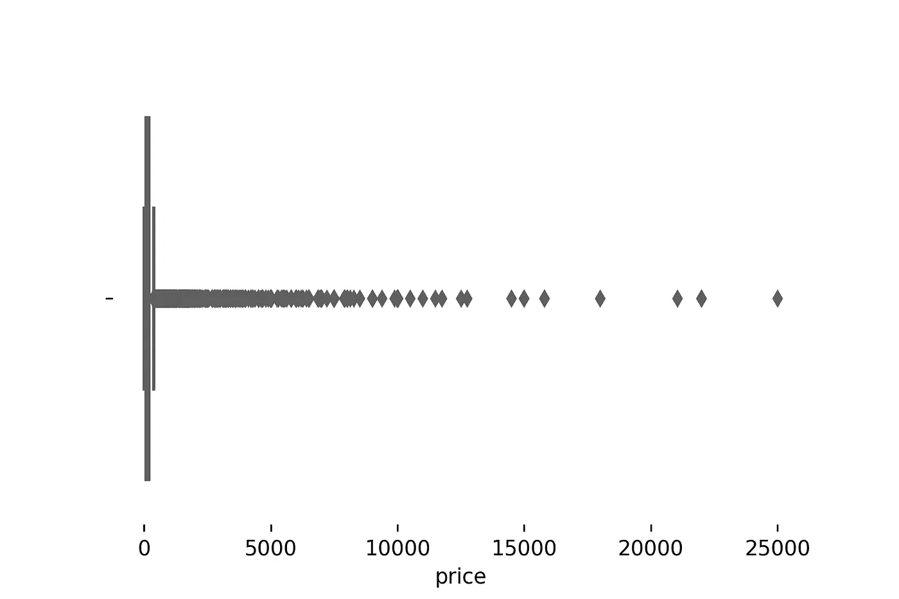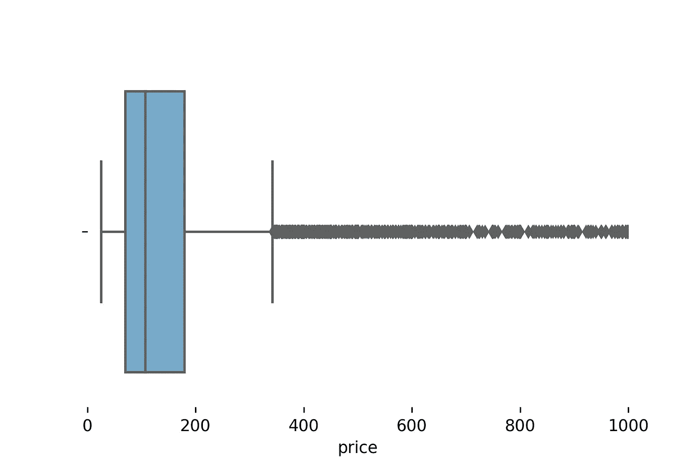

这使得价格的偏斜度从 13.4 下降到 2.87。还是挺高的！当我们训练模型时，可以使用日志来处理它。如果您采用目标变量的对数来拟合模型，请始终记住在预测之前使用指数来反转对数。

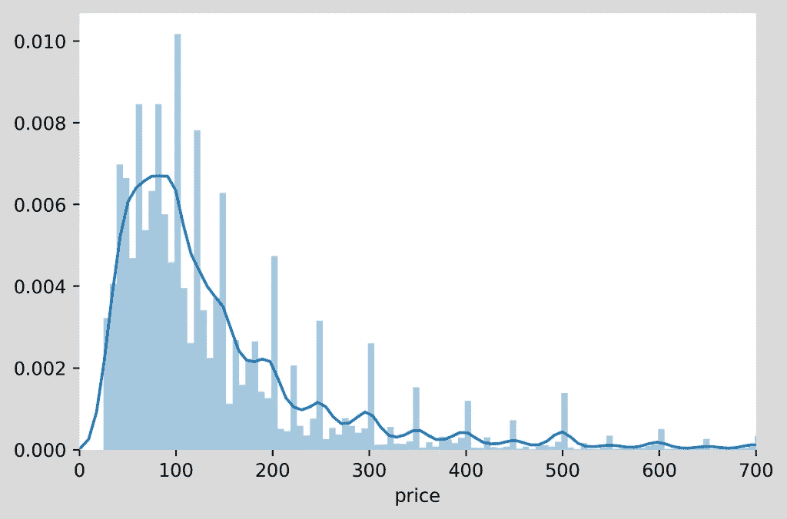

## 特征选择

查看代表相关矩阵的热图，我删除了高度相关的列。彼此高度相关的列是重复的，不会给模型预测增加额外的值。

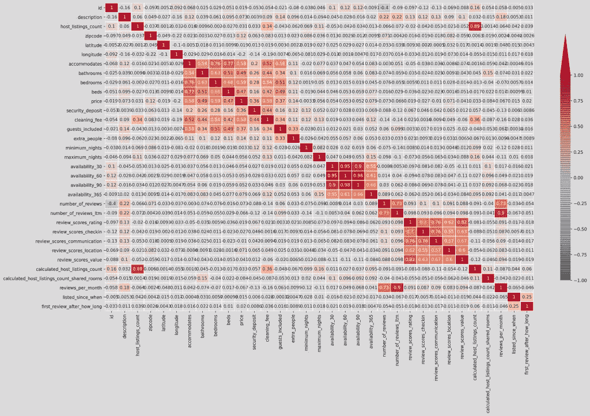

# 特征工程

邮政编码是一个名义分类特征，它可以是计数/=或频率编码。经过一些清理后，我使用 map 函数计算编码后的邮政编码。

计数编码是基于用它们的计数替换类别。这种方法对异常值很敏感，但是因为我们使用的是邮政编码，所以不会影响我们。

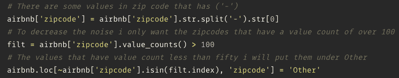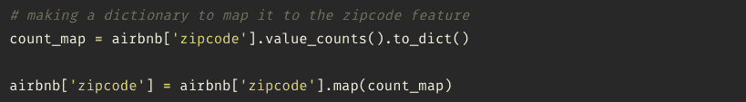

便利设施有很多信息，如果我们能够从文本列中提取信息，这些信息可以帮助我们预测我们的目标变量。自然语言处理(NLP)似乎是唯一的答案。我能够使用 NLP 从便利设施中提取有价值的信息，这有助于显著减少评估错误。

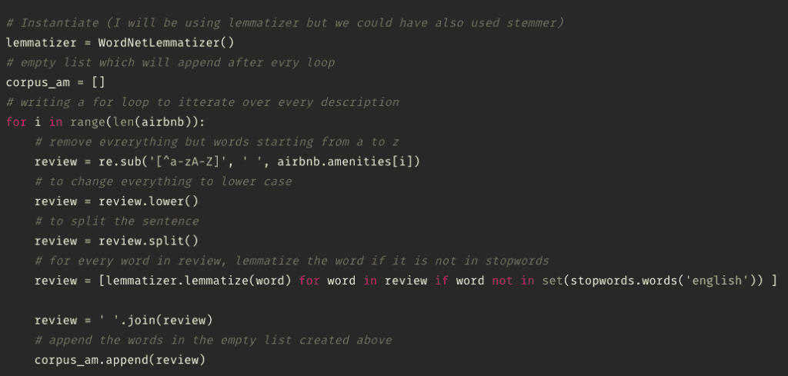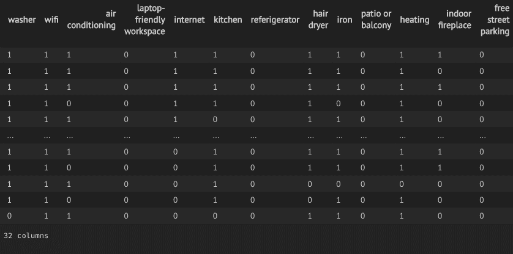

它生成了一个稀疏矩阵形式的文档术语矩阵，然后我将它转换成一个 NumPy 数组，以便能够生成一个数据框。然后，我能够将这个新数据框与我们的原始数据框合并。

# 分割数据集

前面看了相关矩阵，我们知道在预测洛杉矶 Airbnb 的夜间价格时，卧室的数量高度相关。我们希望分割数据，以确保测试集能够代表整个数据集中多个卧室的不同类别。

该物业的大多数卧室数量在 1-3 间之间，但有些物业的卧室数量远远超过 3 间。在数据集中拥有来自每个地层的足够数量的实例非常重要，否则对地层重要性的估计可能会有偏差。

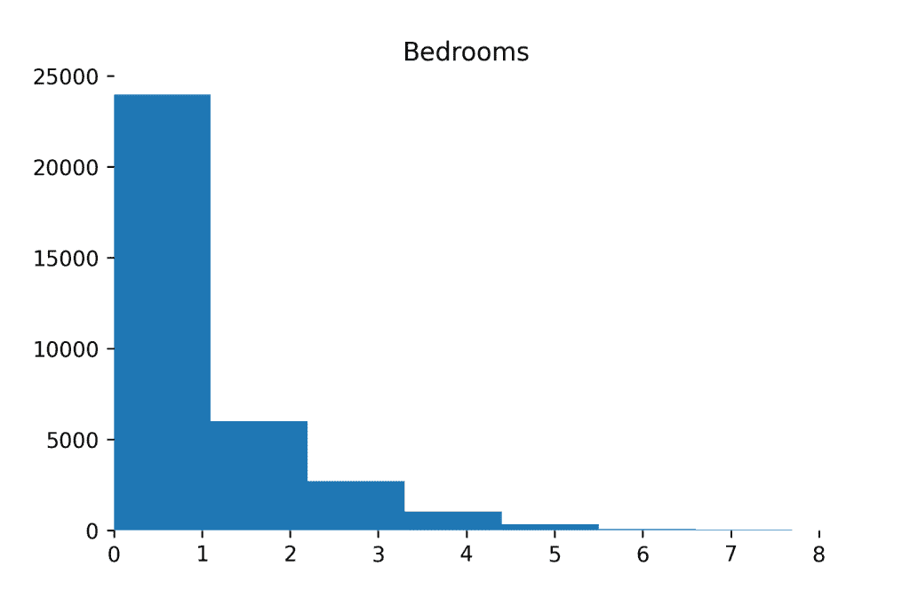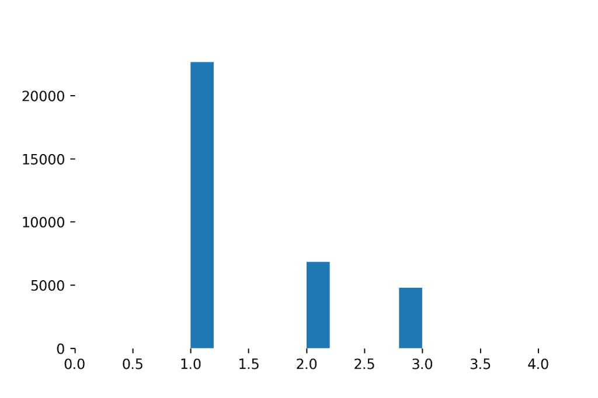

我创建了一个新的列，我把它分成了多个箱，确保它没有太多的层，并且每个层都足够大。有了新列之后，我们就可以使用 Scikit-Learn 中的 StratifiedShuffleSplit 类进行分层采样了。

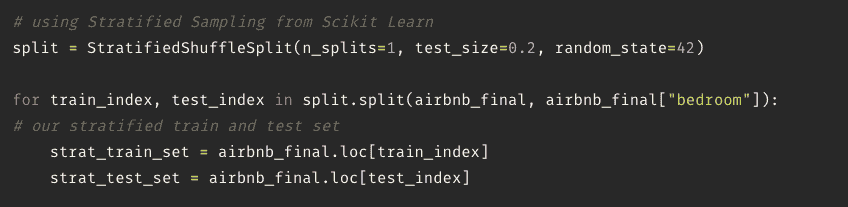

我没有将训练测试进一步分成训练和验证集。相反，我使用了 scikit-learn 的 cross_val_score 来查看模型如何适合训练集。

# 基线模型

使用平均绝对误差，我们模型的基线是 93.50。

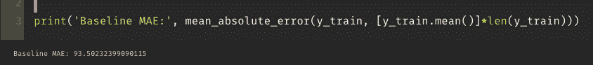

# 转换管道

我在管道中使用的变压器列表:

1.  `Simple Imputer`以`median`为战略`numerical attributes`
2.  `Simple Imputer`以`most_frequent`为`categorical attributes`的策略
3.  分类编码器库中的顺序编码器
4.  标准定标器作为线性模型和支持向量机更好地处理定标数据

我制作了两条独立的管道；一个用于数字属性，另一个用于分类属性。我使用 scikit-learn 中的 ColumnTransformer 类将它们放在一起。

我只使用了一个顺序编码器来编码我们所有的分类属性，因为我最终选择了一个集合树模型作为我的最终选择。一个热门的编码器和我们的树模型不一定能很好地配合。如果你想深入了解这个问题，我推荐你阅读这篇文章([链接](https://towardsdatascience.com/one-hot-encoding-is-making-your-tree-based-ensembles-worse-heres-why-d64b282b5769))。

我在分类管道中传递简单输入时遇到了一个问题，因为它会将一个 NumPy 数组作为输入传递给一个顺序编码器；这让顺序编码器很不高兴。然后，我必须制作一个自定义的转换器来估算分类空值，并将数据帧传递给顺序编码器。

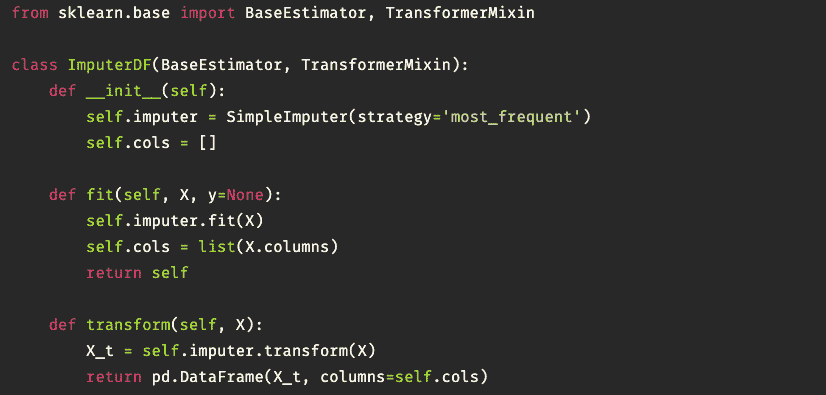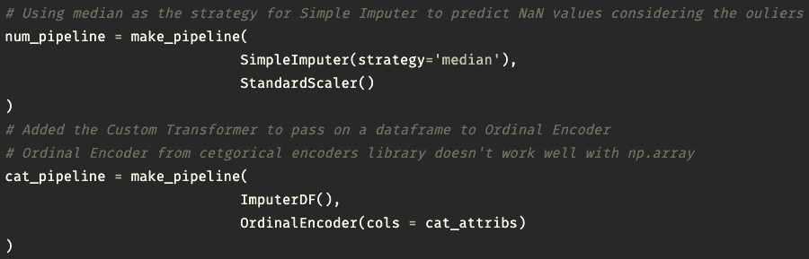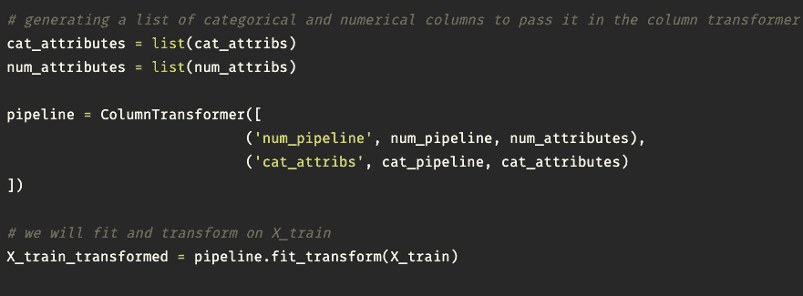

# 入围的有前途的模型

我的前进方法是训练来自不同类别(例如，线性、集成、支持向量机等)的多个模型。)使用标准参数。然后使用交叉验证分数，根据模型的性能对其进行筛选。

我还用三种不同的模型(线性回归器、
梯度推进回归器、支持向量机回归器)训练了一个投票回归器。它表现很好，但无法击败梯度回归。

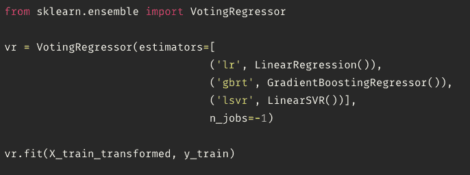

毫无疑问，梯度推进回归器是我们表现最好的通用模型。随机森林是列表中唯一一个似乎严重过度拟合的模型。

# 微调潜在模型

梯度增强是一种广义模型，它在方差和偏差上是平衡的，并且不需要任何超调。虽然，随机森林是过度拟合，并有很高的方差，也许超调模型将有助于我们与过度拟合。

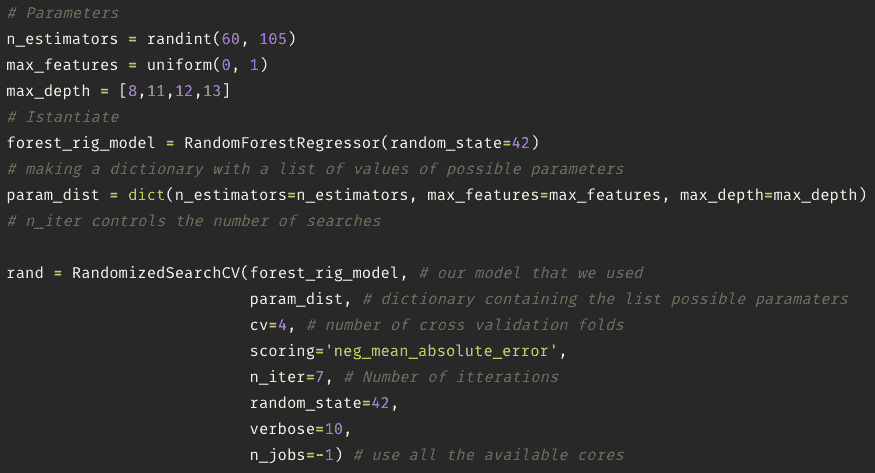

经过超调后，这个模型仍然有点过度拟合，但它已经比以前好得多，可以被认为是我们的最终选择。

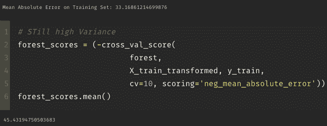

不要只看 10 个交叉验证折叠的平均准确性，让我们绘制每个模型的所有 10 个分数，以及一个突出显示上下四分位数的方框图，以及显示分数范围的“胡须”。

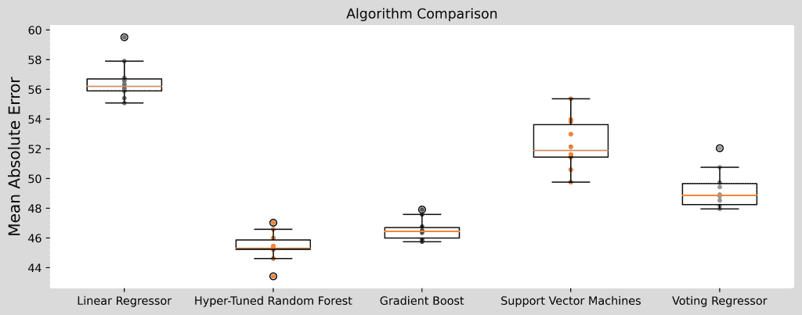

在随机森林回归器和梯度推进回归器之间很难做出选择。这次我将选择随机森林回归，因为它的平均绝对误差为 2 美元。我们可以用梯度推进回归器，这取决于我们要做什么；误差更小或差异更小。

# 评估测试集

我使用一个微调的随机森林回归器来训练测试模型，它在测试集上的表现甚至更好。考虑到我们基线模型的 93.5 分，我们在测试中获得了一个很好的分数，可以进一步提高。

我还可以在 description 列中使用 NLP，这可能会使 MAE 进一步下降。

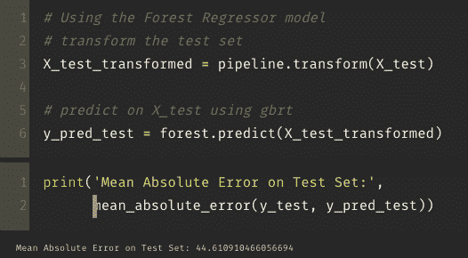

# 排列重要性

我面临一些提取排列重要性的挑战。我们使用置换类生成的特征重要性均值或特征重要性标准差采用 NumPy 数组的格式。只有当我们可以生成一个列的列表并将其压缩到特性重要性(type:numpy.array)时，这些数字才有意义，或者可以用它制作一个数据框。

这是一个问题，因为 X_train _ transformed(transformed X _ train)也是一个 NumPy 数组，这使得我无法从转换后的 X _ train 中提取列。通过进一步研究这个问题，我找到了解决办法。问题出在简单的 input 上，因为它生成 NumPy 数组类型的输出。相反，我使用了我之前制作的类别管道来适应和转换 X_train。因为我使用了类别编码器库，所以我能够生成一个数据帧作为输出，这解决了我们的问题。

注意:

scikit-learn 预处理库有类别编码器，生成一个 NumPy 数组；这解决不了我们的问题。

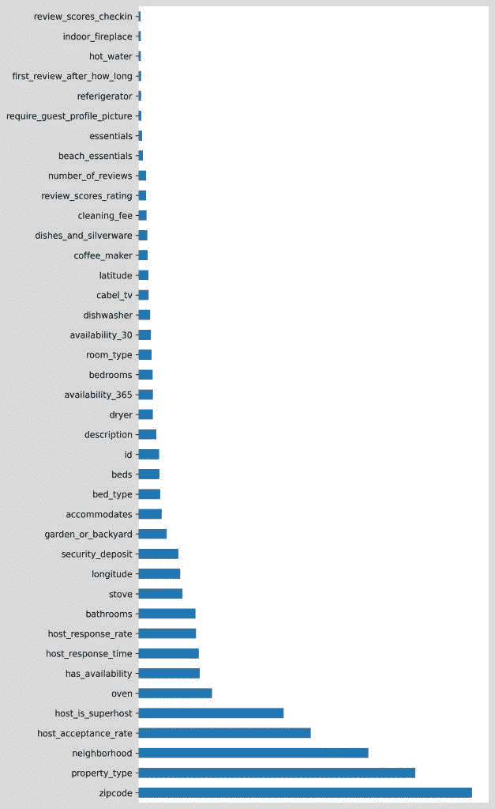

# 使用图来解释最终模型的预测

当我们不使用线性最大似然模型时，SHAP 图和部分相关图就派上了用场，因此我们几乎不可能绘制模型的预测图。

# SHAP(沙普利附加解释)

SHAP 框架已被证明是机器学习模型解释领域的一个重要进步。它结合了几种现有的方法来创建一个直观的，理论上合理的方法来解释任何模型的预测。

SHAP 通过对每个预测和特征提出相同的问题来建立模型解释:“当特征 j 从模型中移除时，预测 I 如何变化？”所谓的 *SHAP 值*就是答案。它们量化了特征对预测影响的大小和方向(积极或消极)。

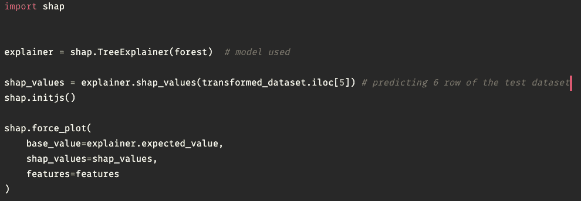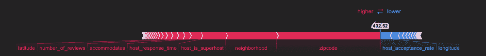

邮政编码、邻里关系以及房东是否是超级房东是影响 Airbnb 价格的三个最重要的变量。

# 部分相关图

部分相关性图(短 PDP 或 PD 图)显示了一个或两个特征对机器学习模型的预测结果的边际效应。部分相关性图可以显示目标和特征之间的关系是线性的、单调的还是更复杂的。

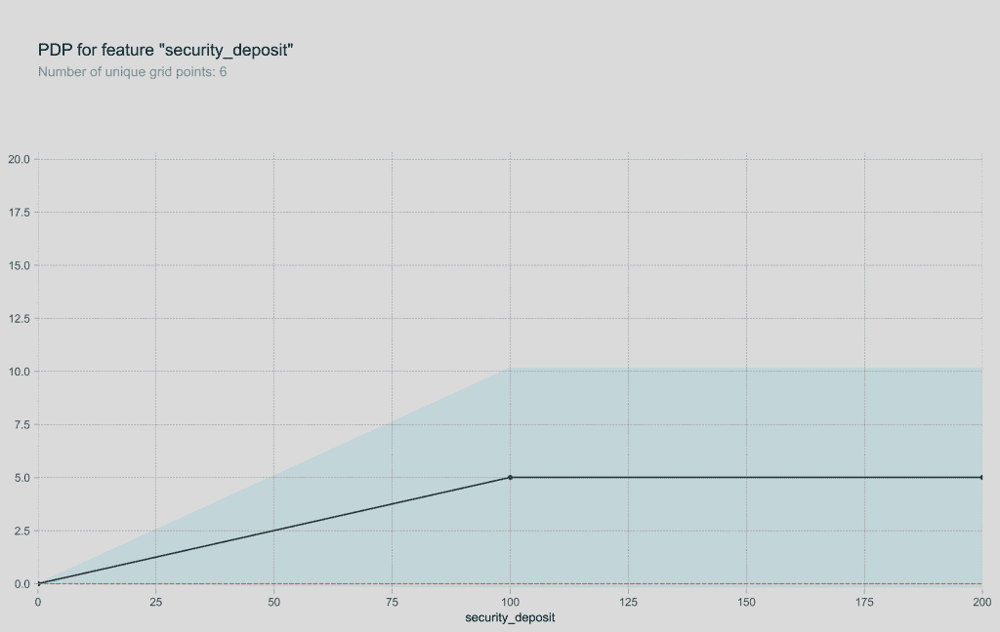

这个图告诉我们押金作为预测 Airbnb 夜间价格的一个特征的重要性。随着保证金的增加，每晚的价格也会增加，直到保证金达到 100 英镑。将押金提高到 100 英镑以上不再影响 Airbnb 的每晚价格。

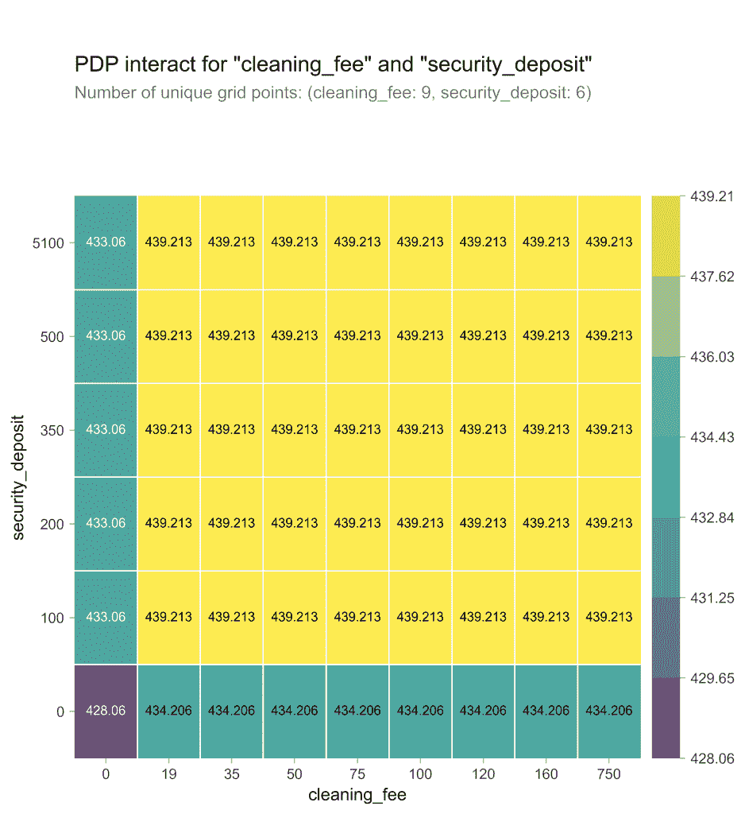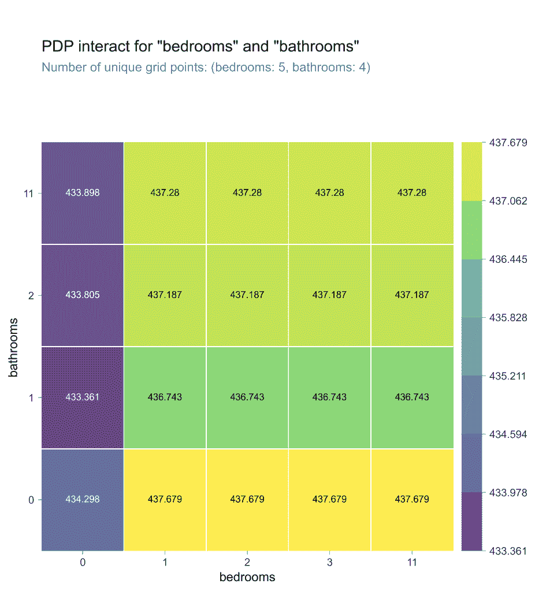

感谢阅读，并随时检查代码和 web 应用程序。

代码:[https://github . com/nav roz-Lamba/predi sting-Airbnb-prices-in-LA](https://github.com/navroz-lamba/Prediciting-Airbnb-prices-in-LA)

网页 App:【https://airbnb-la.herokuapp.com/ 