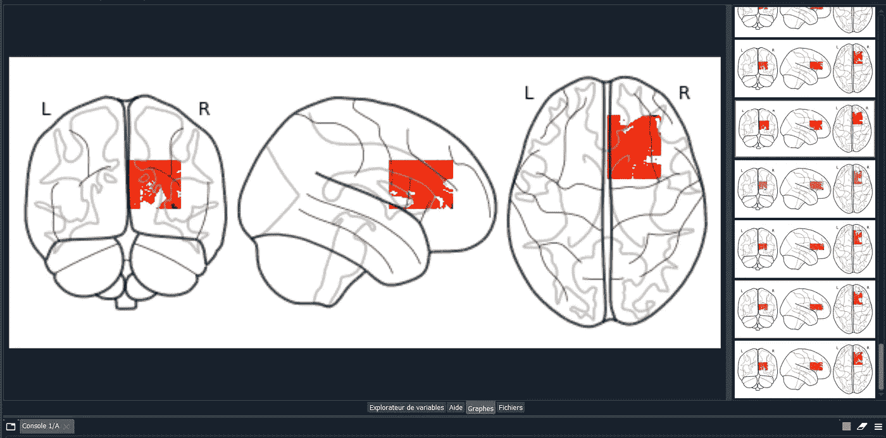

# 用 U-Net 算法预测阿尔茨海默病

> 原文：<https://medium.com/analytics-vidhya/predicting-alzeheimers-disease-using-u-net-algorithm-6a6bb7267188?source=collection_archive---------7----------------------->

面向初学者的基本 Tensorflow 和 Keras 实现


## **什么是老年痴呆症？**

阿尔茨海默病是一种不可逆的大脑退化，会导致记忆、认知、人格和其他功能的中断，最终导致大脑完全衰竭而死亡。

在世界范围内，至少有 5000 万人被认为患有阿尔茨海默氏病或其他痴呆症。

65 岁及以上的人中有十分之一患有阿尔茨海默氏痴呆。这是美国第六大死亡原因。阿尔茨海默病会导致整个大脑组织的逐渐丧失。

它会导致整个大脑组织的逐渐丧失。特别是，大脑中被称为**海马体**的区域往往在疾病过程的早期表现出最快的组织损失。


**图 1:人脑中海马体的定位**

海马体对于形成新的记忆至关重要，比如一个人午餐吃了什么或者最近的一次谈话。海马体的逐渐萎缩是造成短期记忆丧失的原因，而短期记忆丧失是阿尔茨海默氏症的标志性症状。

如视频所示，为了了解更多关于老年痴呆症如何改变大脑以及海马体的作用:[https://youtu.be/0GXv3mHs9AU](https://youtu.be/0GXv3mHs9AU)

## **老年痴呆症可以预防吗？**

参考专家的解读，很难根据最早的症状来判断一个人是否会被诊断为老年痴呆症。然而，可以使用人工智能算法和复杂的基于传感器的工具进行预测。

研究人员开发了一种基于人工智能(AI)的计算机算法，可以使用脑磁共振成像(MRI)的组合来准确预测风险和诊断阿尔茨海默病。

基于 ML 的预测阿尔茨海默氏症的策略是可用作可扩展解决方案的解决方案之一，训练的模型将随着更大人群的数据扩展而增长。

**预测阿尔茨海默病**值得建立基于人工智能的系统和设备，以识别受害者，加快诊断程序，并使其尽早进行必要的治疗。

## **使用核磁共振扫描**

研究人员使用了阿尔茨海默病患者以及大脑神经行为正常者的大脑 MRI 扫描、人口统计数据和临床信息。然后开发了一种新的深度学习模型来预测阿尔茨海默病风险，这表明他们的模型可以准确预测其他独立队列的疾病状态。

发现人工智能算法如何处理数据，并训练模型来预测阿尔茨海默病。

## **使用 MRI 和 U-Net 架构检测阿尔茨海默病**

构建一个基于 **U-net 架构**的算法，可以帮助我们检测肺部或脑部的肿瘤。

这个项目将帮助你更多地了解 U-Net 的架构，如何建立你的模型，以便可视化**海马**和使用 IRM 检测老年痴呆症。

**项目内容如下:**

*   数据集准备和预处理
*   模型结构
*   模特培训
*   模型评估和测试
*   模型预测法

在开始开发模型之前，我们必须学习如何准备和操作数据集。

1.  **数据预处理**

数据预处理是准备(清理和组织)数据以使其适应构建和训练模型。简而言之，数据预处理是一种数据挖掘技术，它将原始数据转换成可理解和可读的格式。它有助于清理、格式化和组织原始数据，从而为模型做好准备。

在这个项目中，有四个重要的数据预处理步骤来准备我们的数据。

**1.1 获取数据集**

数据集可以从[学术种子](https://academictorrents.com/)网站下载，可以在这里找到:[https://Academic Torrents . com/details/274 be 65156 ed 14828 FB 7b 30 b 82407 a 2417 e 1924 a](https://academictorrents.com/details/274be65156ed14828fb7b30b82407a2417e1924a)

在这个项目中，我们将使用 NIfTI(神经影像信息学技术倡议)格式；它可以存储具有不同含义的数据。成像数据、统计值和其他数据(任何矢量、矩阵、标签集或网格)可以保存在 nifti1 *中。nii 或*。hdr/*。img 文件。

**磁共振成像:**磁共振成像是一种使用强磁场和无线电波产生身体内部(大脑、乳房、心脏和血管等)详细图像的扫描。

**1.2 导入库**

首先，我们需要安装整个需求模块；TensorFlow、Keras、os、matplotlib、NumPy 以及其他与项目规范相关的库。

此外，为了读取“nifti”格式，最需要的模块之一是“nibabel”。

点击此处阅读更多关于 Python 数据科学库的信息:[https://www . upgrad . com/blog/Python-libraries-for-Data-Science/](https://www.upgrad.com/blog/python-libraries-for-data-science/)

**1.3**加载并读取数据集

在此阶段，我们需要:

使用操作系统模块“os”将图像数据集的路径存储到一个变量中。路径。加入"

导入**' ni label '**并加载 dataset(注意:“ni label”不加载图像数组，它一直保持到使用 get_fdata()方法请求数据数组为止)。

**1.4** **标准化图像**

计算机视觉中一个关键的预处理步骤。原则上，所采用的模型在较小的图像上训练得更快。当图像更大或更复杂时，所需的时间会增加。此外，许多深度学习模型架构需要相同大小的收集图像，尽管对于所获取的大多数数据来说并非如此。

为输入到人工智能算法中的所有图像建立一个基本尺寸，会产生一个最小图像尺寸的数据集。

**最小图像尺寸**设置为 **32，32，1(宽度、高度和通道)。**

可以使用许多其他预处理技术来准备数据图像，以便在模型中进行训练。**从图像中移除背景**颜色可降低噪声。其他项目可能需要使图像变亮或变暗。使用**数据扩充技术**扩大数据集，使其具有现有的扰动版本(缩放、旋转、去色、去纹理等)。简而言之，应用数据集所需的任何调整都被视为一种预处理。此外，根据数据集和解决方案选择适当的处理技术，可以直观地了解在处理不同的项目时需要哪些技术。

**1.5** **分割数据集**

最后一步是将数据集分成两个独立的集合:训练集和测试集。


**图 2:数据集分割**

“训练集”用于训练模型，“测试集”用于测试和评估模型。

通常，数据集被拆分为 **70%训练** **集**和 **30%测试集**或 **80%训练集**和 **20%测试集**。

在代码中，使用 sk learn“from sk learn . model _ selection import train _ test _ split”拆分数据

**2。模型构建**

使用 U-net 算法建立模型。


**图 3: U-net 架构(最低分辨率下 32x32 像素的示例)。**

## U-Net 是如何工作的？

它由**收缩路径**(左侧)和**扩张路径**(右侧)组成。

**收缩/缩减采样路径**

收缩路径遵循卷积网络的典型架构。它由**四个**挡块组成，每个挡块由:

3x3 卷积层+激活函数(带批量归一化)

3x3 卷积层+激活函数(带批量归一化)

2x2 最大池

> 注意:每个池中的特征映射数量会翻倍，第一个块有 64 个特征映射，第二个块有 128 个，依此类推。该收缩路径的目的是捕获输入图像的上下文，以便能够进行分割。这个粗略的上下文信息然后将通过跳过连接被传送到上采样路径。

**瓶颈**

网络的这一部分位于收缩路径和扩展路径之间。瓶颈是由简单的两个卷积层(带批量归一化)构成的，带有丢失。

**扩展/上采样路径**

扩展路径也由四个块组成。每个模块都包括:

步长为 2 的反褶积层

与收缩路径中相应的裁剪后的要素地图串联

3x3 卷积层+激活函数(带批量归一化)

3x3 卷积层+激活函数(带批量归一化)

在最后一层，使用 1x1 卷积将每个 64 分量特征向量映射到所需数量的类别。该网络总共有 23 个卷积层。


红框→代表输入图像尺寸

蓝色方框→代表 U 形网的左侧(收缩路径)

绿色方框→代表 U-Net 的右侧(昂贵路径)

黄色方框→最终瓶颈层

模型构建的最后一步是修复模型中使用的**优化器**和**成本函数**。

在这一阶段可以应用不同类型的优化器:

**成本函数**

机器学习和深度学习的目标是减少预测输出和实际输出之间的差异。这也被称为成本函数或损失函数。

因为我们的目标是通过找到权重的优化值来最小化**成本函数**。

为了实现这一点，我们使用不同的权重运行多次迭代。这有助于找到最小成本。这是**梯度下降。**

梯度下降是一种迭代机器学习优化算法，以降低成本函数。这将有助于模型做出准确的预测。

我们计算梯度，∂c/∂ω，它是成本相对于重量的偏导数。

**α是学习率**，帮助调整梯度下降的权重


**图 4:梯度下降**

**W** 是神经元的权重， **α** 是学习率， **C** 是成本，∂c/∂ω是梯度。

**学习率是多少？**

学习率可能是梯度下降和其他优化器最重要的方面。

它控制权重相对于损耗梯度应该调整多少。学习率是随机初始化的。

下一个目标是最小化**成本函数**，通过使用不同的权重运行多次迭代并计算成本以达到最小成本，从而找到权重的优化值，如下所示。

下图解释了优化曲线


**图 5:优化曲线**

不同类型的梯度下降有:

批量梯度下降或普通梯度下降

随机梯度下降

小批量梯度下降

想了解更多关于渐变体面的内容，建议关注“吴恩达”制作的视频

链接:【https://www.youtube.com/playlist? list = pllsst 5 z _ DsK-h 9 vyzkqkynwcitqhlrjln

所有**优化器**的目标是改变你的模型的属性，如权重和学习率，以减少损失。

但是也使用基于梯度下降的其他类型的优化器，下面是其中的一些:

**Adagrad** 专门针对单个要素调整学习率:这意味着数据集中的一些权重将具有不同于其他权重的学习率。

**RMSprop:** 在 RMSprop 中，学习率自动调整，并为每个参数选择不同的学习率。

**Adam:** 是一种随机梯度下降法，它基于梯度一阶和二阶矩估计值中每个参数的自适应学习率。


**图 6:各种优化器之间的比较**

根据上面的比较，“亚当”是一个计算效率相当高的优化器，它需要较少的内存空间。

为此，使用“Adam”作为最流行的梯度下降优化算法之一具有多种优势，包括易于实现的优化模型。

```
model.compile(optimizer='adam', loss='binary_crossentropy', metrics=['accuracy'])
```

此外，有必要按如下方式配置规范:

**丢失:**肺炎检测是在最后一步使用乙状结肠激活，结果不是 1 就是 0(痴呆或非痴呆)。因此，**二元交叉熵**是最合适的损失函数

**度量**:精度是获得每个历元预测准确率的度量。

**3。模特培训**

在这一步，使用数据逐步提高我们的模型预测该人是否患有痴呆症的能力。

```
#Fit the model
history = model.fit(X_train,
                         y_train,
                         batch_size = 8,
                         epochs = 50,
                         validation_split = 0.2)
```

型号列车为 **50 个时代**，批量为**8 个**。

**批量大小**是模型更新前处理的样本数(样本是单行数据)。

**时期**是通过训练数据集的完整次数。

关于两个主要参数: **Epoch & Batch size** ， **Epoch** 是指整个数据集只通过神经网络前后传递一次。困难在于如何在应用中选择合适的历元数，以避免**欠拟合**和**过拟合**的问题。


**图 7:欠配合&过配合问题**

> 注意:不可能一次将整个数据集传递到神经网络中。因此，最好将数据集分成多个批次或集合。

一旦模型被完全训练，损失和准确度图的可视化步骤可以导致关于模型效率的解释。

**4。模型评估和测试**

训练结束后，可以看到验证损失和训练损失，以便对模型进行评估。

```
# Accuracy calculation
f, (ax1, ax2) = plt.subplots(1, 2, figsize=(12, 4))
t = f.suptitle('U-NET Performance', fontsize=12)
f.subplots_adjust(top=0.85, wspace=0.3)max_epoch = len(history.history['accuracy'])+1
epoch_list = list(range(1,max_epoch))
ax1.plot(epoch_list, history.history['accuracy'], label='Train Accuracy')
ax1.plot(epoch_list, history.history['val_accuracy'], label='Validation Accuracy')
ax1.set_xticks(np.arange(1, max_epoch, 5))
ax1.set_ylabel('Accuracy Value')
ax1.set_xlabel('Epoch')
ax1.set_title('Accuracy')
l1 = ax1.legend(loc="best")
```


如图所示，**验证损失**和**训练损失**都是同步的。它表明该模型没有过度拟合:验证损失正在减少，并且在整个训练阶段，训练和验证损失之间几乎没有任何差距。

训练后的模型准确率达到了 **95.24 %** ，如下图所示:


**图 10:精度值**

最后，也是最重要的一点，是时候使用 Keras 的 predict()函数重建测试图像了，看看你的模型在测试数据上的重建效果如何。


**图 11:掩模图像**

从上面的图中，您注意到该模型在重建您使用该模型预测的**掩模图像**方面做得很好。

**5。保存模型**

在使用深度学习模型时，保存训练好的模型是关键的一步

```
#save model
model_save_path = os.path.join(path_main,'model')
tf.saved_model.save(model, model_save_path)
```

您可以加载保存的重量，然后使用下面的代码行继续训练过程:

```
#load model
model = keras.models.load_model(model_save_path)
```

**6。模型预测**

通过这一步骤，分类器将数据集标记为痴呆和非痴呆两个类别。建议使用无监督算法(K 均值聚类)来补贴我们的标签。

**首先，什么是聚类算法？**

聚类算法是无监督算法，但类似于分类算法，但基础不同。



**图 12:痴呆和非痴呆图像**

# 再进一步！

本教程可以帮助您了解如何阅读 MRI nifti 格式的图像，分析，预处理并使用大脑 MRI 数据集将它们输入模型。它展示了一种流行的 CNN 算法:U-Net 算法。

您可以修改架构并尝试从定量和定性两方面改进预测，可以使用数据扩充技术来增加数据集的大小，还可以选择另一个分类器来将数据集划分为两个类。

因此，您可以自由选择任何架构和任何分类器。

# 人工智能如何改变医疗保健的未来


**图 13:医疗保健领域的人工智能**

医学中的 AI 是指在需要护理的患者的诊断和治疗中使用人工智能技术/自动化流程。虽然诊断和治疗看似简单，但为了使患者得到适当的护理，还必须进行许多其他的后台处理，例如:

通过患者访谈和测试收集数据

处理和分析结果

利用多种数据来源做出准确的诊断

确定适当的处理方法(通常提供选项)

准备和实施所选择的治疗方法

病人监护等。

**总之，**如今，机器不太可能达到 50 岁经验丰富的医生的即时咨询，尽管如果我们训练模型中使用的数据集包括每个医生的经验，有一天，一个超级计算器可以告诉并预测街上摄像头扫描到的任何人的任何疾病。这就是人工智能的可扩展性。

> 比尔·盖茨(1996)*我们总是高估未来两年将发生的变化，低估未来十年*将发生的变化

我已经尽可能保持文章的准确和清晰。

欢迎您的评论、问题和反馈。

联系我: [Github](https://github.com/besmaGuesmi) ， [Medium](/@bessmagsm) ， [Linkedin](https://www.linkedin.com/in/besma-guesmi-a94201161/) ， [Twitter](https://twitter.com/BesmaGuesmi3) ， [Gmail](http://bessmagsm@gmail.com)

希望这将有所帮助！

下期教程再见！