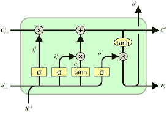
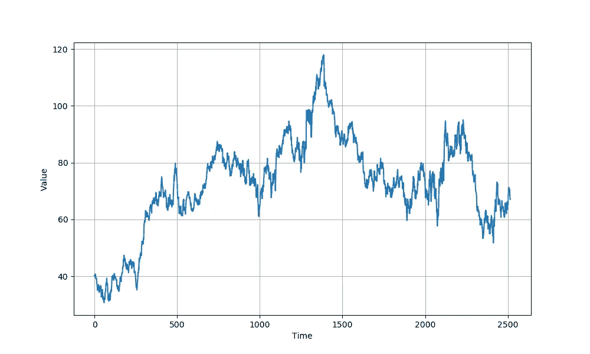
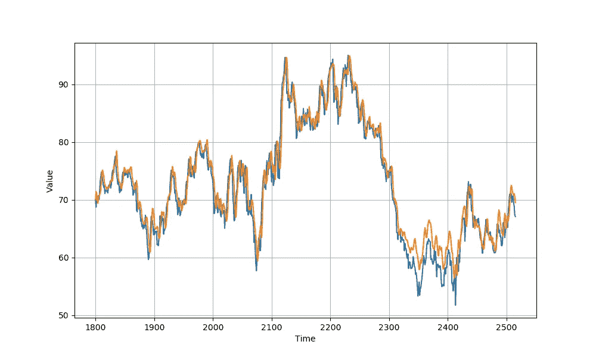

# 使用 AI(递归神经网络)预测石油和天然气公司的股票:Keras 实现

> 原文：<https://medium.com/analytics-vidhya/predicting-an-oil-and-gas-companys-stocks-using-ai-recurrent-neural-networks-a-keras-f54d1c5a1020?source=collection_archive---------14----------------------->


股票市场是一个国家的经济和这个国家的公民之间的桥梁。股票市场的状况关系到一个国家经济的健康发展，但同时也允许普通人参与这个市场。股票市场包含位于特定国家的大公司和小公司的股票，公民可以通过低价买入股票并在股价上涨时卖出获利来做生意。然而，这里有一个问题:当股价暴跌时，就会产生巨大的损失。因此，投资股市的人在花一分钱之前会进行几十次计算，这并不奇怪。然而，令人欣慰的是，人工智能的兴起导致了这个问题的解决方案，因为人工智能在更少的人力投入下表现得非常好。不仅如此，像递归神经网络(RNN)这样的人工智能技术可以通过获取数十年的数据来进行预测。为了说明这一点，本文使用 RNNs 对 Schlumberger(一家石油和天然气服务公司)2010 年至 2019 年的股票进行了预测。

免责声明:这是一篇中级到高级水平的人工智能文章。关于神经网络，RNNs 和 Python 语言的知识是必须的。

**什么是 rnn？**

RNNs 是一种神经网络，它又是机器学习技术的子集。与简单的神经网络不同，RNNs 考虑了特定神经元的过去状态和当前状态。简单来说，RNN 不仅从当前数据中学习，还从过去的数据中学习。如果 RNN 是双向的，网络从现在、过去以及未来的数据中学习。为了简单起见，这里不严格地使用这些术语。建议读者通过其他来源，如吴恩达的深度学习专业化，了解更多关于 RNNs 的信息。

rnn 有几种类型。最著名的是 GRU 和 LSTM。虽然还没有定论哪一个更好，但两者都在今天被广泛使用。对于我们的应用程序，我们将使用 LSTM。



LSTM 单位

**实现**

第一步是收集数据。我从纳斯达克官方网站收集了 10 年的股市数据。数据为 csv 格式，可视化代码如下所示:

```
import tensorflow as tf
import numpy as np
import matplotlib.pyplot as plt
import csv
time_step = []
temps = []with open('HistoricalQuotes(1).csv') as csvfile:
  reader = csv.reader(csvfile, delimiter=',')
  next(reader)
  step=0
  for row in reader:
    val=row[1]
    temps.append(float(val[2:]))
    time_step.append(step)
    step = step + 1series = np.array(temps)
time = np.array(time_step)
plt.figure(figsize=(10, 6))
plot_series(time, series)
```

历史语录(1)。csv 包含股票市场数据。只要有逗号，读取器就会分隔每一行。第二个值(即第一个指数)是股票的收盘价。使用 val[2:]省略了第一个美元符号字符。plot_series 函数如下所示:

```
def plot_series(time, series, format="-", start=0, end=None):
    plt.plot(time[start:end], series[start:end], format)
    plt.xlabel("Time")
    plt.ylabel("Value")
    plt.grid(True)
    plt.show()
```

数据如下所示:



Schlumberger 过去 10 年的股票

数据被分成训练集和验证集。数据在第 1800 个时间步长标记处被分割。

```
split_time = 1800
time_train = time[:split_time]
x_train = series[:split_time]
time_valid = time[split_time:]
x_valid = series[split_time:]
```

RNN 的输入是窗口序列的形式。这是必要的，这样网络就能看到一大块数据，而不仅仅是一个数据点。

```
def windowed_dataset(series, window_size, batch_size, shuffle_buffer):
    series = tf.expand_dims(series, axis=-1)
    ds = tf.data.Dataset.from_tensor_slices(series)
    ds = ds.window(window_size + 1, shift=1, drop_remainder=True)
    ds = ds.flat_map(lambda w: w.batch(window_size + 1))
    ds = ds.shuffle(shuffle_buffer)
    ds = ds.map(lambda w: (w[:-1], w[1:]))
    return ds.batch(batch_size).prefetch(1)
def model_forecast(model, series, window_size):
    ds = tf.data.Dataset.from_tensor_slices(series)
    ds = ds.window(window_size, shift=1, drop_remainder=True)
    ds = ds.flat_map(lambda w: w.batch(window_size))
    ds = ds.batch(32).prefetch(1)
    forecast = model.predict(ds)
    return forecast
tf.keras.backend.clear_session()np.random.seed(51)
window_size = 64
batch_size = 256
shuffle_buffer_size=1000train_set = windowed_dataset(x_train, window_size, batch_size, shuffle_buffer_size)
```

到目前为止，我们已经准备好了数据。下一步是准备模型。我们使用的模型具有以下序列:

**Conv2d->LSTM->LSTM->稠密- >稠密- >稠密->λ**

```
model = tf.keras.models.Sequential([
  tf.keras.layers.Conv1D(filters=60, kernel_size=5,
                      strides=1, padding="causal",
                      activation="relu",
                      input_shape=[None, 1]),
  tf.keras.layers.LSTM(60, return_sequences=True),
  tf.keras.layers.LSTM(60, return_sequences=True),
  tf.keras.layers.Dense(30, activation="relu"),
  tf.keras.layers.Dense(10, activation="relu"),
  tf.keras.layers.Dense(1),
  tf.keras.layers.Lambda(lambda x: x * 400)
])
```

我们将使用具有动量的随机梯度下降(SGD)作为我们的优化器，使用 Huber 作为我们在 100 个时期训练的损失函数。度量是平均绝对误差(MAE)。

```
optimizer = tf.keras.optimizers.SGD(lr=1e-6, momentum=0.9)
model.compile(loss=tf.keras.losses.Huber(),
              optimizer=optimizer,
              metrics=["mae"])
history = model.fit(train_set,epochs=100)
```

该模型被训练 100 个时期，然后在验证集上进行预测。真实值(蓝线)和预测值(橙线)显示在同一个图表上，以供比较。



MAE 小至 1.49，考虑到石油和天然气行业的不确定性和易变性质，这是一个很好的结果。

**这段代码的灵感来自 Deeplearning.ai 的 Tensorflow 专门化**