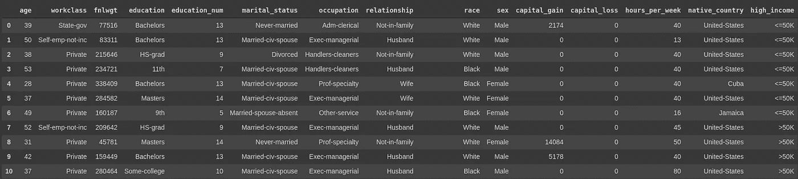
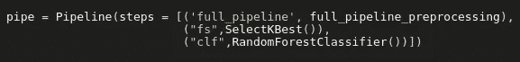
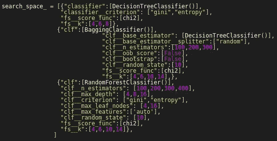
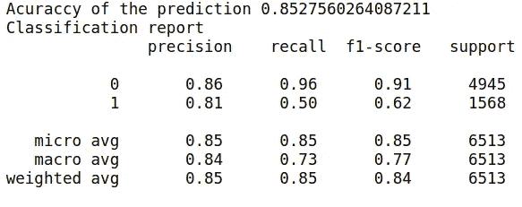
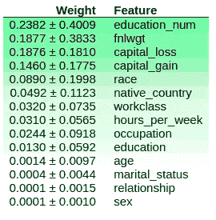
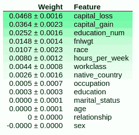

# 使用“成人收入”数据集预测美国年收入，并使用 ELI5 分析模型的可解释性

> 原文：<https://medium.com/analytics-vidhya/predicting-annual-us-income-using-the-adult-income-data-set-and-analyzing-model-e393cf7395a5?source=collection_archive---------9----------------------->

在 [Unsplash](https://unsplash.com?utm_source=medium&utm_medium=referral) 上 [NeONBRAND](https://unsplash.com/@neonbrand?utm_source=medium&utm_medium=referral) 拍摄的照片

一个人的年收入可能会受到各方面的影响，如年龄、教育程度、职业、每周工作时间、性别以及许多其他特征。“成人收入”数据集提供了一组包括这些特征的数据，并告诉我们这个人的年收入是大于 5 万美元(> 5 万美元)还是小于 5 万美元(≤5 万美元)。

我们可以在下面看到这个数据集的样子。然后给出数据集中出现的列的描述。

图一。“成人传入”数据集的前 10 行

*   **年龄**:人的年龄。[连续]
*   **工作类别**:工作类型。(联邦、州、私人……)[分类]
*   **fnlwgt:** *我没有找到任何关于这个的描述:(* 【绵】
*   **教育:**个人所获得的教育水平。(学士、12 级、博士……)[分类]
*   **education_num:** 教育程度的数值表示。[连续]
*   **婚姻状况:**玛丽塔格的状况。(已婚、离异、未婚……)[分类]
*   职业:这个人在工作中扮演的角色。(高级管理人员、销售人员、工艺维修人员……)[分类]
*   关系:人们在家庭关系中扮演的角色。(妻子、丈夫、自己的孩子……)[分类]
*   **人种:**人的种族。(黑人、白人、亚洲人……)[分类]
*   **性别:**人的生物性别。[分类]
*   **资本 _ 收益:**个人的资本收益[连续]
*   **资本 _ 损失:**个人的资本损失[连续]
*   **每周工作小时数:**周末工作的总小时数。
*   **native_country:** 人的出生国。[分类]
*   **高收入:**>【5 万美元或≤5 万美元【分类】

*你可以在以下来源找到这个数据集:*[*http://www.cs.toronto.edu/~delve/data/adult/desc.html*](http://www.cs.toronto.edu/~delve/data/adult/desc.html)

在这篇文章中，我们将使用决策树、随机森林和决策树模型的集合来预测这个人的收入是高于还是低于 5 万美元。我们将通过使用 scikit-learn 提供的管道模块以及 RandomForestClassifier 和 DecisionTreeClassifier 模块来实现这一点。为了进行决策树的集成，我们将使用 sklearn 提供的 BaggingClassifer 模块。我们将使用网格搜索来为我们的预测找到最佳设置，并比较在此模型调整的每个步骤中获得的结果。

为了进行我们的测试和评估，这个数据集的所有特征都被转换成数字特征。因此，以下所有结果都是用转换后的数据集获得的。

我们将从执行从分类到数字的特征转换的流水线开始，使用 Select K best 选择特征，以及使用模型决策树和随机森林的分类问题。

使用网格搜索 cv，我们将把估计器定义为一个决策树、一个随机森林和一个 BaggingClassifier 来做一个决策树的集合。

在这个网格中使用的一组超参数可以在图 3 中看到

图 2 初始管道结构。

图三。定义的搜索空间

在这个例子中，我们还将改变 BaggingClassifier 模型的 ***oob_score*** 和 ***bootstrap*** 超参数。因此，我们也可以使用 ***开箱样品*** 来测试我们的模型，这些样品在我们的培训中没有使用过。

为此，我们必须将 ***oob_score*** 和 ***bootstrap*** 设置为 True。为了探索更多的可能性，我们还将验证我们的模型是否在不使用*开箱*样本的情况下表现更好，在这种情况下，我们必须将 ***oob_score*** 和 ***bootstrap*** 设置为 False。

## 找到最佳模型

在运行网格搜索*拟合方法后，*选择的最佳模型是随机森林。模型的超参数如下表所示。

**估计器**:随机森林分类器

*   **判据**:熵
*   **n _ estimates**:400
*   **最大 _ 叶节点数** : 16
*   **最大 _ 深度** : 16
*   **敏样叶** : 1
*   **最小样本分割** : 2
*   **fs_k: 14**

在我们的例子中，模型在测试数据集中的精确度大约是 85.27%。分类报告如图 4 所示。

图 4。模型预测的分类报告

**模型解释**

为了进行模型解释，我们将使用 ELI5。

> ELI5 是一个 python 包，用于调试机器学习分类器和解释预测。

我们将首先使用我们通过使用网格搜索实现的模型中的功能***【show _ weights】***。因此，我们可以看到随机森林模型的特征重要性的美化版本。

然后我们将使用我们的模型和 eli5 进行排列重要性，这样我们就可以看到每个特征在预测中的贡献。 ***排列重要性*** 方法一次打乱一个特征，然后拟合和预测模型以查看其准确性是否受到损害，它通过计算原始模型和特征被打乱的模型之间的准确性差异来计算该度量。

对所有特征重复该过程。预测准确度的差异越大，特征越重要。

图 4 和图 5 分别显示了模型的特征重要性和排列重要性。

图五。随机森林模型的特征重要性

图六。用排列重要性法确定特征的重要性

***ELI5 的文档参考***

[*https://eli5.readthedocs.io/en/latest/overview.html*](https://eli5.readthedocs.io/en/latest/overview.html)