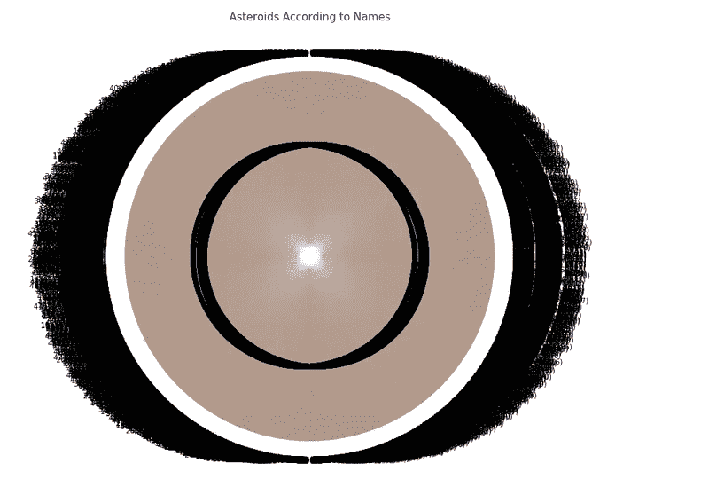
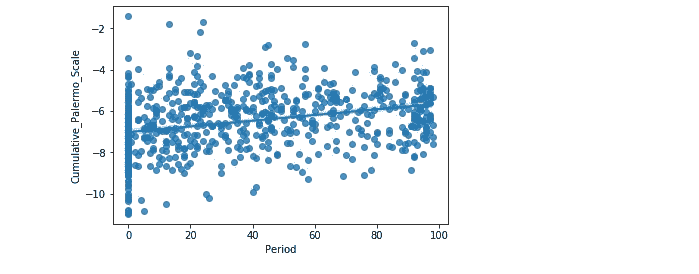

# 利用数据分析预测小行星对地球的撞击

> 原文：<https://medium.com/analytics-vidhya/predicting-asteroid-impacts-on-earth-by-using-data-analytics-a725594b68c2?source=collection_archive---------13----------------------->

过去，小行星给我们的地球带来了巨大的破坏和大气变化。虽然不断有小行星刚刚经过地球的新闻，但恐惧是真实的，因为一颗小行星的撞击可以改变一切。

**什么是小行星？**

这些只不过是太空中的岩石，是由于可能发生在太阳上的爆炸而形成的，存在于银河系的任何地方。一些小行星大到足以让卫星绕轨道运行。它们通常绕着太阳转。

小行星的轨道是通过找到观测预测的绕太阳的椭圆路径来计算的。通过了解多年的位置，我们可以通过使用数据分析和机器学习准确地知道和预测对地球的影响

**数据集**

为了预测可能撞击地球的小行星，我们需要精确的数据集。

小行星轨道和撞击风险数据是由美国宇航局喷气推进实验室(加州理工学院)的近地天体计划收集的。

**学习资料(** [全码](https://www.kaggle.com/saishur/asteroid-impact-on-earth-prediction-by-using-ml))

683 个小行星名称

轨道物体名称

小行星速度与可能撞击的关系图

起始期与小行星名称的关系图

15 个常见小行星名称与频率

小行星名称 Vs 期末

小行星对小行星的百分比

小行星名称

相关矩阵，用于查找数据集中可用的列和数据关系

可能影响时期的回归图

期间与累积 _ 巴勒莫 _ 规模

寻找最大直径的小行星

小行星撞击地球的最大概率。

将对地球造成最大影响的小行星

使用各种算法进行预测

准备训练和测试数据

各种算法精度指标

算法的图表。

根据位置、速度和概率，小行星撞击的预测准确率为 97-99%。

**结论** : →

1.  2011 SR52 是一颗直径最大的小行星。
2.  小行星撞击地球的最大概率
3.  将产生最大影响的小行星→2008 EM68。
4.  在接下来的 100 年里，小行星撞击的机会很多。

参考文献:→

1.  NASA 数据:→[https://www.jpl.nasa.gov/news/news.php?feature=7194](https://www.jpl.nasa.gov/news/news.php?feature=7194)
2.  知乎立场:→[https://www . JPL . NASA . gov/edu/news/2017/4/18/how-NASA-studies-and-tracks-小行星-近远/](https://www.jpl.nasa.gov/edu/news/2017/4/18/how-nasa-studies-and-tracks-asteroids-near-and-far/)