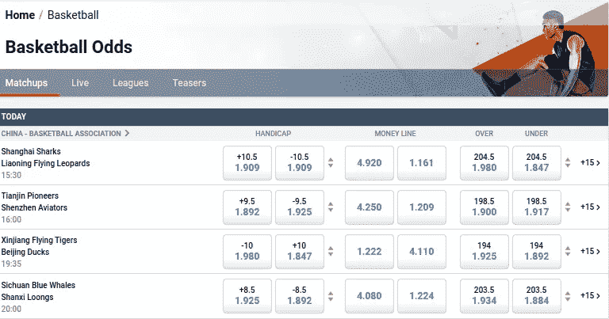
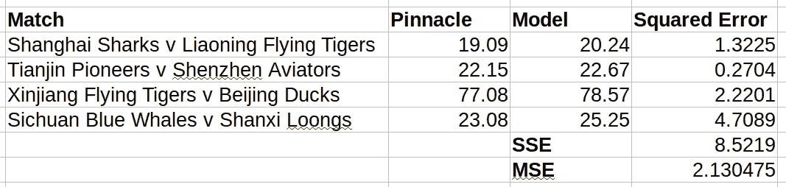

# 使用 Python 和 Docker 预测篮球比赛结果

> 原文：<https://medium.com/analytics-vidhya/predicting-basketball-results-using-python-and-docker-9630d7c3be56?source=collection_archive---------7----------------------->

# **简介**

我们将在 Python 中构建一个基本的预测模型，计算篮球比赛中两队之间的获胜概率。为了验证其准确性，我们将比较模型的输出和实际的博彩赔率。这个模型将是一个简单的 REST API，运行在 Docker 容器中(我的意思是，它*毕竟是* 2020)。

以防你还不知道，这里有这个项目的技术栈的概述，完全不是从维基百科上抄来的:

***Python*** 是一种解释型高级通用编程语言。它被设计成易于阅读和简单实施。

***Docker*** 是一套平台即服务(PaaS)产品，使用操作系统级虚拟化来交付称为容器的软件包中的软件。

## **对接器设置**

在你的机器上安装 Docker 引擎是这个项目的先决条件，所以如果你还没有这样做，你必须在你的机器上安装和设置 Docker。根据您运行的操作系统的不同，说明会略有不同，所以在进行安装和设置时，一定要仔细阅读文档。

一旦你完成了这个过程，打开你的终端并输入

```
docker --version
```

如果它返回的不是你的 Docker 版本，那么…你将不得不再次经历设置过程，因为有可能出错了。

安装 Docker 后，您需要创建您的工作目录。我把我的叫做‘python-basketball ’,但是当然你可以随便叫它什么。现在为了让 Docker 工作，我们需要在这个目录中创建两个文件:一个 **Dockerfile** (注意末尾没有文件扩展名)和 **docker-compose.yml** 文件。我不会详细介绍它们是什么，但本质上 Dockerfile 是一个简单的文本文件，包含用户可以调用来组合图像的命令，而 Docker Compose 是一个用于定义和运行多容器 Docker 应用程序的工具。

Dockerfile 的设置非常简单，我们可以用与 Docker Hub 库中的官方 Python 页面相同的方式组装我们的映像——只需更改运行脚本的名称。该文件应该如下所示:

```
FROM python:3WORKDIR /usr/src/appCOPY requirements.txt ./RUN pip install — no-cache-dir -r requirements.txtCOPY . .CMD [ “python”, “./run.py” ]
```

我们的 **docker-compose.yml** 会是这样的:

```
version: '3.4'
services:
  probability-calculator:
    build: .
    volumes:
      - '.:/usr/src/app'
```

最后，在同一个目录中创建一个 **run.py** 文件，其中包含一个简单的 hello world 输出:

```
print("Hello World")
```

书中最古老的把戏。无论如何，这就是在 Docker 中运行 Python 程序所需要的全部内容。如果你回到终端输入

```
docker-compose up 
```

瞧，你应该得到一个可爱的“Hello World”印到你的控制台上！

您已经成功地在 Docker 容器中运行了一个应用程序，没有了实际安装 Python(或其任何工具和依赖项)的麻烦，并且减少了管理虚拟机的开销。

很酷吧？

# 让我们实际建立模型

好了，让我们开始实际编写一些代码。

在这个项目中，我们将使用几个软件包来帮助我们:

1.  ***烧瓶*，**一个帮助构建 web 应用的微框架。
2.  ***SciPy*** ，一个基于 Python 的数学、科学和工程开源软件生态系统。

通常，我们需要使用 pip 在 Python 中手动安装这些包——然而，当我们使用 Docker 时，我们需要做的只是根据需要添加它们，当 Docker 映像构建完成时，它们会自动安装。在您的工作目录中创建一个名为 **requirements.txt** 的文件。将以下几行添加到文件中:

```
Flask==0.12.2
scipy==1.4.1
flask-restful==0.3.6
```

现在，我们需要创建一个文件夹，它代表保存模型 Python 代码的包。我把这个文件夹叫做‘概率计算器’。为了让 Python 知道这是一个包而不仅仅是一个随机的文件夹，我们需要创建一个名为 **__init__ 的文件。py** 。要启动该文件，请添加以下内容:

```
#import the SciPy framework
import scipy.stats as sp#import the Flask framework
from flask import Flask, g
from flask_restful import Resource, Api, reqparse #create an instance of Flask
app = Flask(__name__) #create the API
api = Api(app)
```

## 模型

好了，现在我们进入代码的核心部分，也就是构建实际的模型。这个模型是基于韦恩·温斯顿的数学理论——他解释说，在 NBA，一个评级系统预测的比赛结果的历史标准差是 12 分。换句话说，在任何给定的比赛中，两支球队之间实际差距的可能性可以用一个以赛前差距为中心的钟形概率分布来描述。我们从哪里得到这些差价？嗯，网上赌博的繁荣意味着我们可以很容易地从网上博彩公司那里得到它们。

多亏了新冠肺炎，7 月底之前没有 NBA 比赛。我们将不得不用退而求其次的东西——中国篮球协会！以下是 Pinnacle 从 2020 年 6 月 24 日星期三开始的价格:



**中国篮协赛事巅峰赔率**

我们有四场比赛，都有价差(“差点”)。让我们以第一场比赛为例——在第一场比赛中，我们有上海鲨鱼队和辽宁飞豹队，他们之间的差距为 10.5 分，这意味着飞豹队需要击败鲨鱼队 11 分或更多才能获胜。

“金钱线”是任何一方获胜的概率。鉴于 10.5 分的差距有利于上面的飞豹，Pinnacle 给鲨鱼队的十进制赔率为 4.92，这意味着他们有 20.3%的胜算。飞豹队的十进制赔率为 1.161，相当于 86.1%的胜算。

等一下，这些概率加起来是 106.3%——概率的总和不是 100%吗？没错，但博彩公司从[超过](https://en.wikipedia.org/wiki/Mathematics_of_bookmaking)中赚钱，这基本上是他们加入选择的百分比，使他们值得下注。为了方便起见，我们将使用中学数学来用比率标准化这些百分比。我们将得出每个团队的以下获胜概率:

上海鲨鱼:19.09%
辽宁飞豹:80.91%

*唷，这些中文名字真拗口。当你需要一个像“明尼苏达森林狼队”这样干脆的 NBA 球队名字时，哪里还有这样的名字呢？*

# **回码**

既然我们已经知道了博彩公司给这两个团队的价差和获胜概率，那么是时候回到 Python 中工作了。

我们可以将标准差硬编码为 12.0(在中国联赛中可能与 NBA 略有不同，但让我们改天再讨论这个问题)。接下来，我们需要生成获胜概率。这些将基于正态分布(也称为高斯分布),该分布以庄家价差的平均值为中心，以及给定的标准偏差。回到 **__init__。py** 让我们写下模型:

```
STD_DEV = 12.0def calculate_probability(spread, std_dev):
    return sp.norm.sf(0.5,spread, std_dev)
```

该函数仅返回给定庄家价差和标准差的情况下，一个团队赢 1 分或更多分的概率。你可以在 SciPy 关于正态分布的文档中阅读这方面的内容。

接下来，实际的模型请求。这将是一个利用 flask-resftul 的 HTTP POST 请求，flask 包的扩展提供了快速构建 API 的工具。它的工作方式是这样的:

1.  用户为每个端点创建一个类
2.  然后，用户为每个要接受的方法创建一个函数

记住这一点，下面是用 200 状态代码编码的请求，如果成功，还会有消息:

```
class WinProbability(Resource):def post(self):
    parser = reqparse.RequestParser()
    parser.add_argument('spread', required=True, type=str) args = parser.parse_args() favourite_win = calculate_probability(float(args.spread),  
    STD_DEV)
    outsider_win = 1 - favourite_win return{'message': 'POST really was excellent',    
    'favouriteProbability': favourite_win, 'outsiderProbability':
    outsider_win}, 200
```

那真是太棒了。

在我们测试模型和响应之前，不要忘记在文件的末尾添加这个资源:

```
api.add_resource(WinProbability, '/winProbability')
```

现在，让我们实际上从 **run.py** 文件中删除“Hello World”儿童剧，并代之以我们的应用程序:

```
from probability_calculator import appapp.run(host='0.0.0.0', port =80, debug=True)
```

最后，让我们在最后的 **docker-compose.yml** 中公开这个应用程序的端口 5000:

```
ports:
  - '5000:80'
```

现在我们可以出发了！

# **测试模型**

首先，我们需要一个 [REST 客户端](https://www.slant.co/topics/7913/~rest-api-clients#2)来测试我们的 HTTP 请求——我使用的是 Postman，但是你可以使用任何你喜欢的。

进入项目目录，启动终端，输入

```
docker-compose up
```

启动应用程序。

现在使用我们的 REST 客户端，让我们使用 POST 请求访问端口 5000，内容类型设置为`application/json`，主体如下:

```
{"spread": 10.5}
```

如果一切顺利，你*应该*得到这样的回应:

```
{"message": "POST really was excellent","favouriteProbability": 0.7976716190363569,"outsiderProbability": 0.20232838096364314}
```

但是我们如何验证这些概率是否真的有用呢？

我们将把它们与之前 Pinnacle 的比赛结果市场进行比较。回到我们之前记录的上海鲨鱼队和辽宁飞虎队的获胜概率，我们可以看到鲨鱼队为 19.09%，飞虎队为 80.91%。离 20.2%和 79.8%也不算太远。不错！我想我们现在可以开始自己的博彩业务了，对吗？

没那么快。首先，我们需要量化我们的模型输出实际上离预期概率有多远。有几种方法可以做到这一点，但一个很好的方法是使用样本数据的[均方误差](https://en.wikipedia.org/wiki/Mean_squared_error) (MSE)。出于时间的考虑，这有点跑题，误差平方和(SSE)就是所有模型误差与实际数据相比的平方。当你将总和除以数据点的数量时，你得到 MSE。对于本例，平方误差为

***匹配 1 的平方误差= (19.09 - 20.24) = 1.3225***

我们必须对所有四个匹配运行我们的模型，以比较结果并获得 MSE。现在，我们可以为此编写另一个 Python 模块，或者我们可以像非受虐狂那样，创建一个 Excel 电子表格:



**模型输出的 SSE 和 MSE**

*请注意，我们只需要四个数据点，因为该模型只针对热门概率运行了四次。局外人的概率正好是补数，即 1-最有希望获胜的概率。*

数据集的 MSE 是 2.13——也许我们还没有完全准备好推出自己的体育博彩业务。

# 结论

唷。从在我们的操作系统上设置 Docker 开始，我们已经走了很长的路——我们现在有一个用 Python 构建的篮球模型，运行在它自己的 Docker 容器上！那真是太棒了。

现在的问题是可以做些什么来改进这个模型？我已经能想到一些事情了:

1.  数据集的标准偏差不一定是 12.0
2.  4 的样本数据不可能足以证明任何模型
3.  最初的假设可能过于简单——你真的能根据高斯分布预测篮球比赛结果吗？可能有更好的方式来模拟篮球比赛的结果吗？
4.  代码错误处理是不存在的(而且寿命很短)

另外，我认为这是篮球预测建模的一个很好的尝试。如果我的博客文章是垃圾，而你宁愿只是翻录我的代码，在我的 [Github 库](https://github.com/ourandy/python-basketball)里随意这么做。

今天谢谢你！

# 其他文章

[](/analytics-vidhya/solving-our-python-basketball-model-d89edfb83f79) [## Python 中的优化可减少均方误差

### 使用 scipy.optimize 库优化模型

medium.com](/analytics-vidhya/solving-our-python-basketball-model-d89edfb83f79)