# 利用随机森林算法预测自行车共享需求

> 原文：<https://medium.com/analytics-vidhya/predicting-bike-sharing-demand-using-randomforest-algorithm-32682a7a07e7?source=collection_archive---------16----------------------->

## 深入分析

## 卡格尔竞赛初学者指南


Jorge Alcala 在 [Unsplash](https://unsplash.com/s/photos/washington-d.c?utm_source=unsplash&utm_medium=referral&utm_content=creditCopyText) 上的照片

# 介绍

随着城市化达到前所未有的水平，道路拥堵已成为一个现代问题。交通拥挤与空气污染、安全风险、经济竞争力、可持续增长和社会凝聚力有关。

在这种情况下*自行车共享系统*成为避免上述问题的主要解决方案。自行车共享计划的好处包括运输灵活性、减少车辆污染物、健康益处、减少拥堵和燃料消耗，以及为个人节省资金。

这是一篇关于数据科学的报告，面向开始 Kaggle 竞赛的初学者和爱好者。以下是对*数据科学*竞赛的详细描述，包括*数据操作*、*数据可视化*以及使用*机器学习算法*预测华盛顿市[](https://www.kaggle.com/c/bike-sharing-demand)**自行车共享需求，并给出了预测共享需求的分步指南。**

**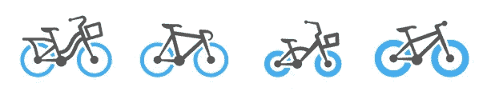**

```
## Loading the required packageslibrary(tidyverse)
library(dplyr)
library(scales)
library(ggplot2)
library(glmnet)
library(caret)
library(lubridate)
```

**我使用了流行的机器学习元算法 RandomForest，这是一种用于分类和回归的集成学习方法。它也是最常用的算法之一，因为它无需超参数调整就能产生很好的效果。**

****

**照片由 [Sebastian Unrau](https://unsplash.com/@sebastian_unrau?utm_source=medium&utm_medium=referral) 在 [Unsplash](https://unsplash.com?utm_source=medium&utm_medium=referral) 上拍摄**

```
## Importing the data 
biketrain <- read.csv("../input/bike-sharing-demand/train.csv")
biketest <- read.csv("../input/bike-sharing-demand/test.csv")## Making equal no. of columns in boths datasets 
biketest$registered=0
biketest$casual=0
biketest$count=0## Joining both train and test datasetsbikesharing <- rbind(biketrain, biketest)## Inspecting the datasummary(bikesharing)## season -  1 = spring, 2 = summer, 3 = fall, 4 = winter 
## weather - 1: Clear, Few clouds, Partly cloudy, Partly cloudy ; 2: Mist + Cloudy, Mist + Broken clouds, Mist + Few clouds, Mist ;3: Light Snow, Light Rain + Thunderstorm + Scattered clouds, Light Rain + Scattered clouds ;4: Heavy Rain + Ice Pallets + Thunderstorm + Mist, Snow + Fog## Converting a few a variables into factors
bikesharing$season <- as.factor(bikesharing$season)
bikesharing$weather <- as.factor(bikesharing$weather)
bikesharing$holiday <- as.factor(bikesharing$holiday)
```

# ****特色工程****

**让我们处理第一个变量 *datetime* ，因为我们可以将它分解为许多其他有意义的变量，如一天中的小时、一个月中的天、一周中的天、一天中的小时、月、年，这些变量对进一步的数据分析很有用，我们可以将它们用于预测共享需求。**

****1。小时****

```
## Extracting hour from date timebikesharing$hour = substr(bikesharing$datetime,12,13)
bikesharing$hour <- as.factor(bikesharing$hour)## plotting the graphggplot(data=bikesharing, aes(x = hour, y=count, fill=hour))+geom_bar(stat = "identity")+ggtitle(label = "Hourly Comparison with Seasons")+theme_minimal()+theme(plot.title = element_text(hjust = 0.5, lineheight = 0.8, face = "bold"),legend.position = "none")+xlab("Weekdays")+ylab("Count")
```

**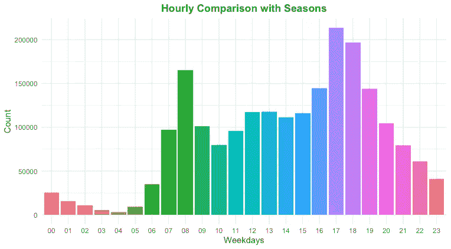**

**城市中的人们在下午 5-8 点之间使用自行车最多，在办公时间上午 8-9 点之间需求也激增，可能是为了避免交通堵塞。**

```
## Season and Hour vs Count Graphggplot(bikesharing, aes(hour, count)) + 
  geom_bar(aes(fill = season), position = 'dodge', stat = 'identity') + 
  ggtitle(label="Count with Hours of Day and Seasons") + scale_y_continuous(labels = comma) + theme(plot.title = element_text(hjust = 0.5, lineheight = 0.8, face = "bold")) + theme_minimal()
```

**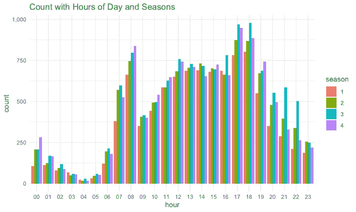**

**秋季和冬季是一天中大部分时间需求量最高的主要季节。根据自行车专家的说法，秋季被认为是骑自行车的最佳季节，因为骑完自行车后你不会浑身是汗，树叶的颜色会不断变化，骑自行车感觉很舒服。**

> ***“春去春来，一念天真，***
> 
> ***夏天过去了，人们记得自己的活力，***
> 
> ***秋天过去了，人们记得自己的崇敬，***
> 
> **冬天过去了，一个人记得自己的毅力**

## ****2。日****

```
## Daylightbikesharing$light <- as.factor(bikesharing$hour == c(7:19)) ## Holidaybikesharing$holiday <- as.factor(bikesharing$holiday)## Weeked or notbikesharing$weekend=0
bikesharing$weekend[bikesharing$day=="Sunday" | bikesharing$day=="Saturday" ]=1## Free time in a weekbikesharing$officehour <- as.factor(bikesharing$hour == c(9:17))
bikesharing$freehourworkday <- as.factor(bikesharing$officehour == FALSE && bikesharing$holiday == 0)## Day of the Weekbikesharing$date = substr(bikesharing$datetime,1,10)
days<-weekdays(as.Date(bikesharing$date))
bikesharing$days=daysbikesharing$days <- factor(bikesharing$days, levels=c("Monday","Tuesday", "Wednesday", "Thursday", "Friday", "Saturday","Sunday"))## Weekdays Graphggplot(data=bikesharing, aes(x = days, y=casual, fill=days))+geom_bar(stat = "identity")+ggtitle(label = "Weekday Comparison of Casual Users")+theme_minimal()+theme(plot.title = element_text(hjust = 0.5, lineheight = 0.8, face = "bold"),legend.position = "none")+xlab("Weekdays")+ylab("Casual Count")+ scale_y_continuous(labels = comma)
```

**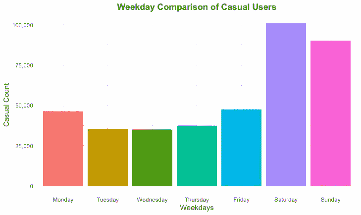**

**临时用户更多是在周末，也就是说，他们不需要注册，因为他们只在空闲时间骑自行车。这些可能是以前的用户。**

```
## Registered Users and Count across Weekdaysggplot(data=bikesharing, aes(x = days, y=registered, fill=days))+geom_bar(stat = "identity")+ggtitle(label = "Weekday Comparison of Registered Users")+theme_minimal()+theme(plot.title = element_text(hjust = 0.5, lineheight = 0.8, face = "bold"),legend.position = "none")+xlab("Weekdays")+ylab("Registered Count") + scale_y_continuous(labels = comma)
```

**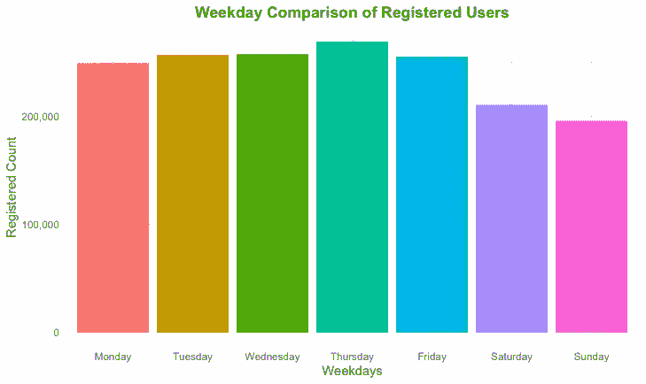**

**注册用户的数量在工作日达到高峰，他们使用自行车来避免交通堵塞并准时到达办公室，因此他们必须已经注册，因为他们几乎每天都需要自行车。**

```
ggplot(data=bikesharing, aes(x = days, y=count, fill=days))+geom_bar(stat = "identity")+ggtitle(label = "Weekday Comparison")+theme_minimal()+theme(plot.title = element_text(hjust = 0.5, lineheight = 0.8, face = "bold"),legend.position = "none")+xlab("")+ylab("Total Count") + scale_y_continuous(labels = comma)
```

**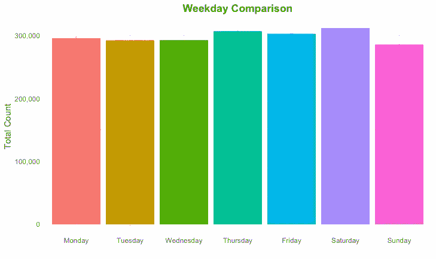**

```
## Weekday and Weather Comparisonggplot(data=bikesharing, aes(x=days, y=count, fill=weather)) +
  geom_bar(stat="identity", position=position_dodge()) + ggtitle(label ="Day of the Week and Weather with Count Comparison") +theme_minimal()+theme(plot.title = element_text(hjust = 0.5, lineheight = 0.8, face = "bold"))+xlab("")+ylab("")
```

**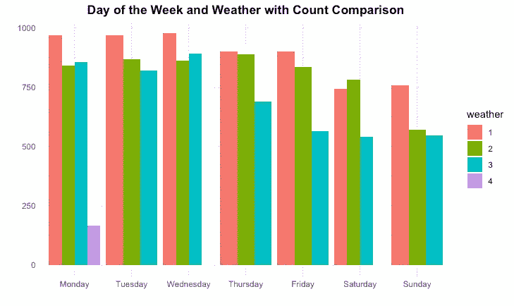**

****3。月份****

```
## Converting date to a date format in Rbikesharing$date <- as.POSIXct(bikesharing$date)## Extracting Month Namebikesharing$MONTHS <- format(bikesharing$date,"%B")bikesharing$MONTHS <- factor(bikesharing$MONTHS, levels=c("January","February", "March", "April", "May", "June","July", "August", "September", "October", "November", "December"))## Monthly Graphggplot(data=bikesharing, aes(x = MONTHS, y=count, fill=MONTHS))+geom_bar(stat = "identity")+ggtitle(label = "Monthly Comparison of Users")+theme_minimal()+theme(plot.title = element_text(hjust = 0.5, lineheight = 0.8, face = "bold"), legend.position = "none")+xlab("")+ylab("Count")
```

**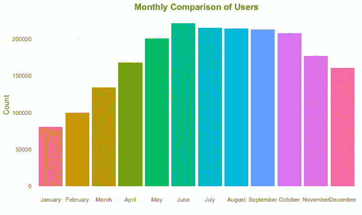**

**下半年可能是骑自行车的好时机，我们可以看到，需求高峰可以在秋季看到。**

```
## Month and Weekday vs Countggplot(data=bikesharing, aes(x = MONTHS, y=count, fill=days))+geom_bar(stat = "identity")+ggtitle(label = "Users Count compared in Months and Weekdays")+theme_minimal()+theme(plot.title = element_text(hjust = 0.5, lineheight = 0.8, face = "bold"))+xlab("")+ylab("")
```

**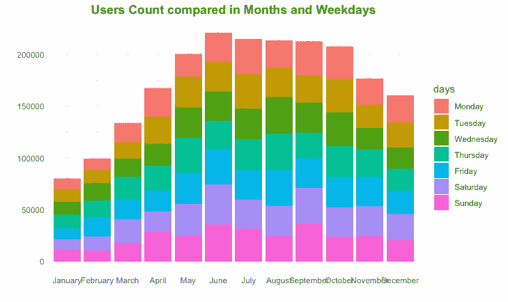**

```
## Day of the Month Extractionbikesharing$dom = substr(bikesharing$datetime,9,10)
bikesharing$dom <- as.numeric(bikesharing$dom)## Season and Day of Month vs Count of Usersggplot(data=bikesharing, aes(x = dom, y=count, fill=season))+geom_bar(stat = "identity")+ggtitle(label = "Day of the Month with Season Comparison")+theme_minimal()+theme(plot.title = element_text(hjust = 0.5, lineheight = 0.8, face = "bold"))+xlab("Days upto 19th")+ylab("Count") + xlim(01,19)
```

**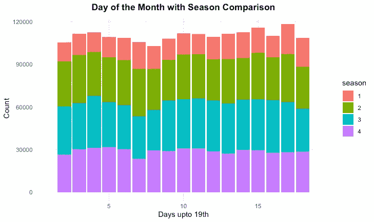**

```
*## Visualizing the demand only till 19 th of every Month as we have to predict the number of users from 20th to end of each month*## Plotting a Heat Tile Graphggplot(bikesharing, aes(dom, hour, fill = count)) + geom_tile(color = "white") +ggtitle(label = "Day of the Month and Hour of the Day Comparison")+theme_minimal()+theme(plot.title = element_text(hjust = 0.5, lineheight = 0.8, face = "bold")) + xlab("Day of the Month(Till 19th)") + ylab("Hour")
```

**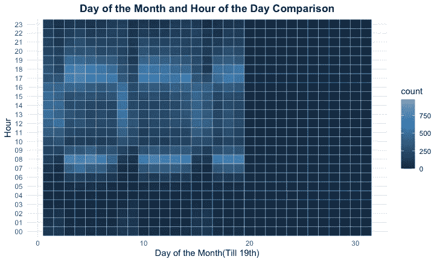**

****我们可以处理更多的变量，以提取更多的附加信息****

**我们在这里还能做什么？可以从湿度、温度、风速、工作日中提取有用的信息，让我们来看看。**

****4。天气状况****

**最好的骑行条件是阳光充足，能见度高，风速小，湿度小，以避免在高温下出汗。**

```
## Ideal Condition to ride a bikebikesharing$Ideal <- as.factor(bikesharing$weather == 1 && bikesharing$windspeed < 20 && bikesharing$humidity < 25 && bikesharing$atemp < 35)## Calculation Pollution(Ozone Content) using Temp, Windspeed and Humiditybikesharing$ozone <- 5.3*(bikesharing$windspeed)+0.4*(bikesharing$temp)+0.1*(bikesharing$humidity)## Plotting Weather and Temp vs Count Graphggplot(bikesharing, aes(temp, count)) + geom_jitter(aes(colour = weather)) + ggtitle(label ="Effect of Weather and Temperature on Count")+theme_minimal()+theme(plot.title = element_text(hjust = 0.5, lineheight = 0.8, face = "bold")) + xlab("Temperature") + ylab("Count of Users")
```

**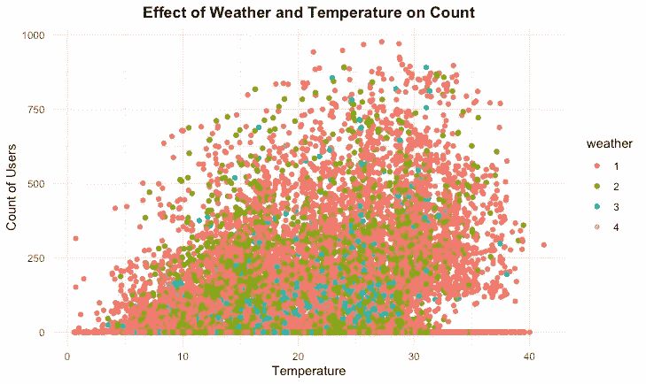**

```
## Windspeed & Hour of the day vs Users' Countggplot(bikesharing, aes(windspeed, hour)) + geom_jitter(color= "blue") + theme_minimal() + ggtitle(label = "Windspeed and Hour of the Day with Users' Count")+theme_minimal()+theme(plot.title = element_text(hjust = 0.5, lineheight = 0.8, face = "bold")) + xlab("Windspeed") + ylab("Hour")
```

**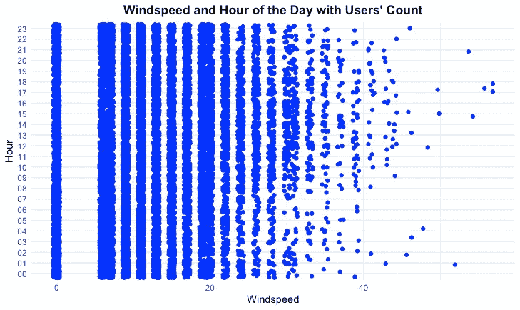**

**创建新的日志变量**

*   **因为我们知道因变量有自然离群值，所以我们将预测因变量的日志。**
*   **分别预测注册用户和临时用户的自行车需求，logcas=log(临时+1)和 logreg=log(注册+1)，加 1 处理零值。**

```
bikesharing$logcas <- log(bikesharing$casual + 1)
bikesharing$logreg <- log(bikesharing$registered + 1)
```

# **模型部署和预测**

```
## Converting numeric values to factor for randomForestbikesharing = bikesharing %>% mutate_if(is.factor, as.numeric)str(bikesharing)## Train and Test data separationbiketrain <- bikesharing[1:10886, ]
biketest <- bikesharing[10887:17379, ]## Deploy the modelset.seed(8234)
library(randomForest)## Casualbkmodel <- randomForest(logcas ~ season + holiday + workingday + weather + temp + atemp + humidity + windspeed + Ideal + hour + MONTHS + days + officehour + freehourworkday + weekend + ozone + light + dom, data = biketrain)# Predictpredict1 <- predict(bkmodel, biketest)
summary(bkmodel)## Registered set.seed(9234)
bkmodel1 <- randomForest(logreg ~ season + holiday + workingday + weather + temp + atemp + humidity + windspeed + Ideal + hour + MONTHS + days + officehour + freehourworkday + weekend + ozone + light + dom, data = biketrain)# Predictpredict2 <- predict(bkmodel1, biketest) biketest$logreg = predict2
biketest$logcas = predict1biketest$casual = exp(biketest$logcas)
biketest$registered = exp(biketest$logreg)## Saving submission file as per requirement of competitionbiketest$count=biketest$casual+biketest$registered
bike<-data.frame(datetime=biketest$datetime,count=biketest$count)
write.csv(bike,file="bikeshare.csv",row.names=FALSE)
```

**这是探索性的数据分析，适合初学者，可以做得更复杂。这些结果可以让你进入 Kaggle 比赛的前 20 个百分点，这对初学者来说是非常好的比赛。像 ntree、importance、npreb 和 proximity 这样的元素可以添加到随机森林模型中以提高其效率。**

**最初作为 [Kaggle 笔记本](https://www.kaggle.com/rutvikdeshpande/bike-sharing-demand)出版。**