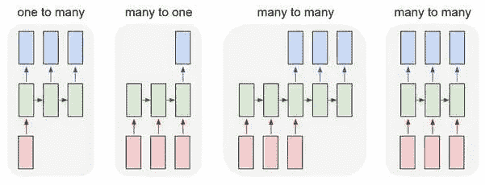

# 用 LSTM 预测比特币价格

> 原文：<https://medium.com/analytics-vidhya/predicting-bitcoin-prices-with-lstm-19e578d389c4?source=collection_archive---------7----------------------->

我们在 21 世纪见证的革命之一是深度学习。一直以来，我们都在日常生活中体验这种机器学习算法的结果。从语言翻译工具到我们手机中的语音控制个人助理，深度学习已经成为我们生活的一部分。

在过去的 5 年里，加密货币也成为了热门话题。自中本聪于 2009 年[ [1](https://bitcoin.org/bitcoin.pdf) ]发布第一种加密货币比特币(BTC)以来，它一直是加密货币系统的旗舰范例，也是最受欢迎的一种。继 BTC 发布之后，许多新的加密货币也被发布，被称为替代硬币(altcoins)。他们中的一些人想出了取代 BTC 的主意，但 BTC 从那时起就一直保持着在社区中的领导地位。它目前拥有 1300 亿美元的市值，每天接收超过 30 万笔交易。

长短期记忆(LSTM)是深度学习中最受欢迎的主题之一。由于这种方法对时间序列数据有很好的效果，因此有很多关于用这种方法预测金融市场的工作。陈等人[ [2](https://search.proquest.com/openview/46aea08541f0024bfd3956c759c3bac3/1?pq-origsite=gscholar&cbl=1606379) ]利用中国股票市场数据对未来价格进行预测，他们的模型将股票收益预测的准确率从 14.3%提高到 27.2%。准确性可以定义为正确分类的数据点的百分比(价格上升、下降，在我们的例子中没有变化)。与这项研究不同的是，Nelson 等人[ [3](https://ieeexplore.ieee.org/abstract/document/7966019) ]还利用 LSTM 的技术分析指标预测了几个巴西股票的价格，平均准确率为 55.9%。另一项关于用 LSTM 预测 BTC 价格的研究由 McNally et al. [ [4](https://ieeexplore.ieee.org/abstract/document/8374483/) ]进行，该研究实现了 52%的最高分类精度和 8%的 RMSE。

本文的目的是在预测 BTC 价格未来走势的数据有限的情况下，介绍 LSTM 基本原理并测量 LSTM 效率。为此，我们构建了一个简单的 LSTM 网络应用程序。接下来的部分描述了人工和递归神经网络，消失梯度问题和 LSTMs。结果部分展示了应用结果并讨论了其性能分析。结论部分是关于本研究呈现的结果和本研究未来可以做的改进。

## 人工神经网络

在这项工作中，我们集中研究人工神经网络，它是机器学习和数据挖掘中的一个有用的工具。它们大多受到神经元在大脑中工作方式的启发。为了理解人工神经网络做什么，首先应该澄清生物神经网络(BNNs)背后的思想。每个生物神经元都有树突，树突从其他神经元接收信息，并将信号传递给细胞体。细胞体是树突信号连接和传递的部分。最后，轴突参与向其他神经元发送信号并重复处理。类似地，每个人工神经元的功能是像树突一样从其他神经元获取加权输入，像细胞体一样进行处理，并产生输出供其他人工神经元使用。由于神经网络的模拟和理解要复杂得多，人工神经网络试图模仿和模拟的只是最基本的部分。在图 1 中可以看到简单生物神经元及其在人工神经元中的等效功能的表示。

图一。一个生物神经元和一个人工神经元

基本上，一个人工神经网络有三个组成部分，即权重，偏差和激活函数，如公式。其中 b 是偏差，w 是权重矩阵，x 是输入。这里 f()代表激活函数。它们在人工神经网络中的示意图见图 2。

第一个主要成分是重量，它代表单元之间的连接强度，即等式中的 w。图 2 中的 1 和 W。它决定了一个神经元是否对输出值有更大的影响。神经网络的主要目的是调整和寻找最佳权重，以最小化损失或误差。最初，我们随机选择权重。然后，我们通过惩罚权重来训练我们的网络，以决定输出。

人工神经网络的第二个主要部分是偏差，它在等式中是最佳的。1 和图 2 中的偏置。我们可以认为偏差是线性方程中的截距。它充当帮助模型拟合给定数据的常数。这使得模型更加灵活。

人工神经网络的最后一部分是激活函数，它是方程 f()中的函数。1.它也被称为传递函数。通过用加权和与偏差值进行计算来决定是否激活神经元是一种决策机制。如果没有激活函数，人工神经网络只能充当线性回归模型。它将非线性引入神经网络。整流线性单元(ReLU)、Tanh 和 Sigmoid 激活是最常用的激活函数。它在人工神经网络中的作用可以在图 2 中看到。

双曲正切函数和 Sigmoid 函数是递归神经网络中常用的激活函数，将在 RNN 部分进行解释。双曲正切函数的范围是[-1，1]，sigmoid 函数的范围是[0，1]。tanh 的梯度值介于 0 和 1 之间，sigmoid 的梯度值介于 0 和 0.25 之间。在消失梯度问题部分解释消失梯度问题时，这些梯度值将发挥重要作用。

图二。这里 x1、x2、x3 是输入，w1、w2、w3 是权重。它接受输入，处理输入，通过激活函数传递输入，然后返回输出。

## 递归神经网络

递归神经网络()是一类人工神经网络，其中神经元之间的连接沿着时间序列形成有向图，如李等人(2019) [ [5](https://www.sciencedirect.com/science/article/abs/pii/S0167739X19307356) 所述。这允许它展示时间动态行为。正如 Mittal (2019) [ [6](https://towardsdatascience.com/understanding-rnn-and-lstm-f7cdf6dfc14e) 所说，rnn 可以使用它们的内部状态(记忆)来处理输入序列，这使它们适用于未分段、连接的手写识别或语音识别等任务。
换句话说，与人工神经网络不同，rnn 能够处理具有序列形式的数据。人工神经网络总是采用固定长度的输入，对于可变长度的输入，如文本、音频或视频，它们是不成功的。固定大小也意味着数据特征之间没有时间关系。

图 3。每个矩形是一个向量，箭头代表函数(如矩阵乘法)。输入向量为红色，输出向量为蓝色，绿色向量保持 RNN 状态[ [7](http://karpathy.github.io/2015/05/21/rnn-effectiveness/)

如图 3 所示，有几种类型的 RNN 序列。第一种是一对多，它接受一个输入并产生一个序列输出。图像字幕就是这种行为的一个例子。它以一幅图像作为输入，并产生与该图像相关的标签。第二种类型是多对一流程序列，它接受一个输入序列并产生一个输出。情感分析可以被视为这种类型的一个过程。一个句子可以作为一个输入序列，作为回报，你决定它是有积极的还是消极的意义。第三个模型是多对多流程序列。Google translate 是这种类型的完美候选，它将一种语言中的单词转换成另一种语言的意思。最后一个例子也是处理同步序列输入和输出的多对多序列。帧级别的视频分类就是一个很好的例子。

图 4。一个多对多的 RNN 例子

让我们继续一个多对多 RNN 示例，输入为 x_0，x_1 … x_n，将产生输出 y_0，y _ 1…y _ n。x _ I 和 y_i 是向量，可以具有任意维数，如图 4 所示。这种 RNN 表示的数学表达式形式化为等式。2 和 Eq。3.这里，偏差 b_h 和 b_y 用于我们的 RNN。在这两个方程中，h 等于隐藏态。在 Eq 中。2，W_xh 用于 x_t → h_t 链接，W_hh 用于 h_{t-1} →h_t 链接。在 Eq 中。3，W_hy 用于 h_t → y_t 环节。

## 消失梯度问题

如 Rumelhart 等人(1988) [ [8](https://www.nature.com/articles/323533a0) 所述，反向传播是机器学习中最常用的算法之一，它反复调整网络中连接的权重，以最小化网络的实际输出向量和期望输出向量之间的差异度量。但是当使用诸如 sigmoid 和 tanh 之类的激活函数时，它带来了一个严重的问题。假设我们有 N 层，我们想计算第一层对误差函数偏导数的更新权重。通过使用链式法则，这意味着将这些小梯度数相乘 N 次，从而导致梯度指数下降。因此，第一层的梯度可能变得几乎为零，这阻止了其权重更新其值。甚至可能导致神经网络的训练停止。

## LSTM

LSTM 是一种人工 RNN 架构，旨在解决在传统 RNNs 的训练阶段可能遇到的消失梯度问题。如图 5 所示，普通的 LSTM 单元由单元、输入门、输出门和遗忘门组成。

图 5。LSTM 单位表示法

1997 年，Hochreiter 和 Schmidhuber [ [9](https://www.mitpressjournals.org/doi/abs/10.1162/neco.1997.9.8.1735) ]提出了 LSTM 方法，并引入了存储单元(单元状态)，用 Cj 表示。单元状态可以保留来自先前序列的所有关系和数据，这是基本 RNN 无法处理大序列的。LSTM 有三个关键步骤。第一步是遗忘，由遗忘门处理。如果需要的话，它负责从细胞状态中移除信息，例如过去的信息历史对于我们未来的工作不再需要。它使用输入、前一个单元输出和输出 0 或 1 的 sigmoid 函数。0 表示完全忘记，1 表示完全保留之前的信息。第二步是更新单元状态。它决定了我们将在单元状态中存储什么样的新信息。输入门在 tanh 层的帮助下负责这个操作。最后一部分是由输出门处理的输出。它决定了下一个隐藏状态是什么。这种隐藏的状态信息也可以透露给单元的外部用于预测。公式在 LSTM 被使用可以在 Eq 中看到。4、情商。5 和情商。6 其中 I 是输入/更新门的激活向量，f 是遗忘门的激活向量，o 是输出门的激活向量。在相同的等式中，h 是隐藏状态向量，x 是输入向量，W 是权重矩阵，c 是单元状态向量，σ是 sigmoid 函数。

如前所述，LSTM 解决了渐变消失的问题。从 c_t 到 c_{t-1}的反向传播只需要逐元素的乘法和加法。由于不需要矩阵乘法，它可以克服这个问题。由于 LSTMs 在捕获长期时间依赖性方面是有效的，所以它们已经被用于许多困难的问题，例如手写识别和生成、语言建模和翻译、语音的声学建模、语音合成、音频和视频数据的分析。但是它们也有自己的缺点。第一个主要缺点是他们很难训练。它们在训练期间消耗大量的硬件资源，因为它们需要大量的存储器带宽。LSTMs 的第二个缺点是它们很容易在训练数据上过度拟合，特别是在数据不足的对象中，如金融时间序列数据。

## 结果

为了用 LSTM 体系结构预测 BTC 价格，开发了一个实验结果预测系统。为此，使用了包含过去 5 年 BTC 对美元每日价格的数据集。5 年的数据是首选，因为这是比特币开始在全球范围内流行的时间，交易量很高。数据集包含 1914 条记录。数据分为 60%用于训练，20%用于验证，20%用于测试。列车组用于训练我们的 LSTM 网络。验证集用于测量我们系统的损失和性能。最后，使用测试数据集进行预测。该应用程序使用经过训练的 LSTM 网络的模式或序列，使用选定日期的过去 30 天的价格来预测未来 5 天的价格。这并不意味着它只考虑 35 天的数据，因为它使用数据集的每一天来训练系统。

为了实现 LSTM 应用程序，Keras 库与 Tensorflow 后端一起使用。Keras 是一个高级神经网络 API，用 Python 编写，而 Tensorflow 是一个端到端的开源机器学习平台。乙状结肠被用作激活函数。优化算法被选为 Adam(自适应矩估计),这是一种由 Kingma 和 Ba (2014)引入的基于梯度的优化方法。[ [10](https://arxiv.org/abs/1412.6980) ]之所以选择 Adam 算法，是因为它的计算效率很高，并且几乎不需要调整。均方误差法被用作损失函数，它是预测值和真实值之间的平均平方差。输入层由每个时间步长的 30 个输入和 1 个输入特征(BTC 价格)组成。构建了具有 30 个神经元的 1 个隐藏层。最后一层是输出层，每个时间步产生 5 个输出。系统的纪元编号是 200，这是网络将重复训练自己的次数。为了找到最佳状态，经历了不同数量的时期，因此应用程序使用 200。

使用两种方法来评估 LSTM 网络的性能，这两种方法是比较验证集的损失和 RMSE。尽管这些图表对计算我们系统的有效性很有用，但它们也帮助我们检测欠拟合或过拟合等情况。欠拟合意味着模型不能从训练数据集学习，而过拟合意味着模型很好地学习数据集，因此它不能解释和概括与训练集不同的新数据。第一种比较方法是比较训练和验证数据集的损失和验证损失值，如图 6 所示。训练和验证损失图都下降到稳定点。列车损失值小于验证损失值，这是合理的。并且两个图之间的差距非常小。因此，我们可以得出结论，我们的模型与我们的数据集非常吻合。用于评估模型的第二种方法是图 7 中可见的 RMSE 图。RMSE 是对模型预测值和实际值之间差异的度量。预计损失曲线和验证曲线都将下降，因此 RMSE 值以积极的方式响应了模型。使用测试集的模型的最终计算的 RMSE 分数是 0.063。

图 6。训练集和验证集的模型损失比较

图 7。训练集和验证集的模型 RMSE 比较

可以从图 8 和图 9 中检查结果。在图 8 中，这些值似乎没有收敛，这在我们的例子中是不希望的情况。当每天更仔细地分析趋势时，系统有 75%的成功率，这是一个好结果。但是 5 天后的最终趋势在系统中是上升的，而实际的价格变动是下降的。与前一个相比，图 9 中的结果似乎更成功。每天之后的趋势和最终趋势都在增加，因此我们可以说我们的系统很好地处理了这个时间戳数据。

图 8。5 天价格预测(结果 1)
预测价格:[7666，7698，7693，7710，7798]
实际价格:[7400，7278，7217，7243，7269]

**图九**。五天价格预测(结果 2)
预测价格:[7625，7641，7703，7715，7756]
实际价格:[7252，7448，7546，7556，7564]

## 结论

深度学习技术 LSTM 是预测时间序列数据未来行为的一种非常有效的方法。这里的关键点是，它需要大量的数据来训练自己。在我的工作中，我想用一组有限的 BTC 对美元的历史价格数据来挑战这种方法。

在今后的工作中，还有一些地方需要改进。首先，可以从 twitter 和 reddit 等社交媒体收集一些数据。由于加密货币的价格非常容易受到投机的影响，并以其价格的急剧上升和下降来回应这些投机，所以像 tweet 和 reddit 帖子计数这样的补充功能对预测系统来说是有益的。还可以进行情感分析来检测价格的上涨或下跌。未来可以做的第二项工作是使用交易量作为更正确地调整每层权重的特征。当前系统表现出最低和最高音量相同的数据，这是一个矛盾的证据。最后一个可以改进的部分是数据大小。如前所述，我们的数据量对于训练网络来说太低了。为了克服这个问题，每天的价格可以通过每小时拆分价格来提高。由于 BTC 是 24 小时生活平台，它可能会解决数据量的问题。

Github 回购:[https://github.com/gorkemkurt/lstm-bitcoin-price-prediction](https://github.com/gorkemkurt/lstm-bitcoin-price-prediction)