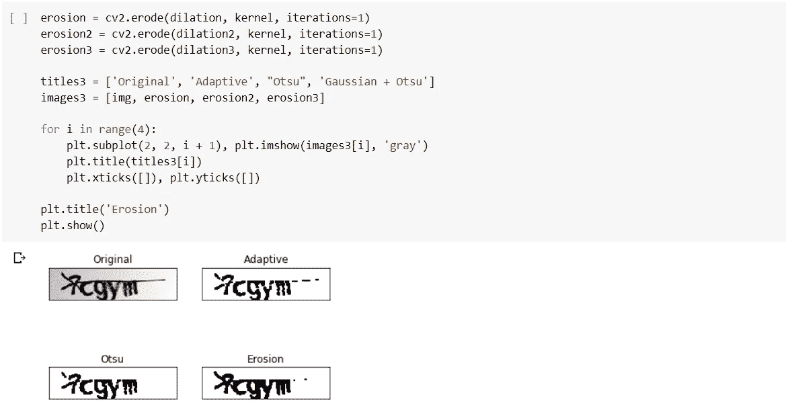
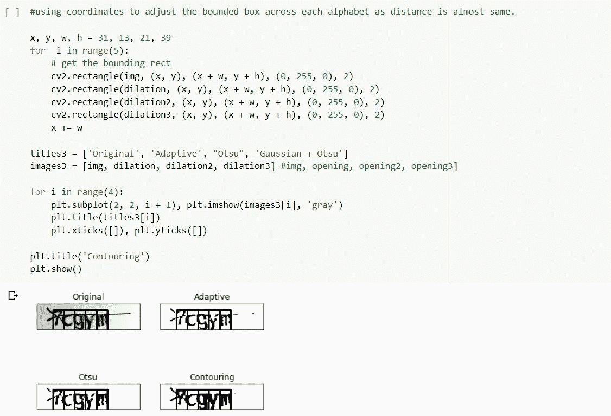
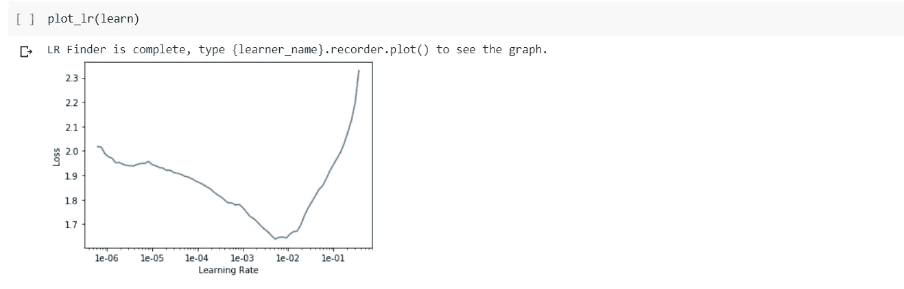

# 通过使用机器学习和分段来预测验证码——创建一个基于光学字符识别(OCR)的算法。

> 原文：<https://medium.com/analytics-vidhya/predicting-captchas-by-using-machine-learning-and-segmentation-make-an-optical-character-53fae2bbf747?source=collection_archive---------16----------------------->

图像处理对于获取图像中包含的信息非常重要，因此它可以进一步用于数据建模，这些数据可以用于空间研究、信息安全(CAPTCHA-区分计算机和人类的全自动公共图灵测试)、语言处理、OCR 扫描和预测准确的数据。

> 神秘感永远不在于我们看到了什么，而在于深入发现它是什么，它的目的是什么。

对于基于文本的图像处理，我们需要遵循的步骤是至关重要的，并且与这些预测的准确度成正比。

基于文本的图像预测的处理流程图

关于数据集

数据集来自[威廉米、罗德里戈&罗萨斯、奥拉西奥。(2013).](https://www.researchgate.net/publication/248380891_captcha_dataset)

对于基于 OCR 的机器学习算法来说，这是一个很好的数据集。

以下是从图像数据中获取结果的步骤。

1.  阅读文件

2)获取验证码中的唯一字符并分配标签。

3)使用 OpenCV 进行分词和灰度缩放

4)模糊和阈值处理

**自适应阈值** →处理照明中出现的空间变化(根据像素强度的差异，帮助从背景中移除所需的前景图像对象。

**OTSU →** 这包括迭代通过阈值，并计算阈值两侧像素级别的扩散度，即落在前景或背景中的像素

5)形态转化

6)侵蚀和膨胀

7)限制每个字符

8)拆分数据以进行训练和测试

学习 15 个时代

显示每个字符预测结果的混淆矩阵

应用卷积神经网络预测验证码

连续的历元提供了更好的准确度

绘制验证码的图形以查看字符的预测结果。

预测验证码的绘图结果(能够预测)

预测验证码的准确率约为 93%。

**参考文献**

1.  dataset-[https://www . research gate . net/publication/248380891 _ captcha _ dataset](https://www.researchgate.net/publication/248380891_captcha_dataset)
2.  分词-[https://towards data science . com/fast-word-Segmentation-for-noise-text-2c 2c 41 f 9 E8 da](https://towardsdatascience.com/fast-word-segmentation-for-noisy-text-2c2c41f9e8da)
3.  阈值处理-[https://www . research gate . net/publication/228350447 _ OCR _ based _ thresholding](https://www.researchgate.net/publication/228350447_OCR_based_thresholding)
4.  [https://medium . com/spinor/a-straight-introduction-to-image-thresholding-using-python-f1 c 085 f 02d 5e](/spinor/a-straightforward-introduction-to-image-thresholding-using-python-f1c085f02d5e)
5.  包围盒-【https://nanonets.com/blog/deep-learning-ocr/ 