# 预测汽车价格:EDA，回归，假设检验

> 原文：<https://medium.com/analytics-vidhya/predicting-car-price-eda-regression-hypothesis-testing-bd4f3c60dc8f?source=collection_archive---------5----------------------->

当你解决问题时，生活就开始了，作为一名数据科学家，我喜欢解决业务问题。

我们每天都可以看到汽车市场在快速增长，这将我们带到了一个许多人在市场上买卖汽车的门口，因此，为了使这一过程更加流畅并具有更好的市场视角，我提出了一个模型，该模型将获取与汽车相关的特定信息，并预测销售价格。这将有助于在买卖汽车时获得更好的视野。

凯伦·瓦达扎里安在 [Unsplash](https://unsplash.com?utm_source=medium&utm_medium=referral) 上的照片

**预测描述:**

我根据汽车的各种特征预测汽车的售价，包括汽车的现价。我将使用多元线性回归来建立模型。

**数据描述:**

该数据集来自 Cardekho.com，它包含 cardekho.com 网站上列出的汽车信息

**来源:**

Kaggle 数据科学社区

# 属性信息:

数据集由几个独立变量组成，包括:

1.  Car_Name:这一列表示汽车的名称。
2.  年份:这一栏代表汽车购买的年份。
3.  Selling_Price:这一列表示车主想要出售汽车的价格。
4.  Present_Price:这是汽车的现价。
5.  Kms_Driven:这是汽车以 km 为单位完成的距离。
6.  燃料类型:汽车的燃料类型，即柴油、汽油、压缩天然气
7.  Seller_Type:定义卖方是经销商还是个人。
8.  变速器:定义汽车是手动的还是自动的。
9.  车主:定义汽车先前拥有的车主数量

# 探索性数据分析:

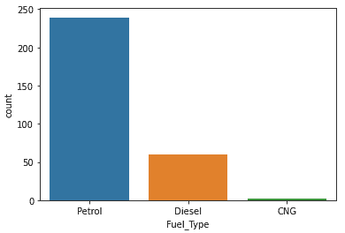

在这里我们可以看到:

*   大多数人拥有的汽车都是汽油型的。
*   人们正在购买更多的汽油车，而不是柴油和压缩天然气。

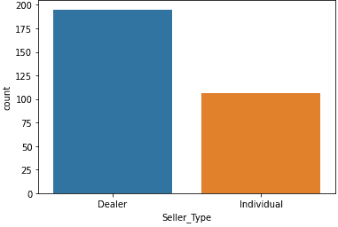

*   大多数卖方类型仅是经销商。
*   但是我们可以看到个人卖家在网上市场的帮助下正在崛起。

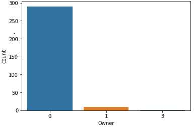

*   大部分车都是第一个车主的。
*   二手车数量较少。

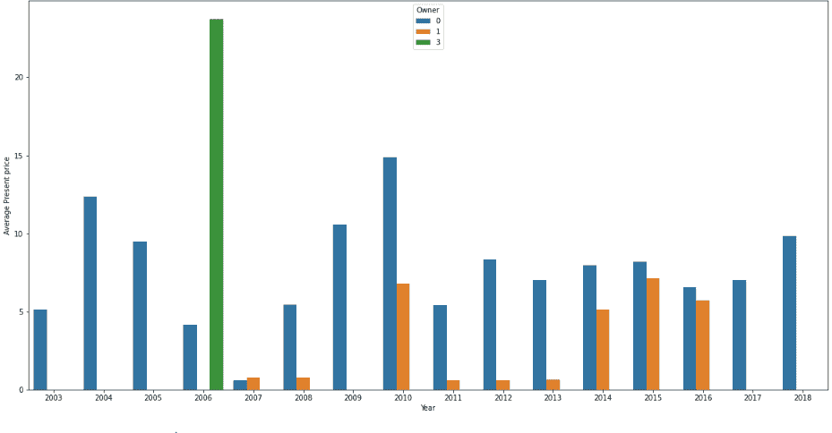

*   在一年的大部分时间里，第一位车主的汽车的现价都很高。

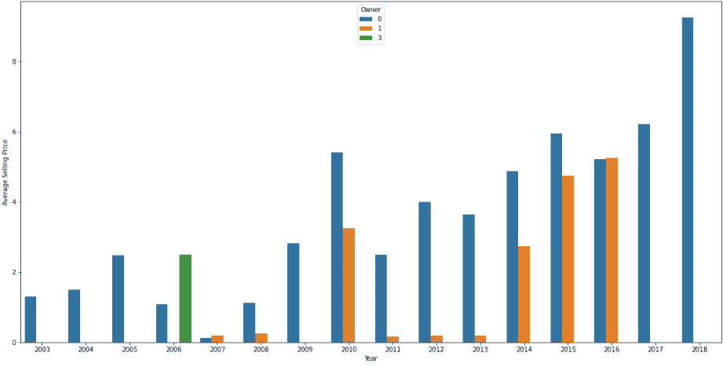

*   当汽车以一个价格出售时，最高售价是第一批车主的，而不是第二批和第三批车主的。

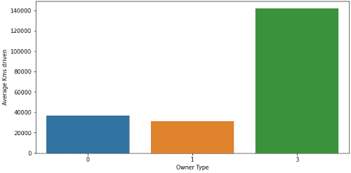

*   第一批车主平均驾驶里程更少。
*   还不如买第一个车主的车。

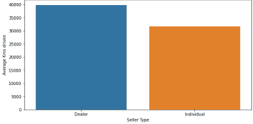

*   经销商拥有/销售平均行驶 4 万公里的汽车，这是一个很大的数字。
*   而拥有/出售行驶 3 万公里的汽车的个人只比经销商少行驶了 1 万公里。
*   如果你想要行驶里程少的车，最好向个人购买。

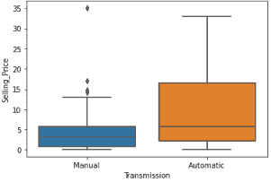

*   自动挡的车比手动挡的车最贵。

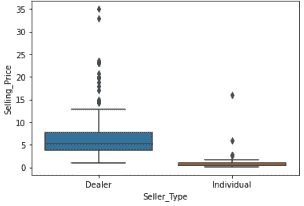

*   经销商以更高的价格出售汽车，正如上面看到的，他们有行驶更高公里数的汽车，在这种情况下价格应该更低。
*   尽管个人驾驶的公里数比上面看到的要少，但他们还是以更低的价格出售他们的汽车。

# 理解变量:

让我们深入了解这些变量，并使用相关矩阵来简化这个过程。

**相关矩阵:**

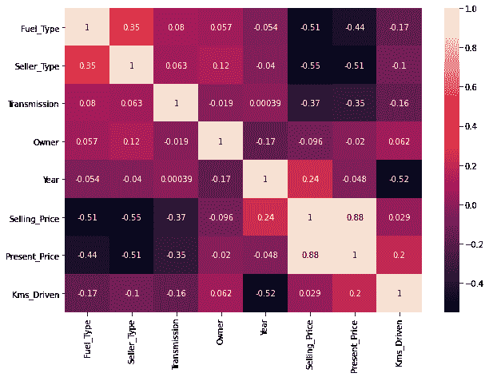

*   售价和现价的相关性为 0.88
*   销售价格与当前价格高度相关，因此我们可以使用任何一个变量进行分析，但不能同时使用两个变量。

**离群值:**

现在让我们检查一下我们的数据中是否有异常值。

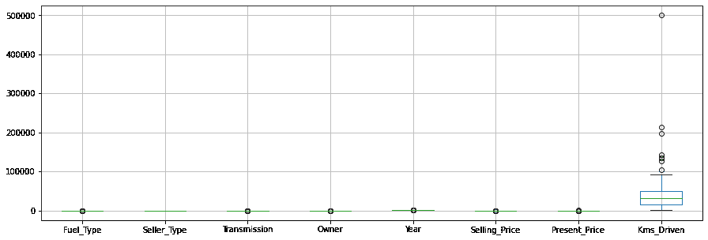

*   Kms_Driven 显示许多数据表现得像离群值。
*   但是在领域知识的帮助下，我们可以说汽车可以行驶任何公里数，因为它是基于车主的，并且汽车的销售价格相应地调整。

因此，与其删除异常值，不如记录它们。

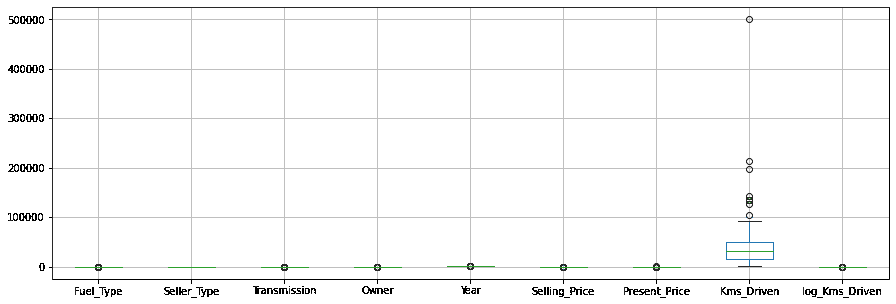

*   我们已经成功地调整了数据，现在它不再像离群值一样。
*   我们保存了有价值的知识管理信息。

# 假设检验:

在进入建模部分之前，我们会做一些假设检验。

**研究问题:**

在过去的一年中，Cardekho.com 在市场上销售汽车的平均价格保持在 5.5 英镑。lakhs.Cardekho.com 声称价格没有改变，其平均销售价格不变。

人口:Cardekho.com 到今年为止的所有数据。

现在我们将把无效和交替假设框定为:

**零假设:**汽车的平均售价为 55 万卢比。

H0 : myu(u) = 5.5

**替代假设:**汽车的平均售价已经跌破，现在是 4.6。

H1: myu(u)！= 5.5.# !=表示不相等。

**数据:**我们有 Cardekho.com 不同年份的样本数据，并将对此进行假设检验。

因此，我们将执行 t 检验(双尾),因为我们有样本标准差，并且将采用 95%的置信水平，这使得 alpa=0.05。

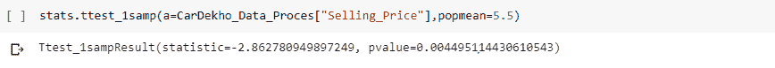

p 值(0.05)>(0.0449)所以我们可以得出结论，我们有足够的证据拒绝零假设(H0)，并接受替代假设(H1)。

意味着汽车的平均售价不是 5.5。

这里第一类误差是 0.05，我们保持尽可能低的值，因为第一类误差在假设中对我们很关键。

**研究问题:**

从事汽车销售业务的 Cardekho.com 表示，我们购买的大多数汽车都是以较高的价格售出的，因此当前价格和销售价格的平均价格最终是相同的。

**人口:**Cardekho.com 目前拥有的全部数据。

现在我们将构建无效和替代假设。

**零假设:**平均售价和现价相同。

H0 : myu(u1) = myu(u2)

**交替假设:**平均售价和现价不一样。

H1 : myu(u1)！= myu(u2) #！=表示不相等。

**数据:**我们有 cardekho.com 历年的销售和现价的样本数据。

因此，这里我们将执行 Annova:一个因素，因为这里我们需要看到不同特征的两个平均值之间的差异。

在这种情况下，只需单击一下就可以轻松进入 excel，因此我们将在那里进行分析，并了解我们分析的输出。

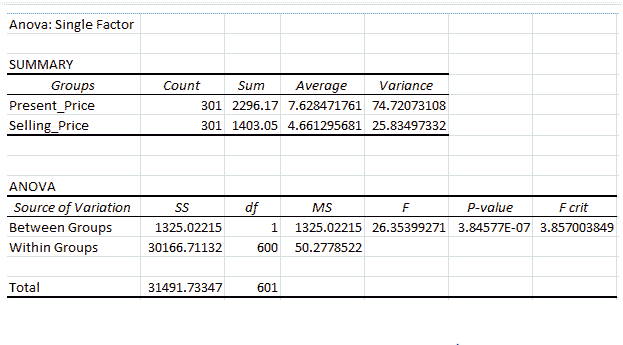

以上，我们可以看到，我们有:

F(26.35) > F 暴击(3.85)

我们有足够的证据拒绝零假设(H0)并接受替代假设(H1)。

所以，结论是汽车的平均售价和平均现价是不一样的，它们是不同的。

# 回归:

回归分析由一组机器学习方法组成，允许我们根据一个或多个预测变量(x)的值来预测连续的结果变量(y)。简而言之，回归模型的目标是建立一个数学方程，将 y 定义为 x 变量的函数。

**特征缩放:**

我们将应用 StandardScaler，因为 StandardScaler 假设您的数据在每个要素内呈正态分布，并将对其进行缩放，以便分布现在以 0 为中心，标准差为 1。

现在，我们将在统计模型库中 Ols 的帮助下进行回归:

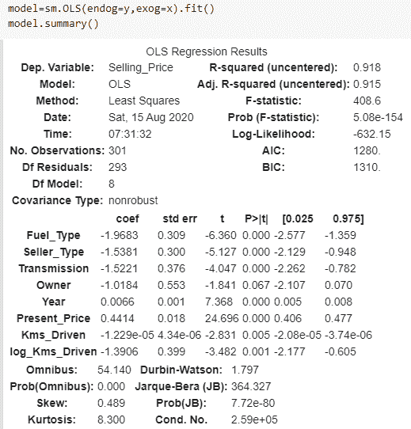

在这里我们可以看到:

*   我们达到了 0.918 的 R 平方，这非常好。
*   我们需要查看调整后的 R_sqr 和 P 值，因为这将有助于我们进一步调整模型。

现在，我们将进一步调整模型:

让我们删除所有者变量，因为它大于我们的 p 值，即(0.05)，表现得好像无关紧要。我们还检查了 Adj R_sqr 不应下降。

# 结果:

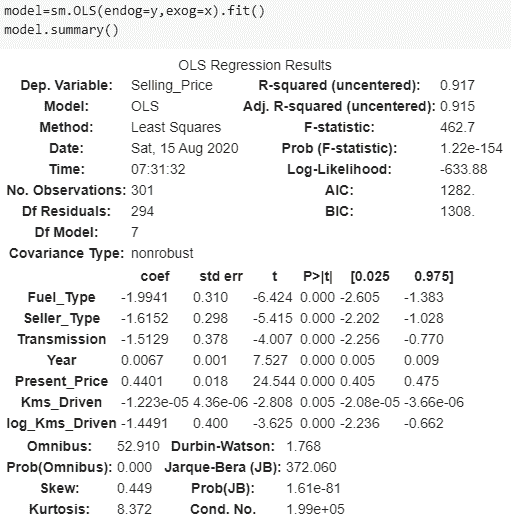

最后，我们有一个最佳拟合模型，该模型具有所有重要的独立值，并具有 Adj R2 91.5 %的良好评分。

# 结论:

我们使用了回归分析，并根据汽车的各种特征预测了汽车的销售价格，包括汽车的当前价格。