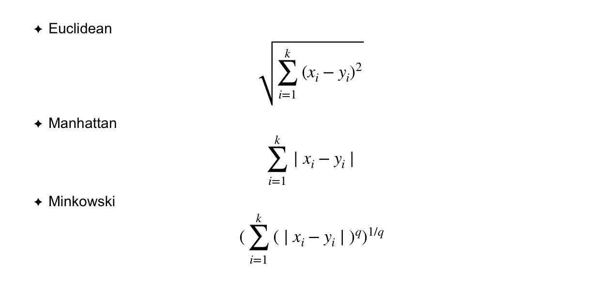

# 使用机器学习模型预测汽车价格-Python

> 原文：<https://medium.com/analytics-vidhya/predicting-car-prices-using-machine-learning-models-python-701aaac23079?source=collection_archive---------3----------------------->

土耳其的二手车市场相当活跃。因此，预测汽车价格是高度可变的。在这篇文章中，机器学习模型进行了比较，并选择了价格预测的最佳模型。


[来源](https://www.pinterest.at/pin/406449935099301288/)

训练模型是通过按汽车品牌划分模型来执行的，而不是为了有效的优化过程和更好地利用计算机能力和时间而进行的单个大模型训练。在训练中使用了大约 100，000 个具有 12 个特征的数据。比较的机器学习模型有:

*   线性回归
*   山脉
*   套索
*   弹性网
*   k-最近邻
*   随机森林
*   XGBOOST
*   梯度推进机

首先，用默认参数训练模型。然后，对这些模型进行超参数优化。两种情况下的参数值和估计值都被记录下来，以备以后查看。

**数据预处理**

通过网络抓取方法(也许可以在另一篇文章中详细讨论)获得的数据是从数据库中下载的。当导入第一个过程库时，我们的数据被转换成数据帧，然后检查是否有丢失的数据。

```
from pymongo import MongoClient
import pandas as pd
import numpy as np
import matplotlib.pyplot as plt
import re
from sklearn.model_selection import train_test_split, GridSearchCV,ShuffleSplit, cross_val_score
from sklearn import model_selection
from sklearn.neighbors import KNeighborsRegressor
import statsmodels.api as sm
from sklearn.linear_model import LinearRegression, Ridge, Lasso, LassoCV, ElasticNet
from sklearn.metrics import mean_squared_error, mean_absolute_error
import numpy as np
from sklearn.preprocessing import StandardScaler, OneHotEncoder
from sklearn.ensemble import RandomForestRegressor, GradientBoostingRegressor
import xgboost as xgb
from xgboost import XGBRegressor
import config
import pickle
from collections import defaultdict
from operator import itemgetter
import random
import lightgbm as lgb
from lightgbm import LGBMRegressor
```


由于缺失数据的数量很少，我们可以删除它们。有些数据是数据类型字符串，会转换为整数，如 year(“1999”，“2018”)。此外，数据是通过删除价格和里程值中的点表达式来准备的。

```
"""Preprocessing of Price"""
df["Fiyat"] = df["Fiyat"].str.replace(".","")
df["Fiyat"] = [re.findall(r"(\d+)", str(x)) for x in df["Fiyat"]]
df["Fiyat"] = df["Fiyat"].str[0]
df["Fiyat"]  = df["Fiyat"].astype(int)"""Preprocessing of Km and year"""
df["Km"] = df["Km"].str.replace(".","")
df["Km"]  = df["Km"].astype(int)
df["Yıl"]  = df["Yıl"].astype(int)
```

在上述数据准备之后，识别异常值检测。这个项目中的异常值检测主要是由于供应商输入了不正确的信息。


上面可以看到检测到的错误里程(Km)信息。这些里程值是错误的，尤其是在与年份(yl)和价格(Fiyat)信息进行比较时。这些数据可以被删除，因为检测到的异常值的数量很少。然而，在我们拥有的数据数量很少的情况下，我们可能不想删除这些数据。在这种情况下，可以将平均值或中值分配给异常值列(在这种情况下为里程列)。例如，我们只考虑了奥迪，但这些程序适用于每个汽车品牌。

让我们简单考虑一下项目中使用的机器学习模型:

*   ***线性回归:***

线性回归用于确定因变量和一个或多个自变量之间的线性关系。线性回归有两种类型，简单线性回归和多元线性回归。由于本项目中有多个独立变量，因此使用了多元线性回归模型。


```
def linear_regression(self):
        self.lr_model = LinearRegression()
        self.lr_model.fit(self.X_train, self.y_train)
        y_pred = self.lr_model.predict(self.X_test)
        lr_rmse = np.sqrt(mean_squared_error(self.y_test,y_pred))
        self.lr_rmse_per  =np.sqrt(np.mean(np.square(((self.y_test - y_pred) / self.y_test))))*100
        self.lr_mae = mean_absolute_error(self.y_test, y_pred)
        self.lr_mape =  np.abs((self.y_test - y_pred) / self.y_test).mean(axis=0) * 100
        return lr_rmse
```

*   ***K-最近邻:***

虽然 K-最近邻算法(KNN)通常用于分类问题，但它在回归问题中也给出非常好的结果。KNN 算法的工作原理是根据对象的邻近关系对其进行聚类。一个例子被它的邻居的多数投票分类；该样本被分配到其最近邻中的最近类，通过距离函数进行测量。



还应注意，所有三个距离仅适用于连续变量。在分类变量的情况下，应该使用汉明距离。此外，当数据集中混合了数字变量和分类变量时，应该注意数字变量的标准化。


虽然 KNN 算法创建了一个有效的机器学习模型，特别是针对包含数据的噪声，但对于大数据，有必要谨慎处理。

项目代码:

```
def knn(self):
        knn_model = KNeighborsRegressor().fit(self.X_train, self.y_train)
        y_pred = knn_model.predict(self.X_test)
        self.knn_rmse = np.sqrt(mean_squared_error(self.y_test,y_pred))
        #Model tuning 
   #=============================================================================
        knn_params = {"n_neighbors": [2,5,10,20,30,40],
                      "leaf_size": [15,30,60]}
        n_neighbors_list = knn_params["n_neighbors"]
        leaf_size_list = knn_params["leaf_size"]
        self.knn_result_list = []
        for i in range(len(n_neighbors_list)):
            for j in range(len(leaf_size_list)):
                temp_list = []
                knn_model = KNeighborsRegressor(n_neighbors = n_neighbors_list[i], leaf_size = leaf_size_list[j])
                knn_model.fit(self.X_train, self.y_train)
                y_pred = knn_model.predict(self.X_test)
                knn_rmse = np.sqrt(mean_squared_error(self.y_test, y_pred))
                temp_list.extend((knn_rmse, n_neighbors_list[i], leaf_size_list[j]))
                self.knn_result_list.append(temp_list)
        self.knn_result_list.sort()

        self.knn_tuned = KNeighborsRegressor(n_neighbors = self.knn_result_list[0][1], leaf_size = self.knn_result_list[0][2])
        self.knn_tuned.fit(self.X_train, self.y_train)
        y_pred = self.knn_tuned.predict(self.X_test)
        knn_tuned_rmse = np.sqrt(mean_squared_error(self.y_test,y_pred))
        self.knn_tuned_rmse_per  =np.sqrt(np.mean(np.square(((self.y_test - y_pred) / self.y_test))))*100
        self.knn_mae = mean_absolute_error(self.y_test, y_pred)
        self.knn_mape =  np.abs((self.y_test - y_pred) / self.y_test).mean(axis=0) * 100
        return knn_tuned_rmse
```

*   ***随机森林:***

随机森林模型，用于回归和分类问题，基于决策树模型。


决策树是一种传统的方法，其最大的问题之一是在教育中过拟合。随机森林模型就是为了解决这个问题而发展起来的。该模型从数据集和属性集中进行随机选择。从上面可以看出，每个决策树使用自己的子集进行单独的预测。在最后一个阶段，我们通过对所获得的预测取平均值来达到我们的随机森林模型的最终预测值。

在我们的项目中，“max_depth”、“n_estimators”和“max_features”超参数用于对我们的随机森林模型进行调整操作。

```
def random_forest(self):

        rf_model = RandomForestRegressor(random_state = 10).fit(self.X_train, self.y_train)
        y_pred = rf_model.predict(self.X_test)
        self.rf_rmse = np.sqrt(mean_squared_error(self.y_test, y_pred))
        #Random Forest Tuning Model
        rf_params = {"max_depth": [None, 2,5,9],
                     "n_estimators": [10,100,500,1000],
                     "max_features": ["auto",3,5]}
        self.rf_result_list = []
        max_depth_list = rf_params["max_depth"]
        n_estimators_list = rf_params["n_estimators"]
        max_features_list = rf_params["max_features"]
        for i in range(len(max_depth_list)):
            for j in range(len(n_estimators_list)):
                for k in range(len(max_features_list)):
                    temp_list = []
                    rf_model = RandomForestRegressor(random_state = 10, max_depth = max_depth_list[i], n_estimators = n_estimators_list[j], max_features = max_features_list[k])
                    rf_model.fit(self.X_train, self.y_train)
                    y_pred = rf_model.predict(self.X_test)
                    knn_rmse = np.sqrt(mean_squared_error(self.y_test, y_pred))
                    temp_list.extend((knn_rmse, max_depth_list[i], n_estimators_list[j], max_features_list[k]))
                    self.rf_result_list.append(temp_list)
        self.rf_result_list.sort()
        self.rf_tuned = RandomForestRegressor(random_state = 10, max_depth = self.rf_result_list[0][1], n_estimators = self.rf_result_list[0][2], max_features = self.rf_result_list[0][3])
        self.rf_tuned.fit(self.X_train, self.y_train)
        y_pred = self.rf_tuned.predict(self.X_test)
        rf_tuned_rmse = np.sqrt(mean_squared_error(self.y_test,y_pred))
        self.rf_tuned_rmse_per  =np.sqrt(np.mean(np.square(((self.y_test - y_pred) / self.y_test))))*100
        self.rf_mae = mean_absolute_error(self.y_test, y_pred)
        self.rf_mape =  np.abs((self.y_test - y_pred) / self.y_test).mean(axis=0) * 100
        return rf_tuned_rmse
```

*   ***渐变助推机:***

Boosting 是一种迭代技术，其中预测器不是独立产生的，而是顺序产生的。因此，后续模型中的观测值出现的概率是不相等的，误差最大的观测值出现得最多。预测器可以从一系列模型中选择，如决策树、回归器、分类器等。因为新的预测器正在从先前预测器犯下的错误中学习，所以达到接近实际预测需要更少的时间/迭代。但是我们已经仔细选择了停止标准，否则它会导致训练数据的过度拟合。所以梯度推进的例子就是推进算法。

假设我们将均方误差(MSE)定义为损失，即:


通过使用梯度下降并基于学习率更新我们的预测，我们可以找到 MSE 最小的值。


```
def gbm(self):
        gbm_model = GradientBoostingRegressor().fit(self.X_train, self.y_train)
        y_pred = gbm_model.predict(self.X_test)
        self.gbm_rmse = np.sqrt(mean_squared_error(self.y_test,y_pred))

        gbm_params = {"learning_rate" : [0.001, 0.01, 0.1],
                      "max_depth": [3,5,8,50,100],
                      "n_estimators" : [10,100,500,1000], 
                      "subsample" : [1,0.5,0.75]}
        learning_rate_list = gbm_params["learning_rate"]
        max_depth_list = gbm_params["max_depth"]
        n_estimators_list = gbm_params["n_estimators"]
        subsample_list = gbm_params["subsample"]
        self.gbm_result_list = []
        for i in range(len(learning_rate_list)):
            for j in range(len(max_depth_list)):
                for k in range(len(n_estimators_list)):
                    for l in range(len(subsample_list)):
                        temp_list = []
                        gbm_model = GradientBoostingRegressor(learning_rate = learning_rate_list[i],
                                                              max_depth = max_depth_list[j],
                                                              n_estimators = n_estimators_list[k],
                                                              subsample = subsample_list[l])
                        gbm_model.fit(self.X_train, self.y_train)
                        y_pred = gbm_model.predict(self.X_test)
                        gbm_rmse = np.sqrt(mean_squared_error(self.y_test, y_pred))
                        temp_list.extend((gbm_rmse, learning_rate_list[i], max_depth_list[j], n_estimators_list[k], subsample_list[l]))
                        self.gbm_result_list.append(temp_list)
        self.gbm_result_list.sort()
        self.gbm_tuned = GradientBoostingRegressor(learning_rate = self.gbm_result_list[0][1],
                                                   max_depth = self.gbm_result_list[0][2],
                                                   n_estimators = self.gbm_result_list[0][3],
                                                   subsample = self.gbm_result_list[0][4])
        self.gbm_tuned.fit(self.X_train, self.y_train)
        y_pred = self.gbm_tuned.predict(self.X_test)
        gbm_tuned_rmse = np.sqrt(mean_squared_error(self.y_test, y_pred))
        self.gbm_tuned_rmse_per =np.sqrt(np.mean(np.square(((self.y_test - y_pred) / self.y_test))))*100
        self.gbm_mae = mean_absolute_error(self.y_test, y_pred)
        self.gbm_mape =  np.abs((self.y_test - y_pred) / self.y_test).mean(axis=0) * 100
        return gbm_tuned_rmse
```

*   ***极限梯度提升(XGBOOST):***

虽然 XGBoost 类似于梯度增压机，但更有效。XGBoost 在创建决策树的同时提供了并行化，使得决策树的创建速度更快。事实上，他可以做到这一点是基础学习者，而他可以在内部和外部循环之间切换。通常，当形成决策树的叶子时，外部循环计算内部循环属性。XGBoost 以 max_depth 优先考虑深度，其复杂度显著提高了计算性能。XGBoost 中的核外计算优化了可用磁盘空间，并在处理不适合内存的大型数据集时最大限度地利用了磁盘空间。XGBoost 可以使用套索和脊正则化来防止过度拟合。为了加快计算速度，XGBoost 可以利用 CPU 上的多个内核。这是可能的，因为其系统设计中的块结构。数据被分类并存储在称为块的内存单元中。与其他算法不同，这使得数据布局能够被后续迭代重用，而不是再次计算。XGBoost 最大的一个优点就是在划分成树的同时，通过加权来使用数据集中的观测点，以区别于正确的点。

在我们的项目中，“max_depth”、“n_estimators”、“colsample_bytree”和“learning rate”超参数用于对我们的随机森林模型进行调整操作。

```
def xgboost(self):
        X_train_v = self.X_train.values
        X_test_v = self.X_test.values
        xgb_model = XGBRegressor().fit(X_train_v, self.y_train)
        y_pred = xgb_model.predict(X_test_v)
        self.xgboost_rmse = np.sqrt(mean_squared_error(self.y_test, y_pred))
        #Model Tuning
        xgb_params ={"colsample_bytree": [0.6,0.9,1],
                     "n_estimators" : [100,200,500,1000],
                     "max_depth" : [4,5,6],
                     "learning_rate": [0.1,0.3,0.5]}
        self.xgb_result_list = []
        colsample_bytree_list = xgb_params["colsample_bytree"]
        n_estimators_list = xgb_params["n_estimators"]
        max_depth_list = xgb_params["max_depth"]
        learning_rate_list = xgb_params["learning_rate"]
        for i in range(len(colsample_bytree_list)):
            for j in range(len(n_estimators_list)):
                for k in range(len(max_depth_list)):
                    for l in range(len(learning_rate_list)):
                        temp_list = []
                        xgb_model = XGBRegressor(colsample_bytree = colsample_bytree_list[i],
                                                 n_estimators = n_estimators_list[j],
                                                 max_depth = max_depth_list[k],
                                                 learning_rate = learning_rate_list[l])
                        xgb_model.fit(X_train_v, self.y_train)
                        y_pred = xgb_model.predict(X_test_v)
                        xgb_rmse = np.sqrt(mean_squared_error(self.y_test, y_pred))
                        temp_list.extend((xgb_rmse, colsample_bytree_list[i], n_estimators_list[j], max_depth_list[k], learning_rate_list[l]))
                        self.xgb_result_list.append(temp_list)
        self.xgb_result_list.sort()
        self.xgb_tuned = XGBRegressor(colsample_by_tree = self.xgb_result_list[0][1],
                                      n_estimators  =self.xgb_result_list[0][2],
                                      max_depth = self.xgb_result_list[0][3],
                                      learning_rate = self.xgb_result_list[0][4])
        self.xgb_tuned.fit(X_train_v, self.y_train)
        y_pred = self.xgb_tuned.predict(X_test_v)
        xgb_tuned_rmse = np.sqrt(mean_squared_error(self.y_test,y_pred))
        self.xgb_tuned_rmse_per  =np.sqrt(np.mean(np.square(((self.y_test - y_pred) / self.y_test))))*100
        self.xgb_mae = mean_absolute_error(self.y_test, y_pred)
        self.xgb_mape =  np.abs((self.y_test - y_pred) / self.y_test).mean(axis=0) * 100
        return xgb_tuned_rmse
```

均方根误差取每个观察值和预测值的差值。你可以交换减法的顺序，因为下一步是求差的平方。这是因为负值的平方总是正值。但是要确保你一直保持同样的顺序。


之后，将所有值的总和除以观察次数。最后，我们得到一个 RMSE 值。


用于比较所获得的估计的另一种方法可以是平均绝对误差(MAE)。当数据中存在极端观察值时，这是特别优选的。然而，如果我们想更强烈地反映异常值对系统的影响，那么选择 RMSE 值将是更正确的。在项目中发现并比较了这两个值。

## 结论

对于模型比较，使用 rmse 值。土耳其里拉被用作货币。每个汽车品牌要比较的所有模型都经过训练，并确定最佳模型。因此，每个汽车品牌的最佳模式被确定。


以上表格中可以看到所有模型的 rmse 值。此外，在表中名为“所选型号 mae”的列中，所选的最佳型号具有 mae 值。

作为模型比较的结果(最佳模型计数):

*   梯度推进机(GBM) : 19
*   极端梯度增强(XGBoost) : 11
*   随机森林:7
*   山脊:5
*   套索:2
*   弹性网:1

看一下排序，可以看到选择 GBM 模型的最多。尤其是 XGBoost 和 GBM 型号比其他型号更有优势。然而，根据这些结果，得出 GBM 模型是最佳模型的结论是不正确的。不要忘记，每个模型在不同的数据类型和大小下都是有效的。


最后，在上表中可以看到 GBM 模型的默认参数的 rmse 值和调整参数的 rmse 值。如果列名中有“def”(GBM def max _ depth)，则它是默认参数，否则(“cho”)它是调整后的参数。所以我们已经看到了超参数优化是如何导致模型进化的

github:[https://github.com/ademakdogan](https://github.com/ademakdogan)

领英:[https://www.linkedin.com/in/adem-akdo%C4%9Fan-948334177/](https://www.linkedin.com/in/adem-akdo%C4%9Fan-948334177/)

## 参考

*   *数据科学、网络安全和 IT 应用的进步*
*   [https://www . statistically significant consulting . com/regression analysis . htm](https://www.statisticallysignificantconsulting.com/RegressionAnalysis.htm)
*   [https://www . analyticsvidhya . com/blog/2018/09/an-end-to-end-guide-to-understand-the-math-behind-xgboost/](https://www.analyticsvidhya.com/blog/2018/09/an-end-to-end-guide-to-understand-the-math-behind-xgboost/)