# 用 PySpark 预测客户流失

> 原文：<https://medium.com/analytics-vidhya/predicting-churn-with-pyspark-sparkify-capstone-project-5ad91781c491?source=collection_archive---------13----------------------->

## 你想搅拌吗？


今天，我们将讨论*客户流失预测*，这是订阅服务最重要的话题之一。及早发现哪些用户最有可能取消订阅有助于主动采取行动，并确定改进点，如更好的目录或界面，甚至是新的推荐引擎。

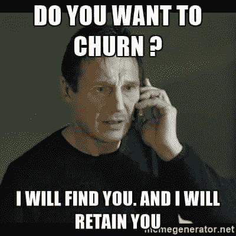

**来源** : [机器学习驱动的现代商业领袖流失分析](https://towardsdatascience.com/machine-learning-powered-churn-analysis-for-modern-day-business-leaders-ad2177e1cb0d)

# 显示一些数字

有很多关于获取新客户的成本与保留新客户的成本的信息。我非常怀疑这些重复数字的准确性，但它们似乎对一些企业有意义。
有人估计，获得一个新客户的成本 [**是留住它的成本**](https://www.outboundengine.com/blog/customer-retention-marketing-vs-customer-acquisition-marketing/#:~:text=Acquiring%20a%20new%20customer%20can,customer%20is%205%2D20%25.) 的五倍。而客户留存率仅仅增加 **5%** 就能导致**利润增长到 5%-95%** 。


来源:[https://d6v 887 nm5 k51d . cloudfront . net/WP-content/uploads/2017/09/customer-service-big-deal . jpg](https://d6v887nm5k51d.cloudfront.net/wp-content/uploads/2017/09/customer-service-big-deal.jpg)

我们继续吧。

# 背景

提供的数据来自一个名为 ***Sparkify*** 的订阅服务。该数据由 Udacity 提供，作为研究数据科学家 Nanodegree 的可选项目。在它上面，有数以千计的用户操作，包括注册、降级、升级等等。用户可以随时播放歌曲、喜欢或不喜欢、创建播放列表、添加朋友，甚至看到广告。

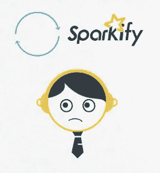

来源:Udacity 视频

所有这些信息使我们能够跟踪用户一生中的消费情况，并发现取消或未取消的用户之间的模式。

# 数据

原始数据在大约 **12Gb** 中有大约 **26.259.199** 个唯一事件，其中有 **22.278** 个客户数据。

## 特征

*   **艺术家**:艺术家姓名(如果事件是播放的歌曲)
*   **auth** :如果用户已经登录
*   **名字**:用户的名字
*   **性别**:用户的性别
*   **itemInSession** :会话中事件的编号
*   **姓氏**:用户的姓氏
*   **长度**:歌曲的长度(如果事件是一首播放的歌曲)
*   **等级**:会员等级(0 —免费或 1 —付费)
*   **位置**:用户所在的州/城市
*   **方法**:事件的 HTTP 方法(如 GET 监听，load，POST，to 更新，在服务器上做一个改变。)
*   **页面**:页面名称(如主页、设置)
*   **注册**:用户注册时的时间戳
*   **sessionId** :会话 Id(自登录后)
*   **歌曲**:歌曲名称(如果事件是播放的歌曲)
*   **状态**:事件的 HTTP 状态码(如 200 成功，500 错误)
*   ts :事件的时间戳
*   **用户代理**:用户的浏览器
*   **userId** :服务上的用户 Id

## 事件摘要:

```
# Spark Code
_df = df.groupBy('page').count().orderBy('count', ascending = False)
_df.show(50, truncate = False)# Output
+-------------------------+--------+
|page                     |count   |
+-------------------------+--------+
|NextSong                 |20850272|
|Home                     |1343102 |
|Thumbs Up                |1151465 |
|Add to Playlist          |597921  |
|Roll Advert              |385212  |
|Add Friend               |381664  |
|Login                    |296350  |
|Logout                   |296005  |
|Thumbs Down              |239212  |
|Downgrade                |184240  |
|Help                     |155100  |
|Settings                 |147074  |
|About                    |92759   |
|Upgrade                  |50507   |
|Save Settings            |29516   |
|Error                    |25962   |
|Submit Upgrade           |15135   |
|Submit Downgrade         |6494    |
|Cancel                   |5003    |
|Cancellation Confirmation|5003    |
|Register                 |802     |
|Submit Registration      |401     |
+-------------------------+--------+
```

# 分析

通过查看数据，我们得到*付费*用户的样本为 **5.030** (占总数的 22.58%)和*免费*会员 **17.248** (占总数的 77.42%)。

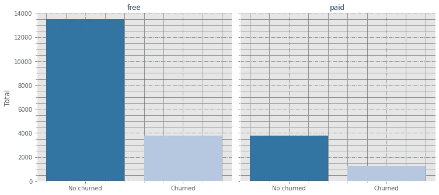

按订阅类型划分的流失

*付费*用户的流失率约为 **1.239** (24.63%)，而*免费*用户*的流失率约为 **3.764** (21.82%)。如果我们看百分比而不是绝对数字，两组的流失率几乎相同。按*性别*流失也是如此。*

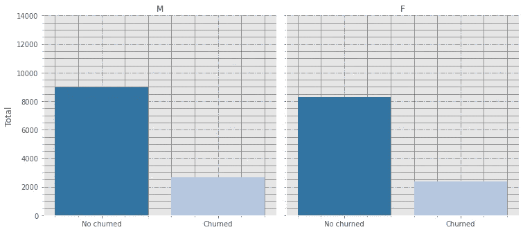

按性别划分的流失——男性或女性

考虑到*降级事件*，意味着某付费用户并没有取消订阅，而是迁移到了免费计划。

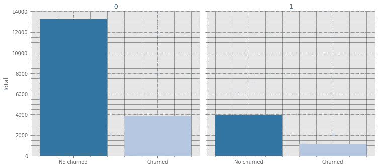

未降级用户(0)与降级用户(1)之间的流失

从 **4.017** 用户*降级*开始，围绕 **873** (21.73%)对未来产生了翻腾。考虑到从来没有降级过 **17.175** 的用户，大概 **3.860** (22.47%)最后都搅黄了。同样，这两组非常相似。

## 数据清理

在数据中，大约 778.479 条记录没有用户标识，或者没有登录。此外，在这一步中，我已经为每个用户及其会话创建了时间窗口。[窗口函数](https://databricks.com/blog/2015/07/15/introducing-window-functions-in-spark-sql.html)是 Pyspark 上的一个特性，它简化了为某个标准选择一些行的任务。

通过使用这个，很容易计算出一个会话和另一个会话之间的时间间隔，甚至是每个会话中播放歌曲的总时间。实际上，其中许多可以通过现有的函数来实现，如 group by。但是，对于窗口函数，我们只能有一个组函数，我们使用的参数创建了这些“逻辑时间窗口”。

像上一页/事件、经过的时间、第一个事件和最后一个事件等列也是在此时创建的。

*   **注意:**对于这个项目，我发现有些小数据集的一些记录不在完整版本中。也许，我会在未来检查这一点，看看我们是否可以从小数据集获得更多的样本，或者这只是一个错误。

# 特征工程

在这一部分中，我们将从现有特征中创建其他特征。例如，用户在页面**提交降级**上发生事件的次数成为降级次数。

有些特征被忽略了，比如名字和姓氏，因为从客户流失的角度来看，它们似乎是不相关的。其他的，比如位置和用户代理，很复杂，很难提取重要的信息。例如，在未来，随着更多的数据，我们可以发现，对于一些平台，一些用户正在经历的问题，但现在，我只是忽略他们。

**调整时间窗**

我尝试了几种方法，这些方法确实将行为(喜欢、不喜欢、广告等等)与时间度量联系起来，比如从注册开始的时间、所有会话时间的总和等等。最后，最成功的方法是考虑用户播放音乐和其他行为的时间。例如，为了考虑广告与时间的关系，我们将广告的观看次数除以以小时为单位的播放时间。所以，如果一个用户平均有 **10 个广告**和一个会话 **100 小时**听**音乐**， **session_avg_ads** 将是 **0.1** 。通过这样做，我们可以对新老用户进行公平的比较。例如，一个老用户可能有 **100 个广告**和 1000 小时的音乐，这也给出了一个 **session_avg_ads** 的 **0.1** 。

这个概念的另一个应用是在足球上。一场比赛进展顺利的一个很好的指标是平均比赛时间。足球的目的是玩它，在 Sparkify，我相信是听音乐。

## 惯例:

*   对于涉及时间、持续时间的每个特征，除非特别说明(如天数),否则日期/时间被转换为小时。

## 最终特征

*   **男性** : 1 —男性或 0 —女性
*   **付费** : 1-付费订阅或 0-免费订阅
*   **avg_daily_actions** :每天的平均动作(考虑可用期间的天数)
*   **avg_session_duration:** 每个会话的平均持续时间(小时)
*   **avg_playback_time** :每次听音乐的平均时间
*   **n_actions** :动作次数
*   **n_added_to_playlist** :添加到播放列表的歌曲数量
*   **n_ads** :观看的广告数量
*   **n_days** :观察窗的天数，
*   **不喜欢的数量**:不喜欢的数量
*   **n _ 降级**:降级次数
*   **n_errors** :经历的错误数
*   **n_friends** :添加的好友数量
*   **n_help** :访问帮助页面的次数
*   **n_home** :访问主页的次数
*   **n_likes** :喜欢的歌曲数量
*   **n_sess** :会话数
*   **n_settings** :访问帮助页面的次数
*   **n_songs** :播放的歌曲数量
*   **n_upgrades** :升级次数
*   **n_ads_over_songs** :观看的广告数量除以播放的歌曲数量
*   **n_likes_over_songs** :喜欢的歌曲数除以歌曲数
*   **n _ unless _ over _ Songs**:不喜欢的歌曲数除以歌曲数
*   **n _ likes _ over _ unless**:喜欢的歌曲数除以不喜欢的歌曲数
*   **时间窗口**:观察数据的时间(小时)

以音乐收听小时数为单位按时间划分的功能(例如，这次，对于广告数量，我们将广告数量除以音乐收听时间):

*   **session_avg_actions**
*   **session _ avg _ added _ playlist**
*   **session_avg_ads**
*   **会话 _ 平均 _ 厌恶**
*   **会话 _ 平均 _ 错误**
*   **session_avg_friends**
*   **session_avg_help**
*   **session_avg_home**
*   **session_avg_likes**
*   **session_avg_settings**
*   **会话 _ 平均 _ 歌曲**
*   **session _ avg _ Time _ away**:Time away 是会话 A 中的最后一个事件与会话 b 中记录的第一个事件之间的间隔。
*   **time _ window _ over _ playback _ time**:观察时间段的总和除以听音乐的时间。

## 特征分数

作为*可解释性的简单方法*

在下一张图中，我们描述了这些特征如何帮助将用户分类为流失或不流失。左侧的绿色负柱有助于归类为非流失。另一方面，红色和积极的有助于定义未来的客户流失。

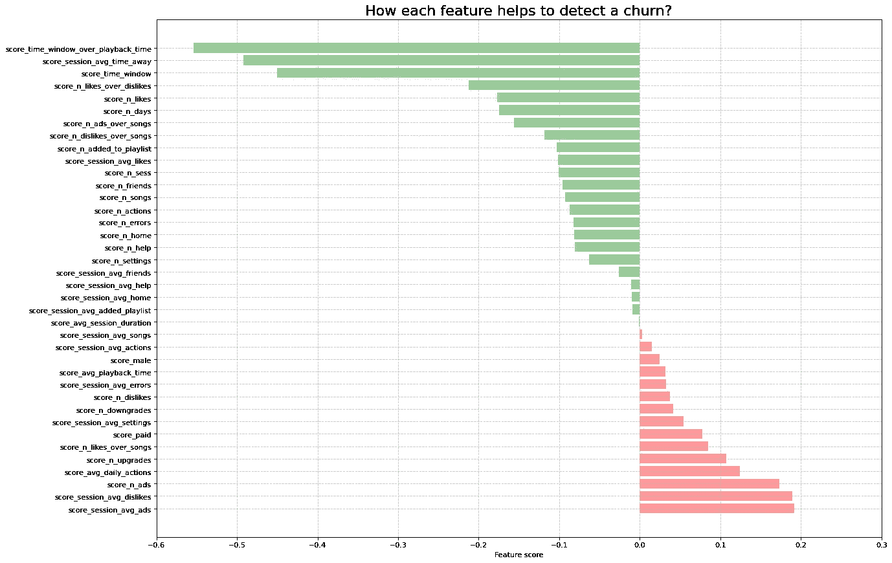

每个功能如何帮助检测客户流失？

## 特征相关性

每个事件或特征的绝对频率(如果是二进制的)

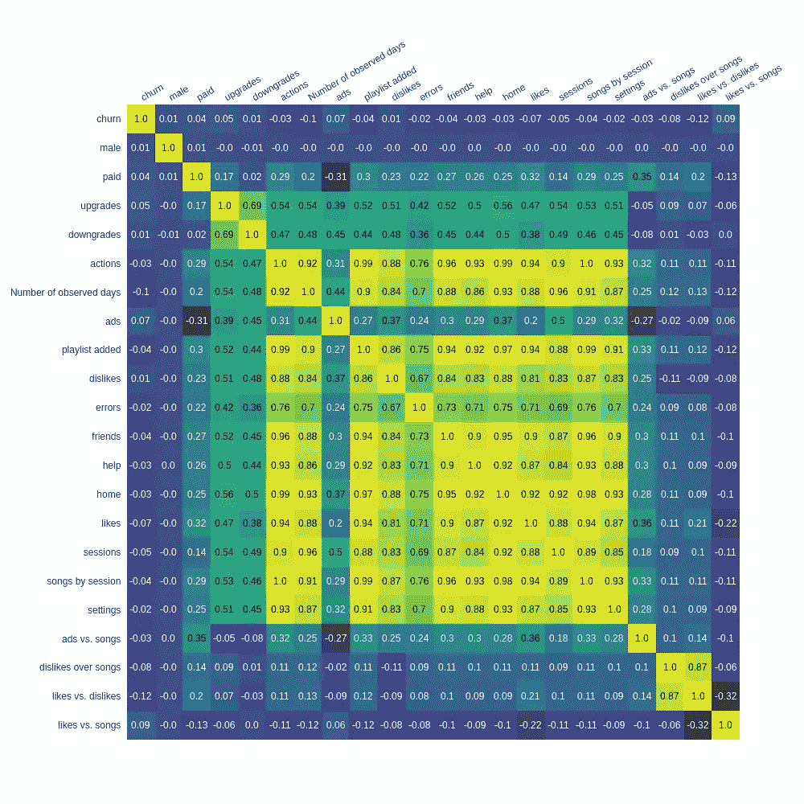

## 特征相关性

事件与播放时间

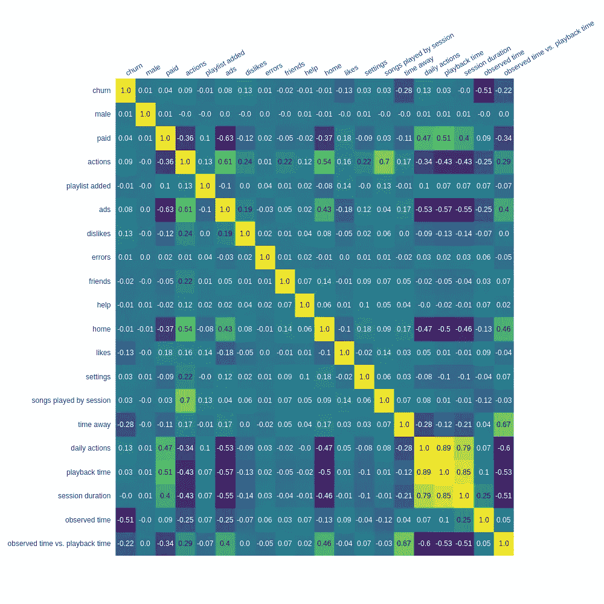

**注意事项**:

*   两个热图都是在剔除异常值后绘制的；
*   有趣的是，考虑到绝对值仍然受到许多虚拟相关性的污染，如会话数与歌曲数，第一个热图如何，以及考虑到平均值和与播放时间的关系，第二个热图如何更加清晰。

## 离群点剔除

在训练我们的模型之前，我们需要尽可能多地移除离群值。为此，我们将计算 [z 值](https://www.kdnuggets.com/2017/02/removing-outliers-standard-deviation-python.html)，并移除大于或小于平均值*3 倍标准差*的值。

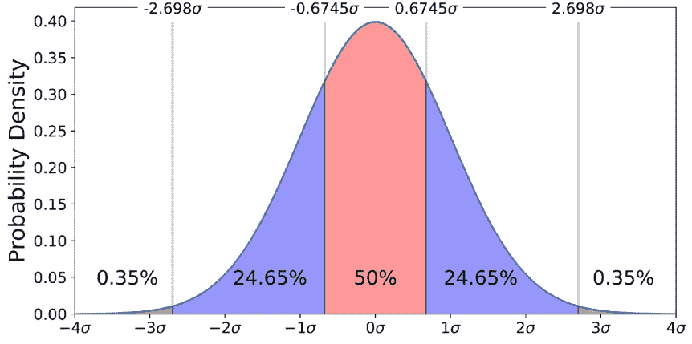

**来源**:[https://byjus.com/maths/box-plot/](https://byjus.com/maths/box-plot/)

对于熊猫，我们可以轻松地使用 [zscore 方法](https://docs.scipy.org/doc/scipy/reference/generated/scipy.stats.zscore.html)。因为我们使用 PySpark，所以我实现了一个简单的代码来计算这个。此外，这里我只计算一些列的 z 值，尤其是平均相关的列。这是因为在这一点上，他们可能是最需要调整的。绝对值将被归一化处理。

在这一步之后，我们删除了 **2.402** 条记录，新的数据集大约有 **19.875** 行。我们仍然以 **22.15%** 的流失样本，因为 **331 个**的流失用户数据点被剔除，而非流失用户的 **2.071 个**。

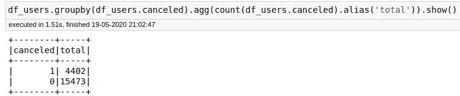

清理后的数据集

# 问题和模型

我们的问题是一个 ***二元分类*** *，其中*的目标是预测用户是否会流失(**取消= 1** )或不流失(**取消= 0** )。

*   目前，我们不会担心降级事件，这也是一种流失，因为用户不会为我们的服务支付更多费用。

使用 Pyspark 和模块 [MLlib](http://spark.apache.org/mllib/) ，我们将测试四个模型:[逻辑回归](https://spark.apache.org/docs/latest/ml-classification-regression.html#logistic-regression)、[随机森林](https://spark.apache.org/docs/latest/ml-classification-regression.html#random-forest-classifier)、[梯度推进](https://spark.apache.org/docs/latest/ml-classification-regression.html#gradient-boosted-tree-classifier)和[决策树。](https://spark.apache.org/docs/latest/ml-classification-regression.html#decision-tree-classifier)

这些模型中的每一个都可以用于分类任务。其中一些，如决策树或随机森林，可能会受到过度拟合的影响，但也允许我们调整一些参数，如修剪，深度等，以避免这种情况。逻辑回归，我们可以简化为带有分类的逻辑回归，最终，更像是遭受离群值之类的问题。但同样，我们可以通过缩放值和限制迭代次数来尝试解决这个问题。

**指标**

这里的**回忆**至关重要，因为我们希望抓住未来的大部分动荡。因为在知道一个用户有很高的流失机会后，很多行为都不是很容易的，例如，我们可以通过发送通知来吸引更多的用户。因此，一些错误，如向一些不会流失的用户发送参与通知；这不是世界末日。不管怎样，努力总是有限的；例如，如果我们将尝试发送折扣优惠，如果我们发送给每个人并影响我们的收入，那就太糟糕了。为了实现**真阳性**和**假阳性**之间的平衡，我们来到了我们的下一个指标，即 **F 值**。

我们还会用到 **AUC** ，意思是:*曲线下面积*。这个指标允许我们绘制出*真阳性* (TP)与*假阳性* (FP)的对比图。

# 培训过程

为了允许每个模型之间的进一步比较，我们将把每个模型结果存储在一个单独的文件中。最后，我们将使用模型*指标*和所有使用的*超参数*创建一个简单的数据框。然后，我们将检查结果。

这种方法简化了保存模型信息的步骤

# 网格搜索训练

常规配置:

*   **70%** 至**训练**和 **30%** 至**测试**；
*   **5 倍** —总之，需要对验证数据进行 5 次重新采样，并用这个新组来训练模型。计算所有折叠的平均值。这有助于选择一个过度拟合的模型作为最佳模型。
*   **binary classificationevaluator**:该评估器帮助返回最佳分类模型。我使用的度量标准是**面积低于中国。**
*   **标准缩放器**:所有数字和连续特征将被缩放，以避免任何剩余异常值的影响。

## 代码

我创建了一个简单的方法来构建一个 pipeline 对象，所有的步骤在所有的模型中都是通用的。然后，一个简单的方法为每个模型处理实例化当前模型的管道，定义一些方面，如数字特征和目标列。

通用管道和每个模型的构建器

有了流水线，我们把二元特征(**付**和**公**)从连续特征中分离出来。因此，只缩放连续特征。最后，我们创建了一个名为 **features** 的列，它有一个包含二进制特征和缩放的连续特征的向量。

**create_grid_search** 方法，只取一个管道和网格值，使用 **5** ***折叠*** 和默认评估器，该评估器将通过 **areaUnderROC** 给出最佳模型。

估计器和网格搜索准备

*   注意:在我最初的测试中，我在训练所有组合时遇到了一些问题。最后，我更改了 Spark 的配置，并将数据缓存在内存中。之前，一些模型，比如 GBT，在经过 5-6 个小时的训练后，我发现了一个内存堆积错误。通过增加限制和使用缓存，不会发生这种情况。

## 逻辑回归

值得一提的一个参数是 class_weights。这就是我们如何准备模型来处理不平衡的数据，就像我们的问题一样。

训练数据集的类权重计算

使用的参数在下面的代码片段中。

逻辑回归-网格参数

逻辑回归模型需要大约 **20 分钟**来测试大约 **432 个超参数**配置。

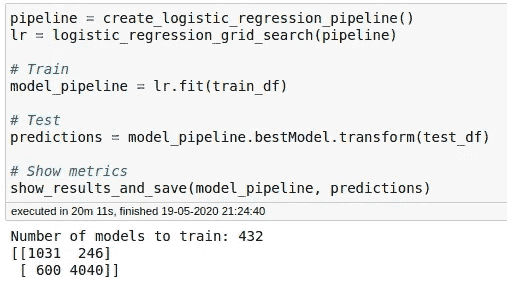

逻辑回归模型的培训

## 决策树分类器

决策树分类器—网格参数

***决策树*** 是最快的一种，只需要大约 2 分钟就可以测试大约 40 个模型组合。

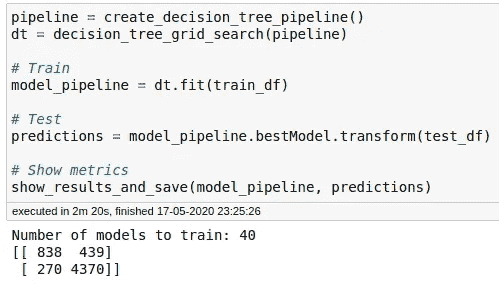

## 随机森林分类器

随机森林分类器—网格参数

随机森林模型大约需要 **41 分钟**来迭代 200 个模型变量。

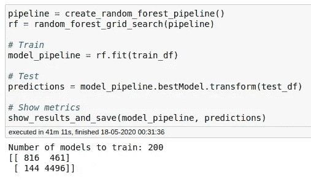

## 梯度推进分类器

梯度推进分类器—网格参数

GB 是最慢的型号，训练大约 **200 个**组合需要 3 小时 19 分钟。

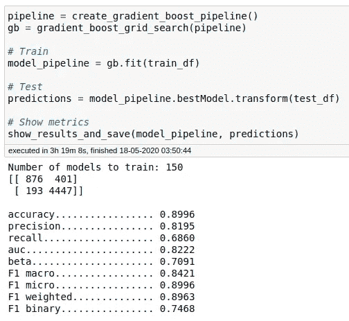

# 决赛成绩

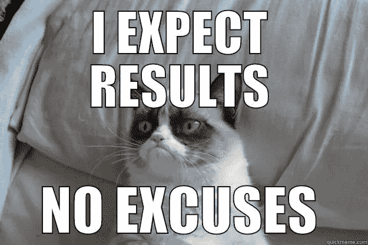

**来源**:【http://www.quickmeme.com/p/3w3ldf】T4

最佳模型是**逻辑回归**🎉考虑到**召回**和 **ROC** 和**曲线评分**。接下来，我们看到所有的结果和总结。

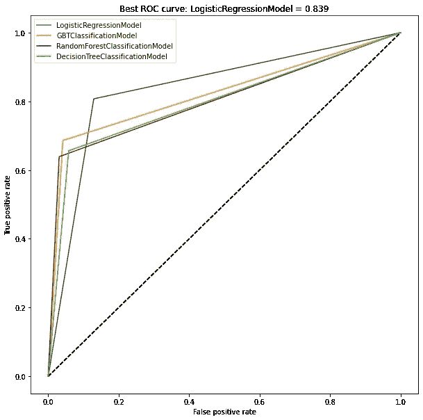

ROC 汇总结果

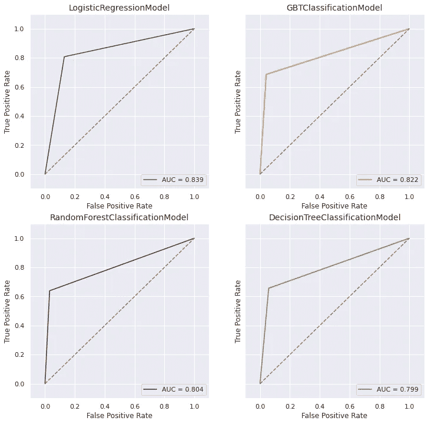

每个模型的 ROC

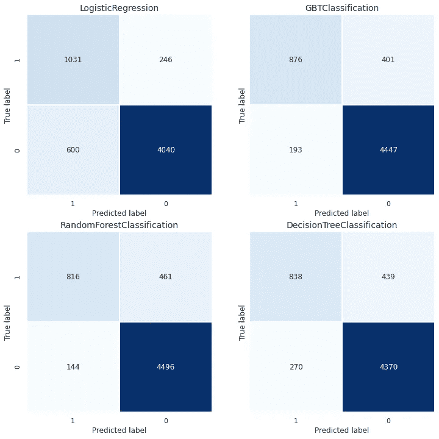

每个模型的混淆矩阵

所有最佳模型指标，*超参数*:

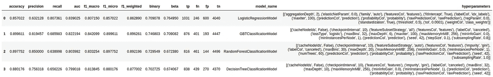

每个模型的网格搜索结果摘要

## 结束语

通俗地说，用我们最好的模型，我们成功地预测了 100 个*中的 ***80 个。如果我们拿 100 个不会*流失*的用户，我们会错误地认为其中的*13*(12.93%)会流失。因为我们的假阳性仍然低于假阴性，而且我们的流失“捕捉能力”很好(80%)，所以这个模型是好的。****

*关于 FP 和 FN 与良好回忆的比率的陈述，更像是现实世界的愿景，考虑了实施某些行动的成本与浪费努力的风险，而不完全是统计上建立的概念。我们浪费的努力，仍然低于我们已经接受的将 80%的准确率模型称为好的失误数。*

**此外，这些假设基于我们的模型没有过度拟合，并且数据代表我们服务成员的数据库。**

# *进一步的改进*

*   ***改善用户生命周期功能**:由于我们有几个用户，这将是更多的事件，这些功能可以让我们为老用户或非常新的用户删除许多数据点。也许，通过为非常新的、平均时间的或非常老的用户创建组，我们可以改进模型并处理更多的用户群。*
*   *探索与多样性相关的流派、艺术家和特征:也许，通过检查歌曲并尝试分类，我们可以得出目录中缺少流派的结论。也许，这些信息不能在模型中使用，但可以在分析中探索。*
*   ***深度学习技术**:也许创造一个 100%召回率的过度拟合黑盒？(开个玩笑)。一种真正的可能性是映射一些原始特征和特征工程特征不会得到的关系。*
*   *特性 **n_upgrades** 和**n _ degrades**可以用作二进制特性，如**has _ degraded**或**has _ upgrades**。但是，由于我们可以有一个长期的用户，他也可以升级和降级许多次。*
*   ***实际听音乐量**:完成这个项目后，我才发现我错过了更精确计算用户是否真的听音乐的机会，直到最后。例如，如果音乐 A 有 3 分钟，并且下一首音乐之间的间隔低于 3 分钟，则用户可能跳过了该歌曲。在这里，我们有机会提高听音乐时间的精确度，以及跳过歌曲的数量，这些歌曲只播放了几秒钟。*

# *小纸条*

*   *我不会深究，但是因为我想在任何机器上处理这些数据，所以我创建了一个脚本来读取成批的数据并删除未使用的列(名字、姓氏、位置、用户代理)。通过这样做，我为所有这 2600 万条记录创建了一个小得多的版本，只有 **2Gb** 。如果这个文件可能对你有用，你可以在这里 找到它[。](https://brunobitencourt.com/data/udacity/sparkify/sparkify_full_csv_data.csv)*
*   *此外，通过这样做，我不需要在 AWS 上运行这个工作负载。你可以这样做的成本或如果你不熟悉的服务。我已经在我的 16Gb 内存的机器上成功地处理了完整的数据集。*
*   *在 [*pyspark.sh*](https://github.com/brunowdev/sparkify/blob/master/pyspark.sh) 文件中，有一个配置允许在没有堆和内存错误的情况下运行所有的分析(可能这不是最佳配置，但确实有效)。而且，这种配置是针对独立模式的，通常只是您的*本地环境*。*

# *结论*

*我希望你喜欢这篇文章。所有的参考资料和链接都在正文或上面。如果你发现一个错误，有一个建议，或任何问题，请让我知道！*

*谢谢大家！😁*

***联系人**:*

*   ***GitHub**:[https://github.com/brunowdev](https://github.com/brunowdev)*
*   ***领英**:[https://www.linkedin.com/in/brunobluiz/](https://www.linkedin.com/in/brunobluiz/)*
*   *邮件:obrunobitencourt@gmail.com*

# *参考*

*   *[阿帕奇火花配置](https://spark.apache.org/docs/latest/configuration.html#application-properties)*
*   *[MLlib —分类模型](https://spark.apache.org/docs/latest/ml-classification-regression.html#classification)*
*   *[窗口功能](https://databricks.com/blog/2015/07/15/introducing-window-functions-in-spark-sql.html)*
*   *[标准偏差—快速回顾](https://www.kdnuggets.com/2017/02/removing-outliers-standard-deviation-python.html)*