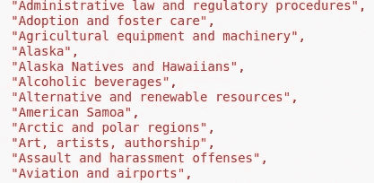
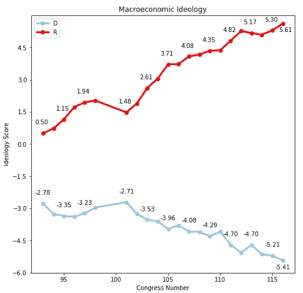
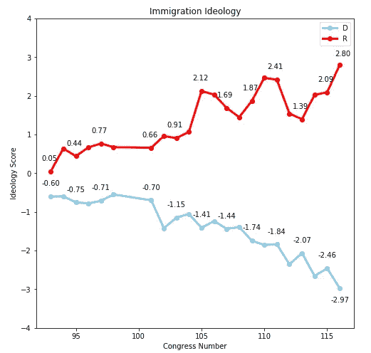
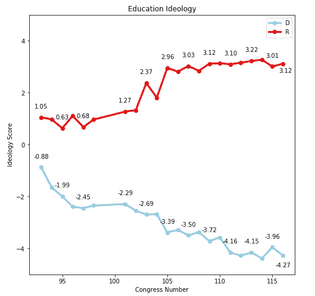
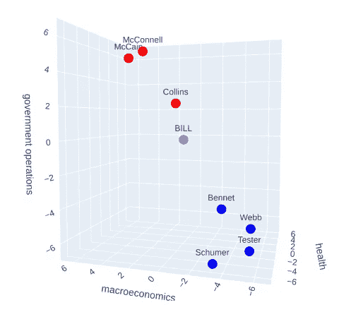

# 用机器学习预测国会点名投票

> 原文：<https://medium.com/analytics-vidhya/predicting-congressional-roll-call-votes-with-machine-learning-7cc4d3ee6f2e?source=collection_archive---------25----------------------->

# 第 2 部分，共 4 部分:意识形态评估

由 [Unsplash](https://unsplash.com?utm_source=medium&utm_medium=referral) 上的 [Element5 数码](https://unsplash.com/@element5digital?utm_source=medium&utm_medium=referral)拍摄

**账单科目:**

对法案特征和政治环境的预测性进行的几乎任何有价值的分析的一个核心组成部分是正在讨论的法案的主题领域构成。虽然国会图书馆提供了一个法案主题列表，该列表也包含在 ProPublica 的批量法案元数据中，但该主题列表可能会非常长，并且本质上非常具体，以至于几乎不可能根据国会图书馆提供的主题来评估法案的主要主题领域。作为国会图书馆提供的法案主题的一个很好的例子，这里只是 LoC 为第 115 届国会的减税和就业法案提供的 93 个主题中的 12 个。

国会图书馆的主题

虽然我不怀疑“阿拉斯加土著和夏威夷人”可能是最终成为法律的冗长法案的某个部分的适用主题，但无论是 93 个异常具体的主题列表还是过于笼统的顶级主题“税收”都没有为我的目的提供适当的详细程度。为了提供一种更实用的分类 bill 主题领域的方法，我再次求助于学术界。

通过利用 Dustin Hilliard 博士、Stephen Purpura 博士和 John Wilkerson 博士在他们的论文“混合方法社会科学研究的计算机辅助主题分类”中的工作，我能够确定一种非常有效的方法来为国会法案分配主题领域分类。我用于分类的数据可以在 comparativeagendas.net 网站上找到。

来自比较议程的数据集提供了从第 80 届国会(1947 年)到第 112 届国会(2012 年)提出的超过 40 万个法案的分类。每一个法案被分为 21 个独特的主要主题领域中的一个和主要主题下的许多次要主题中的一个(主要和次要主题的完整列表的链接将包含在本文的底部)。

因为由政府出版办公室提供并包含在批量账单数据文件中的账单文本摘要非常全面，所以我使用账单摘要作为完整账单文本的代理，测试了 Hilliard 和 Purpura 论文中建议的支持向量机分类模型的复制。使用账单摘要代替完整的账单文本，我能够实现 96.85%的主要账单主题分类准确率，因此我确定 GPO 摘要足以替代 Hilliard-Purpura 研究中使用的完整账单文本。因为我不相信一个单一的主要主题领域通常能够提供一个完整的法案主题构成的足够健壮的表示，所以我返回了具有最高关联预测分类概率的三个主要类别。通过返回前三个主要的主题领域及其预测的类别概率，这将允许我在项目的未来迭代中使用预测的类别概率作为与每个预测的类别相关联的账单内容数量的相对度量。我的主要主题分类模型的代码包含在底部链接的 GitHub 存储库中。

**针对立法者的特定主题意识形态评估:**

我的数据集中有 255，449 个法案，每一个都被标上了前三个主要主题领域，现在我有了定量评估立法者对每个不同主题领域的意识形态所需的基础。我在计算立法者意识形态时设计和使用的以下方法在本质上有点主观，在未来的迭代中可能会被重新访问和修改，但我发现它们在应用中相对直观和有效。

在立法者职业生涯的第一次唱名表决之前，立法者将从 21 个不同主题意识形态中的每一个的意识形态得分为零开始。零分表示绝对的两党合作，因为立法者尚未在任何主题领域投票支持任何一方的多数立场。为了恰当地评估每个法案支持多数党的情况，这种方法必须包含更多的考虑因素，而不仅仅是简单地确定哪个政党投了最多的赞成票。因为由于一方或另一方在众议院中有更多的议员而将一项获得两党 100%支持的法案归类为共和党或民主党支持的法案并不能准确评估该法案的非党派性质，所以获得两党支持的法案显然需要他们自己的指定。虽然我对两党支持的定义有些武断，但我认为任何获得两党 95%或以上支持的法案都将被指定为获得两党对我的项目的支持。由于今天的立法者比过去更倾向于在党内投票，因此确定较低的两党合作门槛是必要的，但较低的两党分类门槛也将软化成员意识形态得分，因为较少的选票将被视为个人党派意识形态的标志。我的工作的未来迭代可能会包含一个更全面的和依赖于背景的两党支持分类方法。

既然我已经概述了我在确定法案的多数支持政党分类中的方法，我就可以解释如何计算每个成员在其职业生涯中独特的主题意识形态得分。如果立法者对一项归类为“A”、“B”和“C”三大主题的法案进行唱名表决，则反映立法者在每个政党占多数地位的背景下的支持或反对的加数将被添加到该立法者在主题“A”、“B”和“C”的连续意识形态得分中。与共和党多数派立场一致的投票导致加数为“+1”，与民主党多数派立场一致的投票导致加数为“-1”，任何未能就该措施投票或就两党法案投票的投票导致加数为“0”。在立法者立法生涯的某一时刻，立法者对某一主题的意识形态得分是这样计算的:对该主题的法案投票的所有加数之和除以立法者投票的该主题的党派法案的数量。在以后的迭代中探索的替代方法可能包括使用主题意识形态分数的时间加权平均值，以更加强调最近的投票立场，并更好地调整潜在的转变意识形态。在我选择的方法中，目前的一个偏见来源是让每一位新当选的立法者从零分的主体意识形态开始。虽然这可能是评估尚未投票的立法者的意识形态的最客观的方法，但它肯定会带来实际的问题，因为即使是意识形态最极端的新当选的立法者也会被视为两党的，直到每个主题领域都记录了足够的票数。我的项目的未来迭代可能会探索将普通政党立法者的意识形态分配给同一政党的新当选立法者的有效性。

以下图表显示了本项目包含的 46 年数据中政党平均的一些主题意识形态的进展情况:

第 93 次党代会以来的党的宏观经济思想

第 93 届国会以来的政党移民思想

93 大以来党的教育思想

**法案主题意识形态评估:**

在计算了每位议员在各自职业生涯中特定主题的意识形态得分后，我现在有了为法案分配意识形态得分所需的基础。为了评估法案内容的意识形态，我查看了每项法案的共同发起人。我认为，对于选择共同提出法案的立法者来说，该法案的内容必须与选择共同提出该法案的立法者的政策目标和特定主题的政治意识形态充分一致。根据这一逻辑，我已经确定，法案共同提案人的特定主题意识形态得分可以有效地代表法案政策目标的意识形态。虽然这种法案意识形态评估方法相对直观，但在提出法案时，对三个法案主题中的每一个的每个共同提案人的意识形态进行查询和平均的过程需要 20 多小时的不间断运行时间。评估法案三个主要主题的意识形态得分的最大好处之一是，它允许将法案的意识形态表示为三维空间中的一个点。通过在三维空间中表示法案的意识形态(法案的每个主要主题一个维度)，这允许我在相同的三维空间中绘制潜在投票立法者的意识形态观点。根据投票的空间模型，立法者很可能会投出与他们的意识形态理想点最接近的一票。法案的意识形态点和立法者的意识形态点之间在三维空间中的距离表示法案共同提案人和所讨论的立法者关于相同主题领域的法案的投票记录之间的相似性或缺乏相似性。法案的观点和立法者的观点之间的距离越短，他们的政策目标就越接近，因此立法者就越有可能投票支持该法案。

以下 3D 散点图通过显示《患者保护和平价医疗法案》的意识形态位置(通过其三个主要主题领域的共同发起人的平均意识形态)及其与两党参议员样本的相对距离，说明了投票空间模型的基本原理:

患者保护与平价医疗法案和两党参议员之间的意识形态空间

从散点图中可以看出，保守的共和党人，如约翰·麦凯恩和米奇·麦康奈尔，聚集在积极的意识形态轴心价值观的交叉点上，而自由民主党人，如查克·舒默和约翰·特斯则聚集在更加消极的轴心价值观上。苏珊·科林斯和麦克·班尼等较为温和的参议员更接近中间立场。

**第三部:**【https://link.medium.com/VFrpwiS5s2】T2

**剩下的代码:**

这个项目最重要的组件的代码可以在我的立法数据科学 GitHub 知识库中找到:【https://github.com/wjarvis2/Legislative-Data-Science

**引文:**

希拉德博士，紫癜，s .，和威尔克森，法学博士(2008)。混合方法社会科学研究的计算机辅助主题分类。

 [## 比较议程

### 比较议程项目数据集中的观察结果根据所描述的指南和主题系统进行编码…

www.comparativeagendas.net](https://www.comparativeagendas.net/pages/master-codebook)