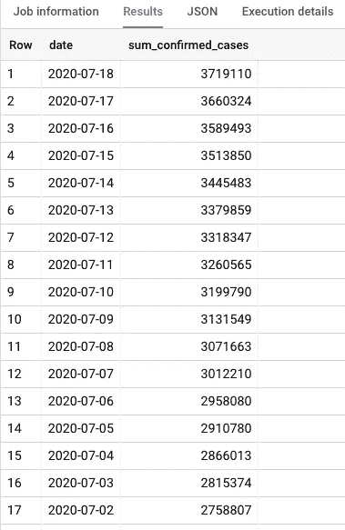

# 使用 BigQuery ML 预测新冠肺炎病例

> 原文：<https://medium.com/analytics-vidhya/predicting-covid-19-cases-using-bigquery-ml-e810cb0df54?source=collection_archive---------12----------------------->

使用新冠肺炎数据集探索 BigQuery ML 和 Data Studio。

随着对机器学习需求的增加，我们都渴望探索各种数据集，并尝试我们的动手建模、预测和评估。然而，这需要广泛的编码和 ML 框架知识。


照片由[张秀坤镰刀](https://unsplash.com/@drscythe?utm_source=medium&utm_medium=referral)在 [Unsplash](https://unsplash.com?utm_source=medium&utm_medium=referral) 上拍摄

## **别担心！！！**

做这个不需要了解 **PYTHON** ！！你不需要搜索数据集！！

Google 的 BigQuery ML 使我们能够用基本的 SQL 查询来完成这项工作。在我们开始探索新冠肺炎数据集之前，让我们先了解一下 BigQuery。

# **什么是 BigQuery？**

BigQuery 是一个全面管理、无服务器、高度可扩展且经济高效的云计算数据仓库，能够对数 Pb 的数据进行可扩展分析[1]它有很多特点。举几个例子，

*   BigQuery Omni 允许您跨云分析数据。
*   BigQuery ML 使数据科学家和分析人员能够使用简单的 SQL 查询来构建和处理模型。
*   BigQuery BI Engine 是一种超快速的内存服务，允许用户分析复杂的数据集，其处理响应时间为亚秒级。
*   BigQuery GIS 有助于使用地理数据类型可视化地理空间数据。

# **为什么 BigQuery ML 这么容易？**

在一个典型的机器学习问题中，人们通常会寻找数据集，利用 Jupyter Notebook 或 Spyder 来导入数据，训练和测试模型。大型数据集上的机器学习需要大量的编程和 ML 框架知识。然而，BigQuery ML 使它变得非常简单。BigQuery ML 使数据分析师能够通过现有的 SQL 工具和技能使用机器学习[2]。BigQuery ML 提供了一系列实时更新的公开可用的数据集。它最小化了导入大型数据集的任务。在简单的 SQL 查询和 Data Studio 的帮助下，可以将数据可视化。通过指定 MODEL_TYPE，使用 CREATE MODEL 语句对数据建模。一旦模型经过训练，就可以使用 ML 进行预测。使用 ML.EVALUATE 进行预测和评估

# **BigQuery ML 训练模型**

BigQuery ML 支持各种模型，例如:

*   线性回归
*   k 均值聚类
*   时间序列
*   深度神经网络
*   多类逻辑回归
*   二元逻辑回归
*   矩阵分解
*   升压树

# **BigQuery ML 可视化工具— Data Studio**

BigQuery ML 很容易与 Data Studio 集成。Data Studio 有助于使用各种图形(如时序图、饼状图、地理图、谷歌地图、树形图、条形图等)来可视化数据。可以使用简单的 Web UI 轻松修改参数和指标。在下面的例子中，我们将尝试探索各种图表来分析数据。

## 读够了！！！现在让我们从一个简单的例子开始吧！


在疫情中，为什么不对真实数据进行更多的分析，并对当前形势有所了解。在这里，我们努力探索纽约时报数据集 T2。该数据集有两个表，提供了关于确诊病例和死亡的信息。

*   美国各县
*   美国各州

登录 Google 云控制台，创建一个项目，开始使用 BigQuery。

让我们将美国的新冠肺炎数据可视化。在 BigQuery 中运行以下查询来可视化表“us_states”。

**数据可视化**

```
SELECT * FROM `bigquery-public-data.covid19_nyt.us_states`
ORDER BY date DESC;
```


表格:美国各州

运行以下查询来可视化表“us_counties”。

```
SELECT * FROM `bigquery-public-data.covid19_nyt.us_counties`
ORDER BY state_name;
```


表格:美国各县

要查找每个州的确诊病例总数，请运行以下查询。

```
WITH state_name_latest_date AS (
  SELECT state_name, max(date) AS max_date 
  FROM `bigquery-public-data.covid19_nyt.us_states`
  WHERE state_name = state_name
  GROUP BY state_name)

SELECT us.state_name, us.confirmed_cases
FROM state_name_latest_date snld
JOIN `bigquery-public-data.covid19_nyt.us_states` us ON
  snld.state_name = us.state_name
  AND snld.max_date = us.date
ORDER BY us.confirmed_cases DESC;
```


显示各州确诊病例总数

点击链接浏览 Data Studio [确诊病例互动图 https://Data Studio . Google . com/reporting/D2 adc5 c 6-2d4c-4f3e-9af 7-11b 64089 BD c8](https://datastudio.google.com/reporting/d2adc5c6-2d4c-4f3e-9af7-11b64089bdc8)


各州确诊病例—时间序列


各州确诊病例—饼状图

若要查找每个州的总死亡人数，请运行以下查询

```
WITH state_name_latest_date AS (
  SELECT state_name, max(date) AS max_date 
  FROM `bigquery-public-data.covid19_nyt.us_states`
  WHERE state_name = state_name
  GROUP BY state_name)

SELECT us.state_name, us.deaths
FROM state_name_latest_date snld
JOIN `bigquery-public-data.covid19_nyt.us_states` us ON
  snld.state_name = us.state_name
  AND snld.max_date = us.date
ORDER BY us.deaths DESC;
```

几行结果…


每个州的死亡总数

点击链接，体验数据工作室[https://datastudio.google.com/s/h6YcbGiY694](https://datastudio.google.com/s/h6YcbGiY694)的互动图


每个州的死亡总数

树形图可视化。交互式树形图链接。[https://datastudio.google.com/s/i9wxNwUweyQ](https://datastudio.google.com/s/i9wxNwUweyQ)


各州死亡人数的树状图可视化

找出美国每天确诊病例的总数

```
SELECT date, sum(confirmed_cases) as sum_confirmed_cases
FROM `bigquery-public-data.covid19_nyt.us_states`
GROUP BY date
ORDER BY date DESC;
```



按日期分列的确诊病例总数

要在交互式图表中可视化数据，点击链接[https://datastudio.google.com/s/jdifvcxQbcI](https://datastudio.google.com/s/jdifvcxQbcI)


美国按日期分列的确诊病例(数据工作室)

**创建模型**

现在让我们创建一个机器学习模型，并训练该模型来预测新冠肺炎确诊病例的增加。我们利用`[CREATE MODEL](https://cloud.google.com/bigquery-ml/docs/reference/standard-sql/bigqueryml-syntax-create-time-series)`子句创建并训练一个名为“{GCP 项目 id}.covid19_nyt.train_model”的模型。当我们训练模型来预测新冠肺炎病例时，我们通过指定“模型类型='ARIMA '”来使用时间序列 ARIMA 模型[3]。该模型接受“SELECT”语句返回的输入。

```
CREATE OR REPLACE MODEL `{GCP project id}.covid19_nyt.train_model`
OPTIONS
 (model_type='ARIMA', 
 TIME_SERIES_TIMESTAMP_COL = 'parsed_date', 
 TIME_SERIES_DATA_COL = 'sum_confirmed_cases',
 DATA_FREQUENCY = 'DAILY'
 ) AS
SELECT 
 date AS parsed_date, sum(confirmed_cases) AS sum_confirmed_cases
FROM 
 `bigquery-public-data.covid19_nyt.us_states`
GROUP BY date 
ORDER BY date DESC;
```

**预测模型**

创建模型后，我们将按日期预测接下来三个月的确诊病例。我们利用`[ML.FORECAST](https://cloud.google.com/bigquery-ml/docs/reference/standard-sql/bigqueryml-syntax-forecast)` 来预测未来 90 天的时间序列数据。

```
SELECT *
FROM
  ML.FORECAST(MODEL `cmpe256-279717.covid19_nyt.train_model`,
              STRUCT(90 AS horizon));
```

该预测返回以下结果。confidence_level 表示模型的准确性。该模型预测期望值、期望的下限和上限。


未来 3 个月确诊病例的预测值

[https://datastudio.google.com/s/hyB1WTz_SD8](https://datastudio.google.com/s/hyB1WTz_SD8)

**评估模型**

我们使用`[ML.EVALUATE](https://cloud.google.com/bigquery-ml/docs/reference/standard-sql/bigqueryml-syntax-evaluate)`来评估模型。

```
SELECT *
FROM ML.EVALUATE(MODEL `cmpe256-279717.covid19_nyt.train_model`);
```


这展示了一个简单的使用 BigQuery ML 的实践经验，提供了对新冠肺炎案例的新兴趋势的见解。预测结果令人震惊，我相信我们很快就会找到出路。注意安全！

**资源:**

[1][https://cloud.google.com/bigquery](https://cloud.google.com/bigquery)

[2][https://cloud.google.com/bigquery-ml/docs/bigqueryml-intro](https://cloud.google.com/bigquery-ml/docs/bigqueryml-intro)

[3][https://cloud . Google . com/big query-ml/docs/ARIMA-multiple-time-series-forecasting-tutorial](https://cloud.google.com/bigquery-ml/docs/arima-multiple-time-series-forecasting-tutorial)

谢谢！结束！

普雷拉纳·谢哈尔

圣何塞州立大学计算机工程硕士

[GitHub](https://github.com/preranashekhar)

[](https://www.linkedin.com/in/preranashekhar/) [## Prerana Shekhar -圣何塞州立大学-旧金山湾区| LinkedIn

### 查看 Prerana Shekhar 在全球最大的职业社区 LinkedIn 上的个人资料。普雷拉纳有 2 份工作列在…

www.linkedin.com](https://www.linkedin.com/in/preranashekhar/)