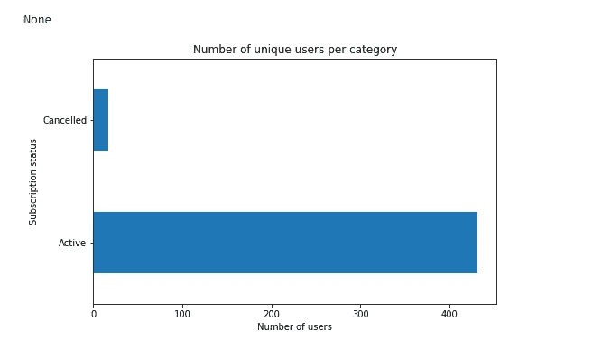

# 预测客户流失

> 原文：<https://medium.com/analytics-vidhya/predicting-customer-churn-58faa29bc836?source=collection_archive---------10----------------------->

在 [Unsplash](https://unsplash.com?utm_source=medium&utm_medium=referral) 上 [NeONBRAND](https://unsplash.com/@neonbrand?utm_source=medium&utm_medium=referral) 拍摄的照片

基于订阅的商业模式的一个重要指标是客户流失率。这是指客户决定不再为企业的服务付费。了解这些客户离开你的服务的原因可以提供对企业运营的洞察力，也可以决定企业是否会失败。在 Udacity 的数据科学家 nanodegree 项目中，我有机会使用与一家名为 Sparkify 的虚构流媒体公司相关的数据，并尝试为他们的公司建立一个预测流失模型。

**商业问题**

这个项目的目标是使用 Sparkify 的网站流量来识别那些更有可能流失的用户。这是为了让 Sparkify 与客户进行沟通，帮助他们解决任何可能导致他们停止支付服务费用的问题。

首先，我将研究这些数据，以发现与用户的订阅年龄、操作系统和设备、性别以及应用程序的活跃程度相关的见解，并列举一些我认为对预测客户流失至关重要的功能。从那里，我的目标是创建这些特征的管道，以馈入监督学习提升树分类算法。这个算法吸引了我，因为它能够重新计算加权输入，这在处理不平衡数据时很有用。

经过进一步考虑，我觉得如果是这样的话，基础设施将不得不利用某种数据流工具，而不是在应用程序出现混乱迹象的每一时刻查询用户的历史记录。因此，客户流失预测将需要快速到达，以触发一个可以给几天时间进行适当干预的响应。

**探索性数据分析**

在这种情况下，我得到了一个相当大的 12GB 的客户数据集。在这里，用于分析和机器学习的标准工具将不适合计算机的内存，所以我被迫使用像 Apache Spark 这样的大数据工具。数据集有 18 个字段，包括订阅级别、userID、sessionID、性别、时间戳、歌曲作者等等。

首先，我加载了数据框，然后检查了数据框的模式和形状。从下面的图片看，大约有 53 万个条目，共 19 列。

准备:有些记录没有空的 userID 或 sessionID，所以我删除了它们

现在，我将查看数据集中的一些分类变量:授权、性别、方法、订阅级别、交互中使用的方法、用户在哪个页面上、交互状态。可以看出，有大量的付费和免费用户对 Sparkify 的业务非常重要，因为他们分别通过付费订阅和广告收入提供收入。

首先，让我们看看有多少用户产生了与没有产生。

然后，我认为按性别或订阅查看流失统计数据会很酷:

基于一些基本的分析，免费用户似乎比付费用户略多，但是被取消的付费用户和被取消的免费用户差不多。男性似乎比女性更容易流失。

我想研究的另一个特征是，一个人的操作系统是否会影响他流失的可能性？

看起来一个人的操作系统确实很重要。iPad 用户似乎最开心，没有人取消订阅，而 iPhone、Windows 7 和 Linux 用户更有可能取消订阅服务。接下来，我可以将每个操作系统分解成可读性更好的图表，并将每个操作系统的已取消用户与活动用户相关联，而不是与用户总数相关联。

**特色工程**

似乎有新的或修改的特征，我想添加到数据集，这可以被视为一个分类特征或数字特征。以下是几个例子:

*   作为二进制变量的页面操作
*   时间特性:创建一个滚动窗口来捕捉用户与时间相关的行为
*   性别
*   用户注册后的天数

在这个特征工程之后，我们有能力检查每个页面的最近趋势。我的目标是滚动窗口，以允许预测客户流失的高精度。

**建模与评估**

这里，我想创建一个概率分类事件，因为在这个问题中我们试图确定一个事件的可能性。这种情况下的数据存在一个问题，即流失事件与非流失事件之间的不平衡。为了解决这个问题，我将使用一个梯度增强分类器算法，比如 GBTClassifier 函数，它执行引导来重复选择数据的子集。这省去了很多试图欠采样或过采样数据的麻烦。

在建模之前，我创建了一个特征向量，将数据分为训练集和测试集，然后缩放数据以最小化离群值的影响。在这一部分中，我为缩放和分类操作部署了一个 Spark 管道。此外，由于数据的偏斜性质，准确性很可能会产生误导，因此我将使用不同于简单准确性的指标来判断我的模型，如召回率、接收器操作特性曲线和假阳性率等。

数据操作和初始化

通过网格搜索和 k-folds 交叉验证，我们可以改进我们的模型来选择理想的超参数。我选择使用二元分类评估，因为我试图创建一个预测二元事件的模型。对于 ParamGridBuilder()函数，我为一些参数创建了一个 paramater 网格来帮助决策树，例如 maxDepth，它需要找到一个最佳深度点来提高准确性，同时避免过度拟合，maxBins 在评估决策树时使用，maxIter 基于我认为理解数据所需的适当迭代次数。

回忆通常被称为真阳性率。例如，它是正确识别病人的比率，在这种情况下，它是正确识别将要流失的成员的比率。如果我们假设与客户的互动不是敌对的，那么未能识别真实肯定的人(即未能识别将要流失的人)将会使企业损失巨大的收入，而相反，错误地识别将要流失的人不会对企业造成太大的伤害。

这里的 ROC 曲线有助于我们查看我们在这种情况下的召回性能:

总的来说，ROC 曲线显示了我们的模型的有希望的结果，因为它显示真实的阳性率在 1 左右。然而，假阳性率似乎很高，但如果你能相信假阳性对业务没有那么有害，这个问题就不太令人担心了。只要假阳性率不太高，我们就可以接受这个比率。为了进一步分析，我在图表中添加了准确度、精确度和 F1 分数，如下所示:

我在上图中添加了准确度、精确度、f1 分数和召回率。精度衡量的是预测的阳性结果中真正阳性的比例。即使使用非常低的预测阈值(分别为 0.2 和 0.5)，精度和总体准确度都接近 1.0。所以，我不认为我们有很多假阳性，也不需要担心他们会继续下去。F1 分数测量我们的精确度和召回率的调和平均值，同时也不考虑真正的否定，因此它可能是对模型性能的更准确的测量。F1 分数在 0.15 阈值附近达到峰值，因此当用户有 15%或更高的机会对业务产生最大影响时，干预可能是明智的。

有关这些指标的更多信息，我发现这个链接很有帮助:[https://blog . ex silio . com/all/accuracy-precision-recall-f1-score-interpretation-of-performance-measures/](https://blog.exsilio.com/all/accuracy-precision-recall-f1-score-interpretation-of-performance-measures/)

# 后续步骤和改进

我们已经创建了一个高度准确的模型，但其正面预测能力还有待提高。作为我们业务的第一个版本，这可能已经足够好了，但是我们可以采取什么步骤来增加更多的价值呢？

*   火花流—我们的业务需要快速响应，为此需要快速预测。将我们的模型整合到 spark streaming 应用程序中将允许几乎即时的预测(和干预)，而不是必须等待一整夜的批处理过程或类似过程。
*   我想看看我的模型在欠采样或过采样的情况下会如何表现，以考虑到不平衡的数据。
*   额外的功能工程——注意到非 iOS 用户更容易流失了吗？我想看看这些统计数据，以及 Sparkify 的业务是否有任何潜在的网络效应。例如，Spotify 的应用程序具有社交方面，所以我认为 Sparkify 也可能受益于或遭受网络效应。引入额外的数据有助于更准确地预测客户流失。
*   我选择分析 Sparkify 的数据的一个重要原因是为了有机会在 Apache Spark 工作。然而，这个数据集是为我构建的，以达到一个比从真实世界的数据中创建我自己的数据集更容易的解决方案。通过创建自己的数据集来解决这个问题将是一次很好的学习经历。

总而言之，这个项目既有趣又有教育意义。使用 Spark 使我能够以分布式和可扩展的方式分析、转换和建模我们的数据集，同时还能够做出业务决策。然而，我需要意识到，对业务问题的仔细分析和理解比我使用的工具对成功更重要。