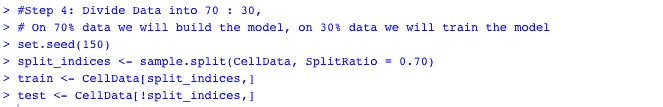

# 电信行业客户流失预测

> 原文：<https://medium.com/analytics-vidhya/predicting-customer-churn-in-telecom-industry-fc7a5a32d358?source=collection_archive---------17----------------------->

这是我用 R 或 Python 解决数据分析/数据科学问题的小实验系列的一部分。这些实验可能是多余的，可能已经被不同的人写在博客上了，但这更多的是个人日记和我个人的学习过程。我希望我能够吸引和激励任何和我经历相似过程的人。如果一个更有见识的人偶然发现了这个博客，并认为有一个更好的方法来做事情，或者我在某些地方出错了，请随时分享反馈，不仅帮助我，而且帮助所有人，作为一个社区一起成长。

客户流失在任何行业都是一个大问题。毫不奇怪，数据科学家的主要关注点之一是减少客户流失和增加客户保留率。在存在按月计费服务的行业，例如电信、互联网、流媒体服务等，预测和检测相对容易。从组织的角度来看，留住现有客户总是比花钱获得新客户更便宜。

在这篇文章中，我的重点是尝试建立一个简单的模型来预测客户是否会流失。

你可以在这里找到我使用过的[的数据集，你可以在这里](https://www.kaggle.com/gaurangswarge/practice-dataset-predict-customer-churn-telecom)找到我的 [GitHub Repo 中的代码。](https://github.com/rckclimber/predict_customer_churn)

**数据集**

这个数据集总共有 11 列，包括一个称为 churn 的列，它是我们的因变量，还有 10 列是我们的预测变量。

我们将尝试并确定在预测客户流失方面具有重要意义的变量，并尝试建立一个逻辑回归模型来准确预测客户流失。

数据集示例

**第一步:导入数据集**

首先，让我们导入 R 中的数据集，检查变量，并检查数据集中是否有空值或缺失值。同时，我们还应该检查数据集的五点摘要。

没有缺失值

**第二步:转换为因子变量并进行异常值处理**

如您所见，变量*‘客户流失’，‘合同续签’，‘数据计划’*实际上都是因子变量，所以让我们将它们转换成因子。

转换为因子变量

下一步是处理异常值，因为异常值可能会影响我们的模型性能。在我们上面的五点总结中，我注意到对于变量 *AccountWeeks* 、 *DataUsage、CustServCalls* ，第三象限值和最大值之间存在巨大差异，这表明这些变量可能存在异常值，让我们相应地检查并处理它们。

异常值处理

因此，由于怀疑这些变量中存在很少的异常值，我将变量限制在第 99 个百分位数，以获得数据的均匀分布。

变量 *DayMins、DayCalls、MonthlyCharge、RoamMins、OverageFee、*的重置似乎在可接受的范围内，没有任何异常值，所以我认为我们不需要限制其中任何一个。

## 步骤 3:创建虚拟变量

下一步是为我们所有的分类变量创建虚拟变量，如果你不知道虚拟变量是什么，那么这里是来自[socialresearchmethods.net](https://socialresearchmethods.net/kb/dummyvar.php)的解释

> 虚拟变量是回归分析中使用的数值变量，用于表示研究中样本的子组。在研究设计中，虚拟变量通常用于区分不同的治疗组。在最简单的情况下，我们将使用一个 0，1 虚拟变量，其中如果一个人在对照组中，则给该人一个 0 值，如果在治疗组中，则给该人一个 1 值。虚拟变量是有用的，因为它们使我们能够用一个回归方程来代表多个群体。这意味着我们不需要为每个子群写出单独的方程模型。虚拟变量就像**“开关”**一样，在一个方程中打开和关闭各种参数。0，1 虚拟编码变量的另一个优点是，即使它是一个名义水平变量，你也可以在统计上把它当作一个区间水平变量

创建虚拟变量

下一步是从每个分类变量中移除一个虚拟变量，这样我们总共有(n-1)个虚拟变量。

**第四步:划分数据**

让我们将数据集拆分为训练数据集和测试数据集，按照惯例，我们将进行 70:30 的拆分。

划分数据集

**步骤 5:第一个模型的时间**

好的，让我们建立第一个包含所有变量的逻辑回归模型。

第一个模型

因此，该模型显示有 3 个变量对预测流失有重要意义，*contract renewal _ Not _ Renewed*(负面影响)*、CustServCalls*&*roam mins*

另外，请注意 AIC 得分为 1383.2。具有最小 AIC 分数的模型将是最优选和优化的模型。

> AIC:赤池信息标准(AIC)是对一组给定数据的统计模型的相对质量的衡量。给定数据的模型集合，AIC 估计每个模型相对于其他每个模型的质量。

现在，既然我们已经建立了考虑所有预测因素的初始回归模型，让我们检查它的显著性

**步骤 6:检查模型显著性和稳健性**

接下来，我们使用对数似然比检查模型的显著性

**对数似然比检验的解释:**
H0:所有 beta 为零
H1:至少有 1 个 beta 非零
从对数似然中我们可以看出，截距只有 model -859.04 方差是我们未知的。
当我们采用完整模型时，我们不知道-680.61 方差。
所以我们可以说，1 -(-680.61 /- 859.04)= 20.77%的仅截距模型固有的不确定性是由全模型校准的。Chisq 似然比显著。p 值也表明我们可以接受另一个假设，即至少有一个β不为零。所以模型很重要。

**模型稳健性:**接下来我们检查我们的模型是否稳健？利用麦克法登的伪 R 平方检验

麦克法登的伪 R 平方检验表明，我们的模型捕获了至少 20.77%的数据方差，这表明它是一个稳健的模型。

回到我们第一个模型的输出，我们注意到 3 个变量在预测客户流失方面很重要，

*contract renewal _ Not _ Renewed，CustServCalls & RoamMins*

此外，合同续签这一分类变量对客户流失有负面影响。

然而，我们需要找出是否有更重要的变量，我们需要考虑？

让我们找出影响客户流失的变量的赔率和概率的力量。

**第七步:赔率解释力**

让步比

赔率概率

**解释:**如果下表所示的特定变量增加“一个单位”，客户流失(与未流失相比)的几率和客户流失的概率如下表所示。

对于分类变量，例如，当客户续约时，与客户续约时相比，客户流失的几率为 0.12。同样，当客户选择数据计划时，客户流失的几率是不选择数据计划时的 0.32。这告诉我们，在我们的模型中，还应该考虑其他重要的变量。

**第 8 步:模型准确性:混淆矩阵** 既然我们已经确认了存在额外的重要变量，让我们使用分类表/混淆矩阵来检查我们模型的性能。

混淆矩阵

**释义:**
(287+1821)个客户中有 1821 个被正确识别并被转出。这相当于 86.3%的阳性预测值。
(10+13)个客户中有 10 个被正确识别，且未被大量生产。这相当于 76.9%的阴性预测值。
在 86.3 %，该模型提供了良好的准确性措施。
敏感性为 0.99，特异性为 0.033

混淆矩阵测验

**解释:**
(181+1024)个客户中有 1024 个被正确识别并被转出。这相当于 84.9%的阳性预测值。
(5+2)个客户中有 5 个被正确识别，且未被大量生产。这相当于 71.4%的阴性预测值。
在 84.9 %时，该模型提供了良好的准确性度量。
敏感性为 0.998，特异性为 0.026

因此，该模型在训练和测试数据集上表现出非常相似的性能。

**进一步的步骤:模型提炼**

到目前为止，我们检查了模型的显著性，稳健性，准确性，我们对目前的情况相当满意。我们可以在这里结束我们的模型并继续前进，但我们不应该这样做。我们可以进一步改进我们的模型，以提高模型的准确性。之前，当我们检查优势比时，我们发现了一些变量，这些变量对于预测客户是否会流失非常重要。我们的下一步应该是:

1.  变量选择(我们可以使用 step()函数)
2.  检查模型的显著性、稳健性和准确性
3.  最终解释结果

高级主题包括，理解变量的相互作用和进一步完善模型。

我希望这对阅读的人有所帮助:)。如果您有任何疑问或需要澄清，请告诉我。