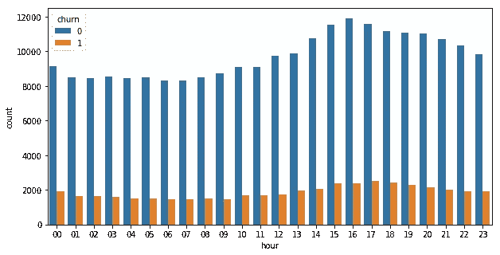
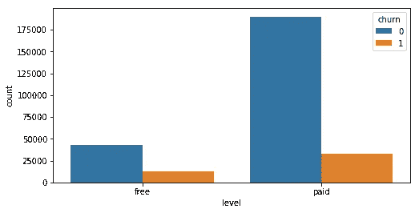
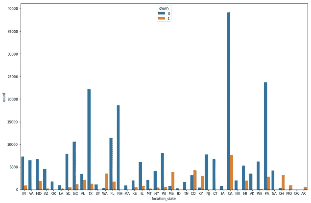
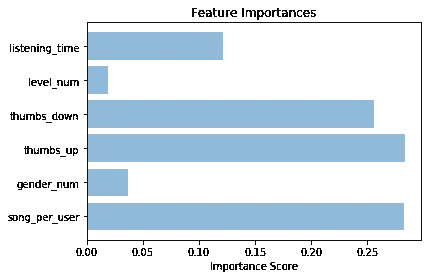

# 用 Spark 预测客户流失率

> 原文：<https://medium.com/analytics-vidhya/predicting-customer-churn-rates-with-spark-61b0e0747b65?source=collection_archive---------7----------------------->


客户流失率是大多数电子商务公司的一大头痛问题。客户为什么会流失？搅动的主要因素是什么？有什么模式可以让我们预测流失率吗？

不断上升的流失率对电子商务公司的收入产生了重大影响。因此，预测他们以及影响流失的因素对这些公司来说非常重要。

本文解决了这些问题，并展示了如何预测一家名为 Sparkify 的虚构公司的流失率。

对于这个项目，我使用 Apache Spark 和 Python (PySpark)。

# Sparkify 项目概述

Sparkify 是一个虚构的音乐流媒体服务，有数千首歌曲和作者模仿流行的流媒体服务 Spotify。Sparkify 用户可以播放音乐，并与应用程序互动。该应用程序有两个订阅级别:免费和付费。

Sparkify 中包含的数据量很大。为了处理它，我使用 Apache Spark 框架。

一般的方法是在一个较小的数据子集(大约 230MB)上测试该算法，然后将其部署在 Spark 集群上，并在整个数据集上进行测试。

首先，我清理数据并可视化变量之间的一些相关性。

第二步，我将一些特征转换成数字特征，并在现有特征的基础上创建一些新特征。

然后我在这个数据子集上测试三个基本算法。基于他们的表现，我选择一个进行最终分析。

# 数据描述和特征工程

Sparkify 数据子集以 json 格式提供，包含环岛 226 用户。

Spakrify 数据具有以下结构:

```
root
 |-- artist: string (nullable = true)
 |-- auth: string (nullable = true)
 |-- firstName: string (nullable = true)
 |-- gender: string (nullable = true)
 |-- itemInSession: long (nullable = true)
 |-- lastName: string (nullable = true)
 |-- length: double (nullable = true)
 |-- level: string (nullable = true)
 |-- location: string (nullable = true)
 |-- method: string (nullable = true)
 |-- page: string (nullable = true)
 |-- registration: long (nullable = true)
 |-- sessionId: long (nullable = true)
 |-- song: string (nullable = true)
 |-- status: long (nullable = true)
 |-- ts: long (nullable = true)
 |-- userAgent: string (nullable = true)
 |-- userId: string (nullable = true)
```

尽管相对较小，但这些数据包含了用户与应用程序交互的许多信息。为了提取一些相关信息，我首先清理和重组数据。

作为第一步，我删除重复，空值和一些不太相关的信息。第二步，我在已有特征的基础上计算一些新的特征。

我还根据数据集中包含的“取消确认”特性从数据集中创建了一个客户流失特性。

处理后的数据集如下所示:

```
+-------------+----------+---------+-----------+-----------------+---------+-----+
|song_per_user|gender_num|thumbs_up|thumbs_down|   listening_time|level_num|label|
+-------------+----------+---------+-----------+-----------------+---------+-----+
|          381|         1|       17|          5|66940.89735000003|        0|    0|
|          381|         1|       17|          5|66940.89735000003|        0|    0|
|          381|         1|       17|          5|66940.89735000003|        0|    0|
|          381|         1|       17|          5|66940.89735000003|        0|    0|
|          381|         1|       17|          5|66940.89735000003|        0|    0|
+-------------+----------+---------+-----------+-----------------+---------+-----+
```

*标签是流失特征。

# 流失的潜在因素——可视化

在实现更高级的分析工具之前，我首先通过一些可视化来查看数据。这种方法允许我验证在用户交互中是否有一些直观的直接关系。

客户流失是否与特定的时间变量有关，比如一天中的某个小时？



流失计数与一天中的小时数

**付费用户比免费订阅用户流失更多吗？**



客户流失与订阅水平

**客户流失取决于地理位置吗？**



客户流失与地理位置

从这三种视觉效果来看，只有地理位置与客户流失有一定关系。一些州似乎比其他州的流失率更高。然而，我们无法核实每个地理位置是否有其他因素影响流失率。

# 系统模型化

在 Apache Spark 框架中，并不是所有的机器学习算法都受支持。我的建模策略必须考虑这个事实。

作为第一步，我实现了三个基本算法，没有任何具体的参数调整:

1.  逻辑回归
2.  随机福里斯特
3.  梯度推进

由于数据集在流失用户和未流失用户之间严重失衡，我将 F1 分数作为成功预测的指标。

## 基本方法:逻辑回归、随机森林和梯度推进

在基本方法中，测试了三种算法:逻辑回归、随机森林和梯度增强，以便检查它们在 F1 分数上的性能。

梯度增强算法表现最佳，F1 值为 99%。然而，这个分数也指出了主要的过度拟合，这很可能是由在测试样本中搅动的小样本客户引起的。

因此，作为下一步，我还试图通过更均匀地分割训练/测试样本来解决这个问题。

在下一步中，我使用如下调整的参数实现梯度增强:

*   三重交叉验证
*   最大迭代次数:5，10
*   最大深度:4，12

实施这一策略后，F1 得分保持在 99%。

# 结果和结论

基于这种策略，虽然参数调整并不能提高算法的性能，但是性能最好的算法是梯度提升。F1 分高很可能是测试组样本量小造成的。



基于上述可视化，影响流失率最大的因素是:每个用户播放的歌曲数量、通过给定拇指(向下或向上)的数量显示的用户参与度以及总收听时间。

这个分析的代码可以在我的 [Github](https://github.com/aleksandraklofat/Sparkify-predicting-customer-churn) 个人资料中找到。

**作者**:亚历山大·克洛法特数据科学家@ [datenvertstehen.de](https://datenverstehen.de/)