# 使用 Spark 预测客户流失

> 原文：<https://medium.com/analytics-vidhya/predicting-customer-churn-using-spark-cb14e1ffe00b?source=collection_archive---------27----------------------->

> **火花**分析；音乐流媒体平台

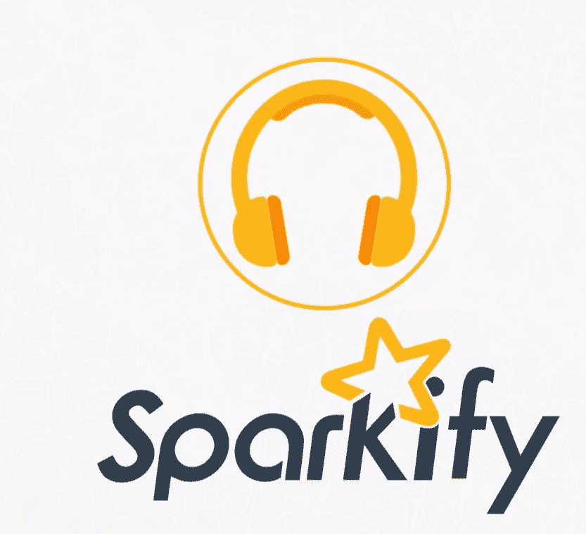

**Sparkify** 是一个虚拟的音乐流媒体平台，在这个项目中，我在 **IBM Cloud** 上使用了 **Apache Spark** ，分析了该平台两个月的数据，以建立一个机器学习模型来帮助预测客户流失。

**Spark** 是一个针对大数据和机器学习的闪电般快速的统一分析引擎。当处理非常大的数据集时，在 **Spark** 上运行分析非常有效。 **Spark** 利用集群计算的计算(分析)能力和存储能力。这意味着它可以使用连接在一起的许多计算机处理器的资源进行分析。

# 问题陈述

在这个项目中，我试图建立一个机器学习模型，帮助预测 **Sparkify 的客户流失。**该模型如果有效，将有助于确定有流失风险的客户，并针对这些客户群进行有针对性的营销，以防止他们流失，从而为公司节省大量资金。

# **数据理解**

**Sparkify** 数据由 **286，500** 行和 **18** 列组成，跨越 **2** 个月；2018 年 9 月至 10 月。

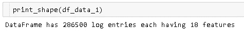

火花数据的维度

不同的列包含用户活动的数据，如**艺术家**、**是否登录的状态**、**名字**、**性别**、**级别**(付费或免费账户)、**位置**、**每次会话在应用上花费的时间长度**等。

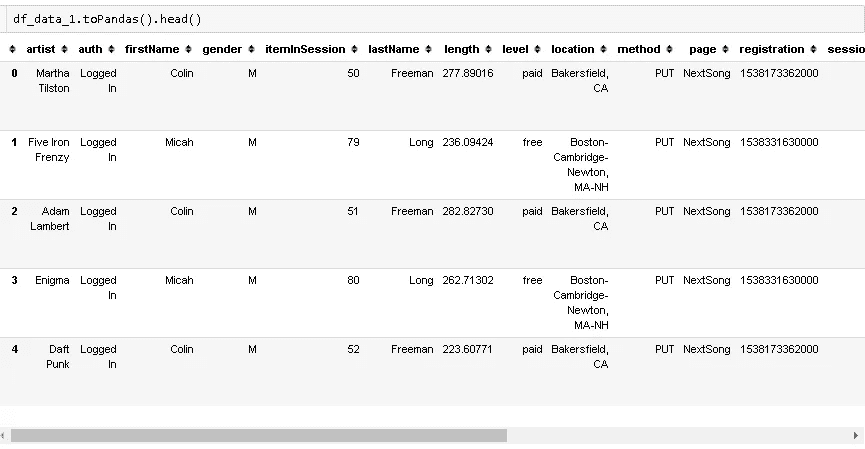

数据样本快照

下图说明了 **Sparkify** 数据集中各列之间的关系。

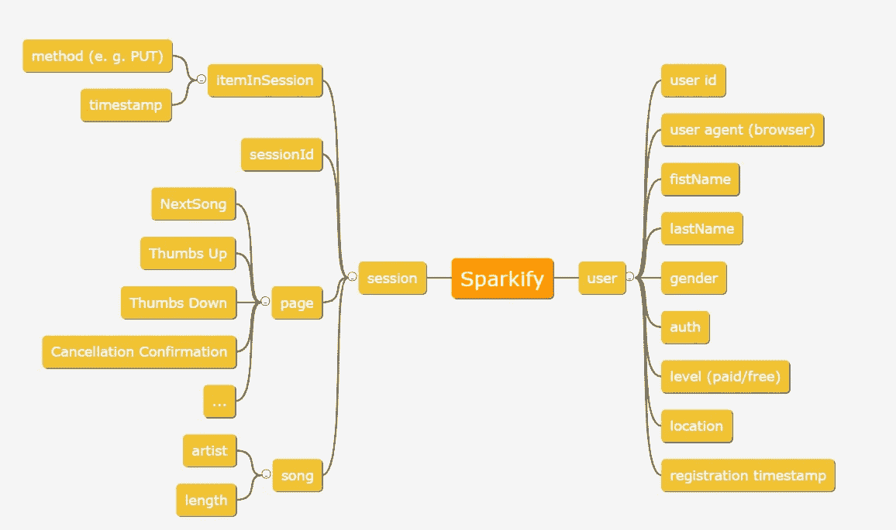

# 数据处理

**Sparkify** 数据相对干净，只有 **userID** 列有实际丢失的数据。这些丢失的数据点指的是访问流媒体网站而没有实际登录的实际用户，或者只是浏览网站的未订阅用户，因此没有为这些交互捕获用户信息。通过扩展列捕获个人信息，如**名**、**姓**、**性别**等。对于这些数据点也是缺失的。

我们还缺少像**艺术家**、**歌曲播放时长**和**歌名**等栏目的数据。对于用户不主动听歌的交互，这些列是空的。

我们将删除缺少 userID 的行，因为我们只关心现有用户的流失。丢失歌曲数据决不是交易的破坏者，因为在人们不听歌曲的所有情况下，我们不会期望得到任何与歌曲相关的信息。

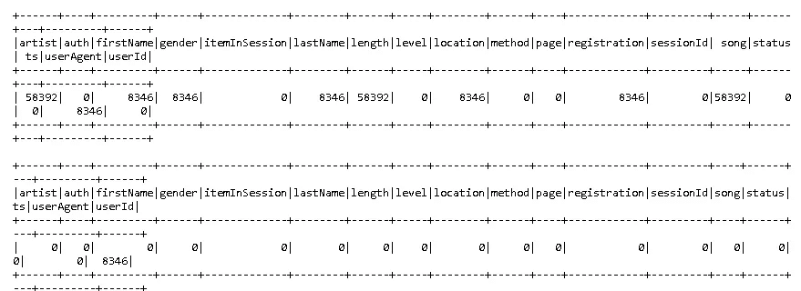

显示缺少数据的列

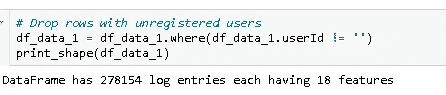

删除缺失数据后火花数据的维度

# 探索性数据分析

在仔细检查数据后，我发现 **Sparkify** 有 225 个独立用户，平均每个用户在 2 个月的时间里有大约 1236 次互动。

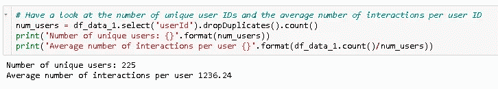

唯一用户的数量

此外，大多数用户的总交互次数低于 2500 次，少数用户高达 9000 次。

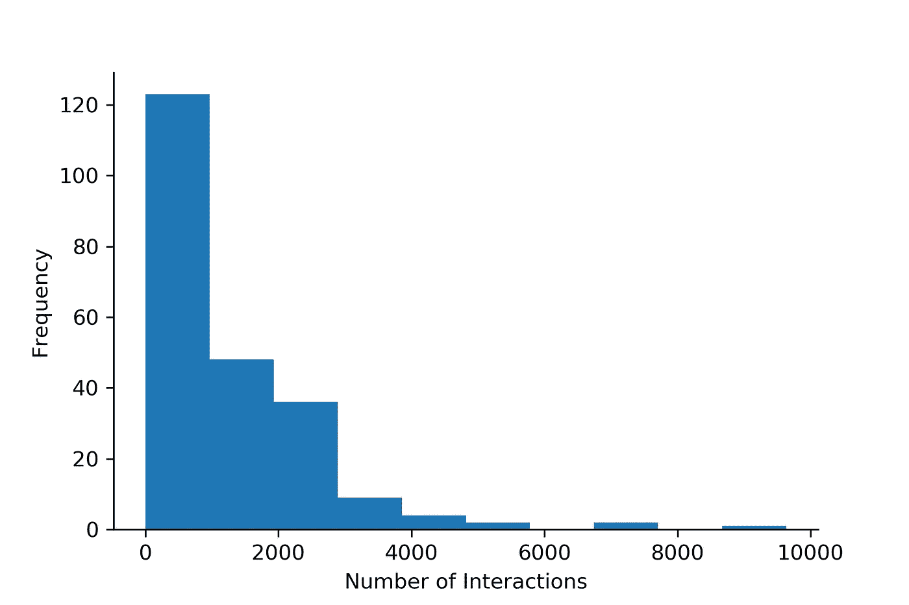

互动次数

**定义流失**

当名为**取消确认**的事件出现在活动日志中时，用户感到不适。这个事件发生在付费和免费用户身上。

让我们探索我们的列和我们的目标变量 **churn 之间的关系。**

**按性别划分的人员变动**

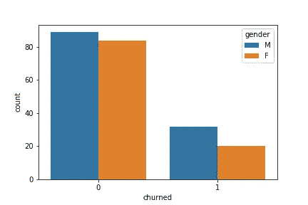

1 表示用户搅动，0 表示用户没有搅动

从上图中我们可以看到，使用 **Sparkify 的男性用户多于女性。**男性和女性在这两个类别中的分布(搅拌过的用户=1，没有搅拌过的用户=0)相似。

**按级别流失**

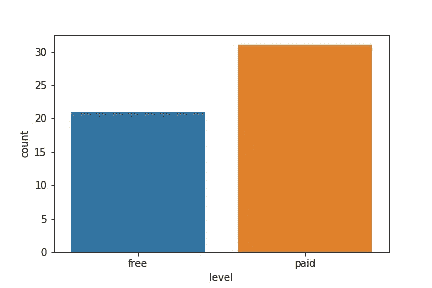

按级别变动

从上图我们可以看到，付费计划的用户比免费计划的用户更容易流失。

# 特征工程

以下特征用于建立预测模型； ***自注册以来的时间*，*听的歌曲总数*，*竖起/放下大拇指的次数*，*添加到播放列表的歌曲数*，*添加的好友数*，*总听时长*，*每期听的歌曲数*，*性别*** 和 ***听的艺人数【T44***这些特征被合并到目标变量 **churn 中。**

接下来，我矢量化，随后使用最小最大缩放器缩放特征。然后，数据被分成训练集、测试集和验证集。

# 型号选择

没有搅动的用户比例是搅动过的用户比例的三倍多，因此我们有一个不平衡的数据集。原则上，我们可以通过对大量用户进行过采样来解决这个问题，但特别是在大数据的情况下，这种方法可能会有问题。

相反，我们可以通过相应地选择度量来解决这个问题。对于不平衡的类别，准确性将是一个糟糕的选择，但如果我们转而追求 F1 分数，我们应该能够获得一个好的模型。

**Logistic 回归**、**梯度推进树**、**支持向量机**和**随机森林**模型利用交叉验证对数据进行训练，选择出 **f1** **得分**最好的模型。

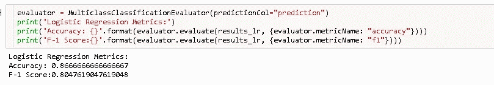

逻辑回归模型结果

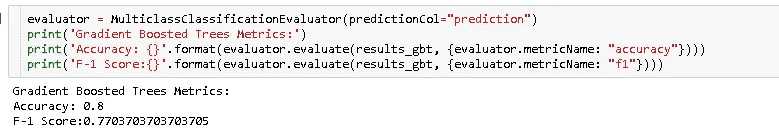

梯度推进模型结果

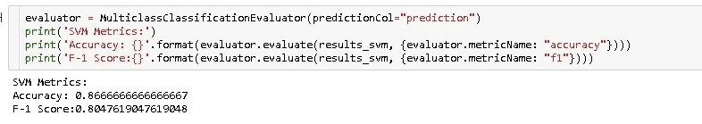

支持向量机结果

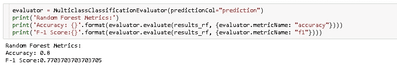

随机森林模型结果

从上面的结果来看，**逻辑回归**和**支持向量**模型都有最高的 **f1 分**为 **0.8** ，但我选择了**逻辑回归**模型，因为它的精度稍高，训练时间也较短。

# **结论**

我们最终的**逻辑回归**模型的 f1 值为 0.8，这对于我们的最终目标来说已经足够好了。我尝试用超参数调整来优化这个模型，但是这个模型几乎没有改进。

我们可以进一步改进该模型的方法包括:

*   寻找要创建的其他变量，例如从用户代理列中提取用户的操作系统，可能有助于改善结果。
*   在更长的时间内收集数据。
*   对从付费服务降级到免费服务的用户的单独分析也可能提供额外的有趣见解。

> *这个项目的 Github 库可以在* [*这里*](https://github.com/ObinnaIheanachor/Predicting-Customer-Churn-using-Spark) 找到

# 关于作者

**Obinna Iheanachor** 是一名创新型数据专家，拥有丰富的分析经验，并成功处理大量数据集来分解信息、收集相关见解和解决高级业务问题。*你会在数据分析、科学和艺术的交汇处找到他*。

你可以在 [LinkedIn](https://www.linkedin.com/in/obinnaiheanachor/) 和 [Twitter](https://twitter.com/DatascientistOb) 上和我联系。