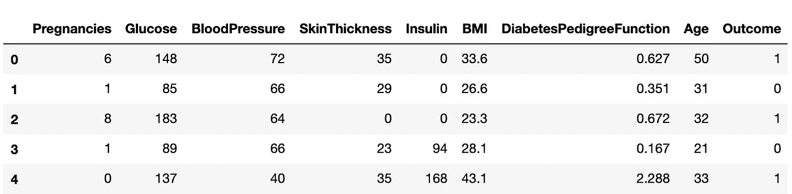
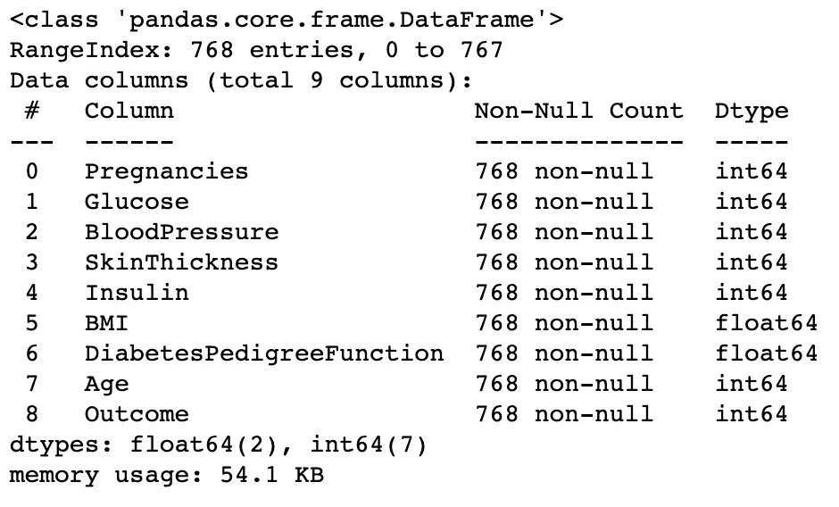
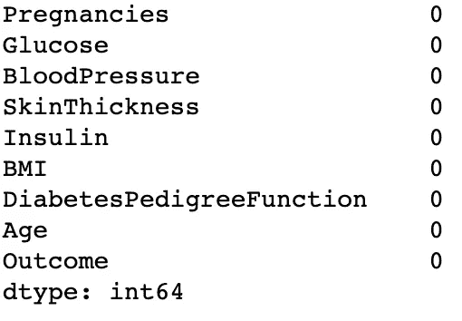
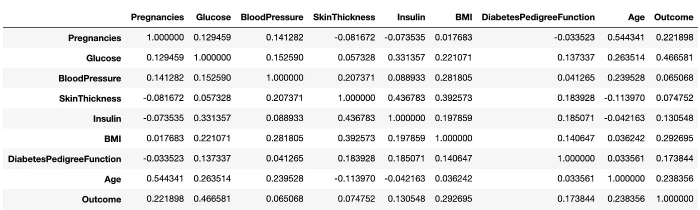
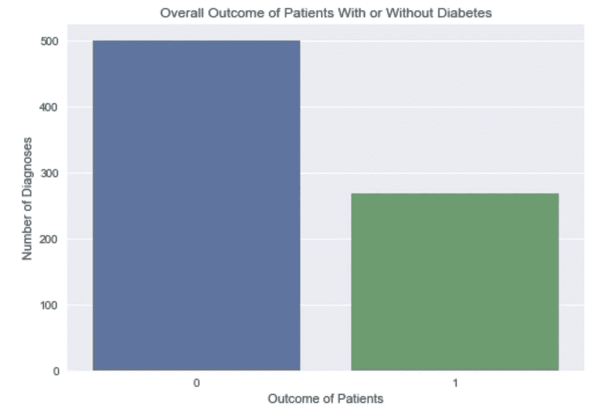
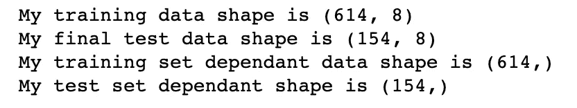

# 使用机器学习预测患者的糖尿病

> 原文：<https://medium.com/analytics-vidhya/predicting-diabetes-mellitus-in-patients-using-machine-learning-3fcba3b86f60?source=collection_archive---------17----------------------->

糖尿病，由高血糖引起的疾病，可分为 1 型和 2 型。

1 型糖尿病通常在幼儿和青少年的早期诊断中被发现。然而，最近的证据表明，这种情况可以在任何年龄发生，因此所有年龄的人都容易发生。1 型糖尿病是一种自身免疫性疾病，它导致胰腺中产生胰岛素的β细胞被清除，从而阻止身体产生足够水平的胰岛素来调节血糖水平。1 型糖尿病的另一个术语是胰岛素依赖型糖尿病。

相反，二型糖尿病是普通人群中最常见的诊断，是一种导致高血糖的代谢紊乱。这通常是身体不能利用其产生的胰岛素或不能产生胰岛素的预测。

随着全球患者中糖尿病诊断的增长趋势，食品和媒体等行业显然存在一个不可克服的问题，即经常误导个人做出不良生活方式的决定，例如使用电视或广播制作不健康食品或饮料的广告，诱使人们做出不良决定。这并不是说偶尔吃一个汉堡不好，但是随着这些行业的发展频率和趋势，证据清楚地表明了问题的根源。

到 2040 年，据估计，世界上被诊断患有糖尿病的患者人数将达到 6.42 亿，这一令人震惊的结果表明，每 10 个人中就有 1 个人将患有糖尿病。除了政府在糖尿病治疗上节省资金之外，对个人来说，采取健康的生活方式更有益，而不是等待这种诊断和治疗提供给患者。例如，英国的国民医疗服务体系每年花费至少 100 亿英镑用于治疗糖尿病患者。

机器学习技术可用于预测患者患糖尿病的可能性。在这篇文章中评估的技术将是逻辑回归模型，给出一个简单的概述。使用的数据集是皮马印第安人糖尿病数据集。

我们将从导入我们通常的嫌疑人开始。

```
#Importing our librariesimport pandas as pd
import numpy as np
import seaborn as sns
import matplotlib.pyplot as plt
%matplotlib inlineimport warnings
warnings.filterwarnings('ignore')
```

现在我们导入数据集

```
#Importing our datasetdiabetes = pd.read_csv('diabetes.csv')#We are investigating the dataset to see what columns we have available in our datasetdiabetes.head()
```



```
#Here we will see how many rows and columns of data we havediabetes.shape
```

结果是包含变量的 768 行和 9 列。目标变量是结果。二元分类问题，0 表示患者没有糖尿病，1 表示有。

```
diabetes.info()
```



我们研究了数据集中的数据类型，可以看到没有分类变量，否则在我们建模之前需要将其转换为虚拟变量。

```
#We want to see if there any null values in our datasetdiabetes.isnull().sum()
```



```
#We are going to investigate the variables in the chart that have the strongest correlation with each variablediabetes.corr()
```



正如我们在数据集中看到的，最强的相关变量是:

*   身体质量指数对血压(0.281805)
*   年龄与血压(0.239528)
*   结果与葡萄糖(0.466581)
*   胰岛素 v 皮肤厚度(0.436783)
*   身体质量指数 v 皮肤厚度(0.392573)
*   葡萄糖对胰岛素(0.331357)

我们还想对我们的目标变量进行数值计算，看看是否有任何会影响我们数据的主要类别不平衡。在这种情况下，这不是一个主要的区别。

```
#We are going to a value counts on our Outcome to see if there is a major class difference that may affect our resultsoutcome_count = diabetes['Outcome'].value_counts()
sns.barplot(outcome_count.index, outcome_count.values)plt.title('Overall Outcome of Patients With or Without Diabetes')
plt.xlabel('Outcome of Patients')
plt.ylabel('Number of Diagnoses')plt.style.use('seaborn')
plt.show()
```



在做基线模型之前，我们需要创建我们的训练测试分割。

```
Separating out test data
y = diabetes[‘Outcome’]
X = diabetes[[‘Pregnancies’, ‘Glucose’, ‘BP’, ‘Skin Thickness’, ‘Insulin’, ‘BMI’, ‘Diabetes Pedigree Function’, ‘Age’]]#Creating our train test split
X_train, X_test, y_train, y_test = train_test_split(X, y, test_size = 0.2, random_state=42)
```

然后，我们可以进一步调查我们的数据的形状。

```
print(f'My training data shape is {X_train.shape}')
print(f'My final test data shape is {X_test.shape}')
print(f'My training set dependant data shape is {y_train.shape}')
print(f'My test set dependant shape is {y_test.shape}')
```

我们分别得到的形状是:



当我们将测试数据分成一个验证数据集时

```
X_train_v, X_val, y_train_v, y_val = train_test_split(X_train, y_train, test_size=0.2, random_state=50)
```

我们现在需要使用标准缩放器来缩放数据。

```
#We are going to standardize our variablesfrom sklearn.preprocessing import StandardScaler#Instantiate the class
ss = StandardScaler()#Fit the scaler on the training dataset
ss.fit(X_train_v)#Transform all the datasets
X_train_v = ss.transform(X_train_v)
X_val = ss.transform(X_val)X_test = ss.transform(X_test)
```

## 逻辑回归

```
from sklearn.linear_model import LogisticRegressionmodel_log = LogisticRegression(penalty='l2', fit_intercept=True, solver='lbfgs', random_state = 45)
model_log.fit(X_train_v, y_train_v)y_train_pred_log = model_log.predict_proba(X_train_v)[:,1]print("ROC_AUC of training model = ", roc_auc_score(y_train_v, y_train_pred_log))
```

这为我们的训练数据提供了 82.5%的分数。但是对我们更有用的是我们的验证数据。

```
y_val_pred_log = model_log.predict(X_val)print("Accuracy of validation model = ", accuracy_score(y_val,y_val_pred_log))print("ROC_AUC of validation model = ", roc_auc_score(y_val, y_val_pred_log))
```

模型的准确率为 78.9%，ROC_AUC 值为 76.8%。ROC_AUC 评分是一个很好的指标，因为它提供了结果为 1 的可能性的指示，即患者是否患有糖尿病。