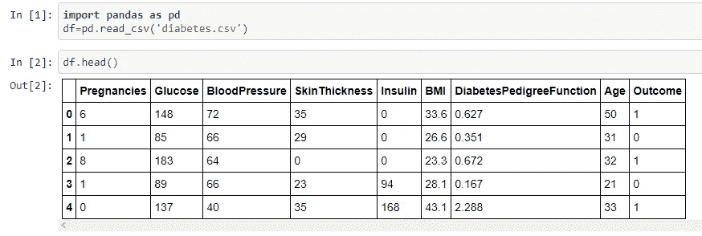
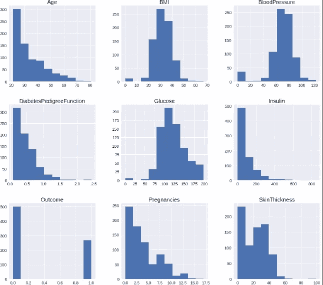
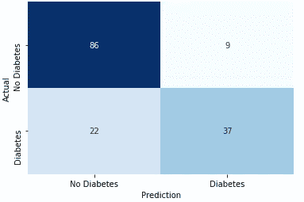

# 用神经网络预测糖尿病

> 原文：<https://medium.com/analytics-vidhya/predicting-diabetes-with-neural-networks-59be196bc30?source=collection_archive---------6----------------------->


糖尿病是一种慢性疾病，据估计全世界有 4 . 15 亿人患有糖尿病。每年有 500 万例死亡可归因于糖尿病相关并发症，这是一种与新冠肺炎死亡相关的共病。

糖尿病的早期阶段通常没有症状，这对于早期检测和诊断是有问题的。不良饮食、缺乏锻炼和体重过重是重要原因。这与二型糖尿病的发作有关，后者是身体对胰岛素逐渐产生抵抗力的结果。1 型糖尿病的不同之处在于，它首先是由于身体无法产生足够的胰岛素。

如果早期诊断，二型糖尿病是可以预防和逆转的。我们可以使用机器学习来预测患者的糖尿病，使用生命统计数据，使用患者被诊断的数据集。通过训练神经网络，我们可以用它来对新患者进行预测。

# 皮马印第安人糖尿病数据集

皮马印第安人是生活在亚利桑那州的一群美国土著人，由于他们易患糖尿病的遗传倾向而被研究。皮马印第安人的二型糖尿病发病率是世界上最高的。这个数据集来自 [Kaggle](https://www.kaggle.com/uciml/pima-indians-diabetes-database) ，由加州大学欧文分校机器学习知识库提供。该数据集是从女性收集的测量样本，以及患者在测量后五年内是否患糖尿病的指示。

## 初步观察



我们有几个类别以及一个二元分类的结果。同样，通过绘制数据帧的直方图，我们可以看到总体的某些方面以及不应为 0 的值，如身体质量指数、血压或血糖。



在继续之前，需要替换或删除缺失值或 0 值。为了使神经网络有效工作，还需要对数据进行缩放。数据清理和预处理是另一个主题，我将在以后的文章中讨论。

## 构建神经网络

这个神经网络将通过使用 Sequential 类使用 Keras 来构建。

下面是我的神经网络代码:

在[31]中:

```
**from** **keras.models** **import** Sequential
model = Sequential()
```

在[32]中:

```
**from** **keras.layers** **import** Dense
```

在[33]中:

```
*# add first hidden layer*
model.add(Dense(32,activation='relu',input_dim=8))
```

在[34]中:

```
*# Second hidden layer*
model.add(Dense(16,activation='relu'))
```

在[36]中:

```
*# Output layer*
model.add(Dense(1,activation='sigmoid'))
```

在[37]中:

```
*# Compile the model*
model.compile(optimizer='adam', loss='binary_crossentropy',metrics=['accuracy'])
```

在[38]中:

```
*# Training for 200 epochs*
model.fit(X_train,y_train,epochs=200)Epoch 1/200
491/491 [==============================] - 2s 3ms/step - loss: 0.6517 - accuracy: 0.6375
.
.
.
Epoch 200/200
491/491 [==============================] - 0s 77us/step - loss: 0.2057 - accuracy: 0.9165
```

训练 200 个历元后，准确率从 0.6375 提高到 0.9165。我的完整代码可以在[这里](https://github.com/geomms/Neural-Network-Projects-with-Python/blob/master/Chapter02-Predicting%20Diabetes%20with%20Multilayer%20Perceptrons.ipynb)找到。

## 结果分析

以下是测试集上预测结果的代码:

在[39]中:

```
*# Train and Test accuracy*
scores = model.evaluate(X_train,y_train)
print("Training Accuracy: **%.2f%%\n**" % (scores[1]*100))
scores = model.evaluate(X_test,y_test)
print("Testing Accuracy: **%.2f%%\n**" % (scores[1]*100))491/491 [==============================] - 1s 1ms/step
Training Accuracy: 91.45%154/154 [==============================] - 0s 645us/step
Testing Accuracy: 79.87%
```

在[40]:

```
**from** **sklearn.metrics** **import** confusion_matrix
```

在[42]中:

```
y_test_pred = model.predict_classes(X_test)
cm = confusion_matrix(y_test,y_test_pred)
ax = sns.heatmap(cm, annot=**True**, xticklabels=["No Diabetes",'Diabetes'], yticklabels=['No Diabetes','Diabetes'],
                cbar=**False**,cmap='Blues')
ax.set_xlabel('Prediction')
ax.set_ylabel('Actual')
plt.show()
```



有假阳性和假阴性的混淆矩阵

测试集的准确率为 79.87%，对于一个简单的神经网络来说，这还不算太差，但肯定还可以提高。只有 9 个假阳性，但有 22 个假阴性。需要对该模型进行许多改进以降低错误诊断。该数据集只有八个类别，可能不足以真正做出准确的预测。特征工程比增加这种神经网络的复杂性更可能有用。