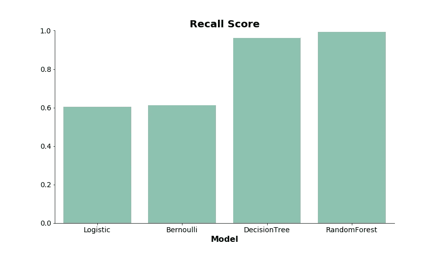

# 预测假期期间国内航班延误

> 原文：<https://medium.com/analytics-vidhya/predicting-domestic-flight-delays-during-the-holiday-season-82ec4ff7dcd9?source=collection_archive---------9----------------------->

近年来，空中旅行已经成为一种普通的交通方式，而不是奢侈品。航空乘客的增加通常会导致航空公司之间的竞争加剧——打折航班、更好的航线、增值服务。此外，铁路公司正在努力改善州际列车，增加了对消费者的竞争。

许多消费者在决定乘坐哪家航空公司的航班时考虑的一个服务因素是航班延误。虽然由于自然因素和机场安全造成的延误无法预防，但航空公司可以改善由于技术问题造成的延误。在过去的一年里，几乎有 1/3 的航班延误！

在这个项目中，我们的目标是预测 12 月份的航班延误，当时许多消费者正在跨州旅行，在圣诞节假期拜访家人。

## **建立机器学习模型**

从[美国运输统计局](https://www.transtats.bts.gov/DL_SelectFields.asp?Table_ID=236)获得前一年的数据来训练模型。为了选择最合适的模型，进行了初始测试并比较了一些参数。使用的模型是逻辑回归，朴素贝叶斯伯努利，决策树和随机森林。KNN 和 SVC 被省略了，因为我的系统不支持它。

首先，我们看 ROC-AUC 曲线，它给出了虚警率(预测延迟但没有延迟)对命中率(预测延迟和发生延迟)的概念。它描述了当实际结果是肯定的时，模型在预测肯定类别方面有多好。模型之间的差异不超过 10%。

初始 ROC-AUC 曲线

评估的第二个参数是回忆分数。它也被称为敏感度，概括了现实中准确预测的航班延误比例。

尽管决策树和随机森林模型具有明显更高的分数，但仔细观察发现，这些模型过度拟合，训练和测试分数之间的差异约为 35%。

**改进模型**

1.  一项快速评估显示，航班延误数是未延误数的一半。欠采样是为了平衡数据集。

0 表示没有延误，1 表示航班延误

2.对影响模型的因素进行了评估。进行特征工程以消除权重为零的因素，并使用 Scikit-learn 的 RandomSearchCV 对模型进行微调以改善预测。

20 大特性

**改进型**

曲线下面积(AUC)分数决定了预测航班延误与假警报模型的准确性，在微调后保持在约 65%。回忆分数表示被准确预测的航班延误的比例。较高的分数表明较少的航班被预测为准时，但发生了延迟，这对于逻辑和朴素贝叶斯伯努利模型有显著改善。

**结论和见解**

逻辑回归可能是预测航班延误的最佳模型。尽管有很高的分数，决策树和随机森林模型都过度拟合，在训练和测试数据集之间有很大的分数差异。

在本周早些时候(周一至周三)出行的乘客比其他日子更容易经历航班延误。此外，从 JFK 和旧金山等繁忙机场出发的乘客，他们的航班延误的几率更高。

> 这个项目的更多细节和代码可以在我的 G [ithub](https://github.com/kelseyheng/predict_flight_delays) 上找到。如果你愿意联系，可以通过 [LinkedIn](https://www.linkedin.com/in/kelseyhenghy/) 联系我。