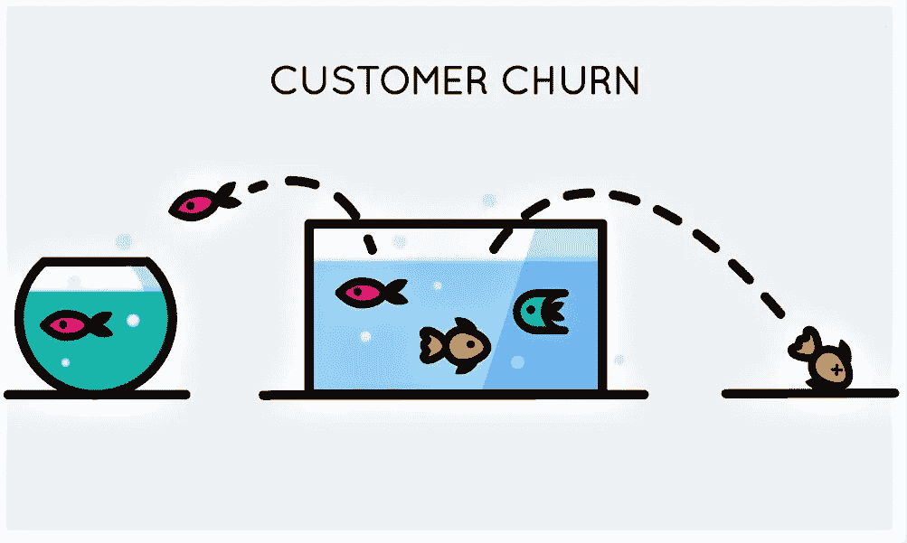
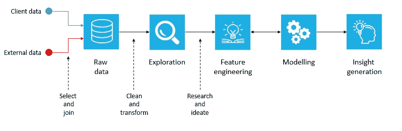

# 预测慈善组织的捐赠可能性

> 原文：<https://medium.com/analytics-vidhya/predicting-donation-likelihood-for-a-charity-organisation-708018c0806d?source=collection_archive---------9----------------------->

(这不是一个关于执行二元分类的教程，相反，这是一个项目故事，讲述了作为我毕业后课程的一部分的预测练习中所面临的挑战和学到的东西。)

尽管在处理数据和构建预测模型方面有相当多的经验，但我从未着手解决的一个问题是预测客户流失或购买可能性。意识到几乎每个 B2C 公司，尤其是那些非常重视营销的公司，都会在某个时间点处理这样的问题，我很快就报名参加了一个项目，在慈善和非营利部门执行这些任务。

当我们正式开始这个项目时，我们确保首先理解客户为什么想要执行这些任务。在我们的第一次会面中，我们了解到该组织在过去的一年中举办了几次筹款活动，并且在最近几年中活跃客户的数量有所下降。作为一个主要由社区资助的慈善组织，更明智地利用营销资源对他们来说很重要，预测客户流失和捐赠的可能性不仅有助于这一点，而且最终还有助于估计[客户的终身价值](https://en.wikipedia.org/wiki/Customer_lifetime_value)。我们还被告知，我们收到的数据将是混乱的，而且没有关于数据和数据问题的适当文件。虽然这最初听起来像是一个问题，但实际上彻底探索数据并自己构建这些数据文档是一种有益的体验(尽管这确实花费了我们两周的项目时间)。在这个项目的过程中，我明白了这些数据文档的价值。

一旦我们有了数据文档和对数据的基本理解，我们就可以专注于手头的目标——建立一个预测模型。一开始，建立一个模型来预测客户流失或支付可能性似乎很简单。毕竟只是二元分类吧？不完全是。在这个项目的过程中，我意识到当我们在*真实世界*中应用这些技能时，我们在教室环境中学到的东西是不够的。几乎每个在互联网上遇到的二进制分类练习都将目标/因变量巧妙地定义为 0 和 1。但是如果您必须自己创建标签呢？换句话说，你如何定义客户流失，或者支付的可能性？你想出的任何和所有规则看起来都会，而且永远有争论的余地！这里学到的一个重要经验是，业务背景和领域知识对于数据科学家来说极其重要。

针对捐赠者流失和捐赠可能性进行的项目流程

随着因变量或目标变量的确定，我们进行了文献综述，以了解到底是什么驱动了慈善行为和流失。虽然一些研究发现人口统计学起着重要的作用，但其他一些研究表明它们不起作用。如前所述，我们拥有的人口统计数据相当混乱，我们没有花时间清理这些属性，因为文献综述对人口统计的重要性没有达成共识。相反，我们在特征工程上花了很多时间，因为几项研究表明，捐赠历史和模式最能揭示人们的捐赠倾向。这里的一个关键的学习是进行文献综述的重要性，尤其是在我们的理解是暗淡的情况下。不要尝试不同的事情，阅读关于类似问题的研究和工作将为我们提供前进的方向，从而节省大量时间。

随着分析数据集的创建，我们开始进行预测建模。我决定研究捐赠可能性模型，我的队友开始研究流失预测。为了了解我们创建的特征是否具有统计显著性，我们最初进行了逻辑回归，并查看了准确性度量，如 ROC 曲线下面积，并构建了混淆矩阵。注意到精确度指标非常高，我们意识到数据中存在严重的阶级不平衡，只看精确度是不正确的。在这种情况下，假设客户希望确定可能流失的捐赠者或可能付款的捐赠者，我们关注精确度和召回率，这是显示我们的正面类别预测有多好的指标。作为这个过程的一部分，我们认识到在处理二元分类时检查类别不平衡的重要性。

在通过 SMOTE 解决了类别不平衡之后，我们通过创建新的特征并排除统计上不重要的特征来执行更多的模型迭代。虽然我们确实得到了大得离谱的 AUC 值(在一个例子中为 0.999998)，但我们知道这可能是由于 SMOTE 引入的合成拷贝在本质上彼此太相似，并且还因为一些特征。最终，我们得到的模型给出了合理的结果，准确率和召回率都在 75%左右。

在项目后期的一次客户会议上，我们被告知，他们对我们设计的变量以及创建这些变量背后的逻辑更感兴趣，而不是拥有超级精确的模型。因此，在建立了逻辑回归模型之后，我们接着通过建立具有相同特征的随机森林模型来获得可变重要性和部分依赖性图。这使我们能够向客户解释，对于一些常规活动，寿命和频繁活动的指标是关键的预测因素，而对于某些其他活动，支付偏好更重要。相当有趣的是，当我们在模型中包含一些人口统计属性时，发现它们要么在统计上不重要，要么与基于捐赠历史的其他指标相比不重要。

总之，我想说，这个项目帮助我对如何作为一名数据科学家进行操作有了一些认识和了解，而不仅仅是在技术方面。虽然有些事情我不能尝试有点令人失望，但我很高兴我们做的工作对客户有用。

这个项目中使用的代码可以在这里找到:[https://github.com/AdithyaKrishna7/iLab1](https://github.com/AdithyaKrishna7/iLab1)