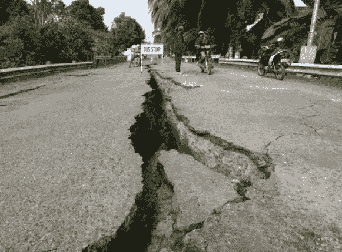
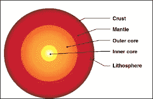
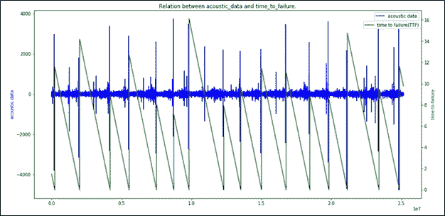
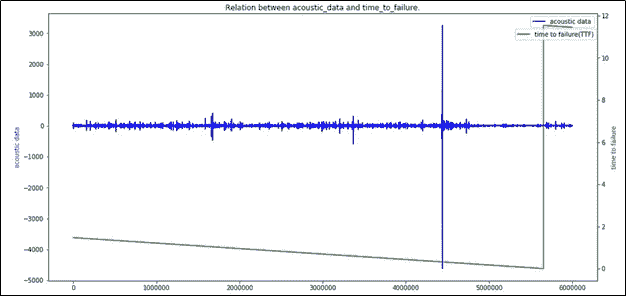
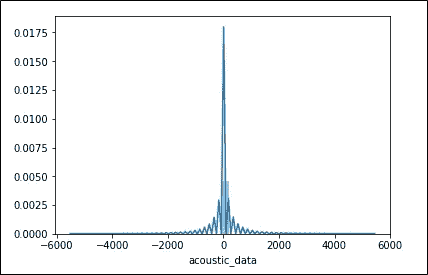
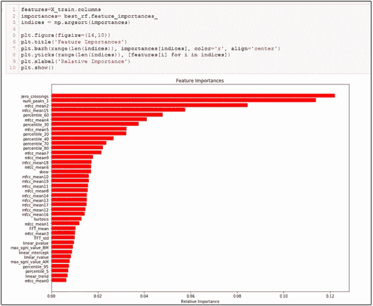
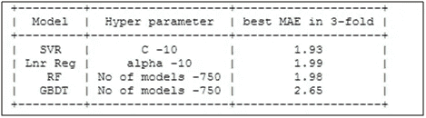

# 用机器学习预测地震

> 原文：<https://medium.com/analytics-vidhya/predicting-earth-quake-with-machine-learning-8946a19a500e?source=collection_archive---------27----------------------->

在所有的自然灾害中，地震是发生频率最高的，造成的生命损失和财产损失高达十亿美元。从一项关于地震死亡人数的调查中，我们可以看到几年来死亡人数以十万计，这强调了受灾地区面临的破坏。

所以，如果我们能找到一种提前预测地震的方法，那么我们就有机会拯救很多生命和基础设施。在考虑如何预测地震之前，让我们先了解什么是地震以及它是如何发生的。

**什么是地震？**

地球(地壳)的顶层被称为岩石圈，它不是像蛋壳一样包裹整个地球的连续块。它实际上是由被称为 [**构造板块**](https://spaceplace.nasa.gov/tectonics-snap) 的巨大拼图块组成的。

这些[构造板块](http://earthquake.usgs.gov/learn/glossary/?term=tectonic%20plates)移动缓慢，但它们会因摩擦而卡在边缘。当边缘的[应力](http://earthquake.usgs.gov/learn/glossary/?term=stress)克服摩擦力时，就会发生地震，以波的形式释放能量，穿过地壳，导致我们感觉到的震动。

因此**地震**是地球表面的强烈震动。震动是由地球最外层的运动引起的。

地球层

过去几十年来，人们一直在进行大量的研究，试图找到一种提前几个小时/几天预测地震的方法。但这似乎是一个比预期更复杂的问题。所以，让我们看看我们是否能提前几秒/几分钟发现地震，这样现代电力系统就能有自动防故障装置来减轻地震造成的损失。

卡格尔举办了一场比赛([https://www.kaggle.com/c/LANL-Earthquake-Prediction](https://www.kaggle.com/c/LANL-Earthquake-Prediction))。)之类的，在这篇博客中，让我们来看看解决这个问题的机器学习生命周期中涉及的所有步骤。

**关于比赛**

这项挑战是由洛斯阿拉莫斯国家实验室主办的，在这项比赛中，你将回答地震何时会发生。具体来说，您将根据实时地震数据预测实验室地震发生前的剩余时间。

# **数据概述**

这些数据来自一个著名的用于研究地震物理的实验装置。我们给出了训练和测试数据集。在训练数据中，数据是从包含多个地震的单个连续实验中收集的，并且测试数据由包含许多小段的文件夹组成。内的数据*每个测试文件都是连续的，但测试文件并不代表一个连续的实验片段；因此，不能假设预测遵循在训练文件中看到的相同规则模式。*

训练数据集包含 6 亿个数据点，具有两列 acoustic_data 和 time_to_failure。声学数据是地震信号和从实时地震数据到实验室地震发生的剩余时间(失效时间，或 TTF)

到目前为止，我们知道我们的业务问题是什么，也有通过实验室实验收集的数据。现在，我们将它作为一个 ML 问题，并定义性能指标。

# **性能指标**

我们的目标是在实时地震发生之前找到 TTF 值(这是一个连续值)。因此，我们可以把它称为“回归”问题。主要限制是在运行时具有低延迟。使用的性能指标是平均绝对误差(MAE ),它测量两个连续变量之间的差异(在我们的例子中是预测值和观测值之间的差异)。

# **探索性数据分析**

在开始数据预处理/清理之前，让我们先看看给定数据的各个方面。由于给定的训练数据集有 6 亿条记录，即使在配置不错的系统上，如 12GB RAM 和 i5 处理器，也不容易加载和可视化完整的数据

处理这种情况的一种方法是只从数据集加载 10%的数据并执行 EDA，在我的情况下，我一直想尝试 GCP(谷歌云平台)，所以我创建了一个帐户并创建了一个 64GB RAM 的实例，这对于处理如此庞大的数据来说绰绰有余。

从下面的声音信号和 TTF(训练数据)之间的图中，我们可以看到，在训练数据集中总共产生了 16 次人工地震。

在上面的图中，我们可以看到，就在 TTF(即地震发生)之前，声学信号值有一个突然的尖峰。让我们看看声波信号在总体数据上的分布。

分布以零为中心，因为除了地震发生的大部分时间，地震在零附近。

# **特征工程**

作为数据验证的一个步骤，我检查了数据中是否有任何空条目或异常值，但是没有找到。因此，走向特征工程。给定数据的主要问题是我们有一个单一的特征，即我们有一个声音信号作为时间序列的输入。到目前为止，我主要处理文本数据，我总是试图减少特征的数量以提高整体性能，而这次相反，我们必须在给定单个特征的情况下生成多个特征。

下面是从大约 40 个特征的给定输入中产生的一些重要特征。

**梅尔频率倒谱系数(MFCC):** 这是一组 20 个特征，简明地描述了频谱包络的整体形状。

**百分位数:**百分位数是一种表示 a 值在数据集中位置的方式。

**过零点:**这代表地震波过零点的次数。

**峰的数量:**顾名思义，这个特性简单地统计一个窗口中的峰的数量。

**Mean，std:** Mean 是给定段中地震信号的平均值，标准偏差用于测量平均值的数据分布。

**偏斜度，峰度:**偏斜度用于测量声学信号中的不对称性，峰度测量分布的尾部沉重度。

**快速傅立叶变换:**傅立叶变换是一种将类似地震信号的信号分解成多个频率乘积的方法。

**斜率和截距:**它取直线的斜率和截距项，我们试图用它们来拟合线段

# **功能选择**

鉴于实时数据和准确性，低延迟在这种情况下同样重要。因此，最好使用像 VIF(方差膨胀因子)这样的技术或使用模型特征重要性属性来移除不太重要的特征。

在这里，我使用了随机森林的特征重要性属性，并考虑了进一步建模的前 12 个特征。

# **造型**

一般来说，选择符合业务约束的正确模型同样重要。在我们的例子中，我们已经对数据进行了分段，并从 1，50，000 条记录的集合中生成了单个观察值，我们总共有大约 5000 条记录作为训练数据集，大约 2600 条记录作为测试数据集。

由于最终的训练数据集不是太大，我们可以从简单的模型开始，如 SVR 和线性回归，以避免过度拟合问题。

**SVR**

此外，尝试了一些复杂的模型，如随机森林，GBDT 等。，因为数据不太短。

**RF**
这是系综模型(Bagging)的一种形式，它在建模中自举聚合

**GBDT**

# **结论**

通过使用超参数调整，从所有上述模型中，发现随机森林正在产生更好的结果。

平均绝对误差分数

# **未来工作**

为了进一步提高模型的性能，我们可以尝试使用复杂的模型，如神经网络，即 LSTM 等，我们还可以包括从 tsfresh 库中自动提取相关特征

# **参考文献**

 [## 什么是地震，是什么导致了地震的发生？

### 地震是由断层的突然滑动引起的。构造板块总是在缓慢移动，但它们会被卡住…

www.usgs.gov](https://www.usgs.gov/faqs/what-earthquake-and-what-causes-them-happen?qt-news_science_products=0#qt-news_science_products)  [## 应用课程

### 应用机器学习课程 GATE CS 混合课程面试准备课程 AI Workshop AI 案例研究

www.appliedaicourse.com](https://www.appliedaicourse.com/lecture/11/applied-machine-learning-online-course/3082/bootstrapped-aggregation-bagging-intuition/4/module-4-machine-learning-ii-supervised-learning-models)  [## LANL 地震预测

### 你能预测即将到来的实验室地震吗？

www.kaggle.com](https://www.kaggle.com/c/LANL-Earthquake-Prediction/data)  [## MFCC 虚拟指南

### 免责声明 1:这篇文章只是一个 MFCC 功能的介绍，是为那些需要一个简单和…

medium.com](/prathena/the-dummys-guide-to-mfcc-aceab2450fd) 

[https://ts fresh . readthe docs . io/en/latest/text/list _ of _ features . htm](https://tsfresh.readthedocs.io/en/latest/text/list_of_features.html)

https://spaceplace.nasa.gov/earthquakes/恩