# 预测电力

> 原文：<https://medium.com/analytics-vidhya/predicting-electricity-3700b8c4458?source=collection_archive---------10----------------------->

*沙特中央作业区用电负荷*


# 项目定义

## 项目概述

我的任务是建立机器学习模型，可以预测和预测中央运营区(COA)的电力消耗。

我得到了一个数据集的样本，如下

**项目数据**

*   沙特中央作业区的每小时电力需求。
*   涵盖 2012 年至 2017 年。
*   共找到 52，607 项记录。

你可以在我的 [GitHub](https://github.com/IbrahimYahyaHakami/Data-Science-Udacity-capstone) 中找到数据集。

**利益相关方**

我试图准确预测电力需求，并希望将我的发现呈现给感兴趣的利益相关者，这些利益相关者要么推动政策，要么与沙特阿拉伯的电力部门相关。

**接近**

由于计算领域的最新进展，特别是机器学习和数据科学，我们现在可以接近准确地预测长期、中期和短期的用电量。

## **问题陈述**

*   用电消耗一个国家的资源，特别是沙特阿拉伯。
*   因此，对其进行长期、中期和短期预测，对于更好地估计将使用多少资源以及推动电网扩展政策至关重要。

## 韵律学

我将使用均方根误差作为主要得分指标，这是预测的常用指标，我还将使用 r2 得分，因为它更容易理解。

# 分析

## 数据探索和可视化

首先让我们快速看一下数据帧的头部

```
*# load and shoe 1st 5 rows of data*
df = pd.read_csv('../dataset/full_COA_v3.csv')
df.head()
```

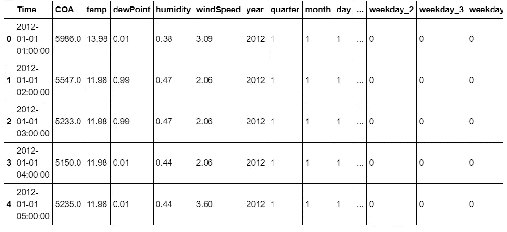

让我们做一些可视化，这将导致对数据的理解。

请注意，为了更好地可视化，我将在前置后使用数据框，前置将在后面讨论。

前置后的数据集将包含以下内容

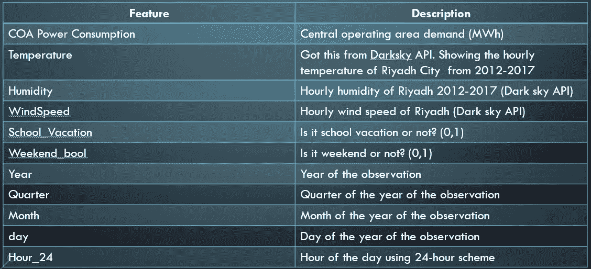

**箱线图**

```
*# Showing boxplots*
plt.figure(figsize=(14,5))
plt.subplot(1,2,1)
plt.subplots_adjust(wspace=0.2)
sns.boxplot(x="year", y="COA", data=df)
plt.xlabel('year')
plt.ylabel('Power Demand (MWh)')
plt.title('Box plot of Yearly COA Power Demand MWh')
sns.despine(left=**True**)
plt.tight_layout()
plt.subplot(1,2,2)
sns.boxplot(x="quarter", y="COA", data=df)
plt.xlabel('quarter')
plt.ylabel('Power Demand (MWh)')
plt.title('Box plot of Quarterly COA Power Demand MWh')
sns.despine(left=**True**)
plt.tight_layout();
```

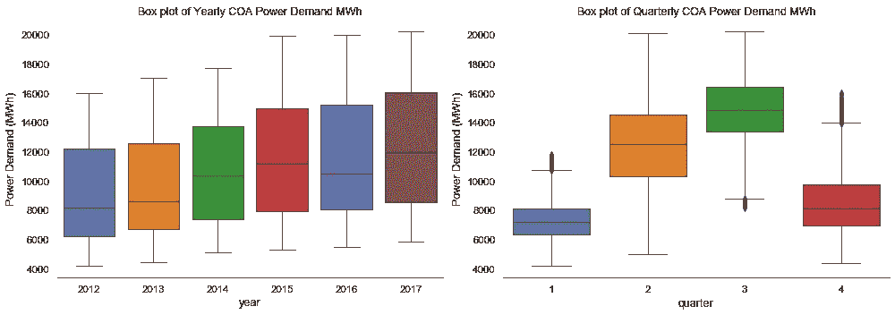

注意:多年来电力需求的增长趋势，也是逐季度显示第 3 季度的需求最大，与其他国家不同，沙特阿拉伯国家的需求高峰在夏季。

**不同时间段的电力需求**

```
plt.figure(figsize=(14,8))
plt.subplot(2,2,1)
df.groupby('year').COA.agg('mean').plot()
plt.xlabel('')
plt.title('Mean COA Power Demand by Year (MWh)')
plt.ylabel('Power Demand (MWh)')

plt.subplot(2,2,2)
df.groupby('quarter').COA.agg('mean').plot()
plt.xlabel('')
plt.title('Mean COA Power Demand by Quarter (MWh)')

plt.subplot(2,2,3)
df.groupby('month').COA.agg('mean').plot()
plt.xlabel('')
plt.title('Mean COA Power Demand by Month (MWh)')
plt.ylabel('Power Demand (MWh)')

plt.subplot(2,2,4)
df.groupby('day').COA.agg('mean').plot()
plt.xlabel('')
plt.title('Mean COA Power Demand by Day (MWh)');
```

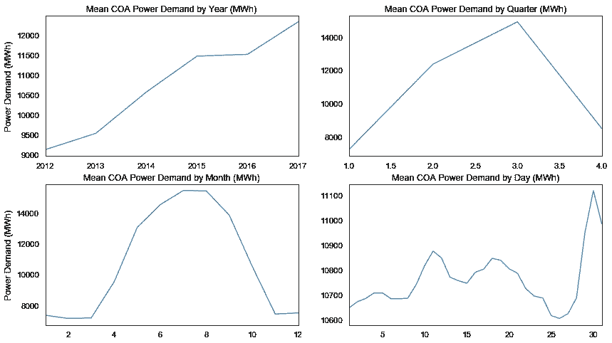

注意:顶部的两个图显示了与箱形图相似的洞察力，而按月分组显示了一年的趋势，最后按日分组显示了一个月的趋势。

**季节性检查**

现在，我想展示一下数据集中的季节性，我们将看到电力消耗是如何趋向于流行和季节性的。

季节性对于以后选择模型的参数非常重要。

**年度季节性**

```
*# Showing Yearly seasonality*
*# Yearly seasonality is clear in the plot*
df['2012-01-01':'2015-01-01'].COA.plot(figsize=(15,5))
plt.axvline('2013-01-01' , c='r')
plt.axvline('2014-01-01',c='r')
```

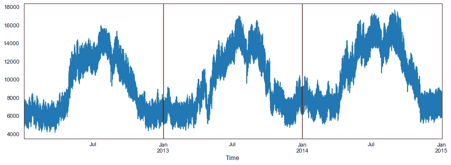

功率需求(MWh)与时间的关系

注意:每年的趋势几乎相同

**弱季节性**

```
*# Showing weekly seasonality*
*# Weekly seasonality is clear in the plot*
df['2012-02-01':'2012-4-01'].COA.plot(figsize=(15,5))
plt.axvline('2012-03-02' , c='r')
plt.axvline('2012-03-09',c='r')
```

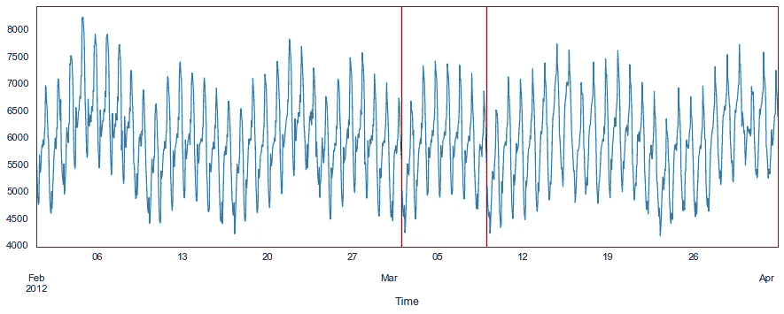

功率需求(MWh)与时间的关系

注意:工作日比周末有更多的需求，这可能是一些工厂放假的结果。

**每日季节性**

```
*# Showing daily seasonality* 
*# Daily seasonality is clear in the plot*
df['2012-01-01 01:00:00':'2012-01-03 01:00:00'].COA.plot(figsize=(15,5))
plt.axvline('2012-01-02 00:00:00' , c='r')
plt.axvline('2012-01-03 00:00:00' , c='r')
```

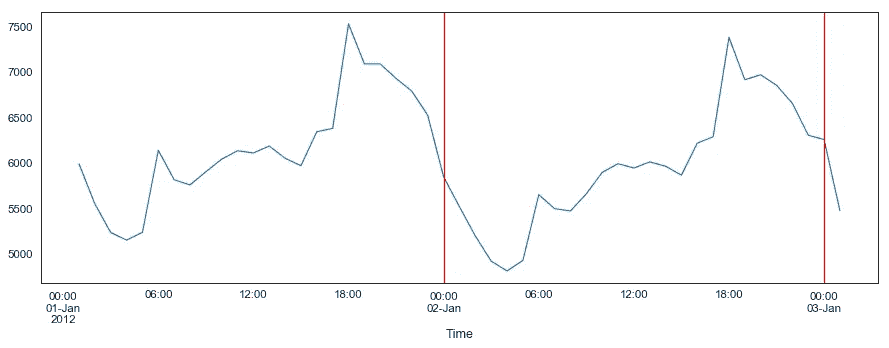

注意:明显的季节性和高峰在下午 6 点，这是在人们下班回家之后。

# 方法学

## 数据预处理

由于我的电气工程背景，我能够想出一些我认为与电力消耗高度相关的特征，并开始寻找获得这些特征的方法。

首先，这是我拥有的数据集的标题

```
df = pd.read_csv('dataset/demand_dataframe.csv')[['Time' ,'COA']]
df.head()
```

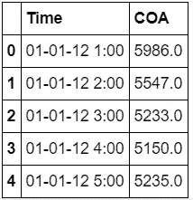

因此，重要的是要确保日期格式正确，以便 pandas 将日期更改为日期时间对象。

```
df.index = pd.to_datetime(df.index, format="**%d**-%m-%y %H:%M" , dayfirst=**True**)
df.tail()
```

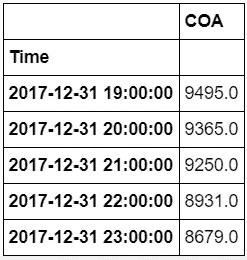

下一步有点挑战性，所以我知道温度是非常重要的特性，所以我需要与电力消耗数据集相同时间段的天气数据。

我使用 [Darksky](https://darksky.net/dev) API 从位于机场的利雅得城市传感器提取天气数据，我能够提取每小时的天气数据

```
df_temp = pd.read_csv('../dataset/df_weather2012-2018.csv')[['time' , 'temperature','dewPoint','humidity','windSpeed']]
df_temp.head()
```

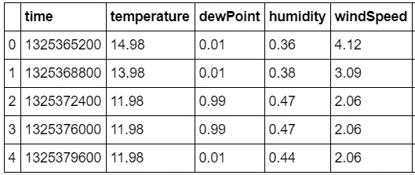

下一步是用下面的代码将时间戳转换成日期

```
df_temp['Time']=df_temp.time.map(**lambda** x: time.strftime("%Y-%m-**%d** %H:%M:%S", time.localtime(x)))
df_temp.head()
```

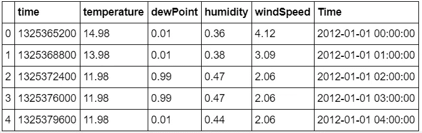

，但是数据框中缺少一些小时，并且没有标记为空，所以我无法将其与主数据框合并，因为它具有不同的形状。

因此，我提出的解决方案如下，我制作了一个测试数据框，它包含与主数据框相同的日期范围。

```
df_test = pd.DataFrame(pd.date_range('2012-01-01 01:00:00' , '2017-12-31 23:00:00' , freq='1H') , columns=['Time'])
df_test.head()
```

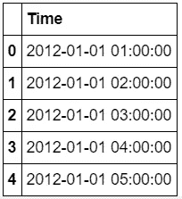

然后将其与天气数据框合并，以获得预期的缺失日期的空值。

```
df_t = df_temp['2012-01-01 01:00:00':'2017-12-31 23:00:00'].merge(df_test , how = 'outer' ,on = 'Time' ).sort_values('Time')
df_t.isnull().sum()
```

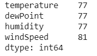

还要确保两个数据帧具有相同的长度。

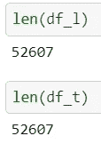

至于空值，经过一些探索后，我注意到所有的空值恰好连续 3 到 5 个小时，这对于传感器停机一段时间然后得到修复是有意义的，所以我用向前填充来填充缺失的值，因为 3 个小时内是否会保持不变。

```
df_t.fillna(method='ffill' , inplace=**True**)
```

最后，我可以将它们合并在一起

```
df_l['temp'] = df_t.temperature.values
df_l['dewPoint'] = df_t.dewPoint.values
df_l['humidity'] = df_t.humidity.values
df_l['windSpeed'] = df_t.windSpeed.values
```

您可能认为我在这里停下来是为了这些特性，但是我仍然添加了更多的特性。

一些数据工程的时间，从日期时间对象添加其他列。

```
df_l['year'] = df_l['Time'].apply(**lambda** x: x.year)
df_l['quarter'] = df_l['Time'].apply(**lambda** x: x.quarter)
df_l['month'] = df_l['Time'].apply(**lambda** x: x.month)
df_l['day'] = df_l['Time'].apply(**lambda** x: x.day)
df_l.sort_values('Time', inplace=**True**, ascending=**True**)
df_l["weekday"]=df_l.apply(**lambda** row: row["Time"].weekday(),axis=1)
df_l["weekday"] = df_l["weekday"].astype(str)
df_l['weekday_name']=df_l.index.strftime("%A")
df_l['hour_24']=df_l.index.strftime("%H") df_l['weekday_no']=df_l.index.map(**lambda** x:x.weekday())
```

周末和工作日这一列有些棘手，因为在沙特阿拉伯，我们在 2013 年更改了周末，所以我必须查找日期并相应地标记它们。

```
*# Define an empty column in the df_l dataframe*
df_l['weekend_bool'] = pd.Series()
  *
# Setting up the weekend boolean for the Thursday & Friday weekend (Before 29-6-2013)* df_l['weekend_bool'][df_l.Time <='2013-06-29']=df_l.weekday_no.apply(**lambda** x: int(1) **if** x==3 **or** x==4 **else** int(0))  *# Setting up the weekend boolean for the Friday & Saterday weekend (After 29-6-2013)* df_l['weekend_bool'][df_l.Time >='2013-06-29']=df_l.weekday_no.apply(**lambda** x: int(1) **if** x==4 **or** x==5 **else** int(0))
```

最后一栏是学校假期，我查找了所有有学校假期的日期，并相应地标注出来。

```
*# Below are the school vacations during the years 2012-2017 to be added to the school vacation feature*

df_l['school_vacation'][(df_l.Time >='2012-01-19')&(df_l.Time <'2012-01-28')]=df_l.school_vacation.apply(**lambda** x: 1)
df_l['school_vacation'][(df_l.Time >='2012-03-22')&(df_l.Time <'2012-03-31')]=df_l.school_vacation.apply(**lambda** x: 1)
df_l['school_vacation'][(df_l.Time >='2012-06-07')&(df_l.Time <'2012-09-01')]=df_l.school_vacation.apply(**lambda** x: 1)
df_l['school_vacation'][(df_l.Time >='2012-09-23')&(df_l.Time <'2012-09-24')]=df_l.school_vacation.apply(**lambda** x: 1)
df_l['school_vacation'][(df_l.Time >='2012-10-18')&(df_l.Time <'2012-11-02')]=df_l.school_vacation.apply(**lambda** x: 1)
df_l['school_vacation'][(df_l.Time >='2013-01-17')&(df_l.Time <'2013-01-26')]=df_l.school_vacation.apply(**lambda** x: 1)
df_l['school_vacation'][(df_l.Time >='2013-03-21')&(df_l.Time <'2013-03-30')]=df_l.school_vacation.apply(**lambda** x: 1)
df_l['school_vacation'][(df_l.Time >='2013-06-06')&(df_l.Time <'2013-09-01')]=df_l.school_vacation.apply(**lambda** x: 1)
df_l['school_vacation'][(df_l.Time >='2013-09-23')&(df_l.Time <'2013-09-24')]=df_l.school_vacation.apply(**lambda** x: 1)
df_l['school_vacation'][(df_l.Time >='2013-10-10')&(df_l.Time <'2013-10-21')]=df_l.school_vacation.apply(**lambda** x: 1)
df_l['school_vacation'][(df_l.Time >='2014-01-17')&(df_l.Time <'2014-01-26')]=df_l.school_vacation.apply(**lambda** x: 1)
df_l['school_vacation'][(df_l.Time >='2014-03-21')&(df_l.Time <'2014-03-30')]=df_l.school_vacation.apply(**lambda** x: 1)
df_l['school_vacation'][(df_l.Time >='2014-06-06')&(df_l.Time <'2014-08-31')]=df_l.school_vacation.apply(**lambda** x: 1)
df_l['school_vacation'][(df_l.Time >='2014-09-23')&(df_l.Time <'2014-09-24')]=df_l.school_vacation.apply(**lambda** x: 1)
df_l['school_vacation'][(df_l.Time >='2014-09-30')&(df_l.Time <'2014-10-12')]=df_l.school_vacation.apply(**lambda** x: 1)
df_l['school_vacation'][(df_l.Time >='2015-01-16')&(df_l.Time <'2015-01-25')]=df_l.school_vacation.apply(**lambda** x: 1)
df_l['school_vacation'][(df_l.Time >='2015-03-20')&(df_l.Time <'2015-03-29')]=df_l.school_vacation.apply(**lambda** x: 1)
df_l['school_vacation'][(df_l.Time >='2015-06-05')&(df_l.Time <'2015-08-23')]=df_l.school_vacation.apply(**lambda** x: 1)
df_l['school_vacation'][(df_l.Time >='2015-09-18')&(df_l.Time <'2015-10-04')]=df_l.school_vacation.apply(**lambda** x: 1)
df_l['school_vacation'][(df_l.Time >='2016-01-08')&(df_l.Time <'2016-01-17')]=df_l.school_vacation.apply(**lambda** x: 1)
df_l['school_vacation'][(df_l.Time >='2016-03-11')&(df_l.Time <'2016-03-20')]=df_l.school_vacation.apply(**lambda** x: 1)
df_l['school_vacation'][(df_l.Time >='2016-05-26')&(df_l.Time <'2016-09-18')]=df_l.school_vacation.apply(**lambda** x: 1)
df_l['school_vacation'][(df_l.Time >='2016-09-22')&(df_l.Time <'2016-09-23')]=df_l.school_vacation.apply(**lambda** x: 1)
df_l['school_vacation'][(df_l.Time >='2016-11-09')&(df_l.Time <'2016-11-20')]=df_l.school_vacation.apply(**lambda** x: 1)
df_l['school_vacation'][(df_l.Time >='2017-01-27')&(df_l.Time <'2017-02-05')]=df_l.school_vacation.apply(**lambda** x: 1)
df_l['school_vacation'][(df_l.Time >='2017-03-29')&(df_l.Time <'2017-04-09')]=df_l.school_vacation.apply(**lambda** x: 1)
df_l['school_vacation'][(df_l.Time >='2017-06-16')&(df_l.Time <'2017-09-17')]=df_l.school_vacation.apply(**lambda** x: 1)
df_l['school_vacation'][(df_l.Time >='2017-09-24')&(df_l.Time <'2017-09-25')]=df_l.school_vacation.apply(**lambda** x: 1)*# filling empty school vacation days with 0*
df_l.school_vacation.fillna(0,inplace=**True**)
```

我终于停止了自我，去实现，

## 履行


来源:[https://ethicaljournalism network . org/人工智能-人权-民主-法律](https://ethicaljournalismnetwork.org/artificial-intelligence-human-rights-democracy-law)

在这一节中，我将介绍我在做预测时的思维过程，选择我做预测的方式，并展示结果。

我选择了 2012 年到 2016 年底这几年作为训练数据，并尝试对 2017 年进行预测。

在选择预测方法之前，我选择查看所有特征与电力消耗的相关性

```
*#COA correlation matrix*
corrmat = abs(df_l.drop(columns=['Time']).iloc[:df_l.drop(columns=['Time']).shape[0],:].corr())
plt.figure(figsize=(17, 8))
k = 10 *#number of variables for heatmap*
cols = corrmat.nlargest(k, 'COA')['COA'].index
cm = np.corrcoef(df_l.drop(columns=['Time']).iloc[:df_l.drop(columns=['Time']).shape[0],:][cols].values.T)
sns.set(font_scale=1.50)
hm = sns.heatmap(cm, cbar=**True**, annot=**True**, square=**True**,
                 fmt='.2f', annot_kws={'size': 10}, yticklabels=cols.values, xticklabels=cols.values,
                 cmap = 'RdBu', linecolor = 'white', linewidth = 1)
plt.title("Correlations between COA and k features", fontsize =15)
plt.show()
```

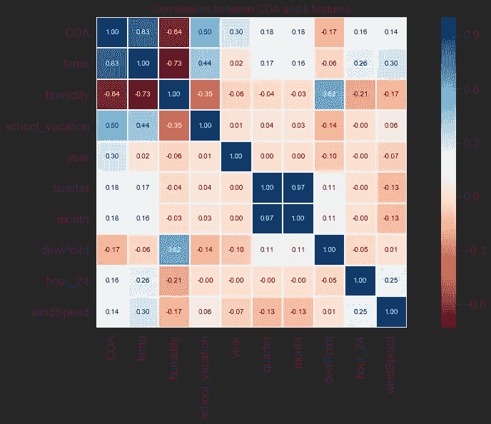

注意:与温度和湿度高度相关。与学校假期显著相关。

由于具有高度相关的特征，我选择做回归和时间序列模型。

**预测方法学**

我尝试了不同时间段的不同模型，并假设沙特电力公司(SEC)会对短期和长期预测感兴趣，因此我将数据分组以进行预测，如下所示:

*   明年的每小时预测
*   每日预测
*   月度预测
*   第二天每小时预测

**使用的型号**

我使用的模型是:

*   带有外生回归量的季节性自回归综合移动平均数
*   RNN·LSTM 细胞(长短期记忆)
*   先知
*   XGBoost(极限梯度提升)
*   lightGBM(一种高效的梯度推进决策树)

**整点数据预测**

在每小时数据中，我们将使用预处理后的数据框。

**LSTM**

首先我们要拆分数据来训练和测试，我们要得到数据帧的长度和一个要拆分的长度。

```
*# length of dataset*
l_df = len(df_l)*# length to split*
l_split = len(df_l['2017-01-01 00:00:00':])
```

创建训练和测试分割

```
*# train test split*
dataset = df_l.COA.values *#numpy.ndarray*
dataset = dataset.astype('float32') *# make sure values are float*
dataset = np.reshape(dataset, (-1, 1)) *# reshape to vertical*
scaler = MinMaxScaler(feature_range=(0, 1)) *# define minmax scaler*
train_size = l_df-l_split 
test_size = len(dataset) - train_size
train, test = scaler.fit_transform(dataset[0:train_size,:]), scaler.transform(dataset[train_size:len(dataset),:]) *# scale data*
```

这个函数是 LSTM 的基础，它将使回望决定用于预测目标的滞后数。

```
*# convert an array of values into a dataset matrix*
**def** create_dataset(dataset, look_back=1):
    X, Y = [], []
    **for** i **in** range(len(dataset)-look_back-1):
        a = dataset[i:(i+look_back), 0]
        X.append(a)
        Y.append(dataset[i + look_back, 0])
    **return** np.array(X), np.array(Y)
```

为训练和测试创建特征和目标。

```
*# reshape into X=t and Y=t+1*
look_back = 1
X_train, Y_train = create_dataset(train, look_back)
X_test, Y_test = create_dataset(test, look_back)
```

重塑要素，为 LSTM 做好准备

```
*# reshape input to be [samples, time steps, features]*
X_train = np.reshape(X_train, (X_train.shape[0], 1, X_train.shape[1]))
X_test = np.reshape(X_test, (X_test.shape[0], 1, X_test.shape[1]))
```

网络体系结构

```
*# network architecture*
model = Sequential()
model.add(LSTM(200, input_shape=(X_train.shape[1], X_train.shape[2])))
model.add(Dropout(0.2))
model.add(Dense(50, activation='relu'))
model.add(Dropout(0.2))
*# model.add(Dense(15, activation='relu'))*
*# model.add(Dropout(0.2))*
model.add(Dense(1))
opt = optimizers.Adam(lr=.001)
model.compile(loss='mean_squared_error', optimizer=opt)history = model.fit(X_train, Y_train, epochs=30, batch_size=24, validation_data=(X_test, Y_test), 
                    callbacks=[EarlyStopping(monitor='val_loss', patience=5)], verbose=1, shuffle=**False**)*# Training Phase*
model.summary()
```

使用训练好的模型进行预测，并将缩放后的数据反演回正常值。

```
*# make predictions*
train_predict = model.predict(X_train)
test_predict = model.predict(X_test)
*# invert predictions*
train_predict = scaler.inverse_transform(train_predict)
Y_train = scaler.inverse_transform([Y_train])
test_predict = scaler.inverse_transform(test_predict)
Y_test = scaler.inverse_transform([Y_test])
```

绘制列车和测试损失图

```
*# plotting train and test loss*
plt.figure(figsize=(8,4))
plt.plot(history.history['loss'], label='Train Loss')
plt.plot(history.history['val_loss'], label='Test Loss')
plt.title('model loss')
plt.ylabel('loss')
plt.xlabel('epochs')
plt.legend(loc='upper right')
plt.show();
```

为了绘制训练和测试，我们希望为两者制作数据框，以便于绘制。

```
*# make data frame for test* 
tes = pd.DataFrame(Y_test.reshape(Y_test.shape[1],Y_test.shape[0]) , columns=['test'] , index= df_l.iloc[train_size+look_back:-1].index)*# make data frame for prediction*
pre = pd.DataFrame(test_predict , columns=['pred'] , index= df_l.iloc[train_size+look_back:-1].index)
```

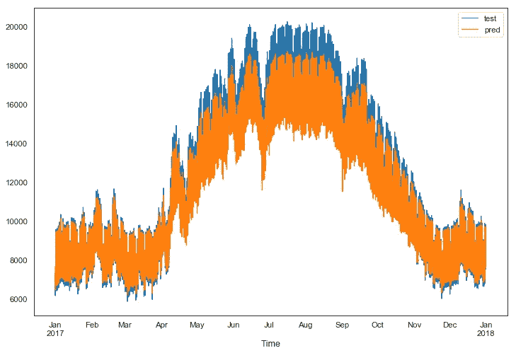

LSTM 每小时预测值与实际值(MWh)

注意:LSTM 在巨大数据集上的表现确实不错。

**先知**

Prophet 要求我们将日期重命名为“ds ”,将预测目标重命名为“y”。

```
*# reset index to prepare data frame for prophet*
df_l = df_l.reset_index()*# rename columns to prepare it for prophet*
df_l = df_l.rename(columns = {'Time':'ds',
                      'COA':'y'})
```

把我们的数据拆分出来进行训练和测试。

```
*# define a length to split, split last year*
l_split = len(df_l[df_l.ds >= '2017-01-01 00:00:00'])*# split by pre defined length*
train = df_l.iloc[:(len(df_l)-l_split)]
test = df_l.iloc[(len(df_l)-l_split):]
```

Prophet 允许我们添加来自同一数据框架的回归量，然后训练模型。

```
model = Prophet(seasonality_mode='multiplicative')
model.add_regressor('temp')
model.add_regressor('year')
model.add_regressor('quarter')
model.add_regressor('month')
model.add_regressor('day')
model.add_regressor('weekday_0')
model.add_regressor('weekday_1')
model.add_regressor('weekday_2')
model.add_regressor('weekday_3')
model.add_regressor('weekday_4')
model.add_regressor('weekday_5')
model.add_regressor('weekday_6')
model.fit(train)
```

制作一个包含我们预测的数据帧，然后使用该模型对该数据帧进行预测，或者您可以在删除目标后使用测试数据帧。

```
*# make data frame to hold the prediction*
future = model.make_future_dataframe(periods=24 , freq='H')*# make prediction on the data frame made* 
forecast = model.predict(test.drop(columns=['y']))
```

使用测试和预测数据帧来绘制它们之间的关系。

```
*# make a seperate data set for prediction only*
predictions = forecast[['ds','yhat']][forecast.ds >='2017']*# set time as index*
predictions = predictions.set_index('ds')
test = test.set_index('ds')*# plot test vs prediction*
test.y.plot(legend=**True**,figsize=(12,5))
predictions.yhat.plot(legend=**True**)
```

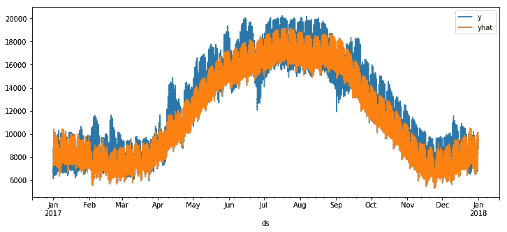

Prophet 每小时预测值与实际值(MWh)

注意:prophet 能够捕获每年的季节性，但不能捕获其他季节性。

**每日预测**

在每日预测中，我们希望使用 panda 的时间重采样方法将我们的数据分组为每日记录。

```
*# resample data to daily data*
df_d = df_l.resample(rule = 'D').mean()
```

**LSTM**

之前针对 LSTM 讨论的相同代码也将在这里用于每日数据集，并将为我们产生以下预测与实际。

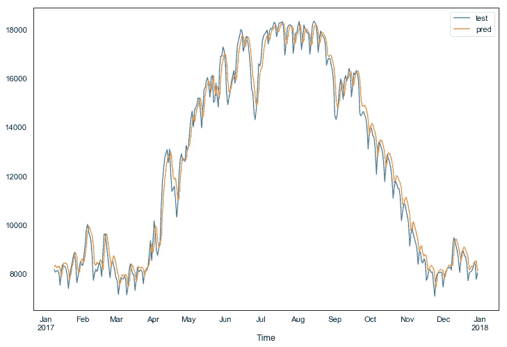

LSTM 每日预测与实际(MWh)

注意:其他来自 LSTM 的非常好的表现。

**先知**

之前针对 prophet 讨论的相同代码也将在这里用于每日数据集，并将为我们产生以下预测与实际。

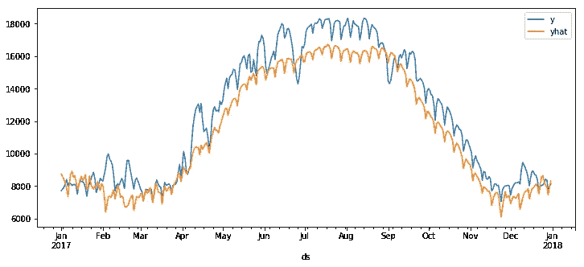

预言者每日预测与实际(MWh)

注意:再次捕捉每年的季节性，但不能捕捉其他。

**月度预测**

在月度预测中，我们希望使用 panda 的时间重采样方法将我们的数据分组为月度记录。

```
*# resample data to daily data*
df_m = df_l.resample(rule = 'MS').mean()
```

**LSTM**

之前针对 LSTM 讨论的相同代码也将用于月度数据集中，并将为我们提供以下预测与实际数据对比。

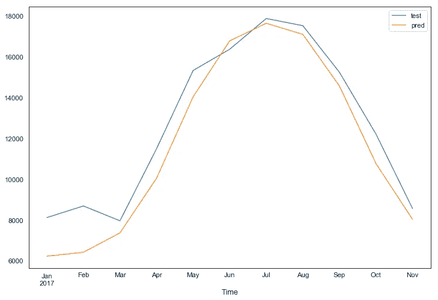

LSTM 月度预测与实际(MWh)

注意:我们可以看到 LSTM 开始比其他组表现差。

**先知**

之前讨论的 prophet 的相同代码也将在这里用于月度数据集，并将为我们产生以下预测与实际。

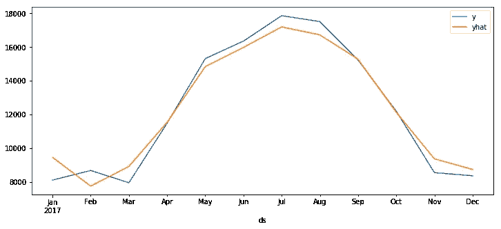

预言家每月预测与实际(MWh)

注意:prophet 出色地捕捉到了每月的季节性。

**萨里马克斯**

对于 SARIMAX，检查季节性以选择正确的参数非常重要。

```
*# plot whole data*
df_m.COA.plot(figsize=(15,5)).autoscale(axis='x',tight=**True**)
```

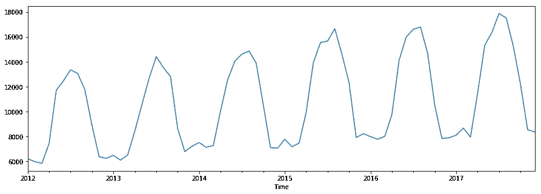

COA 与时间

在我们的月度数据中，我们可以清楚地看到每年的季节性，这为我们选择 SARIMAX 模型的参数提供了一个思路。

在这里，我将选择一个长度进行分割，然后分割数据进行训练和测试。

```
*# length to split*
l_split = len(df_m['2017-01-01 00:00:00':])*# split by pre defined length*
train = df_m.COA.iloc[:(len(df_m)-l_split)]
test = df_m.COA.iloc[(len(df_m)-l_split):]
```

我将计算 SARIMAX 模型预测的起点和终点，起点在训练数据之后，终点在测试之后。

```
*# define start and end of prediction*
start = len(train)
end = len(train) + len(test) - 1
```

auto arima 非常有助于为我们的 SARIMAX 模型找到最佳参数，它将对所有参数进行网格搜索，即 P、D、Q、P、D 和 Q，并返回产生最少 [Akaike 信息标准(AIC)](https://www.sciencedirect.com/topics/social-sciences/akaike-information-criterion) 的顺序。

请注意，我将选择 m = 12，这是因为月度数据之前显示的季节性是每年的，这在我们的月度数据中每 12 个数据点发生一次。

m 参数选择正确是最重要的。

```
 *stepwise_model = auto_arima(train,*
 *m=12,*
 *trace=True,*
 *error_action='ignore',* 
 *suppress_warnings=True,* 
 *stepwise=True)*
 *print(stepwise_model.aic())*
```

在网格搜索之后，我将使用自动 arima 选择的顺序，然后将其应用于训练数据。

```
model = SARIMAX(train,
                                order=(1, 0, 0),
                            seasonal_order=(0, 1, 0, 12),
                                enforce_stationarity=**False**,
                                enforce_invertibility=**False**).fit()
```

使用拟合模型，在之前计算的开始和结束范围内进行预测。

```
predictions = model.predict(start=start , end=end).rename('SARIMA(1, 0, 0)(0, 1, 0, 12) Predictions')
```

最后，绘制预测与实际的对比图。

```
test.rename('test').plot(legend=**True**,figsize=(12,8))
predictions.plot(legend=**True**)
```

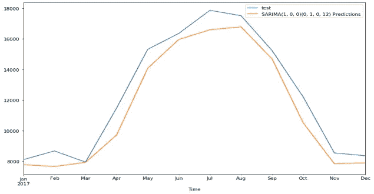

SARIMAX 每月预测值与实际值(MWh)

注意:SARIMAX 以比 lstm 更好的性能出现在这里。

**次日整点预测**

对于这一部分，我们将使用我们的原始数据集(每小时记录)并选择 2017 年的最后一天作为我们的测试，并尝试预测短期内明天的用电量。

**LSTM**

之前针对 LSTM 讨论的相同代码也将用于每小时的数据集，并将产生以下预测与实际值。

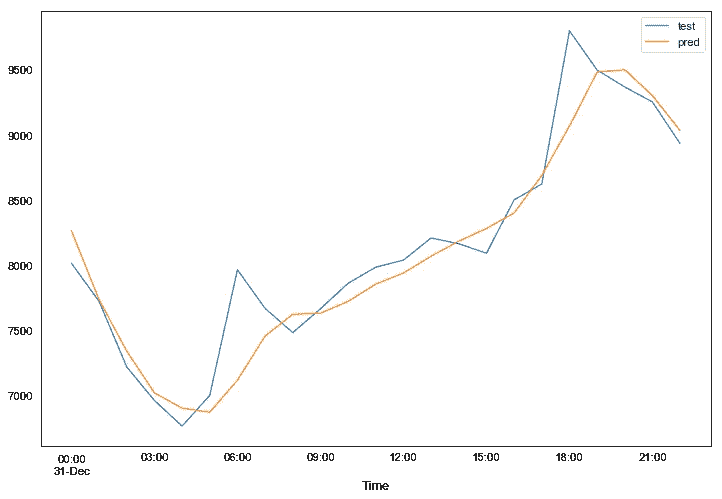

LSTM 第二天每小时预测与实际(MWh)

注意:LSTM 仍然表现得还可以。

**XGBOOST**

我也试过回归法。

首先，我们不想要任何数据类型为 object 的列，所以我们将为这些列获取虚拟变量

```
*# creating dummy variables for all categorical variables in the cleaned and merged dataset*
df_d = pd.get_dummies(df.drop(columns=['Time']) , drop_first=**True**)
```

为了确保没有数据泄漏，我将进行训练、测试和验证。

最近(2017 年的最后一天)的 x 和 y 将不在训练或测试集中。

```
*# length to split*
l_split = 24*# make a regression problem*
X = df_d.drop(columns=['COA'])[:-l_split]
y = df_d.COA[:-l_split]
X_lately = df_d.drop(columns=['COA'])[-l_split:]
y_lately = df_d.COA[-l_split:]
```

列车测试分离。

```
*# train split test with given length to split*
**from** **sklearn.model_selection** **import** train_test_split
X_train, X_test, y_train, y_test = train_test_split(X, y, test_size=0.33, random_state=42)
```

使用标准定标器来定标我们的数据集，重要的是只适合于训练集，并且只在测试和验证时转换。

```
*# importing scaler, then scale training and test dataframes*
**from** **sklearn.preprocessing** **import** StandardScaler s = StandardScaler()X_train_d_s = pd.DataFrame(s.fit_transform(X_train) , columns=X_train.columns)
X_test_d_s = pd.DataFrame(s.transform(X_test) , columns=X_test.columns)
X_lately_df = pd.DataFrame(s.transform(X_lately) , columns=X_lately.columns)
```

在我们的训练数据中导入并拟合模型。

```
*# importing models* 
**from** **xgboost.sklearn** **import** XGBRegressor*# define and fit the model*
model = XGBRegressor()
model.fit(X_train_d_s , y_train)
```

为测试和预测制作数据帧

```
*# making a dataframe to hold test predictions*
predictions = pd.DataFrame(model.predict(X_lately_df) , index=pd.date_range('2017-12-31 00:00:00','2017-12-31 23:00:00' , freq='H'), columns=['pred'])*# making a dataframe to hold test data*
test = pd.DataFrame(np.array(y_lately) , index=pd.date_range('2017-12-31 00:00:00','2017-12-31 23:00:00' , freq='H') , columns=['test'])
```

将测试和预测对立起来。

```
*# plot prediction vs test*
test.test.plot(figsize=(12,5) , legend=**True**)
predictions.pred.plot(legend=**True**)
```

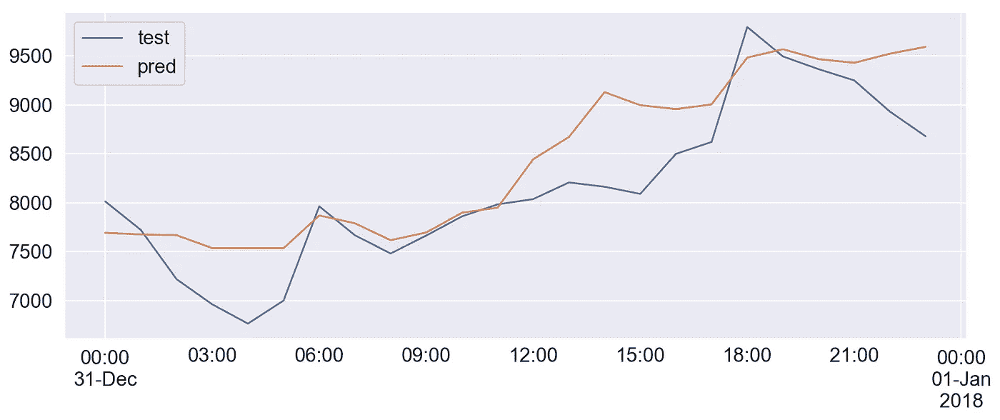

Xgboost 第二天每小时预测值与实际值(MWh)

注意:XGBOOST 并不是很好的结果。

**LIGHTGBM**

对于 lightGBM，我将使用相同的管线，唯一会改变的是模型的拟合。

```
**from** **lightgbm** **import** LGBMRegressorlgb =  LGBMRegressor()
lgb.fit(X_train_d_s,y_train)
```

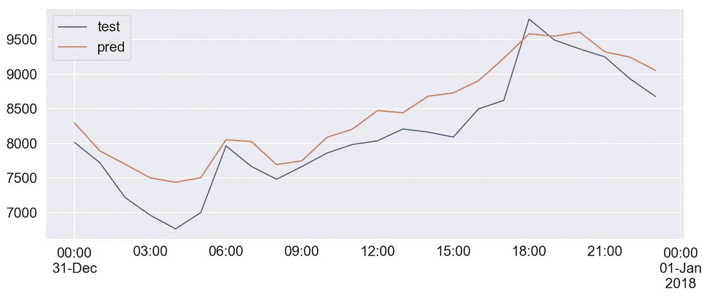

lightGBM 第二天每小时预测值与实际值(MWh)

注意:lightGBM 作为一种回归方法比 XGBOOST 执行得更好。

**萨里马克斯**

这里也将使用前面讨论的 SARIMAX 的相同代码。

唯一会改变的是，auto arima 中的 m 参数将是 24，因为我们每小时的数据集中有每日季节性，季节性发生在每 24 个数据点。

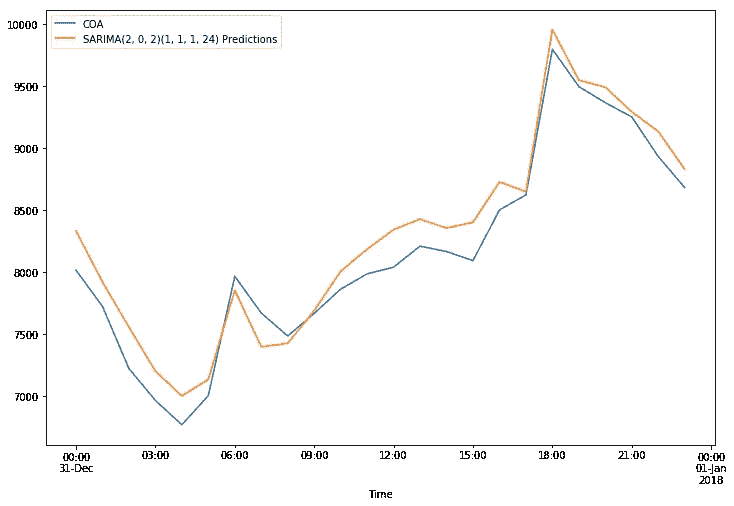

SARIMAX 第二天每小时预测值与实际值(MWh)

注意:最终萨里麦克斯·克利里在这里获得了胜利。

## 精炼

在这一节中，我将讨论每个算法如何改进。

**LSTM**

可以改善 LSTM 的主要变化是网络架构。

你可以添加密集层，改变优化器，改变学习率，添加另一个 LSTM 细胞，等等。

不断改变，直到你对结果满意为止。

**先知**

添加回归变量会有很大帮助，但是要确保如果你添加了一个回归变量，当你想预测未来时，你需要有相同的回归变量，不要使用你得不到的回归变量。

另一件事是趋势，它是乘法还是加法？两种方法都试试，看看哪一种效果最好。

**萨里马克斯**

为了改善 SARIMAX，你可以增加外生变量，但正如先知所说，确保你得到这些变量来预测。

此外，SARIMAX 的主要问题是它不能捕捉多个季节。

傅立叶级数有一个技巧可以解决这个问题，通过添加傅立叶级数作为外生变量，我在这里没有这样做，希望在未来实现。

**回归**

最重要的是增加更多的功能，增加相关功能后可以明显看到一个改进。

我想在未来的工作中增加的一个功能是 GDP，我认为它与电力消耗有关。

# 结果

## 模型评估、验证和论证

**每小时数据预测**

R2 分数摘要

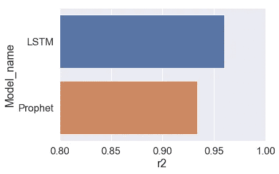

每小时预测摘要

LSTM 在小时分组中表现更好，这可能是因为 PROPHET 没有能够很好地捕捉到多重季节性。

此外，LSTM 表现更好，记录数量更多。

**每日预测**

R2 分数摘要

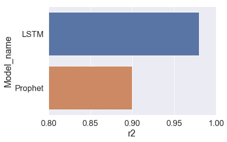

ML 每日预测摘要

每日数据也是同样的原因

**月度预测**

R2 分数摘要

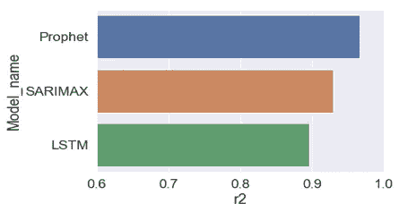

ML 每月预测汇总

因为只有一个季节性，SARIMAX 和 PROPHET 都很容易捕捉到，而 LSTM 开始受到月度数据中记录数量少的困扰。

**次日整点预测**

R2 分数摘要

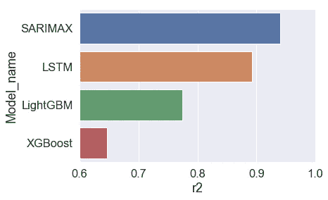

第二天每小时预测汇总

为了对这一短期进行预测，只需要捕捉一个季节性，即每日季节性，SARIMAX 捕捉得非常好。

# 结论


来源:[https://deposit photos . com/221270752/stock-photo-writing-note-showing-结语-business.html](https://depositphotos.com/221270752/stock-photo-writing-note-showing-conclusion-business.html)

## 反射

*   机器学习可以用来预测电力负荷，准确率很高。
*   电力公司可以使用这种模型来预测短期/中期/长期电力负荷，并相应地规划他们的发电，这可以节省资源和资金，并为他们的客户提供更好的服务。
*   理解和实现所有这些模型需要花费大量的时间和精力，因为我想对长期、中期和短期进行预测，我必须使用不同的模型，并且每个模型在特定的时期表现得更好。
*   与其他模型相比，LSTM 真的很难理解和实现。
*   在寻找所有这些方法的过程中，我学到了很多东西，这是值得努力的。

## 改进

*   通过对每天的数据进行重新采样并取最大值，我可以做出另一个重要的预测方法，即预测每天的电力负荷峰值
*   实现一个 web 接口，该接口接受输入，从模型中获取预测并显示出来。
*   探索 R 编程语言，因为它具有强大的统计和时间序列预测模型。
*   正如在“优化”一节中所讨论的，SARIMAX 可以通过傅立叶变换实现强大的功能，我对此很感兴趣。

## 承认

感谢我们在 Udacity 的所有老师，感谢他们在课程和这个项目中提供的所有支持，这是一次美妙的经历。