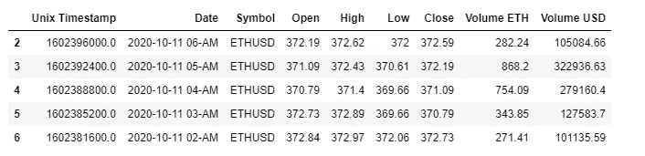

# 预测以太坊(ETH)价格与 RNN LSTM 在 Keras (TensorFlow)

> 原文：<https://medium.com/analytics-vidhya/predicting-ethereum-eth-prices-with-rnn-lstm-in-keras-tensorflow-9ae2709de270?source=collection_archive---------4----------------------->


本主题的想法是提出一种使用探索性分析和递归神经网络(RNN)预测以太坊加密货币未来价格的简单方法，主要是 LSTMs。

我不会详细讨论加密货币和 LSTMs 的操作，关于这个主题已经有很多文章了。

如果您对这些主题仍然不清楚，我邀请您看看这些文章:

以太坊到底是如何运作的？[https://medium . com/@ preethikasireddy/how-does-ether eum-work-anyway-22d 1 df 506369](/@preethikasireddy/how-does-ethereum-work-anyway-22d1df506369)

**了解 LSTM 及其图**
[https://medium . com/ml review/Understanding-lstm-and-its-diagrams-37 e2f 46 f 1714](/mlreview/understanding-lstm-and-its-diagrams-37e2f46f1714)

我使用了提供 REST API 的币安市场来检索 ETH/USDT 的历史数据。

您可以参考此处的文档:

[https://github . com/币安/币安-spot-API-docs/blob/master/rest-API . MD](https://github.com/binance/binance-spot-api-docs/blob/master/rest-api.md)

或者使用 python 包来简化这个过程，如下所示:

[https://python-binance.readthedocs.io/en/latest/](https://python-binance.readthedocs.io/en/latest/)

这是熊猫的数据集:



埃胡斯德·达弗雷姆

在继续之前，执行一些数据结构化操作很重要:

```
df_ethusd.dtypes
```


ethusd 数据类型函数

```
# convert date format to datetime
df_ethusd['Date'] = pd.to_datetime(df_ethusd['Date'], format='%Y-%m-%d %H-%p').dt.strftime('%Y-%m-%d %H:%M')
df_ethusd['Date'] = pd.to_datetime(df_ethusd['Date'])# sort values by date
df_ethusd = df_ethusd.sort_values(by='Date')df_ethusd.rename(columns = {'Date':'datetime'}, inplace = True)del df_ethusd['Symbol']
del df_ethusd['Unix Timestamp']
```

对空值的简单检查:

```
df_ethusd.isnull().sum()
```


简单检查空值

在开始相关性分析之前，对定量变量使用数值很重要:

```
# Convert all quantitative variables to numeric format
df_ethusd = pd.concat([
    df_ethusd.iloc[:,0],
    df_ethusd.iloc[:, 1:len(df_ethusd.columns)].astype('float')
], axis = 1)df_ethusd.dtypes
```


ethusd 数据类型函数

# 相关

数据准备完成后，下一步是分析不同的相关性，以确定最感兴趣的变量。

这个想法是预测“接近”价格的未来值。因此，了解其他变量是否能解释这个变量的可变性是很重要的。

这里，我们将首先绘制 [Pearson](https://en.wikipedia.org/wiki/Pearson_correlation_coefficient) 相关性热图，并查看自变量与输出变量 Close 的相关性。我们将只选择与输出变量的相关性**大于 0.5** (取绝对值)的特征。

相关系数的值在-1 到 1 之间
—越接近 0 的值意味着相关性越弱(恰好 0 意味着无相关性)
—越接近 1 的值意味着正相关性越强
—越接近-1 的值意味着负相关性越强


df_ethusd 上的热图

然后，我恢复不同的相关性对，以检查它们的 p 值，并只保留阈值低于 0.05%的显著相关性。


df_ethusd 相关性

如我们所见，只有特征**高、低**和**打开**与输出变量关闭高度相关

为了确保第一个假设，使用[递归特征消除](https://scikit-learn.org/stable/modules/generated/sklearn.feature_selection.RFE.html) (RFE)方法进行第二次分析。RFE 方法的工作原理是递归地删除属性，并在那些保留的属性上建立一个模型。它使用准确性度量来根据特征的重要性对其进行排序。

结果如下:


递归特征消除

RFE 方法也推荐与皮尔逊系数的第一种方法相同的变量。

因此，我们将保持**打开，高**和**低**变量来预测**关闭**价格。

# 数据预处理

我们现在进入预处理阶段。选择不同的变量和定义时间步长是很重要的。

指定的时间步数定义了用于预测下一个时间步( *y* )的输入变量( *X* )的数量。因此，对于制图表达中使用的每个时间步长，都必须从数据集的开头移除那么多行。

在我们的例子中，我将时间步长设置为 24。这意味着模型每次都将使用过去的 24 小时来预测未来的一个小时。

```
# Select features (columns) to be involved intro training and predictions
cols = list(['Close','High', 'Low', 'Open'])# Target feature
y_target = 'Close'# Number of time steps use to predict the future 
n_time_steps = 24# Extract dates (will be used in visualization)
dataset_datelist = list(dataset['datetime'])# Parse training set timestamp for better visualization
dataset = pd.DataFrame(dataset, columns=cols)
dataset.index = dataset_datelist
dataset.index = pd.to_datetime(dataset.index)print('Training set shape == {}'.format(dataset.shape))
print('All timestamps == {}'.format(len(dataset_datelist)))
print('Featured selected: {}'.format(cols))
print('Featured target selected: {}'.format(y_target))
print('Number of time steps selected: {}'.format(n_time_steps))
```


功能选择

这是此时的数据集:


选择要素后的数据集

# 评估所选要素的正态分布

下一步是将数据标准化，使 LSTM 模型不受尺度变化的影响。输入变量尺度的差异可能会增加建模问题的难度。

有几种方法，ScikitLearn 提供了两种主要方法:

**标准缩放器**:去除平均值，并将数据缩放至单位方差。
**MinMaxScaler** :重新缩放数据集，使所有函数值都在范围[0，1]内。

为了使用最佳方法，重要的是事先知道我们的变量是否遵循正态分布。

为此，我们必须观察变量的分布，并将它们与正态密度进行比较。


所选特征的正态分布

我们可以得出结论，这些变量似乎不遵循正态分布。

为了确保这一点，Kolmogorov Smirnov 测试应用于每个变量，Kolmogorov-Smirnov 方法也是另一种拟合优度方法，它比较实验[累积分布](https://www.sciencedirect.com/topics/engineering/cumulative-distribution)函数和理论累积分布函数之间的最大距离。

结果如下:


科尔莫戈罗夫斯米尔诺夫试验

变量的 p 值不大于 0.05%的显著阈值，这导致我们拒绝正态假设。这可能与时间序列中的大量异常值有关。在这种情况下，StandardScaler 标准化似乎非常合适。

# 列车测试分离

现在是时候将我们的数据集分成两部分了，一部分用于训练模型，另一部分用于数据验证。

我使用了标准的 **80/20** 分割，这为我们带来了 22，999 个用于训练的样本和 5749 个用于验证数据的样本，这对于我们的情况来说已经足够了。

```
import mathtrain_split = 0.8Data = dataset.values #converting numpy array
train_data_size = math.ceil(len(Data)*train_split)
test_data_size = len(dataset) - train_data_sizeprint('train size == {}.'.format(train_data_size))
print('test size == {}.'.format(test_data_size))# split the actual dataframe in train/test set
train, test = dataset[0:train_data_size], dataset[train_data_size:len(dataset)]
print('train shape == {}.'.format(train.shape))
print('test shape == {}.'.format(test.shape))
```


训练/测试规模

训练和试验数据的可视化；


列车测试分离

# 特征缩放归一化

然后，我们可以用 **StandardScaler** 方法标准化这两个数据集。

```
from sklearn.preprocessing import StandardScalerscaler = StandardScaler()
training_scaled_data = scaler.fit_transform(train)
print('training scaled data shape == {}.'.format(training_scaled_data.shape))look_back_train_data = train.tail(n_time_steps) #look back n_time_steps
testing_data = look_back_train_data.append(test)scaler_test = StandardScaler()
testing_scaled_data = scaler_test.fit_transform(testing_data)scaler_test_predict = StandardScaler()
scaler_test_predict.fit_transform(testing_data.iloc[:, 0:1])print('testing scaled data shape == {}.'.format(testing_scaled_data.shape))
```


训练/测试缩放形状

现在数据已经标准化，将数据结构转换为 LSTM 模型所期望的输入数据变得非常重要。

你必须给出一个三维数组作为你的 LSTM 网络的输入。其中第一维代表**批量**，第二维代表**时间步长**，第三维代表一个输入序列中**单元**的数量。例如，输入形状看起来像 *(batch_size，time_steps，units)。*

有许多方法可以转换数据，这里有一种方法可以实现 3 个方面的目标:

```
def split_sequences_multivariate_output(sequences, n_steps):

  X, y = list(), list()
  for i in range(len(sequences)):
      # find the end of this pattern
      end_ix = i + n_steps
      # check if we are beyond the dataset
      if end_ix > len(sequences)-1:
          break
      # gather input and output parts of the pattern
      seq_x, seq_y = sequences[i:end_ix, :], sequences[end_ix, :]
      X.append(seq_x)
      y.append(seq_y)
  return array(X), array(y)# convert into input/output
X_train, y_train = split_sequences_multivariate_output(training_scaled_data, n_time_steps)X_test, y_test = split_sequences_multivariate_output(testing_scaled_data, n_time_steps)print('X_train shape == {}.'.format(X_train.shape))
print('y_train shape == {}.'.format(y_train.shape))print('X_test shape == {}.'.format(X_test.shape))
print('y_test shape == {}.'.format(y_test.shape))
```


输入形状

开始训练前(再次)检查形状:


输入形状

我们在 **X_train** 和 **X_test** 数据集上有 **24 个时间步长**，使用了 **4 个特征**，并且在 **y_train** 和 **y_test** 上也使用了 4 个特征。

# 建立 LSTM 网络

现在是准备 LSTM 模型的时候了，我定义了一个函数，它将训练和测试数据以及一些超参数作为输入。

然后模型由**两个 LSTM 隐藏层**组成，每个隐藏层有 **50 个单元**。

**在每个 LSTM 隐藏层之间也使用 25%的下降层**。

输入丢失意味着对于给定的概率，每个 LSTM 块的输入连接上的数据将被排除在节点激活和权重更新之外。

在 Keras 中，这是在创建 LSTM 图层时用 *dropout* 参数指定的。压差值是介于 0(无压差)和 1(无连接)之间的百分比。

在第一个 LSTM 隐藏层上指定输入形状很重要，这样它就可以使用与训练数据相同的形状。

**然后在密集输出层上使用线性激活**。

```
def train_keras_model(X_train, y_train, X_test, y_test, epochs, batch_size, shuffle=False): from tensorflow.keras.models import Sequential
  from tensorflow.keras.layers import LSTM, Dropout, Dense# Initializing the Neural Network based on LSTM
  model = Sequential()  
  model.add(LSTM(units=50,return_sequences=True,input_shape=(X_train.shape[1], X_train.shape[2])))
  model.add(Dropout(0.25))
  model.add(LSTM(units=50))
  model.add(Dropout(0.25))
  model.add(Dense(units=X_train.shape[2], activation='linear'))
  model.compile(optimizer='adam',loss='mean_squared_error')

  history = model.fit(X_train, y_train, shuffle=shuffle, validation_data=(X_test, y_test), epochs=epochs, verbose=2, batch_size=batch_size).history

  return history, model
```

训练可以开始了，我用了 **30 个纪元**，将**批量设置为 256** 。这些值似乎可以使模型快速收敛。

```
# Fit model
history, model = train_keras_model(X_train, y_train, X_test, y_test, epochs=30, batch_size=256, shuffle=False)
```

以下是训练和验证损失曲线:


模型损失

在训练和验证数据上，该模型似乎很快收敛到 0。

# 使用测试集的性能可视化

用不同的指标而不仅仅是损失曲线来检查模型的性能变得很重要。

最有趣的指标是: **MAE、MAPE、MSE、RMSE、R 平方和调整后的 R 平方。**

它们必须根据验证数据的预测值进行计算:

```
# Perform predictions
predictions_test = model.predict(X_test)# Inverse the predictions to original measurements
y_pred_test = scaler_test_predict.inverse_transform(np.array(predictions_test)[:,0])y_actual_test = scaler_test_predict.inverse_transform(np.array(y_test)[:,0])
```

然后可以对 **y_pred_test** 和 **y_actual_test** 应用不同的指标。

结果如下:


韵律学

我们得到的 **MAPE 值为 3.43%** ，这意味着实际值与模型预测值之间的平均误差非常低。

此外，**调整后的 R2 和 R2 系数**非常**接近 1** ，这意味着预测值与真实值高度相关，因此解释了真实值上的许多差异。

我们可以用图表来直观显示模型的性能，为此，我定义了两个时间序列，一个包含验证数据，另一个包含预测数据:

```
y_test_serie = pd.DataFrame(y_actual_test, columns=[y_target]).set_index(testing_data[n_time_steps:].index)y_pred_serie = pd.DataFrame(y_pred_test, columns=[y_target]).set_index(testing_data[n_time_steps:].index)
```

然后只查看两个系列:

```
plt.plot(y_test_serie.index, y_test_serie[y_target], color='green', linewidth=2, label='Actual')
plt.plot(y_pred_serie.index, y_pred_serie[y_target], color='red', linewidth=2, label='Testing predictions')plt.grid(which='major', color='#cccccc', alpha=0.5)plt.legend(shadow=True)
plt.title('Testing predictions Vs Acutal')
plt.xlabel('Timeline', fontsize=10)
plt.ylabel('Value', fontsize=10)
plt.xticks(rotation=45, fontsize=8)
plt.show()
```


测试预测与实际

我们可以关注上个月:


测试上个月的预测与实际

尽管仍然需要对数据处理和模型参数进行改进以提高预测的质量。模型做出的预测遵循测试数据的主要趋势。

# 预测未来

然后就可以用这个模型来预测未来，未来几个小时以太坊的价格。

有几种方法可以预测未来。直接预测或递归预测。

我用递归预测来预测未来 12 小时。该模型每次预测 1 个时间步长的 4 个特征。

所以我使用了预测变量，并在最后一个窗口中，通过每次移动一步，将它们整合为输入变量。

这种方法对于小型预测很有意思，因为它每次都会增加预测误差，这可能会对长期预测的质量产生相当大的影响。

以下是接下来 12 小时的结果:


# 摘要

以太坊时间序列与开盘、盘高和盘低变量一起用于测量收盘变量上的网络性能。

将获得的估计结果与图表进行比较。MSE、MAPE 和 R 值被作为预测成功的标准。

然而，通过更多的数据点和修改 LSTM 网络的超参数，有可能获得更成功的结果。

就是这样！希望这篇文章对使用 LSTM 预测时间序列有一个很好的理解。

*参考文献:*

[https://machineellingmastery . com/use-dropout-lstm-networks-time-series-forecasting/](https://machinelearningmastery.com/use-dropout-lstm-networks-time-series-forecasting/)
[https://machineellingmastery . com/multi variable-time-series-forecasting-lst ms-keras/](https://machinelearningmastery.com/multivariate-time-series-forecasting-lstms-keras/)
[https://machineellingmastery . com/use-time steps-lstm-networks-time-series-forecasting/](https://machinelearningmastery.com/use-timesteps-lstm-networks-time-series-forecasting/)
[https://towards datascience . com/feature-selection-with-pandas-E3](https://towardsdatascience.com/feature-selection-with-pandas-e3690ad8504b)

***跟我来*** [***这里***](https://twitter.com/AdrienBorderon) ***。***