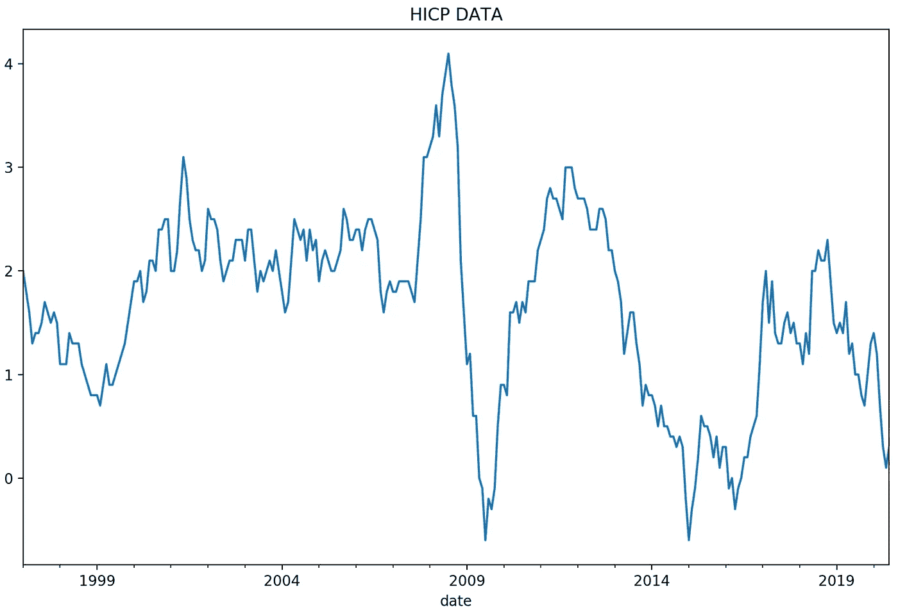
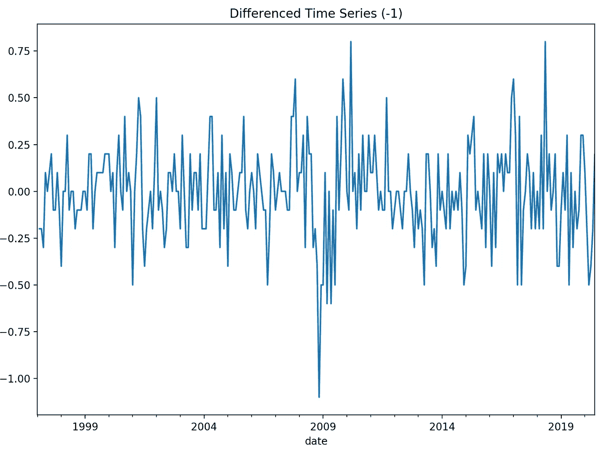
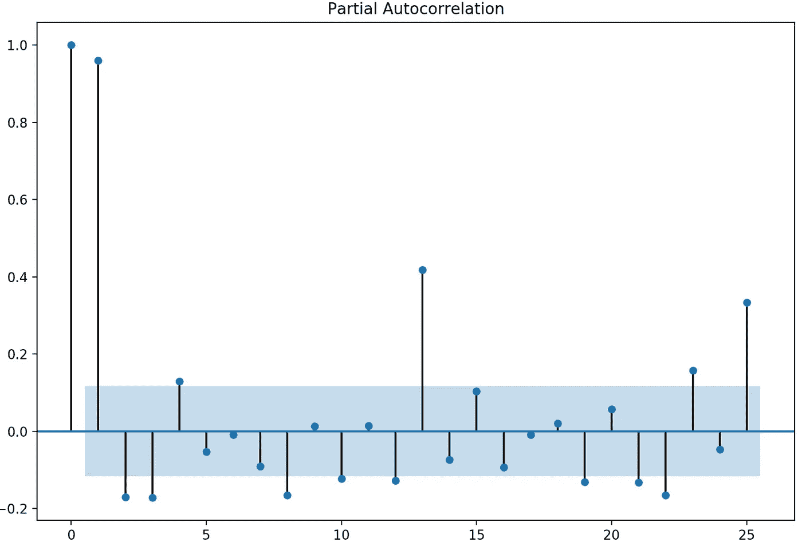
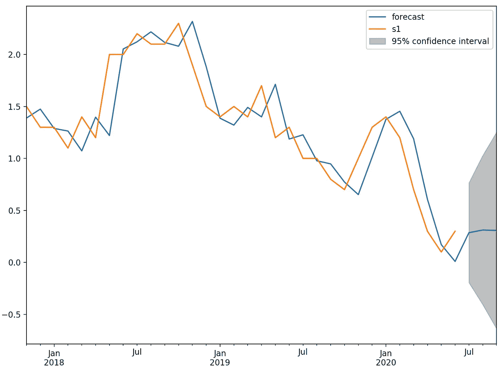

# 使用 ARIMA 模型预测欧洲价格稳定性(HICP)

> 原文：<https://medium.com/analytics-vidhya/predicting-european-price-stability-hicp-using-arima-modelling-c251be1b95?source=collection_archive---------33----------------------->


# **简介**

欧洲央行在第三季度发布的最受期待的数据之一是其被广泛接受的通胀指标；[消费价格协调指数](https://ec.europa.eu/eurostat/web/hicp)。这些数据将帮助经济学家更好地了解我们从新冠肺炎的第一次冲击中复苏的情况。

由于我最近对时间序列建模感兴趣，我决定使用 python 中的简单 ARIMA 建模方法来预测第三季度的通胀结果。

**代表自回归综合移动平均线。这是一个用于预测时间序列数据的简单工具。该模型由 3 个参数组成:**

*   **p:模型中包含的滞后观测值的数量，也称为滞后阶数。**
*   **d:原始观测值有差异的次数，也称为差异度。**
*   **问:移动平均线窗口的大小，也叫移动平均线的顺序。**

**我已经使用从[欧洲央行统计数据仓库](https://sdw.ecb.europa.eu/)收集的数据运行了这个模型。**

# **方法**

**我的代码分为 3 个简单的部分，数据清理和处理，统计测试，以及模型构建和数据解释。我不会深入代码本身的细节，而是试图展示方法和结果。**

*   **数据清理和处理:**

```
#package import
import pandas as pd
import matplotlib.pyplot as plt
import numpy as np
from statsmodels.tsa.arima_model import ARIMA
from statsmodels.graphics.tsaplots import plot_acf,plot_pacf
from pandas.plotting import autocorrelation_plot#data download and cleaning
data = pd.read_excel('/Users/prokoptrojan/Documents/HICP_HIST.xlsx', index_col = 'date', parse_dates=True, squeeze=True)df = data['s1']
df.index = pd.DatetimeIndex(df.index).to_period('M')
print(df)df.plot(title = 'HICP DATA')
plt.show()
```

****

*   **初始统计测试:**

```
#differencing
df1 = df.diff(periods=1)
df2 = df1.dropna()
print(df1.head())#PACF testing
df1.plot(title = 'Differenced Time Series (-1)')
plt.show()plot_pacf(df)
plt.show()autocorrelation_plot(df)
plt.show()
```

********

*   **模型构建和结果解释:**

```
#build ARIMA and interpret results
model = ARIMA(df, order=(2,1,0))
model_fit = model.fit(disp=0)
print(model_fit.summary())model_fit.plot_predict(250,284)
plt.show()final = model_fit.predict(280,284,typ='levels')
print(final)
```

**选择 p 值是因为我们的代码的第二步中的初始 PACF 测试；在 2 个滞后之后，我们失去了显著的自相关。选择 d 值是因为给定的初始数据集不具备平稳性标准。选择 q 值是因为不需要设置移动平均值。与任何模型一样，在找到最合适的模型之前，我进行了几次迭代。**

# **结果和结论**

**使用基于订单 2，1，0 和最终 AIC 得分 14.125 构建的模型，我们得到第三季度记录的通货膨胀率为 0.32%。比 Q2 值 0.33%略有下降。**

****

**这个预测有多准确？可能不太多。鉴于当今经济环境的不确定性和复杂性，我们需要更多复杂的模型。我当然会继续跟进，当实际结果公布时，我会让你知道我有多接近！**

**感谢:**

**[](https://machinelearningmastery.com/arima-for-time-series-forecasting-with-python/) [## 如何在 Python -机器学习掌握中创建用于时间序列预测的 ARIMA 模型

### 一个流行的和广泛使用的时间序列预测的统计方法是 ARIMA 模型。ARIMA 是…的首字母缩写

machinelearningmastery.com](https://machinelearningmastery.com/arima-for-time-series-forecasting-with-python/)**