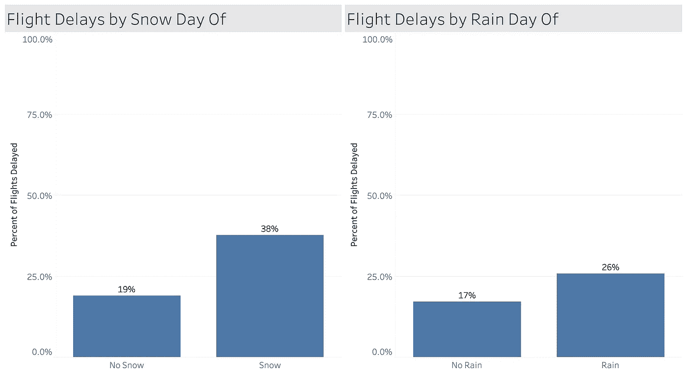
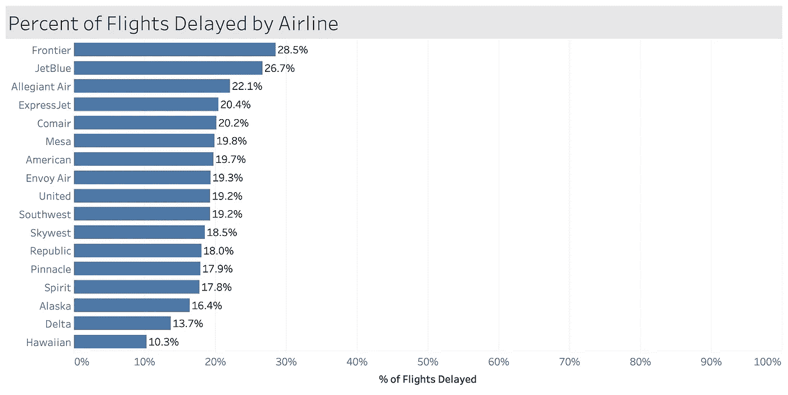
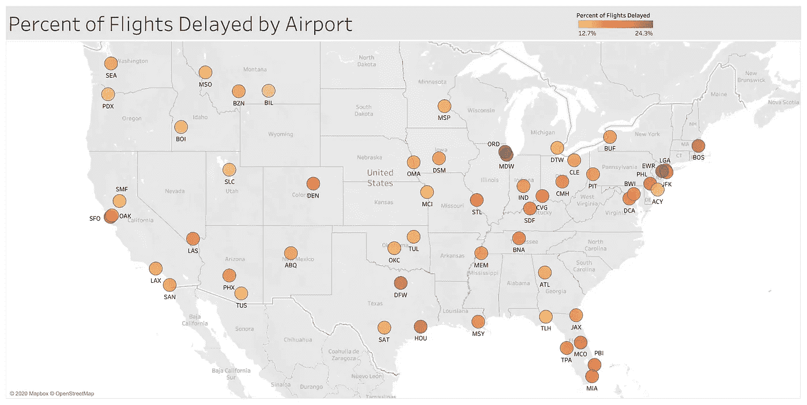
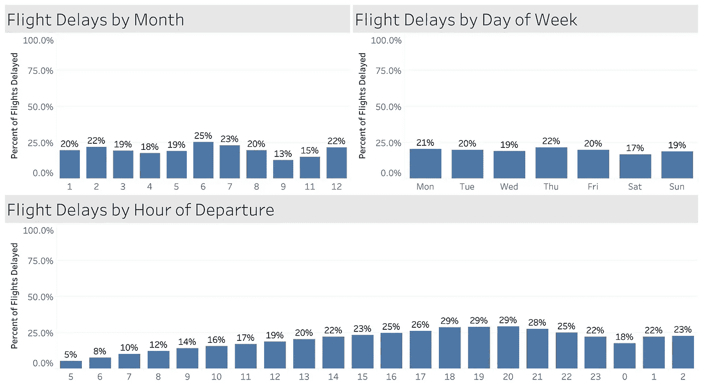
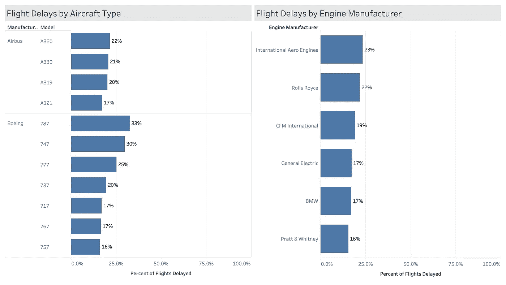

# 用机器学习预测航班延误

> 原文：<https://medium.com/analytics-vidhya/predicting-flight-delays-with-machine-learning-3d24dbf62f0b?source=collection_archive---------7----------------------->

## 了解导致航班延误的因素，学会如何战胜困难

> 点击这里查看我的网络应用程序，它会告诉你航班延误的几率。项目回购[此处](https://github.com/drewhibbard/Metis_Project3_FlightDelays)。

JESHOOTS.COM 在 [Unsplash](https://unsplash.com?utm_source=medium&utm_medium=referral) 上[拍照](https://unsplash.com/@jeshoots?utm_source=medium&utm_medium=referral)

作为一个狂热的旅行者，我一天中经历过一两次航班延误。我相信你们中的许多人也是如此。

你不想知道你的航班被延迟的可能性吗？你可能不会(或不应该)在机场迟到，但你至少可以进入一种几乎预期会延误的心理状态，如果你的航班最终准时起飞，那就太棒了！但是通常旅行者有相反的心态，对延误非常不满。

考虑到这一点，我深入研究了航班数据，以确定导致航班延误的最重要因素。最终，我做了一个[网络应用](https://flightdelayhibbard.herokuapp.com/)，任何人都可以用它来获得他们航班的延误几率。

# 数据源

我从 4 个不同的来源获取数据。

1.  所有 2015 年美国航班从 [Kaggle](https://www.kaggle.com/usdot/flight-delays) 出发。这个数据集包括每个航班的时间戳、航空公司、始发和出发机场、飞机尾号和延误指标。它包含了庞大的 580 万次飞行记录。通过关注排名前 50 的机场，我将这个数字缩小到了 140 万。
2.  美国国家海洋和大气管理局的天气数据。这提供了历史每日天气摘要。雪、雨、温度和风被证明是有用的。
3.  来自[空军](https://www.airfleets.net/home/)的特定飞机数据，如飞机制造商和型号、发动机信息和首飞日期。
4.  最后， [FlightAware API](https://flightaware.com/commercial/flightxml/) 提供实时飞行数据，以便在 Streamlit web 应用程序中进行预测。

# 探索性数据分析

## 天气

当你想到航班延误的原因时，首先想到的可能是天气。是给我的。事实证明确实如此。正如你在下面看到的，任何降雪都会使你的航班延误的几率翻倍。雨水也是一个因素，但不那么明显。

当然，当你提前 3 个月预订机票时，预测天气是不可能的。但是如果你的航班将在一月份离开明尼阿波利斯，你知道，不要感到惊讶。

但事实证明，雪实际上并不是最好的预测因素。这一荣誉属于同一架飞机的连续航班延误。如果你要乘坐的飞机在当天早些时候被不同的航班延误，你的航班也被延误的几率是 46%。你可能不知道你将乘坐哪架飞机，但没关系，我的应用程序可以告诉你！

# 航空公司

你可能也很想证实你的怀疑，某些航空公司比其他航空公司有更多的航班延误。我们将在下面证实你的怀疑！

用 2018 年的数据更新

## 臭名昭著的机场

我们可以对机场做同样的分析。抱歉，如果你要经过芝加哥或纽约！

用 2018 年的数据更新

## 时机

我们也看到了季节性模式，夏季和冬季比春季和秋季出现更多的延迟。一周中没有太多的不同，但是你最好的选择似乎是周六。一天中的时间变得非常有趣，但实际上很有意义。如果你决定用睡眠来换取早上 5 点的航班，你很可能会得到及时的回报。但是时间越晚，延误就越多。

最后，另一个因素是飞机本身。虽然我认为飞机的年龄会发挥作用，因为全新的飞机和老化的飞机比其他飞机需要更多的维护，但事实并非如此。然而，所使用的飞机型号和发动机确实起了作用。

我使用所有这些因素来训练一个机器学习算法，该算法可以预测几乎任何航班延误的可能性。假设所有航班中有 20%被延误，那么基线模型将会预测每一个航班都没有被延误，并且它将会有 80%的准确率！但那很无聊。它会把每一个实际的延迟都弄错。在准确预测真正的延迟和真正的无延迟之间找到一个折衷是有意义的。

我运行了四种不同的模型类型，逻辑回归、随机森林、高斯朴素贝叶斯和 XG Boost。虽然随机森林和 XG Boost 的性能基本相当，但 XG Boost 运行速度更快，因此被用于生产。它对延迟的回忆分数为 49%，对非延迟的回忆分数为 85%，这意味着它正确预测了几乎一半的真实延迟，同时仍然预测了超过 80%的非延迟基线。

所以你有它！你现在对导致航班延误的因素有了更多的了解，也许可以调整你的计划来避免它们。你可以自己试试[我的应用](https://flightdelayhibbard.herokuapp.com/)，但请不要根据它的预测来晚了机场！