# 使用随机森林预测坦桑尼亚水井泵的功能

> 原文：<https://medium.com/analytics-vidhya/predicting-functionality-of-water-well-pumps-in-tanzania-using-random-forest-6c25844a517e?source=collection_archive---------11----------------------->

对于这个数据科学博客的第三次迭代，我将贯穿一个项目的整个过程，使用随机森林(一种强大的集成建模方法)创建一个机器学习模型。

我将使用 drivendata.org 上一个竞赛的数据，该竞赛的数据来自开源 API TAA rifa 和坦桑尼亚水利部。我将演示如何使用随机森林分类模型对水井的功能进行三元分类。

坦桑尼亚正处于水危机之中。1/3 的土地是干旱的沙漠，对于不住在该国边境三大湖泊附近的居民来说，获得清洁水的机会非常有限。污染在很大程度上不受管制，许多人求助于饮用被污染的地下水。而且水泵大部分时间都不工作。人民需要我们的帮助！

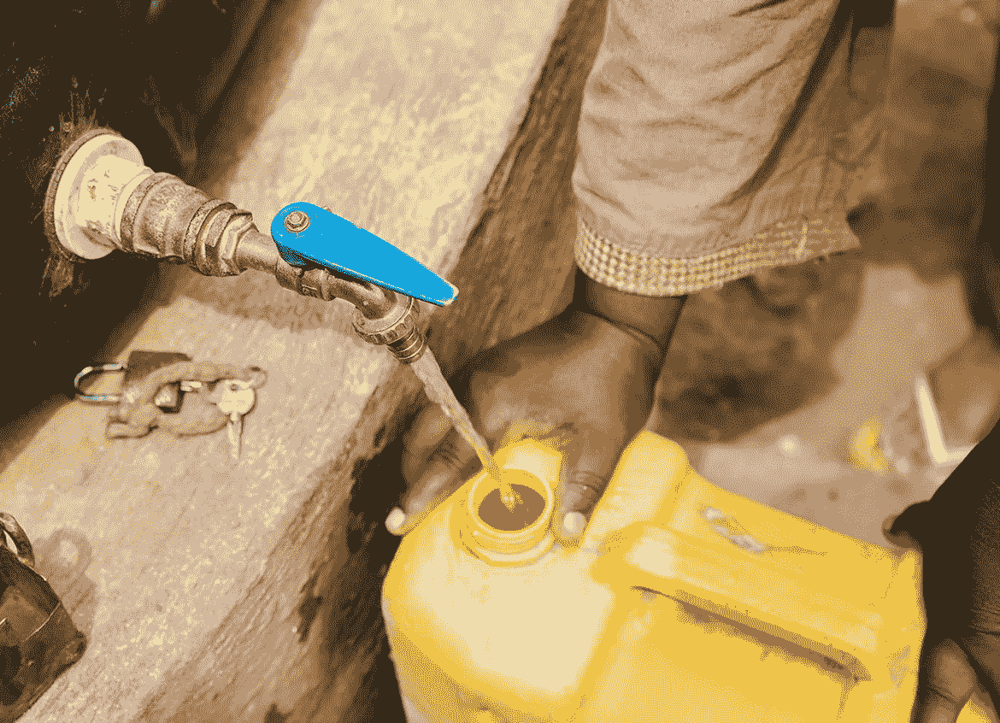

[https://water.org/our-impact/where-we-work/tanzania/](https://water.org/our-impact/where-we-work/tanzania/)

OSEMN 框架

我们使用 OSEMN 框架来组织这个项目，因为它的方法是合理和有效的。我们从导入数据集开始，数据集被分为训练值(在本例中是我们的预测值)、测试值和仅用于训练集的目标变量“status_group”。“状态组”由三个分类值组成:

## *['功能性'，'非功能性'，'功能性需要修复']*

## 清理我们的数据

为了便于竞争，我们对所有三个表进行了 pd.merge，这样我们就可以清理测试值，然后将它们从测试集预测集中分离出来。

我们开始清除缺失值的数据集，输入一些缺失值并删除冗余的数据列(这次数据列太多了:例如‘数量’&‘数量组’，‘管理’&‘管理组’等等……)，这些对都有几乎相同的值。

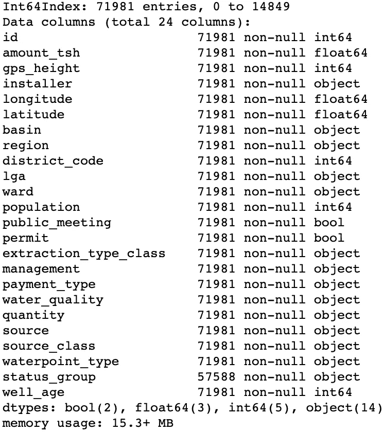

我们丢弃的特性包括位置的 9 列中的 4 列，包括经度和纬度，每一列都有不同程度的位置特异性。我们保留了'区域'，'地区代码'，' lga '，'纬度'和'经度'，以防某些地区由于某种原因容易发生井泵损坏。

我们通过将“日期记录”(记录数据的日期)转换为日期时间类型，然后用“建造年份”减去年份，并创建一个名为“井龄”的新列，轻松设计了一个功能。

对于布尔列，我们通过我们拥有的值的比率来估算空值/缺失值，以便保留潜在的关系。例如，“public_meeting”缺少 4155 个值。

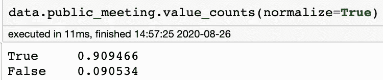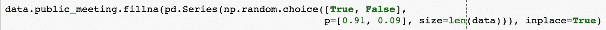

在清理和删除了所有重复和不必要的特性之后，我们最终只剩下 25 个专栏！

清理之后的下一步对我来说有点混乱，原因如下:由于预测建模的本质，所有的输入都需要是数字的。例如，不是字符串值/对象/常规单词。然而，我们希望我们的数据完整无缺，因此我们可以执行一些探索性分析(EDA ),以便对我们的数据有所了解，并理解其性质以及与功能“status_group”目标变量的关系。所以我把分类交易留到埃达之后。

# 探索我们的数据

让我们就手头的问题问几个问题:

## **位置与油井功能有关系吗？**

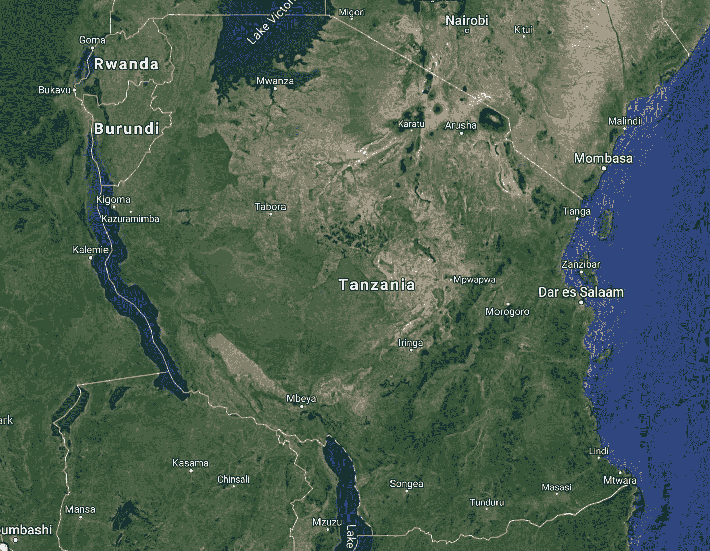

坦桑尼亚的谷歌地图截图

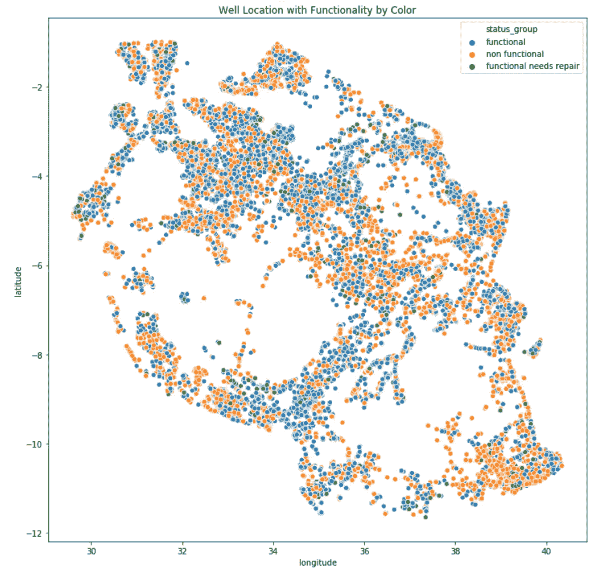

油井位置和颜色功能 seaborn 制造

在坦桑尼亚东南部、西部边境和中部似乎有一些非功能井群。还有没有井的巨大空地，我会想象在那里生活是非常困难的。可能是丛林/雨林？

## **水质与泵的功能有关系吗？**

按水质分类的井泵状况 seaborn 制造

嗯，它看起来确实像咸水，或者任何不“软”的水质(这意味着不含硬矿物质，可以饮用)，其功能性与非功能性的比例要高得多。然而，这里的另一个大问题是，大部分油井都是软水，这些油井仍然容易破裂。

## (泵)抽取类型与“状态组”有任何关系吗？

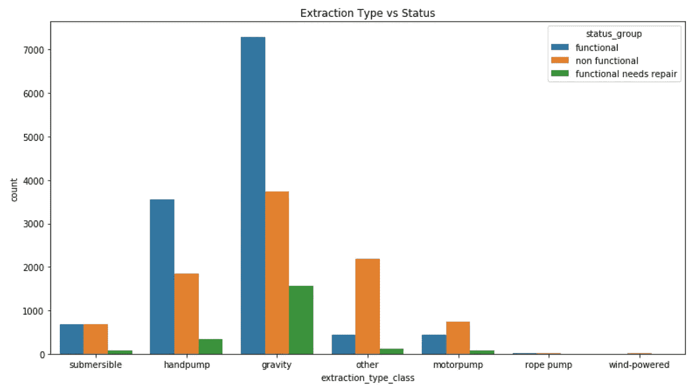

看起来重力泵和手压泵具有最佳的功能/非功能状态比率，而所有其他泵都有可能处于非功能状态。重力泵就像它们听起来的那样，水只是从海拔较高的源头流下来。手泵是非电动的，只有很少的运动部件，通过杠杆操作。

# 处理分类数据和高基数

正如我们在 EDA 之前提到的，我们必须将所有的分类数据转换成数字，否则我们的模型将返回错误。起初，我考虑在每一列上使用 pd.factorize，这对于将对象/字符串值转换为数组的数值表示非常有用，因为唯一重要的是识别不同的值。然而，对于机器学习模型来说，这将事情搞砸了，因为模型会将每个升序数字误解为具有更大的权重。在我们的例子中，我们有大量完全独特的值。例如，重力提取独立于潜水提取。两者完全是独一无二的。

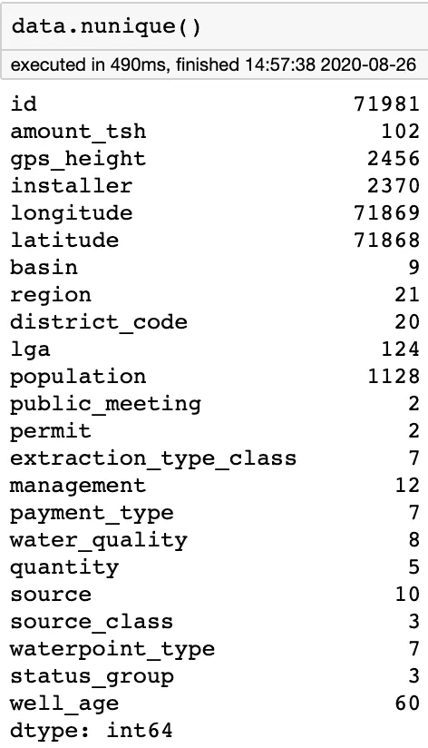

对于我们的类别，我们将需要通过 one-hot-encoding 来转换它们，这将基于 is/is 的二进制值创建全新的列。更复杂的是，我们保留的一些分类列具有高基数。这意味着有很多独特的价值。为每个列创建新的二进制列肯定太多了。让我们来看一下我们是如何处理这个问题的。

其中一个非常独特的栏目是“安装者”，它是坦桑尼亚 2370 个井泵安装者的子集。我们不想完全放弃它，以防这里有一些建模价值。相反，我们将把所有具有最低 value_counts 的安装程序归入“未知”(由于缺少/NaN 值，已经有一个较高的计数)，并保留最大的前 4 个用于 one-hot-encoding。

我复制了数据集两次——一次复制到 model_data，我们将把我们的编码列与它合并，另一次复制到 valcountmap，以防出错，不得不返回。

我不得不做一些严重的谷歌搜索，以找到一个工作解决方案

如下所示:

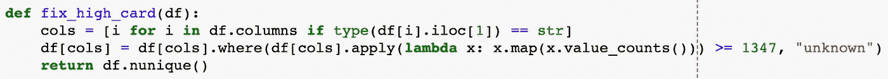

使用 lambda x: x.map 获取“Commu”和低于该值的所有值的计数，并应用“unknown”。

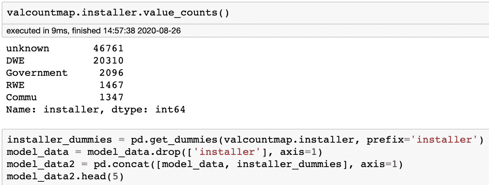

成功！现在只有 5 个安装程序的唯一值，其中大部分是“未知的”，但至少我们有最高计数的安装程序，没有删除潜在的有价值的信息。合并的表被分配一个全新的数据集。我对剩下的分类/对象列进行一次性编码，作为检查点，以防出错。

分类处理的最终结果产生了一个总共 69 列的大数据集。

# 随机森林建模

我们首先将训练列分配给“X ”,将目标列“status_group”分配给“y”。然后，我们将数据分成单独的训练集和测试集，默认测试大小为数据的 25%。这使得我们可以在大部分数据上训练随机森林模型，并保留 25%的数据来测试该模型的有效性。

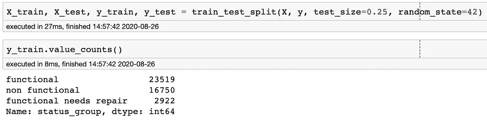

由于我们有三个目标值，这使得我们的项目成为一个三元分类问题。我们可以看到我们的训练集的 value_counts 是不平衡的，这是在运行我们的模型时要考虑的事情。我们将仅对我们的训练集运行 SMOTE，对我们的训练集进行重新采样，并获得“功能性”、“非功能性”和“功能性需要修复”的相等值。我们只在训练集上这样做，以避免任何额外的信息泄露到我们的测试集中。

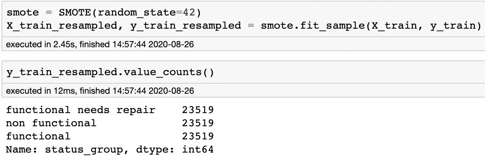

完美平衡的目标值！

我们现在有了常规的训练集，以及一个重新采样的训练集来尝试我们的模型。由于我们的变量的规模不同，我们将需要使用 StandardScaler 重新调整它们。

为了简单起见，我创建了一个函数，它包含了一个已经简化的方法，用于标准缩放、拟合，然后返回准确度分数、分类报告和混淆矩阵:

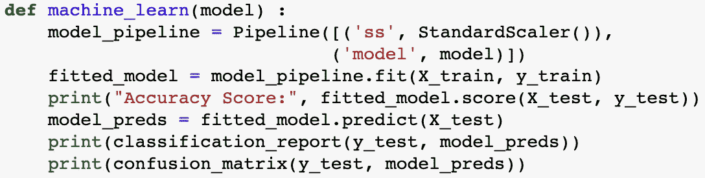

使用这个函数，我插入随机森林模型，森林中的决策树数量为 200，并得到以下基线结果:

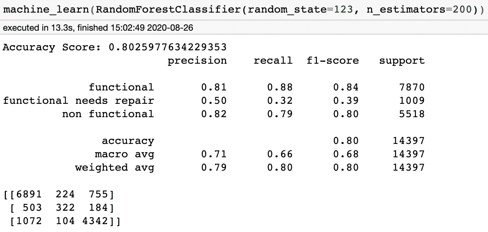

0.802 处的总体精度= 80.2%。不算太差！然而，似乎“功能性需要修复”的预测精度达不到 50%，这意味着 50%被标记为需要修复的油井实际上需要修复。召回率更低，为 32%，在所有需要维修的水井中，我们正确标记了其中的 32%。然而，更重要的是，我们更准确地预测完全不起作用的井，因为人们无法从那些泵中获得任何水。让我们用重新采样的数据再试一次:

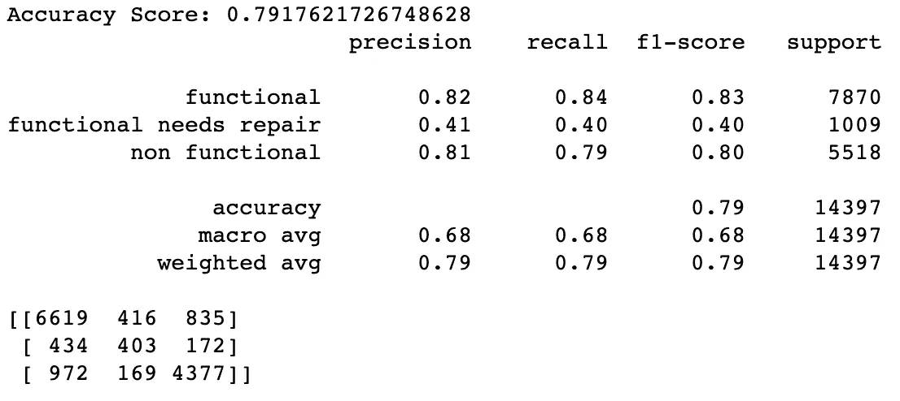

我们的重采样精度降低了 1%，需要修复时精度更差，召回率提高了 8%。非功能性下降的精度为 1%。如果“功能性需求修复”比完全非功能性更重要，那么这将是一个更好的模型，然而非功能性更重要。

让我们尝试通过实现 GridSearchCV 来微调我们的原始模型，看看我们是否可以通过调整以下内容来提高精确度:

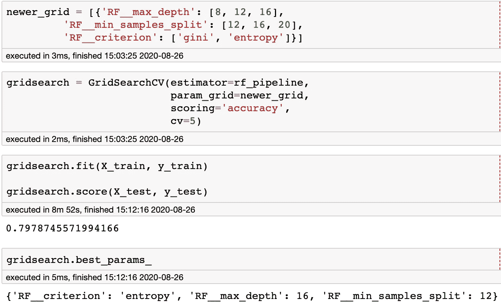

max_depth:树的深度

min_samples_split:拆分决策树上的内部节点所需的最小样本数

标准:分裂的质量、基尼系数和信息增益的“熵”。

我们的分数实际上有点低，我猜是由于 max_depth 不是无限的，因为这个参数通常对模型有最大的影响。让我们缩小这些结果的范围:

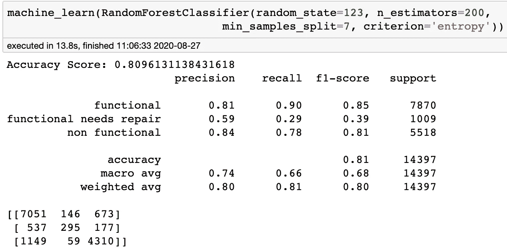

这一次，我们将让 max_depth 不受约束，使用熵标准降低 min_samples_split。

在两次缩小范围后，我们有了一个稍微改进的模型！

…下降了 1%。但是，嘿，这比我们的基线模型更好，给我们一个 0.8096 的整体精度，最好的 min_samples_split 为 7 个样本。

让我们画出这个模型的混淆矩阵:

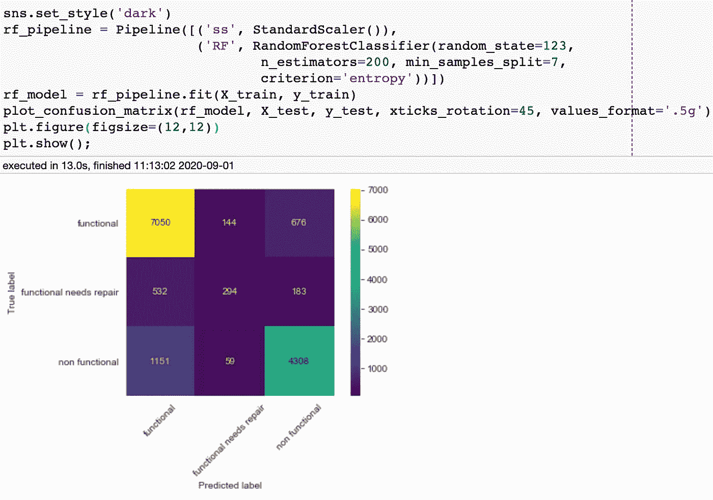

7050 口井被正确预测为功能井(右上角)。532 个被错误地预测为功能正常，而实际上它们需要修复。1151 个在没有功能时被错误地预测为有功能(误报-在我们的情况下最重要，因为这些水井将被查看，如果水井没有修好，依赖这些水井的居民将无法获得他们需要的水)。

让我们在这里绘制特征重要性，并找出哪些特征对预测的准确性影响最大:

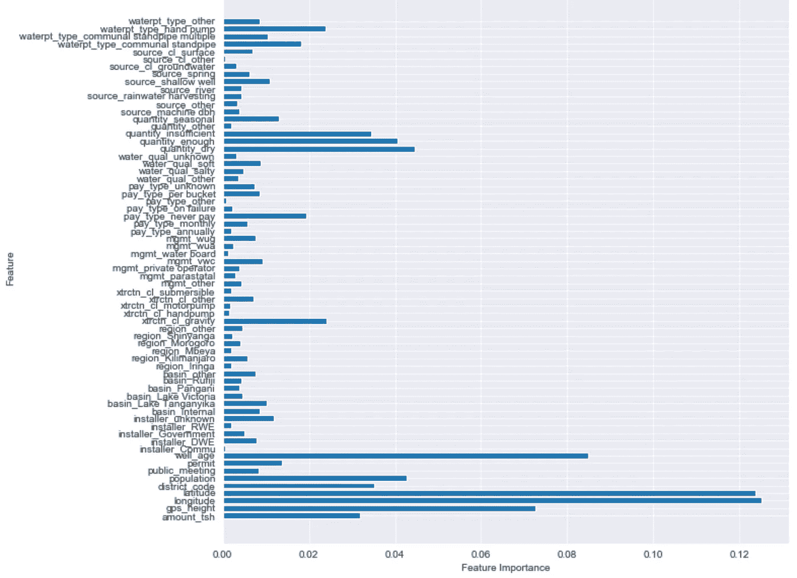

我们的随机森林模型告诉我们，纬度和经度是最重要的，然后是井的年龄、gps _ 高度和水泵排出的水量。使用这些随机森林，我们能够以 81%的准确率预测坦桑尼亚水井的功能性——好团队！！

通常，从这里开始，您会希望将这些最重要的变量可视化，以便利益相关者可以在评估正确位置的正确油井时做出决策，以获得最佳效率。

我希望你能从整个演练中学到一些东西，如果你对我这里的过程有任何问题，请随时给我发电子邮件。