# 使用 SARIMA 预测未来房价

> 原文：<https://medium.com/analytics-vidhya/predicting-future-house-prices-using-sarima-d972ea9c3cfa?source=collection_archive---------14----------------------->

# 介绍

这个项目的目的是预测威尔士首都卡迪夫的排屋的未来价格。房屋销售数据被转换为时间序列，显示 1995 年至 2020 年的月平均销售价格，然后通过使用 SARIMA 模型将时间序列扩展到 2025 年，以预测房价。

本研究中使用的数据来自皇家土地登记处:[https://landregistry.data.gov.uk/app/ppd/](https://landregistry.data.gov.uk/app/ppd/)

# 根据房屋销售列表创建时间序列

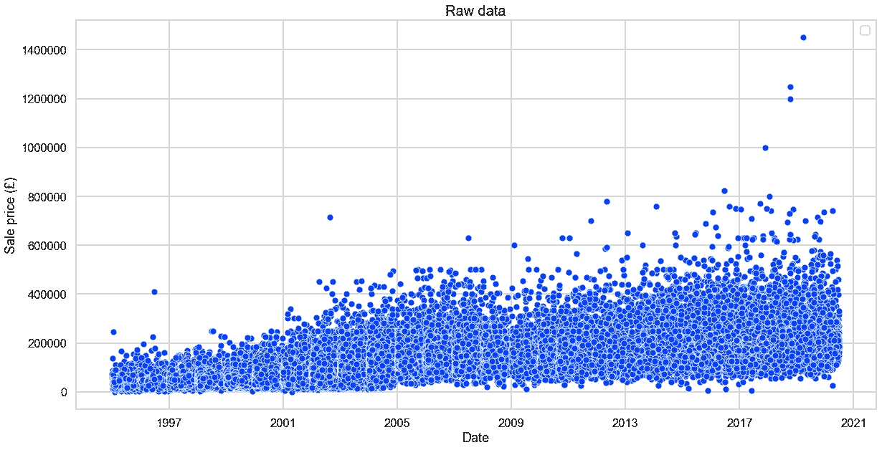

从 1995 年到 2020 年加的夫的所有排屋销售

**离群点剔除**

由于房屋的价格差异很大，在加的夫有一些非常昂贵的露台房屋，我选择从数据中删除这些房屋，将超过中位数 3 个标准差的房屋销售归类为异常值，这些是“非常昂贵的房屋”。我没有使用完整数据集中的中位数来做这件事。不出所料，卡迪夫的房价在过去 25 年里大幅上涨。因此，为了说明这一点，我独立计算了每年的异常值。

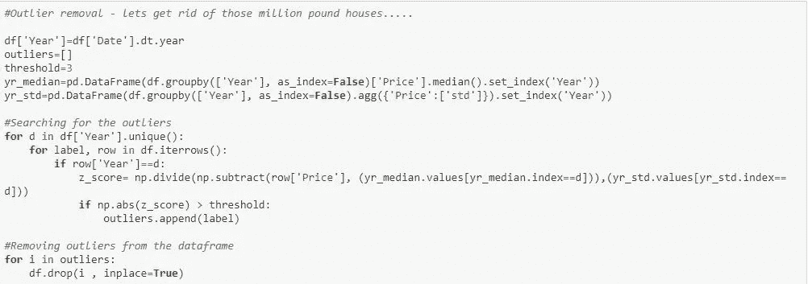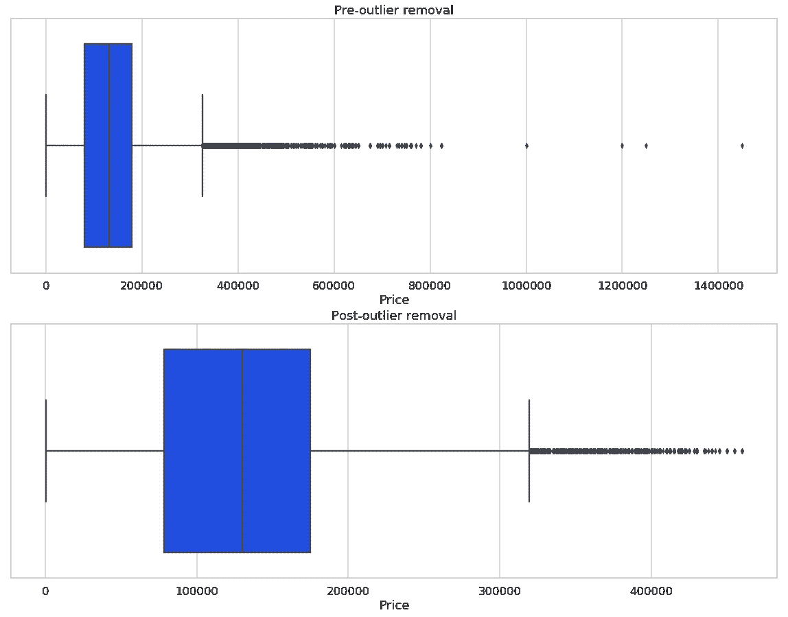

**重采样**

原始数据包含销售日期和销售价格。如果要将数据转换成时间序列，每天不可能有多个销售，因此我对数据进行了重新采样，创建了从 1995 年到 2020 年每个月的平均销售价格。现在我们有了一个时间序列！

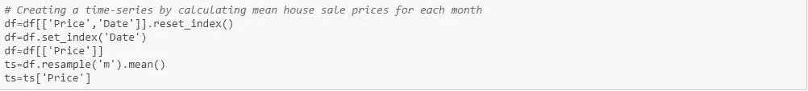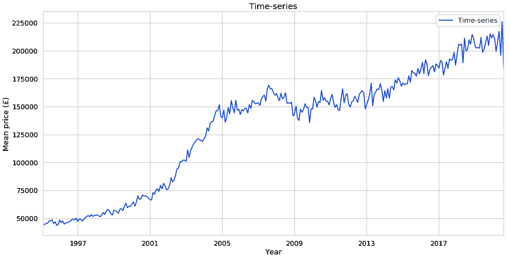

# 系统模型化

为了使用 SARIMA 萨里玛方法，输入时间序列必须是平稳的，迪基-富勒检验可以告诉我们一个时间序列是否平稳。

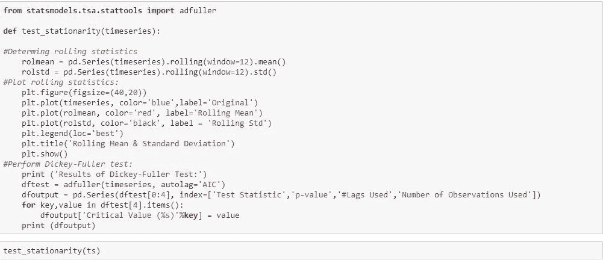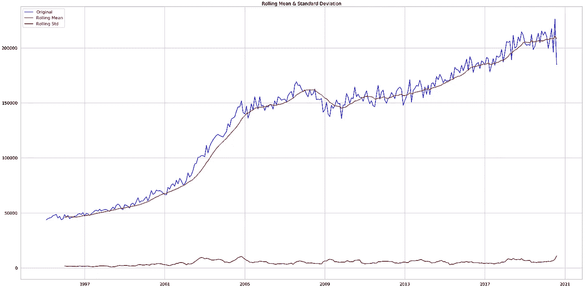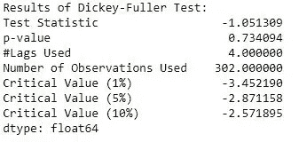

一个平稳的时间序列有一个接近常数的平均值，显然这不是我的时间序列的情况。Dickey-Fuller 检验的零假设是“时间序列是平稳的”。这里，我们不能在 90%的置信水平上拒绝零假设，因为 10%的临界值小于检验统计量，因此可以肯定地说我的时间序列是平稳的。我们可以用差分法使时间序列平稳，幸运的是这是 ARIMA 函数的一部分。

statsmodels 库有一个特性叫做季节性分解。这可以将时间序列分解成几个部分。

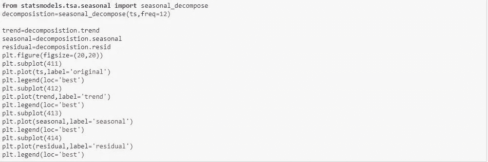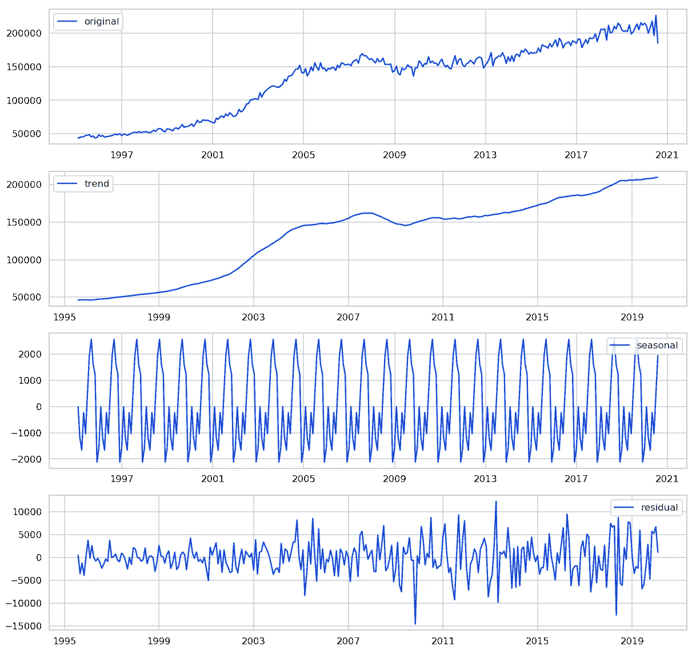

这一趋势表明，1995-2005 年间，房价的上涨速度比 2005 年以后要快得多，而 2005 年以后，房价的上涨速度有所放缓，在 2009 年(信贷紧缩)期间，房价甚至略有下降。从 2013 年开始，房价再次缓慢上涨。残差显示去除趋势和季节性的时间序列。看看剩余的图，很明显，从 2004 年开始，房价波动更加剧烈和不稳定。

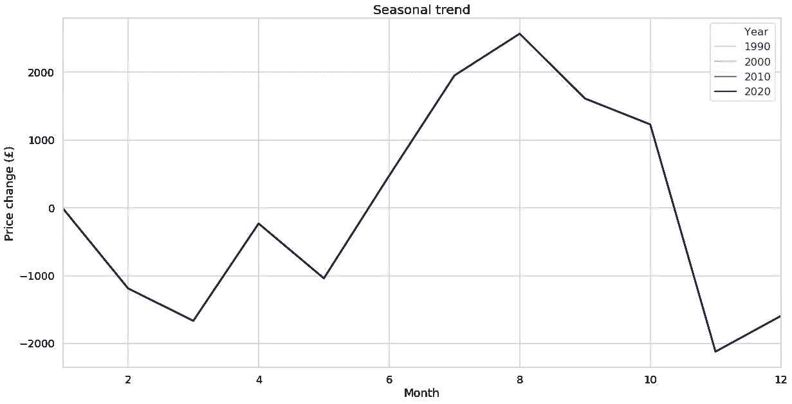

从上图中可以明显看出，数据中的季节性趋势每年都是一致的，8 月份价格最高，11 月份价格最低。谁想在圣诞节期间搬家？

**季节性自回归综合移动平均线(SARIMA)**

SARIMA 模型可用于拟合时间序列，然后用于预测该序列的未来值。模型必须参数化:(p，d，q)

p:模型中使用的滞后数

d:时间序列的每个观察值被差分的次数(这就是时间序列如何成为平稳的)

问:移动平均线窗口的大小

季节性因素还有另外 3 个参数，但是在这篇文章中我不会深入讨论。

pmdarima 库有一个名为 auto_arima 的有用函数，它执行网格搜索来为 arima 模型找到最佳参数(p，d，q)。每种参数组合都使用 Akaike 信息标准(AIC)进行评估。AIC 的值是对模型正确的可能性的估计，AIC 越低，模型越有可能真实地表示时间序列。AIC 完全依赖于训练数据，而不受测试数据的任何影响，这使得它适合于评估预测模型。

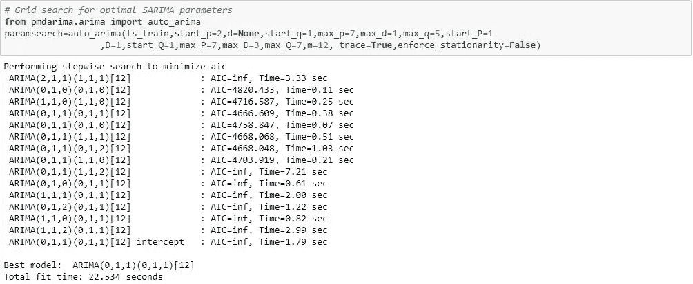

参数 ARIMA 参数(0，1，1)和季节性参数(0，1，1)输出最低的 AIC 值。

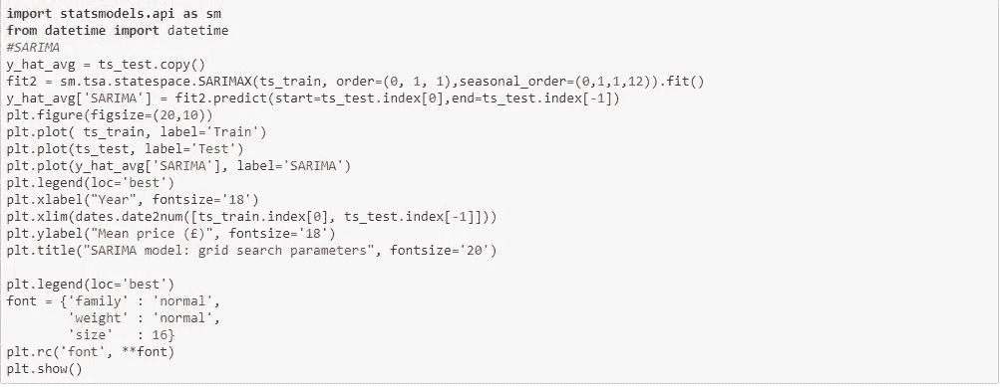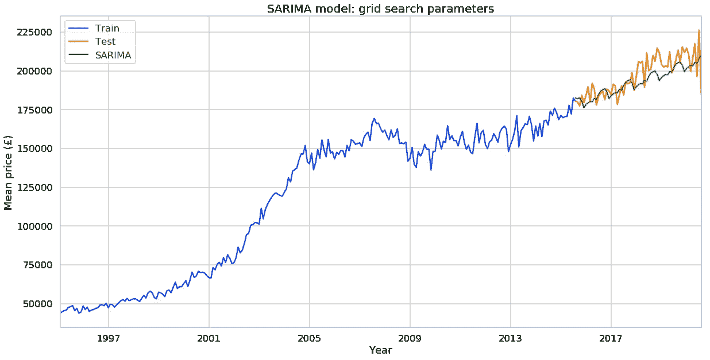

SARIMA 模型遵循测试数据的总体趋势，但是 SARIMA 没有对测试数据的波动进行建模。萨里玛模型中的波动是季节性周期。使用可以对模型进行更深入的分析。总结()。

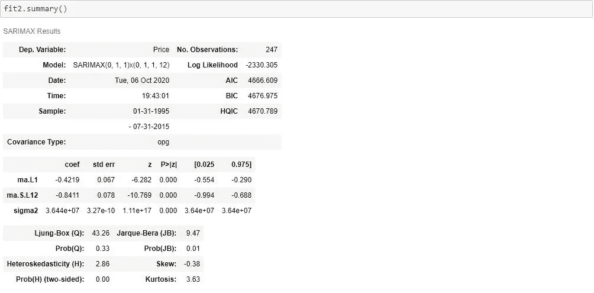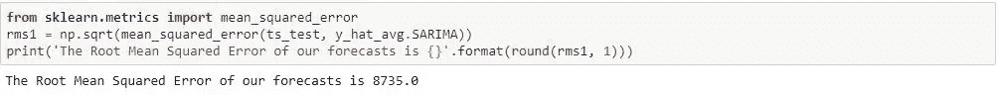

RMS 误差为 8735，这意味着测试数据和 SARIMA 数据样本之间平均有 8735 的差异。不算太差！

可以使用核密度估计(KDE)图来查看误差的分布。

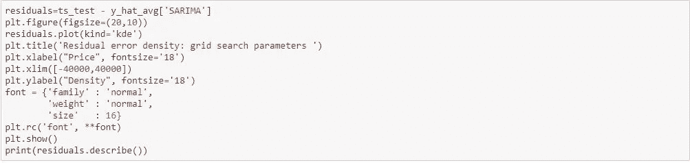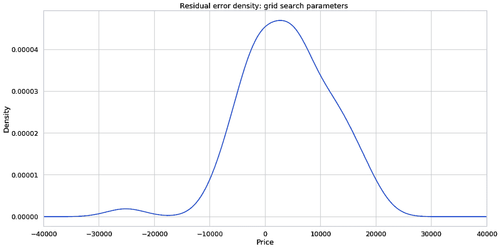

平均值不在 0 以上居中。这意味着误差不符合正态分布，因此误差不是随机的……模型可以更好地参数化。

经过对 ARIMA 参数的反复试验，我找到了(1，1，1)来改善模型对测试数据的拟合。

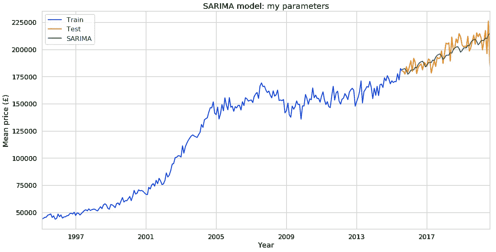

将模型(p)中的滞后数从 0 改变为 1 具有随着时间增加平均价格的效果，提供了对测试数据的更好拟合。

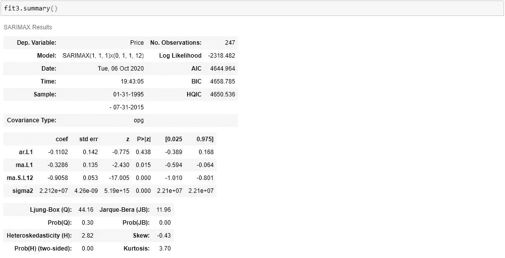

请注意，此 SARIMA 模型的 AIC 高于前一个模型，因此网格搜索没有将此模型作为最佳模型输出。

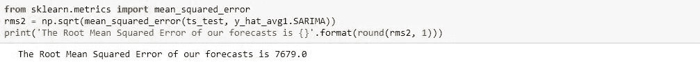

均方根误差降低了 1000 多倍！这证明一个人不应该把所有的信任都放在 AIC 价值上。

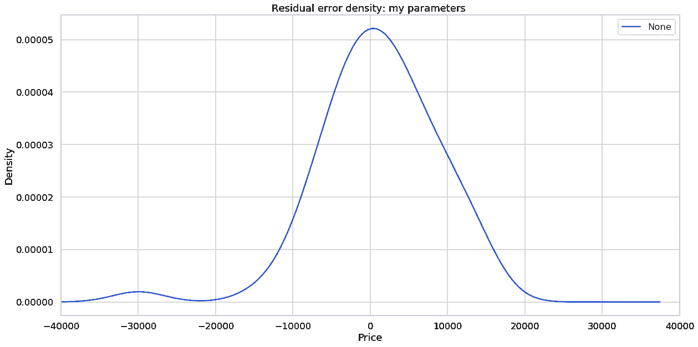

平均值现在更接近于 0，尽管它仍然稍微有点倾斜，线不是关于 0 对称的。总体而言，该模型过度预测了价格，这一点从 x 轴正侧的图形面积大于负侧的图形面积可以明显看出。

# 预测未来

为了预测未来的房价，我必须创建一个新的时间序列，一个延伸到未来 5 年的时间序列。

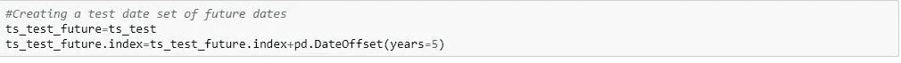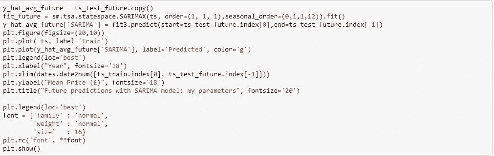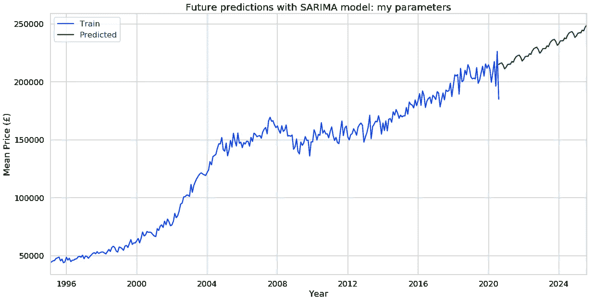

未来预测显示未来 5 年平均房价将会上涨。除了每年的季节性周期外，增长率是恒定的。现在手头有两个问题:我在预测未来的价格，我丢失了时间机器的钥匙。这意味着我没有测试数据，所以 AIC 是评估模型质量的合适方法。

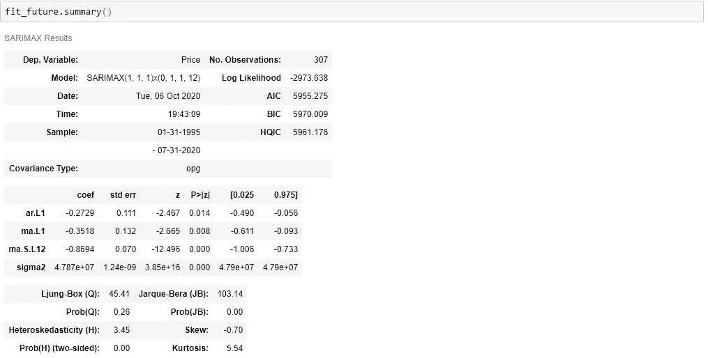

与预测过去价格时的值 4645 相比，未来价格预测模型的结果 AIC 是 5955。这不是我所期望的，因为未来的价格预测模型使用整个数据集，因此有更多的数据输入到模型中，而不是过去的价格预测模型，因为数据被拆分用于训练和测试，所以输入到模型中的数据较少。经过一些研究，我发现这是因为 AIC 假设数据的样本量是无限的，因此输入模型的数据量在确定 AIC 值时没有任何权重。

# 结论

如果你想在卡迪夫买一栋带露台的房子，那就尽快买一栋，它们只会越来越贵！并且不要忘记在季节周期的低谷期(11 月)买入。

在本项目中，SARIMA 产生的时间序列仅显示了平均房价随时间的变化所显示的一般趋势和季节周期，忽略了训练数据显示的波动。

感谢您的阅读。

源代码可以在我的 github 上找到:[https://github . com/risdallseis/Cardiff _ house _ sales/blob/time _ series _ sarima/Cardiff _ monthly _ time _ series . ipynb](https://github.com/risdallseis/Cardiff_house_sales/blob/time_series_sarima/cardiff_monthly_time_series.ipynb)