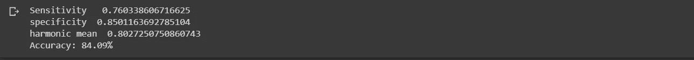

# 用 CNN 预测基因

> 原文：<https://medium.com/analytics-vidhya/predicting-genes-with-cnn-bdf278504e79?source=collection_archive---------7----------------------->

**用于宏基因组学基因预测的卷积神经网络**

# 基因组学中的深度学习

预测宏基因组片段中的基因是一项具有计算挑战性的任务，由于数据的短读取长度、不完整和碎片化性质，传统的机器学习技术提取大量特征，然后应用统计方法或监督分类方法来预测基因。

本研究使用卷积神经网络进行宏基因组学基因预测，克服了特征提取和选择步骤，该方法能够学习编码区和非编码区的特征，并直接从原始 DNA 序列中区分编码区和非编码区。

卷积神经网络(CNN)展示了基因组学中功能基序的最新预测。细胞神经网络在需要输入中的一些空间不变模式的设置中是有用的，例如图像或序列数据。CNN 的输入通常是实值矩阵。在基因组学中，输入可以是 DNA 序列，其中核苷酸 A、C、T 和 G 被编码为[1，0，0，0]、[0，1，0，0]、[0，0，1，0]和[0，0，0，0，1]。直接读取数据输入的神经元被称为第一层，或输入层。第二层由读入第一层输出的神经元组成，对于更深的层也是如此，更深的层也被称为隐藏层。神经网络的输出是感兴趣的预测，例如，输入的 DNA 是否是增强子。

# 加载训练数据

我们使用这个[链接](http://180.208.58.19/Meta-MFDL/)下提供的 traTest700.zip 数据来训练和测试我们的方法

首先，我们填充所有的基因组，然后从文件中提取所有的编码和非编码 orf。

现在让我们提取所有的 orf。非编码 orf 标记为 0，编码标记为 1，这一步我们提取了近 4 百万个 orf

因为训练 400 万个 orf 在计算上很昂贵，所以我只选择了 85000 个 orf，并在这个[链接](https://drive.google.com/drive/folders/1YcOCetzL8X4-YK-ShdWgih0YGWnBHLB2?usp=sharing)下上传到 google drive，以便在 google colab 中训练模型。

# 从 colab 中读取数据

在阅读完数据后，我们对 orf 应用一热编码，我在这篇[文章](/@elferachid/one-hot-encoding-dna-92a1c29ba15a)中解释了这一点。

orf 总是有不同的长度，深度学习无法处理可变大小的输入，所以我们应用了我之前帖子中解释的帖子填充，你可以在这里找到。

现在我们需要对标签进行一次热编码，并将编码的 orf 堆叠到 numpy 数组中。

在创建模型之前，我们还有最后一步，你猜猜看！？。将数据分为训练和测试。我们使用 20%的数据作为测试集。

最后，是时候创建我们的 CNN 模型了，超参数步骤已经完成。

现在，让我们训练我们的模型并观察它的性能，训练数据分为 70%用于训练，30%用于验证。

是时候使用混淆矩阵来评估我们的模型了。

我们的模型存档了 85%的准确率，这并不坏，但如果我们用所有数据训练模型，我们可以将准确率提高到 94%，因为深度学习获得的数据越多，它的表现就越好。

# 摘要

在这一课中，我们学习了如何应用 CNN 进行基因预测，以及创建一个 CNN 的步骤，我的下一篇文章将是关于使用 NLP 进行基因预测的。

在我的 [LinkedIn](https://www.linkedin.com/in/rachid-elfermi-75a84b8b/) 和 [GitHub](https://github.com/rachidelfermi) 关注我。