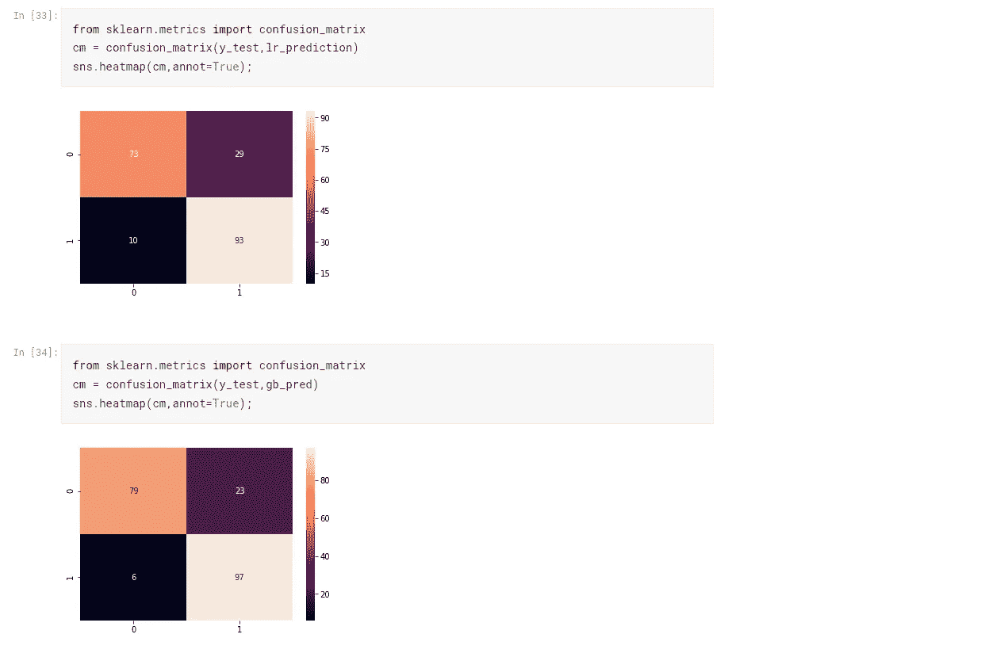

# 利用探索性数据分析和 ML 模型预测心脏病

> 原文：<https://medium.com/analytics-vidhya/predicting-heart-disease-by-using-exploratory-data-analysis-and-ml-models-22d70946cd88?source=collection_archive---------7----------------------->

> 我们的活动定义了许多事情，它与外在的成长和成功无关，但我们内在器官的健康也取决于我们的习惯。所以吃得健康，保持健康，快乐！

了解用于预测心脏病发作的心率监测的各种参数。

1.  **静息血压:**—120–129 毫米汞柱范围为收缩压，小于 80 毫米汞柱为舒张压。心肌收缩时心脏动脉的压力。
2.  **胆固醇:——**胆固醇是血液中的一种蜡状物质。身体需要胆固醇来构建健康的细胞。存在两种类型的胆固醇——低密度脂蛋白(LDL)和高密度脂蛋白(HDL)。低密度脂蛋白是有害的胆固醇，因为它在动脉的瓣膜中堆积，导致阻塞。而高密度脂蛋白胆固醇是好的，因为它可以吸收坏的胆固醇并将其带回肝脏。
3.  **空腹血糖:——**如果一个人的血糖水平低于 100 毫克/分升，他就被认为是正常的。超过 126 毫克/分升意味着这个人患有糖尿病。
4.  **心电图:——**心电图仪通过贴在皮肤上的传感器，以脉冲的形式显示心律(心跳)和电活动信号。
5.  **运动诱发的心绞痛:——**心绞痛是一种因流向心脏的血液减少而诱发的胸痛。如果心绞痛只在运动时发生，那就不要担心，因为它可能是因为一些堵塞。但是即使稳定了，心绞痛还是会发生，这时就有大问题了(医疗急救)
6.  **地中海贫血:——**血液中血红蛋白量不足导致地中海贫血。血红蛋白是一种蛋白质，对红细胞起作用。重型地中海贫血和轻型地中海贫血是两种类型，男性的血红蛋白水平在 13.5 至 17.5 克/分升范围内是正常的，女性在 12.0 至 15.5 克范围内。

**关于数据集**

数据集始于 1988 年，由四个数据库组成:克利夫兰、匈牙利、瑞士和长滩 v。它包含 76 个属性，包括预测属性，但所有已发表的实验都引用了其中 14 个属性的子集。“目标”字段是指患者是否存在心脏病。它是整数值，0 =疾病，1 =无疾病。数据由 David Lapp 在 Kaggle 上发布:- kaggle 数据集下载-d John Smith 88/heart-disease-dataset。

**读取数据集**

14 列，包含检测心脏病的所有参数

**定义列标签**

新的列透明标签

**大血管心绞痛**

心绞痛(痛苦/疼痛)图

**胸痛性别明智**

**血压与胆固醇的关系图**

简单线性回归图

血压计数

正常和异常血压计数

**胆固醇计数**

正常和异常胆固醇分布。

**地中海贫血计数**

**最大心率计数**

**所有列的绘图**

分布图

**通过使用各种模型进行预测来应用机器学习**

1.  SVM(支持向量机)

大约 81%(径向基函数和线性 SVM)

2 .逻辑回归

LR 也有 81%左右

3.梯度推进分类器

一种用于预测的集合模型，它是一种决策树。

大约 86%

4.决策树分类器

比梯度提升实现的准确度高 98%

5.KNN 分类器

不同邻居(n)值的精确度。

6.各种型号性能概述

决策树提供最佳结果

7.混淆矩阵

**各模型预测图**

0 =疾病，1=无疾病

决策树能够准确预测(98%)

**参考资料:-**

1.  恩加雷，肯尼迪。(2019).心脏病预测系统。-[https://www . research gate . net/publication/331589020 _ 心脏病 _ 预测 _ 系统/引文/下载](https://www.researchgate.net/publication/331589020_Heart_Disease_Prediction_System/citation/download)
2.  AvinashGolande，Pavan Kumar T .使用有效的机器学习技术进行心脏病预测-[https://www . ijrte . org/WP-content/uploads/papers/v8i1s 4/a 11740681s 419 . pdf](https://www.ijrte.org/wp-content/uploads/papers/v8i1s4/A11740681S419.pdf)
3.  ka ggle Commit-[https://www . ka ggle . com/sai Shur/analysis-of-heart-disease-by-ml？scriptVersionId=28402041](https://www.kaggle.com/saishur/analysis-of-heart-disease-by-ml?scriptVersionId=28402041)