# 预测心脏病-第一部分

> 原文：<https://medium.com/analytics-vidhya/predicting-heart-diseases-part-1-d1e297fad9f4?source=collection_archive---------31----------------------->

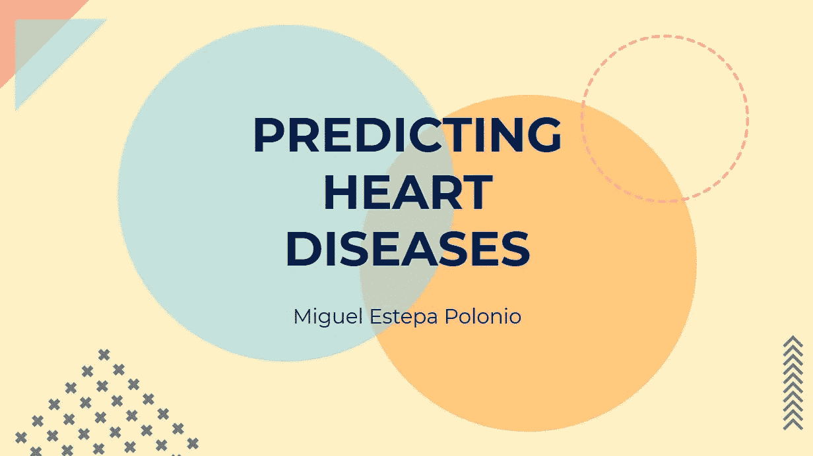

如今，我们正与全球艾滋病形势作斗争，但我们不能忘记心脏病，根据许多机构的说法，T2 是全世界最大的死亡原因。

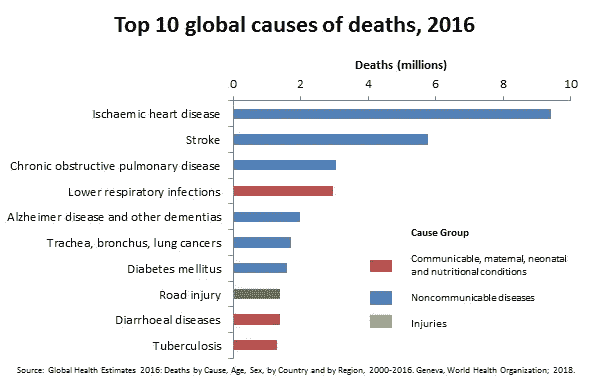

[来自世卫组织的数据。](https://www.who.int/news-room/fact-sheets/detail/the-top-10-causes-of-death)

心脏病有很多种，但在这个案例研究中，我将重点关注“**冠心病**”。这是由于冠状动脉中的脂肪物质阻塞或中断了心脏的血液供应。最常见的症状是心绞痛、心脏病发作和心力衰竭。

# 如果我告诉你我们可以预测它们会怎么样？

由于机器学习和 Python，我们可以使用医疗信息和小数据集来教授和训练算法。然后，我们可以将这个模型应用于任何人群，以估计这些人群的风险水平。为此，我使用的 3 个关键概念是:

*   [**弗雷明汉风险评分**](https://framinghamheartstudy.org/)
*   **数据分析**
*   **机器学习**

如上所述，我使用的方法可以推广到任何国家或地区，但因为我是西班牙人，我决定做整个项目，考虑到我的目标是研究西班牙人口。

请跟随我踏上之旅，在这里我将解释如何在人口统计学层面上预测这些疾病。

# 弗雷明汉风险评分

简而言之，这是一项医学研究，测量一个人在未来 10 年内患心脏病的概率。这是用弗雷明汉人(英格兰)作为实验人口完成的。专家们研究了他们的心血管问题以及与年龄、吸烟习惯或饮酒等几个因素的关系。

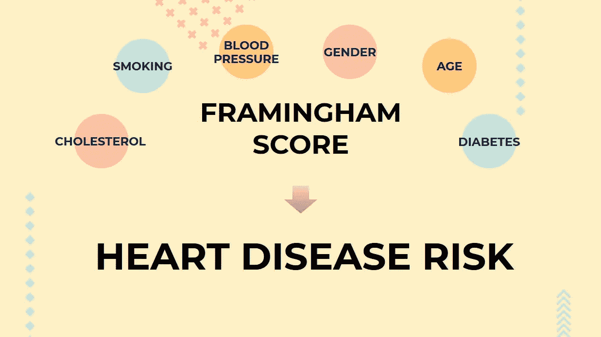

研究的不同方面。

这项研究根据这些特征给一个人打分。如果你有糖尿病，你会得到一些分数，如果你吸烟，你会得到分数，等等。最终，**你的积分越多，风险就越高**。

## 准备我们的数据

首先，我需要一个好的数据集，包含弗雷明汉风险评分考虑的所有参数。我在 [**Kaggle**](https://www.kaggle.com/sulianova/cardiovascular-disease-dataset) 找到一个不错的，70.000 行。它有我想要的一切:年龄、性别、胆固醇、吸烟习惯等等。**数据集干净而平衡**。

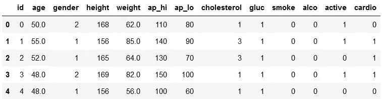

使用 **Python** ，我定义了一个**函数**，考虑到所有的 Framingham 参数，**计算数据集中每个虚构人物的风险分数**。此外，请记住，这项研究是在人口统计学层面上进行的，在这种统计数据中很难找到可靠的医学信息，如人群中的胆固醇水平。

所以，我**放弃了所有的医疗数据**。

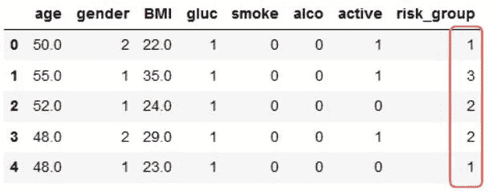

你注意到了吗？许多列被删除。此外，还出现了两个新名称:“身体质量指数”和更重要的“风险组”。**身体质量指数**是身体质量指数；一种简单的方法来联系身高和体重，并不是完美的，但便宜的方法来确定一个人是否超重。

**风险组**是一个新的类别，区分 5 个风险级别，从 1(低)到 5(非常高)。机器学习在处理少量类别时效果更好，所以我决定对不同的弗雷明汉分数进行分组。

# 预测风险

现在我们已经准备好了数据，是时候进行机器学习了。你可能知道，在 ML 中会有一个**目标**列(我们要预测的数据)。其他的将被用来计算这个预测。“T20”风险集团“T21”将是我的目标。

在此之前，我会检查**相关性**。这很重要，因为我们可以看到一个变量过于依赖另一个变量。

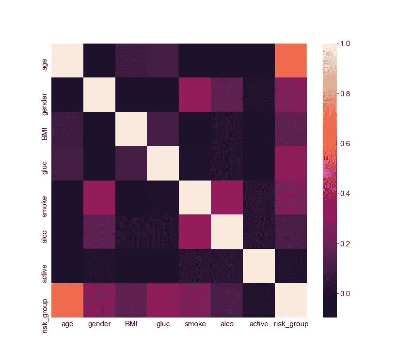

使用 Seaborn 绘图。

年龄相关性最高，但这是正确的，因为根据弗雷明汉的研究，年龄是风险得分的最决定性因素。

然后是时候**缩放**我们的数据了。这里有不同的数量级。二进制(0 或 1)或其他参数，如年龄，从 30 到 80。“最小最大值缩放器”使这些差异均匀化，因为它**将所有值更改为 0 到 1 之间的数字**。它会给我们的最终解决方案一个更好的结果。

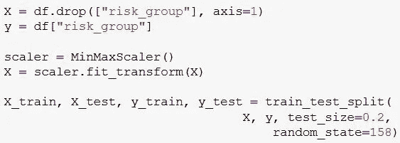

此外，我将数据分为“**训练数据**”(我将用来训练我的算法的信息)和“**测试数据**”(我将用来检查我的模型的准确性的值)。这种分割过程不是 50/50 的划分，而是通常 80%的训练数据(56.000 人)和 20%的测试数据(14.000 人)。

# 该算法

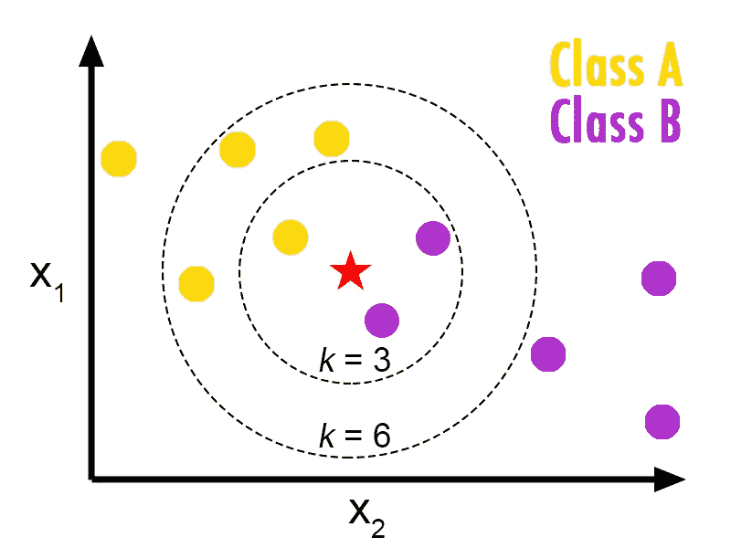

KNN 背后的概念。

在 ML 中，有许多不同类型的算法，每一种算法根据问题的不同都有优缺点。做了几次尝试后，我选择了**【KNN】K-最近邻。这种方法将研究每个人的数据，并确定这些特征是否属于某个风险群体或其他。**

**一旦你有了算法，检查一下所谓的“**超参数调整**”总是好的，这是一种“让我们去寻找这个问题可能的最佳配置”的花哨说法。如果你想了解这个过程的更多细节，请查看我的回购。请注意，最后我只是想要一个准确度分数，这个值将给出我们对每个人进行正确风险分类的概率。**

# **结果呢**

**在改进了我的算法的不同参数之后，我得到了 61%的**。****

****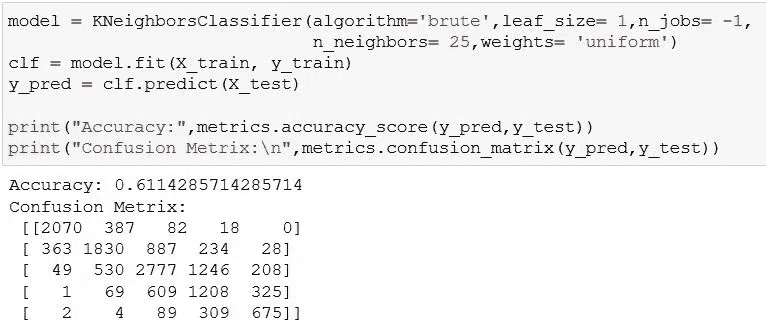****

****从我的笔记本到你的屏幕。****

****所有这些工作只是为了得到 61%的准确率？等等。这样好吗？这很糟糕吗？记住大多数时候**精度不够**。如果我们考虑 2 个以上的选项，那么**混淆矩阵**就派上用场了。****

## ****让我们探索矩阵。****

****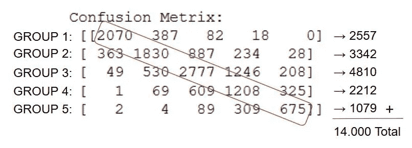****

****该矩阵中的每一行代表与不同风险组相关的预测。对角线上的**数字是正确的预测**，而其他数字是错误的预测。请记住，在这个测试数据中，我有 14，000 行。****

****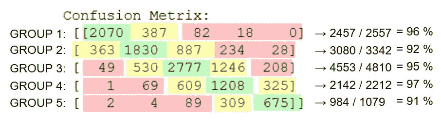****

****当预测一个有几种不同可能性的值时，不仅要知道错误，还要知道这个错误的**程度**。如果我们考虑正确类别中的值，前一组和后一组，这些数字非常有趣。正如我们所看到的，ML 不仅选择了正确的类别，而且避免了相反的类别。极端错误的类别从未超过 9%。****

****最后，我的模型准备好了，我希望你能理解我在整个过程中的想法。下一步将是创建一个西班牙人口模型，应用最大似然算法并研究结果。****

# ****结束永远不是结束****

****非常感谢你读到这里。我不想在一篇文章中给你那么多信息，以免让你不知所措，所以我决定把它分开。在这里，你可以阅读本书的**动机**、**目标**和**最重要的概念**:****

*   ******弗雷明汉评分风险**。****
*   ******机器学习**。****

****但是你没看到我是怎么把这个不可思议的工具应用到西班牙人口模型上的。**敬请关注本文的第二部分**，你会发现惊人的结果和一些惊喜。****

******如果你喜欢，请鼓掌并与你认为可能感兴趣的人分享！******