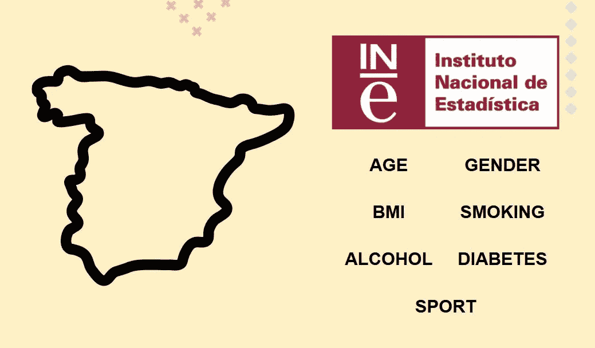
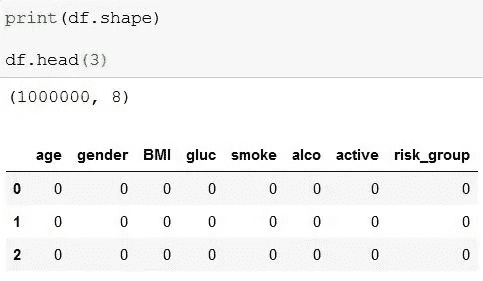
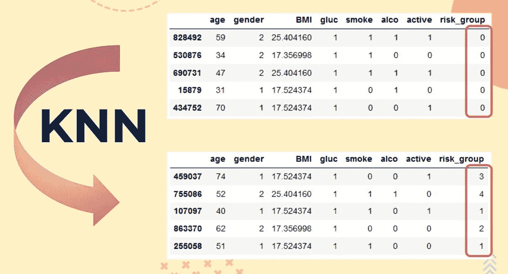
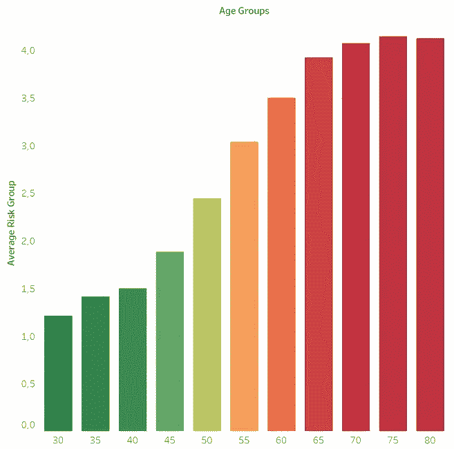
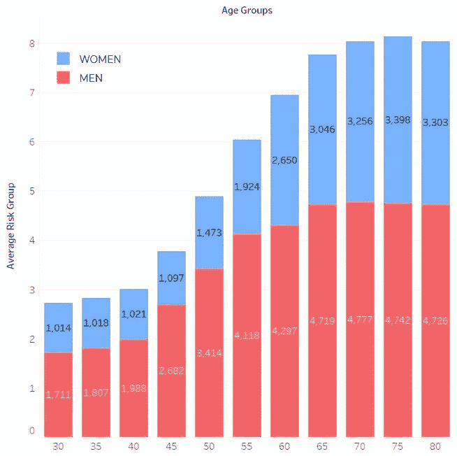
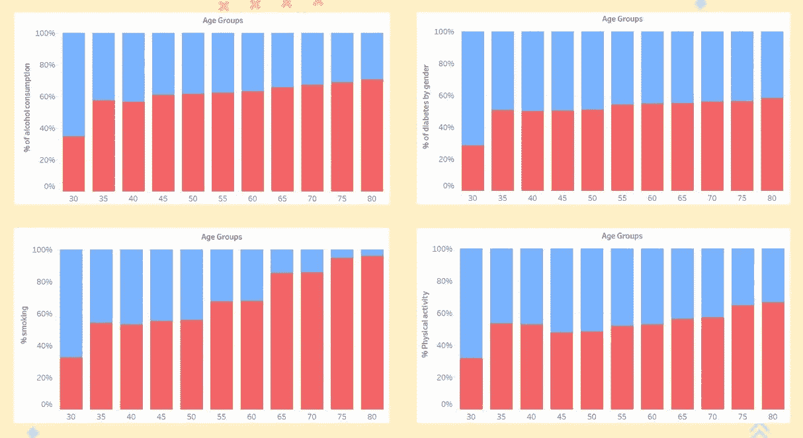
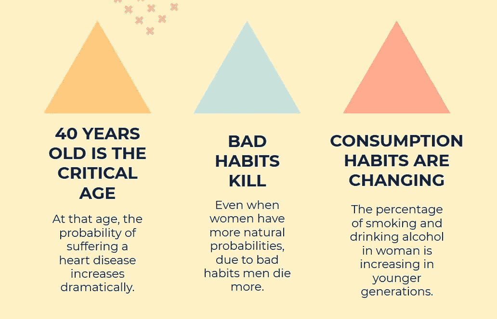
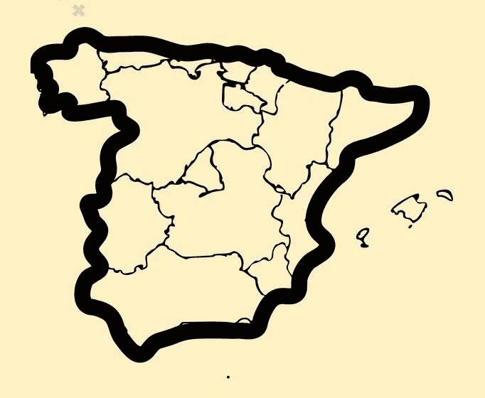

# 预测心脏病——第二部分

> 原文：<https://medium.com/analytics-vidhya/predicting-heart-diseases-part-2-e572d3f83230?source=collection_archive---------13----------------------->

在我的上一篇文章中，我向您解释了基于 Framingham 风险评分的特征生成预测心脏病的机器学习算法的过程。如果你没有看过，请点击这里查看，这样你会对这一切有更好的理解。话虽如此…

# 是时候为一个国家建模了！

为了预测所有这些疾病，首先我必须对人群进行建模。在这种情况下，由于我是西班牙人，我决定模仿**西班牙**。但是什么是“模拟一个国家”，为什么？

当我说“模拟一个国家”时，我的意思是创建一个**数据集**，它拥有我需要的所有信息(如吸烟习惯、年龄、性别等)，基于来自**西班牙人口**的各种统计数据。

这是一项有趣而复杂的任务，因为医疗信息总是一件明智的事情。人们的医疗信息没有公开或可获取的信息，如“全国血压均值”。

正因为如此，在这个项目的第一部分，我从最初的数据集中删除了所有的医学特征。我用“吸烟习惯”等更常见的东西来训练我的模型，这样我就可以在未来使用这个预测模型。

# 我的秘密武器

很简单:[**INE**](https://www.ine.es/)**(国家统计研究所)。在国家统计局，我几乎找到了我需要的一切:**年龄、性别、身体质量指数、吸烟习惯、久坐不动和饮酒**。对于糖尿病，我不得不做更深入的研究。**

**有了所有这些信息，我创建了数据集。使用 **Python** 和**熊猫**，一点一点地，一次一个特性，我实现了我所有的数据。从**年龄**和**性别**开始。**

****

**一块 1.000.000 行的空白画布。**

**一旦完成，我就可以介绍我的其他信息了。请记住，INE 的大部分统计数据是按性别和 5 岁的年龄范围划分的，所以正确地完成第一部分对继续下去极其重要。**

**在摆弄完我心爱的 Python 之后，我用我想要的数据填充了我的专栏。如果你了解整个过程，我强烈推荐你去[查看我的回购](https://github.com/miguestepa/Project-Week-8-Final-Project/tree/master/your-project/coutry_model)，在**我有几个详细的 Jupyter 笔记本**解释每一步。**

****

**将 KNN 应用于我的西班牙人口数据集。**

# **让我们把数据可视化吧！**

**我用我的新数据集做了很多探索，但我更喜欢在这里保持简单。我不想让你不知所措(即使我用 **Tableau** 做的这些图很酷)！除了笑话，请记住，如果你愿意，你可以摆弄这个数据集，寻找更多的见解。话虽如此，我们还是去查一些图表吧。**

****

**年龄与风险。**

**年龄与风险是解决我的问题的第一步。在我的第一篇文章中，记得我把患心脏病的风险分成了 5 组。1 表示“低风险”，5 表示“非常高风险”。此外，我的数据集中的年龄从 30 岁到 80 岁不等，并被分为 5 岁组。**

****

**年龄和性别与风险。**

**第一个情节的第二次迭代对我来说有趣多了。它也显示了考虑性别的平均风险。如你所见，这种风险在男性中比在女性中高得多。**

****

**分析特征与年龄和性别。**

**也许这在这面墙上得到了很好的解释。男性有更多的不良习惯，如吸烟或饮酒，这些都是严重的危险因素，尤其是吸烟。**

# **结论**

**终于！在研究了我的数据后，我可以看到西班牙人口中的 3 个主要问题。**

****

**结论。**

**第一个可能非常明显，因为中年是人们健康对不同问题变得更加敏感的时期。然而，我不得不承认第二和第三个结论给我留下了深刻的印象。**

**根据弗雷明汉评分的参数，女性患心脏病的概率更大。当她们进入更年期时，她们体内强大的荷尔蒙屏障开始下降。**但是**就像我说的，因为**男性的有害物质消耗率**高很多，所以他们的风险百分比更差。**

**如果这种趋势不改变的话，在接下来的几十年里，我们将会看到西班牙女性患心脏病的人数增加。**

# **最后的想法**

**就像我常说的，**这不是结束而是开始**。在这两篇文章中，我向您展示了如何创建 ML 模型，以及如何将它应用于西班牙人口模型。**

****

**然而，这个项目远远没有完成。我说的不是分析本身，而是问题的范围。拥有一个国家(在这个例子中是西班牙)的数据本身并不能说明什么。这个项目的**最终目标**是**研究**西班牙**的每个地区**。**

**然后我们可以分析政府应该在哪里以及如何行动，给出更具体的答案。**

**在一些地区可能有大量的年轻吸烟者，而在其他地区可能有惊人比例的超重者。这些特定的健康运动可以在对抗这些可怕的疾病的战斗中产生更好的效果和帮助。**

**就是这样！**非常感谢**阅读这篇文章！我真的很喜欢这个项目，在上面投入了很多。我希望你也觉得有趣！如果你喜欢，我提醒你，你可以**拍**和**分享**！那会给我一些额外的鼓励来继续我的研究。如果你有任何疑问或问题，请便！**我会很乐意回答的**。**