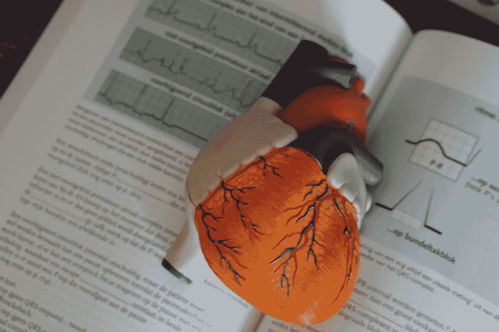

# 使用机器学习预测心力衰竭，第 1 部分

> 原文：<https://medium.com/analytics-vidhya/predicting-heart-failure-using-machine-learning-part-1-6c57ce7bee8c?source=collection_archive---------11----------------------->

随机 Forrest vs XGBoost vs fastai 神经网络

Robina Weermeijer 在 [Unsplash](https://unsplash.com/s/photos/medical?utm_source=unsplash&utm_medium=referral&utm_content=creditCopyText) 上的照片

全世界每年都有数百万人死于心血管疾病。它们是心脏和血管的疾病，分为心脏病发作(由心脏血管闭塞引起)、中风(由脑血管闭塞或破裂引起)和心力衰竭(由心脏不能泵血引起)