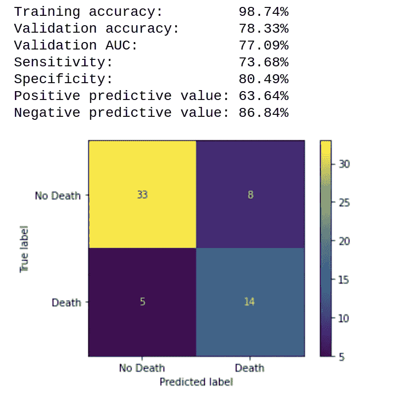

# 使用机器学习预测心力衰竭，第 2 部分

> 原文：<https://medium.com/analytics-vidhya/predicting-heart-failure-using-machine-learning-part-2-b343471dbde8?source=collection_archive---------13----------------------->

XGBoost 参数优化的简便方法

照片由 [Robina Weermeijer](https://unsplash.com/@averey?utm_source=unsplash&utm_medium=referral&utm_content=creditCopyText) 在 [Unsplash](https://unsplash.com/s/photos/medical?utm_source=unsplash&utm_medium=referral&utm_content=creditCopyText) 拍摄

在我的[上一篇文章](/analytics-vidhya/predicting-heart-failure-using-machine-learning-part-1-6c57ce7bee8c)中，我使用随机森林、XGBoost、神经网络和一组模型预测了心力衰竭。在这篇文章中，我想回顾一下 XGBoost 参数优化，以提高模型的准确性。

据官方 [XGBoost 网站](https://xgboost.readthedocs.io/en/latest/)介绍，XGBoost 被定义为一个优化的分布式梯度增强库，旨在高效、灵活、可移植。它在梯度推进框架下实现机器学习算法。XGBoost 提供了一种并行的树提升(也称为 GBDT，GBM ),可以快速准确地解决许多数据科学问题。

XGBoost 非常受 [Kaggle](https://www.kaggle.com/) 比赛参与者的欢迎，因为它可以实现非常高的模型精度。唯一的问题是为了得到好的结果，需要优化的参数数量。

XGBoost 有三种类型的参数:常规参数、助推器参数和任务参数。一般参数选择哪一个助推器你正在使用做助推器，通常树或线性模型；助推器参数取决于你选择的助推器；学习任务参数指定学习任务和相应的学习目标。所有参数的详细描述可以在[这里](https://xgboost.readthedocs.io/en/latest/parameter.html)找到。

查看所有参数超出了本文的范围。相反，我将集中精力优化以下选定的树增强器参数，以提高我们的 XGBoost 模型的准确性:

1.  有助于防止过度拟合的参数(别名用于使用 sklearn 命名约定的 XGBoost python sklearn 包装器)

`eta`[默认值=0.3，范围:[0，1]，别名:`learning_rate` ]

*   更新中使用的步长收缩可防止过度拟合。在每一步提升后，我们可以直接得到新特征的权重，`eta`收缩特征权重，使提升过程更加保守。

`max_depth`[默认值=6，范围[0，∞]]

*   树的最大深度。增加该值将使模型更加复杂，并且更有可能过度拟合。只有当 tree_method 设置为`hist`时，0 才在`lossguided`增长策略中被接受，它表示对深度没有限制。请注意，XGBoost 在训练深度树时会大量消耗内存。

`min_child_weight`[默认值=1，范围[0，∞]]

*   一个孩子所需的最小体重总和。如果树划分步骤导致实例权重之和小于`min_child_weight`的叶节点，那么构建过程将放弃进一步的划分。在线性回归任务中，这只是对应于每个节点中需要的最小实例数。`min_child_weight`越大，算法就越保守。

`gamma`[默认=0，范围[0，∞]，别名:`min_split_loss` ]

*   在树的叶节点上进行进一步划分所需的最小损失减少。`gamma`越大，算法就越保守。

`subsample`[默认值=1，范围:[0，1] ]

*   训练实例的子样本比率。将其设置为 0.5 意味着 XGBoost 会在生成树之前随机采样一半的训练数据。这将防止过度拟合。子采样将在每个提升迭代中发生一次。

`colsample_bytree`[默认值=1，范围[0，1]]

*   Colsample_bytree 是构造每个树时列的子样本比率。对于每个构建的树，进行一次子采样。

`lambda`[默认值=1，别名:`reg_lambda` ]

*   关于权重的 L2 正则化项。增加该值将使模型更加保守。

`alpha`[默认值=0，别名:`reg_alpha` ]

*   关于权重的 L1 正则项。增加该值将使模型更加保守。

2.用于处理不平衡数据集的参数

`scale_pos_weight`[默认值=1]

*   控制正负权重的平衡，对不平衡类有用。要考虑的典型值:`sum(negative instances) / sum(positive instances)`。

3.其他参数

`n_estimators`[默认值=100]

*   梯度推进树的数量。相当于助推轮数。

以上参数定义均来自官方 XGBoost [网站](https://xgboost.readthedocs.io/en/latest/)。

有了这些关于 tree booster 参数的简短知识，让我们导入库，加载数据集，创建独立和相关变量，并将数据集分成训练集和测试集。

现在，让我们用默认参数训练我们的模型。

如您所见，即使使用默认参数，该模型也为我们提供了可接受的结果。为了找到最佳参数，我使用了 GridSearchCV，这是 sklearn 的 model_selection 包中的一个库函数。它有助于循环通过预定义的超参数，并使我们的模型适合训练集。因此，最终，我们可以从列出的超参数中选择最佳参数。我为以下每个参数尝试了三个值:learning_rate、max_depth、min_child_weight、gamma、subsample 和 colsample_bytree。

接下来，我用更新的参数训练我们的模型。因为我降低了学习率，所以我增加了梯度推进树的数量。

通过这一简单的步骤，我成功地将验证准确性从 76.67%提高到 80.00%，并将验证 AUC(曲线下面积)从 68.81%提高到 75.48%。

有了充足的时间和计算机能力，人们可以扩大助推器参数搜索的取值范围，并使用 GridSearchCV 结果作为进一步参数研究的基础。例如，如果 GridSearchCV learning_rate 从默认的 0.3 减少到 0.2，在下一轮搜索中，我们可以像[0.05，0.1，0.2]一样将范围进一步左移。

接下来，我尝试优化正则化参数 reg_lambda 和 reg_alpha。

GridSearchCV 发现 reg_alpha 和 reg_lambda 的默认值是最佳值。最后一个需要优化的参数是 scale_pos_weight，我一直在增加这个参数，直到找到一个值为 4 的参数，这样可以得到最好的结果。然后，我用这些最终优化的参数来训练我的模型。下面是带有额外指标的代码，包括灵敏度、特异性、阳性预测值和阴性预测值。

结论:在 GridSearchCV 的帮助下，通过几个简单的步骤，我成功地将验证准确性从 76.67%提高到 78.33%，并将验证 AUC(曲线下面积)从 68.81%提高到 77.09%。虽然使用特征工程可以获得最佳的精度改进，但是 XGBoost 参数优化也是值得的。

感谢你花时间阅读这篇文章。

在这艰难的时刻致以最美好的祝愿。
安德鲁
[@坦帕帕斯](http://twitter.com/tampapath)