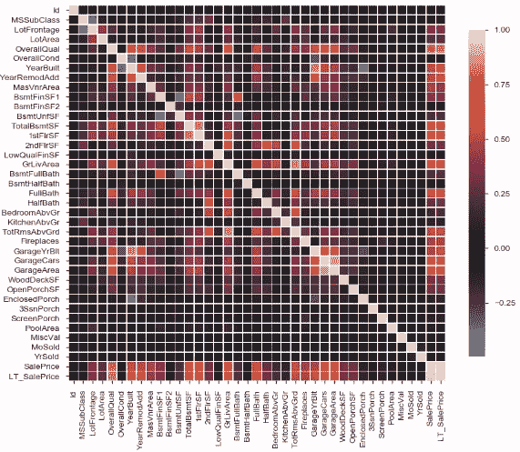
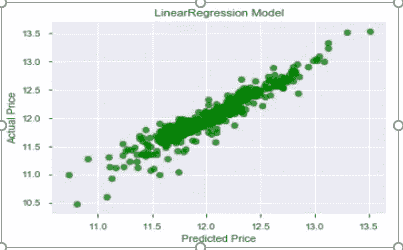

# 使用经典机器学习和深度学习技术预测房价

> 原文：<https://medium.com/analytics-vidhya/predicting-house-prices-using-classical-machine-learning-and-deep-learning-techniques-ad4e55945e2d?source=collection_archive---------0----------------------->

房价是经济的一个重要反映，房价范围是买卖双方都非常感兴趣的。在这个项目中，房价将在给定解释变量的情况下进行预测，这些解释变量涵盖住宅的许多方面。这个项目的目标是创建一个回归模型，能够准确估计给定特征的房子的价格。

# 数据采集:

T 这是一场 **Kaggle 房价预测比赛**。该项目的目标是执行数据可视化技术，以了解数据的洞察力。机器学习通常需要理解数据及其洞察力。这个项目旨在应用各种 [**Python**](https://www.python.org/) 工具来获得对数据的可视化理解，并对其进行清理，使其为在其上应用机器学习和深度学习模型做好准备。

**下载数据集请随意访问本:** [**链接**](https://www.kaggle.com/c/house-prices-advanced-regression-techniques/data)

# **问题陈述:**

****

**房价**

**住房价格是经济的一个重要反映，住房价格区间是买卖双方都非常感兴趣的。请购房者描述他们梦想中的房子，他们可能不会从地下室天花板的高度或靠近东西向铁路开始。但是这个游乐场竞赛的数据集证明，影响价格谈判的远不止卧室的数量或白色栅栏。**

**随着解释变量描述了(几乎)爱荷华州艾姆斯住宅的每个方面，这场比赛挑战你预测每所房子的最终价格。**

# **现实世界/业务目标和约束:**

## ****目标:****

**1.预测每栋房子的销售价格。**

**2.最小化预测和实际评级之间的差异(MSE 均方误差)**

## ****约束:****

1.  **某种形式的可解释性。**

# **数据概述:**

****

**数据集的图片**

## ****关于数据:****

****1。**列车数据中的数据点数: **1460****

****2。**列车数据中的特征数量: **81****

****3。**测试数据中的数据点数: **1459****

****4。**测试数据中的特征数量: **80****

# **将现实世界的问题映射到机器学习问题:**

**这个问题涉及到预测连续实值输出的房屋价格。由此可见，这是一个**回归问题。****

# **绩效指标:**

**使用**均方根误差(RMSE)** 作为性能指标。要了解更多信息，请点击:“****”**。****

# ****机器学习目标和约束:****

******1。**最小化 **RMSE。******

******2。尝试提供一些可解释性。******

# ******探索性数据分析:******

****ET22**勘探数据分析**是指对数据进行初步调查的关键过程，以便在汇总统计和图形表示的帮助下发现模式、发现异常、检验假设和检查假设。我们对数据进行了一些双变量分析，以更好地了解数据，并找出数据集中的异常值。异常值可能是由于收集数据时的某种错误而出现的，需要将其删除，以便它不会影响我们模型的性能。****

## ******训练和测试数据中零和 NaN 或空值的百分比:******

************

**左:用于列车数据: :右:用于测试数据****** 

## ****总体质量:****

****在进行数据分析时，我们注意到特征**总体质量**在决定房屋价格时起着巨大的作用。****

********

****总体平等****

## ******现在很少统计输出变量**:****

********

******输出变量描述:销售价格******

*   ****然后将目标变量**销售价格**可视化，以找到其分布:****

********

******销售价格输出特征分布:偏斜度为 1.8828757597682129******

## ****让我们尝试绘制 QQ 图:****

********

******销售价格的 QQ 图:-** 这看起来向右倾斜，倾斜角度为 1.8828757597682129****

# ****观察:****

*   ****这看起来向右倾斜了**倾斜 1.8875797682129******

## ****偏斜的解决方案:****

******对数变换**可用于降低高度偏斜分布的偏斜度。对数变换数据均值的比较，实际上是几何均值的比较。这是因为，如下所示，对数变换值的算术平均值的反对数是几何平均值。****

********

******销售价格输出特征分布:偏斜度为 0.12134661989685333******

# ****观察:****

*   ****这看起来几乎是正态分布，偏斜度为 0.1213466198968533****

## ****检查与输出要素的相关性:****

****在此之后，我们通过建立一个相关矩阵来找到与目标相关的最重要的特征。**相关矩阵**是显示变量之间相关系数的表格。表格中的每个单元格显示了两个变量之间的相关性。相关系数的值**在-1 到 1 之间。******

****相关性在许多应用中非常有用，尤其是在进行回归分析时。但是，不应该把它和因果关系混在一起，以任何方式曲解。您还应该始终检查数据集中不同变量之间的相关性，并收集一些见解作为探索和分析的一部分。****

******多重共线性:******

****如果数据集具有完全正或负的属性，那么模型的性能很有可能会受到一个名为“**多重共线性**”的问题的影响。当多元回归模型中的一个预测变量可以通过其他预测变量以较高的准确度进行线性预测时，就会出现多重共线性。这可能导致扭曲或误导的结果。****

****************

******左:用于列车数据::右:用于测试数据******

********

******放大******

*   ****由此我只能说，总的来说，TotalBsmtSF，GarageCars，GarageArea 与销售价格有很高的正相关性。可惜颜色不是很清晰。下面是一个更好的数值表示。****

# ****观察:****

*   ****我们可以看到输入特征之间没有太多的相关性。因此，特征之间不存在多重共线性。这很好。****
*   ****很少有特征与输出特征具有大于 0.5 的皮尔逊相关性。****
*   ****越接近 0 的值意味着相关性越弱(精确的 0 意味着没有相关性)****
*   ****越接近 1 的值意味着越强的正相关性****
*   ****越接近-1 的值意味着负相关性越强。****

# ****数据预处理:****

****由于各种原因，许多真实世界的数据集可能包含缺失值。它们通常被编码为名词、空格或任何其他占位符。使用具有大量缺失值的数据集来训练模型会极大地影响机器学习模型的质量。一些算法，如 scikit-learn 估计器，假设所有的值都是数字的，并且拥有有意义的值。处理这个问题的一个方法是去掉有缺失数据的观测值。但是，您可能会丢失包含有价值信息的数据点。更好的策略是估算缺失值。****

## ****这些是带有空值的列:****

********

******空值******

## ****处理空值:****

****为了尝试理解丢失的值是什么，我查看了数据文档，这帮助我转换其他特征以反映我所做的假设，例如，GarageArea 或 Alley 是零，表明我们没有车库，汽车也应该转换为 0。****

********

******处理 NaN 值******

# ****机器学习模型:****

****一旦数据被清理，我们现在将进一步制作我们的机器学习模型。由于我们的目标变量是连续的，我们将对数据集拟合一个回归模型。销售价格以美元为单位，我们将尝试使用一个 **3 层和一个 5 层神经网络**和几个**经典机器学习算法来预测它。******

## ****算法 1:“XG boost 回归模型”:****

********

******XGBoost**RMSE = 0.0211****

> ******结果:XGBoost RMSE= 0.0211******

## ******算法二**:**ridge regressor 模型】:******

********

******岭回归量 RMSE= 0.0183******

> ******结果:岭回归量 RMSE= 0.0183******

## ******算法三**:**线性回归模型】:******

********

******线性回归 RMSE= 0.01721******

> ******结果:线性回归 RMSE= 0.01721******

******算法 4**:**ANN(2 个隐藏层，无遗漏，无批处理标准化层):******

********

******ANN 1 : Summary::获得验证损失= 0.01871******

> ******结果:ANN 1 : Summary::获得的验证损失= 0.01871******

******算法五:** **【安(3 隐层，漏层(0.2)，带 BatchNormalisation 层】:******

********

******ANN 2: Summary::获得验证损失= 0.01893******

> ******结果:ANN 2: Summary::获得的验证损失= 0.01893******

******算法 6**:**ANN(5 个隐藏层，漏失(0.2)，带 BatchNormalisation 层):******

********

******ANN 3: Summary::获得验证损失= 0.01110******

> ******结果:ANN 3: Summary::获得的验证损失= 0.01110******

# ******使用漂亮表格进行比较:******

********

# ******结论:******

****提交给 Kaggle 比赛后这里是[排行榜](https://www.kaggle.com/c/house-prices-advanced-regression-techniques/leaderboard)和[代码](https://github.com/SubhamIO/House-Price-Prediction)。肯定可以做得更多。****

****感谢阅读！****

# ****参考资料:****

*   ****哈里森博士和 D. L .鲁宾菲尔德。1978."享乐型房价和对清洁空气的需求."j .环境。经济学。管理 5(1):81–102。****
*   ****Alejandro Baldominos、Iván Blanco、Antonio José Moreno、rubén iturarte、óscar Bernárdez 和 Carlos Afonso，“使用机器学习识别房地产机会”，2018 年 11 月。****