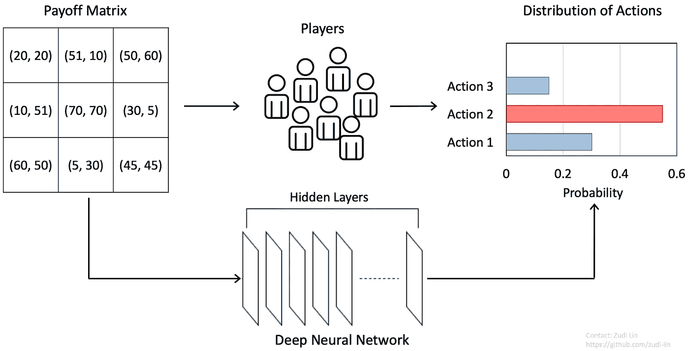
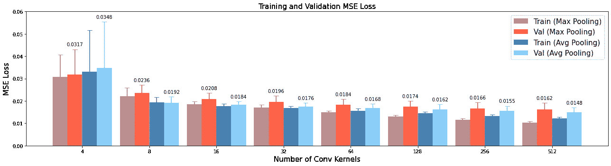
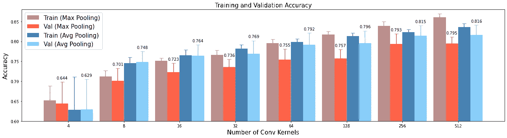

# 通过深度学习预测人类在游戏中的策略

> 原文：<https://medium.com/analytics-vidhya/predicting-human-strategies-in-games-via-deep-learning-787ae6667aca?source=collection_archive---------31----------------------->

**图 1** |利用深度神经网络预测一场范式游戏中人的动作分布。

N 正规形式博弈是博弈论中的一个经典模型，它帮助建立了几个理解人类策略的理论。最著名的例子之一是[囚徒困境](https://en.wikipedia.org/wiki/Prisoner%27s_dilemma)，这是一个普通形式的游戏，可以表现为一个 2x2 的收益矩阵。那么当面临选择时，囚犯们会怎么做呢？传统的博弈理论告诉我们，如果我们假设两个囚犯都完全理性*，那么两个囚犯都会背叛对方，因为这样的策略达到了纳什均衡:*

> *“涉及不同参与者相互作用的系统的一种稳定状态，在这种状态下，如果其他参与者的策略保持不变，任何参与者都不能通过单方面改变策略而获益”——新牛津美国词典*

*然而，尽管有强大的理论保证，纳什均衡模型通常在预测人类的现实行为方面表现不佳。这是因为真正的人类玩家在选择策略时很难做到完全*理性*。理性的水平会受到许多因素的影响，包括计算策略的难度，或者对手玩家策略的认知度。因此 ***行为*** 博弈论者放松了完全理性假设来模拟现实世界的实验结果，这就产生了像[认知层次](https://en.wikipedia.org/wiki/Cognitive_hierarchy_theory) (CH)这样的理论。然而，这些模型仍然有很强的假设，这使得它很难推广。*

*因此我们的问题是:*

> *我们能否开发一个对参与者假设最小的模型，并让该模型找到一个完全从数据中预测人类策略**的好方法？***

*为此，我们利用 ***深度学习*** 。近年来，深度学习技术的发展已经改变了人类生活的许多方面。然而，与已经工业化二十多年的手写数字识别等计算机视觉任务不同，深度学习方法仅在最近才被应用于人类行为预测[ [Hartford et al. 2016](https://papers.nips.cc/paper/6509-deep-learning-for-predicting-human-strategic-behavior) ]。一个可能的原因是，预测人类行为的模型不能像自动驾驶的对象检测模型和机器翻译的自然语言处理(NLP)技术那样容易地产品化。*

*在这篇博文中，我将描述如何构建一个简单的神经网络模型来预测范式游戏中的人类策略。如果你对这个话题感兴趣，但对深度学习不是很熟悉，我推荐你参加 Coursera 上[吴恩达](https://en.wikipedia.org/wiki/Andrew_Ng)的[深度学习课程或者阅读](https://www.coursera.org/specializations/deep-learning#courses)[深度学习系列](/@jonathan_hui/deep-learning-series-f6b46d1e568e)Jonathan Hui的博文。*

# *方法*

*如图**图 1** 所示，我们处理的任务是预测范式博弈中人类选择的分布。使用深度学习完成这项任务的最简单的想法是将支付矩阵编码为一个向量，并应用多层感知(MLP)来回归分布。然而，这样的模型很难推广到不同大小和排列的矩阵。在这一部分中，我们描述了两种提高模型性能的技术。*

***置换不变性的逐点卷积***

*深度学习模型的第一个设计原则是人类行为的预测应该是排列不变的。也就是说，置换支付矩阵的单元应该导致相应的置换分布。因此，根据[ [Hartford et al. 2016](https://papers.nips.cc/paper/6509-deep-learning-for-predicting-human-strategic-behavior) ]，我们为模型中的每个特征图使用单个可学习参数。这种层可以很容易地用逐点 1×1 卷积核来实现。*

*在设计深度神经网络时，可以调整几个超参数，包括层数和每层中可学习参数的数量。为了最小化搜索空间，我们将网络固定为四层模型，每层共享相同数量的可学习参数。通过这样的设计，对于每个模型，唯一变化的超参数是不同层的内核数量。*

***全球信息聚合与池化***

*由于深度学习模型中各层的排列不变设计，特征图中每个位置的响应没有考虑其他位置的值，这不能反映人类在做出游戏决策时的推理。因此，我们在模型中应用了另一种技术来聚合全球信息。*

*遵循[ [Hartford et al. 2016](https://papers.nips.cc/paper/6509-deep-learning-for-predicting-human-strategic-behavior) ]，我们对每一层中的特征图进行行和列汇集，并将汇集的特征连接到原始特征图。然后，对于下一层，卷积核可以计算来自其他位置的响应，即使是逐点操作。对于池操作，我们测试了*最大池*和*平均池*。注意，虽然池操作没有引入额外的可学习参数，但是为了聚集信息，卷积核的通道需要扩展三倍，以进行原始的、行池和列池特征的加权求和。*

# *实验*

*我们使用包含 200 个 3x3 范式游戏的实验结果的数据集。我们进行**五重交叉验证**，使用样本外*回归损失*和*预测精度*作为评价标准。请注意，我们对所有实验的子集划分是固定的，而不是进行随机采样，以最小化随机性的影响。*

**

***图 2** |交叉验证实验中的平均回归损失。*

**

***图 3** |交叉验证实验中的平均预测精度。*

*由于我们只有一个很小的数据集，我们将层数限制为四层，每层的最大内核数为 512，以限制可训练参数的数量。通过这样的设计，我们观察到过拟合问题并不严重，因为训练精度仅略高于测试精度(**图 3** )，并且训练损失仅略低(**图 2** )。训练和验证精度随着核的数量而提高。我们还观察到**平均池**始终优于最大池。模型达到的最佳验证精度为 **0.816** ，最佳验证损失为 0.148。这个结果明显优于纳什均衡模型，纳什均衡模型只能达到大约 0.5 的预测精度。*

# *下一步*

*到目前为止，我们已经描述了如何建立一个简单的深度学习模型，该模型在预测范式游戏中的人类策略方面取得了相当好的性能。我们一直在从多种出版物中收集数据。我们的下一个目标是提高模型对不同规模(例如，用一个在 3×3 游戏上训练的模型测试 2×2 游戏)和不同价值尺度的范式游戏的泛化能力。培训/测试模型的代码在[https://github.com/zudi-lin/human_behavior_prediction](https://github.com/zudi-lin/human_behavior_prediction)公开发布。*