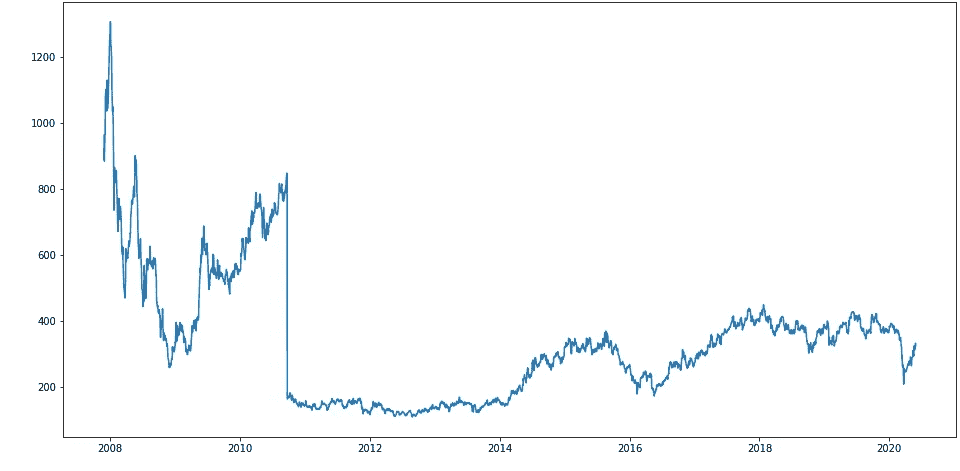
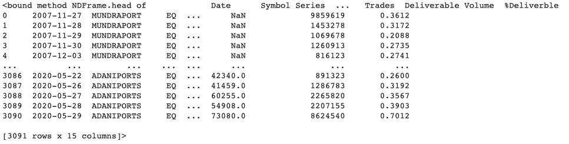
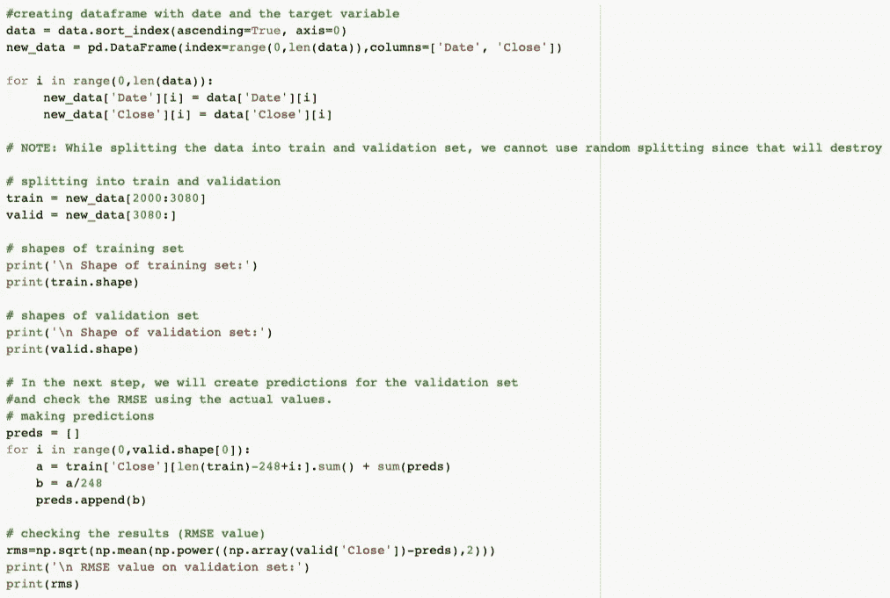
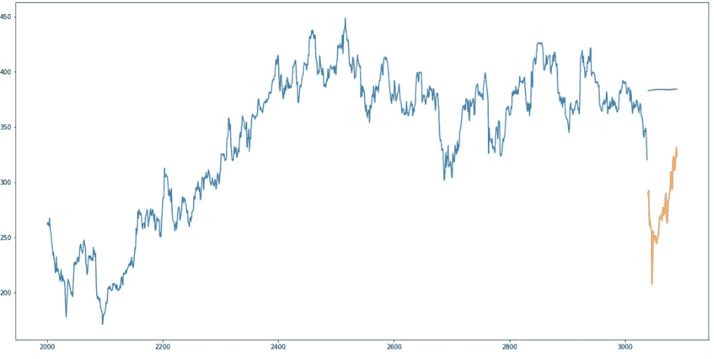
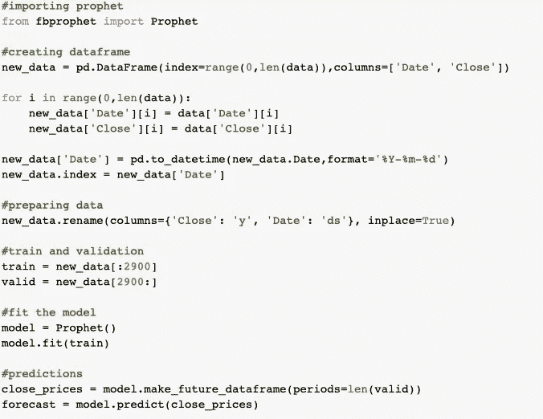
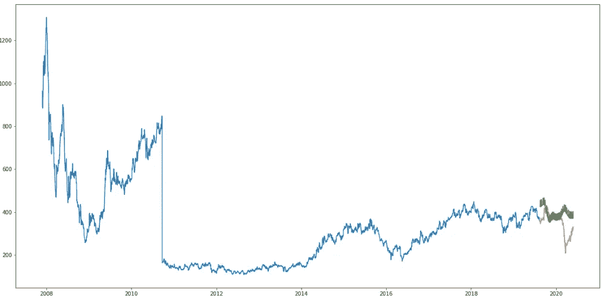
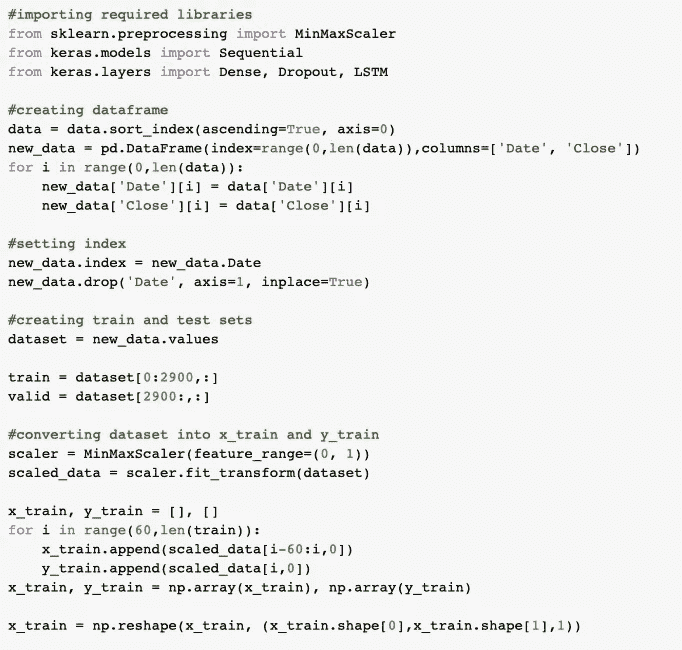
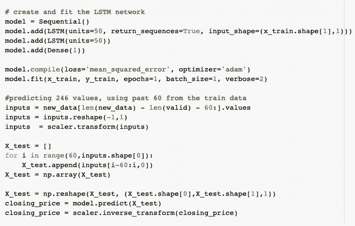
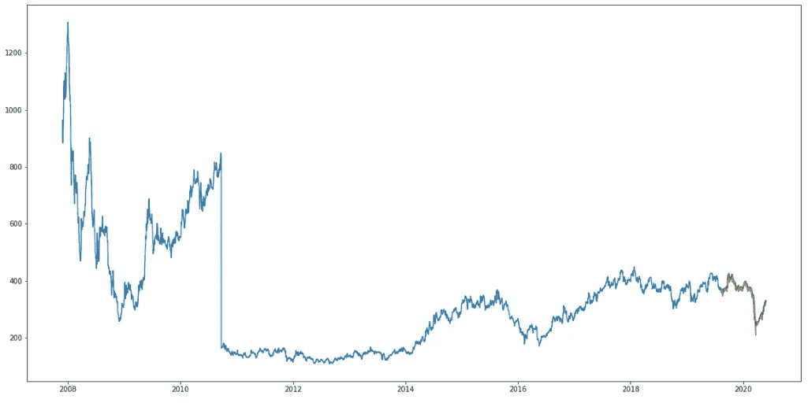

# 预测新冠肺炎时代的印度股市行为，并分析其对国家经济的影响

> 原文：<https://medium.com/analytics-vidhya/predicting-indian-stock-market-behaviour-in-the-times-of-covid-19-and-analysing-its-impact-on-9e46be88c978?source=collection_archive---------24----------------------->

**简介** 预测股票市场的表现是最困难的事情之一，疫情可以彻底改变它的行为。预测中涉及到很多因素——物理因素与心理因素、理性和非理性行为等等。所有这些因素结合在一起，使得股价波动很大，很难高度准确地预测。我们能在这个领域使用机器学习(ML)作为游戏改变者吗？使用组织的最新公告、季度收入结果等功能。，机器学习技术有可能挖掘出我们以前没有看到的模式和见解，这些可以用来做出准确无误的预测。

关闭价格历史与日期

# 问题陈述

我们的目标是预测 Nifty 的每日调整收盘价，使用前 N 天的数据(即预测范围=1)使用移动平均、线性回归、kNN、Prophet 和 LSTM 等技术。我们将使用从 2007 年 11 月 27 日到 2020 年 5 月 29 日的 13 年历史价格，可以从 [NSE India](https://www.nseindia.com/market-data/real-time-data-subscription) 轻松下载。下载后，数据集如下所示:

## 移动平均数

每天的预测收盘价将是一组先前观察值的平均值。我们将使用移动平均技术，而不是简单的平均，移动平均技术对每个预测使用最新的一组值。换句话说，对于每个后续步骤，在从集合中删除最早的观察值时，会考虑预测值。

检查 RMSE 并不能帮助我们理解模型是如何运行的，我们必须将它可视化，以获得更直观的理解。这是预测值和实际值的曲线图。

## 推理

RMSE 值接近 105，(RMSE: 110.53)，但结果并不乐观(从图中可以看出)。

## 线性回归

可以在这些数据上实现的最基本的机器学习算法是线性回归。线性回归模型返回一个确定自变量和因变量之间关系的方程。这是一种简单的技术，很容易理解，但是有几个明显的缺点。使用回归算法的一个问题是模型过度适应日期和月份列。模型将考虑一个月前相同的*日期*或一年前相同的*日期/月份*的值，而不是从预测的角度考虑以前的值。

## 先知

有许多时间序列技术可以在股票预测数据集上实现，但是这些技术中的大多数在拟合模型之前需要大量的数据预处理。由脸书设计和首创的 Prophet 是一个时间序列预测库，它不需要数据预处理，实现起来非常简单。Prophet 的输入是一个包含两列的 data frame:date 和 target (ds 和 y)。

Prophet 试图捕捉过去数据中的季节性，当数据集很大时效果很好。这里有一篇有趣的文章，以简单直观的方式解释了 Prophet:

## 结果

均方根值为 68.74，但该图不令人满意。

## 推理

Prophet(像大多数时间序列预测技术一样)试图从过去的数据中捕捉趋势和季节性。该模型通常在时间序列数据集上表现良好，但在这种情况下却名不副实。

事实证明，股票价格没有特定的趋势或季节性。这在很大程度上取决于目前市场的行情，因此价格会有涨有跌。因此，像 ARIMA、萨里玛和预言家这样的预测技术对于这个特殊的问题不会显示出好的结果。

让我们继续尝试另一种先进的技术——长短期记忆(LSTM)。

## 长短期记忆(LSTM)

LSTMs 被广泛用于序列预测问题，并被证明是非常有效的。它们如此有效的原因是因为 LSTM 能够存储过去重要的信息，并忘记不重要的信息。LSTM 有三个城门:

*   **输入门:**输入门向单元状态添加信息
*   **遗忘之门:**它删除模型不再需要的信息
*   **输出门:**LSTM 输出门选择要显示的信息输出

现在，让我们将 LSTM 实现为一个黑盒，并检查它在特定数据上的性能。

## 结果

均方根值为 11.7722

## 推理

哇！LSTM 模型可以针对各种参数进行调整，例如更改 LSTM 层数、添加下降值或增加历元数。但是，LSTM 的预测是否足以确定股票价格是上涨还是下跌呢？肯定不是！

正如我在文章开始时提到的，股票价格受到有关公司的新闻和其他因素的影响，如公司的非货币化或合并/拆分。还有一些无形的因素通常是无法预先预测的。

## 新冠肺炎和股市崩盘

由于全球市场的影响，印度金融市场目前正经历剧烈波动。这一下跌与全球基准指数一致，因为国内市场通常会跟踪主要的全球指数，而高波动性可能会在不久的将来持续下去。此外，随着海外投资者(FPI)从新兴市场转向美元支持的安全资产，导致印度股市大幅下跌。S&P BSE Sensex 指数在 2020 年 1 月 20 日为 42273 点，在 2020 年 4 月 8 日为 29894 点。Sensex 的市盈率低于 18(2020 年 3 月 31 日的市盈率为 17.81)，远低于 20-24 的历史区间。大、中、小盘股市场已经从峰值大幅回调。2020 财年，中型股指数下跌了 26%，而 Sensex 指数下跌了 22%。

## 股票市场有崩盘和复苏的历史

全球股市有一段崩盘和复苏的历史，印度股市也不例外。在《哈沙德·梅塔骗局》(Harshad Mehta Scam)中，Sensex 在一年内暴跌 53%，但在 1.5 年内收复了 127%的失地。在“亚洲危机”(1996 年)期间，Sensex 指数在 4 年内下跌 40%，但在一年内反弹 115%。在“科技泡沫”(2000 年)期间，Sensex 指数在 1.5 年内暴跌 56%，但在 2.5 年内反弹 138%。当美国面临“房地产——雷曼”危机(2008 年)时，Sensex 指数在一年内暴跌 61%，但在 1.5 年内反弹 157%。在不到 3 个月的时间里，目前的市场已暴跌约 30%。由于新冠肺炎，没有人知道经济何时会回到正轨。一些专家甚至将这次经济崩溃与 20 世纪的“大萧条”相提并论。“大萧条”始于 1929 年，一直持续到 20 世纪 30 年代末。1929 年至 1932 年期间，全球国内生产总值(国内总产值)下降了约 15%。相比之下，在 2008 年至 2009 年的大衰退期间，全球 GDP 下降了不到 1%。

## 当前股票市场的复苏

指望经济从当前的新冠肺炎效应中快速反弹是愚蠢的。虽然金融危机是不可避免的，但考虑到各国央行和财政当局全力以赴减轻冲击，深度经济衰退可能会避免。预计 2020 年世界各地区以及所有行业的贸易量都将大幅下降。但此后全球贸易可能会迅速反弹。然而，这将取决于疫情多快得到控制，以及政府采取何种政策来支持其经济。一旦这个疫情结束，商业和经济恢复正常，股票市场将开始朝着积极的方向发展，正如过去所见证的那样，复苏将比预期更快。高度可取的是，不要跳入市场或不要试图抓住下跌的刀。