# 用机器学习预测保险诈骗(SMOTE)…！！！

> 原文：<https://medium.com/analytics-vidhya/predicting-insurance-fraud-with-machine-learning-smote-da94adf8fb62?source=collection_archive---------8----------------------->


我可以通过事故赚钱..。

保险欺诈是被保险人/索赔人或实体出于经济利益的目的而故意提出的虚假或歪曲的索赔。在保险生命周期的不同接触点，投保人、投保人、第三方索赔人或专业人士(如提供此类服务的保险机构/代理人)都可能实施保险欺诈。

根据*反保险欺诈联盟所做的一项研究估计，*欺诈每年在所有保险业务中窃取 800 亿美元，其中财产意外险欺诈约占 340 亿美元。不用说，所有这些数字使保险欺诈成为一种特定的犯罪。

# **保险诈骗类型**

***软保险诈骗****——*这类诈骗一般是即兴的，在实施诈骗的机会有机上升时发生。简而言之，这是关于歪曲信息或说“善意的谎言”来夸大索赔金额。软保险欺诈的一个典型例子是，声称你的意外伤害比实际严重，以获得比你本来可以获得的更高的索赔金额。

***硬保险诈骗****——*与软保险诈骗不同，硬保险诈骗一般都是事先策划好的&故意造成事故等方式来骗取保险金。

# **5 种最常见的保险欺诈**

***1。车祸/碰撞—*** 车祸在道路和高速公路上相当常见。

虽然大多数事故都不是故意的，但也有许多故意制造的事故使财产和意外伤害保险行业在支付意外索赔方面损失了数百万美元。在大多数情况下，司机和受害者是欺诈索赔的唯一对象，然而，在某些情况下，保险调查员和付费证人也可能是欺诈的一部分。损坏的价值被夸大了，保险公司被迫赔偿一辆全毁的汽车。碰撞有几种类型，如猛扑、急停、倒车、撞了就跑、撞纸等等。

有时，索赔人报告轻微损坏，得到修理估价，领取保险金，但从不修理他们的车。

**2*2。偷车*** *—* 这是另一种常见的保险欺诈类型，犯罪者要么将自己的汽车部分出售，要么在没有适当文件的情况下将汽车卖给另一个买家&，然后报失。

另一种常见的欺骗保险公司的方式是“幽灵车”。索赔人创造了一个虚假的所有权或注册，以确保对一个不存在的车辆保险。然后，他/她在提交欺诈性保险索赔之前报告车辆被盗。

***3。医疗账单&不必要的程序*** —有时医疗专业人员也可能参与欺诈活动。医疗保健组织对标准程序或从未在患者身上执行的程序收取更多费用。

[*【12 亿美元医保计划】*](https://www.nytimes.com/2019/04/09/us/billion-dollar-medicare-scam.html)

所以，下次你的医生开出一系列与你的医疗状况无关的验血单时，这可能是欺诈的表现。

***4。家庭火灾/破坏行为***——这是最常见的房主保险欺诈形式，旨在索赔保险金。房子可能会被遗弃，或者索赔人会在实施欺诈之前搬走贵重物品。或者在某些情况下，雇佣的专业人员会破门而入，破坏房子来支持索赔的合法性。

***5。风暴/自然灾害*** *—* 另一种常见的欺诈形式是提高风暴或其他自然灾害造成的损失价值。

# **通过分析打击欺诈**

由于技术进步和创新，今天的保险业看起来与十年前有很大不同，但不用说，欺诈者也在发展。保险欺诈一直是这个行业面临的一个挑战，然而，一个基础框架和一个强大的人工智能策略可以帮助提前识别可疑的索赔。

曾经有一段时间，保险公司依赖于内部业务规则、理算师和代理人的建议以及特别调查组的见解。经过一段时间后，不仅索赔的复杂性增加了，而且数量也增加了，因此几乎不可能手动筛选和调查所有案例。因此，保险公司依靠预测分析来筛选索赔，并制定风险/怀疑评分。

一旦欺诈案件的概率(风险分值)可用，企业就可以根据资源的可用性决定要调查的案件数量。

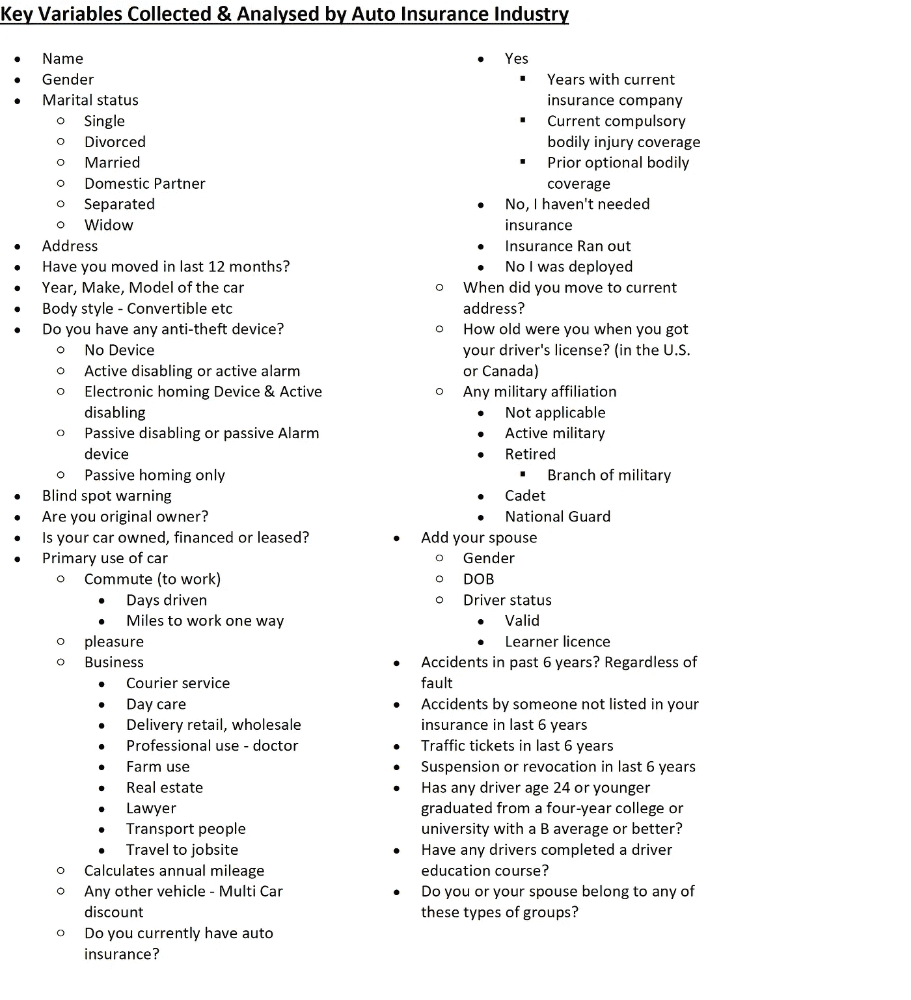

申请汽车保险时收集的数据样本列表

为了说明实际的实现，我们可以从汽车保险行业获得一个虚拟数据，以了解机器学习如何帮助识别和预测欺诈性索赔。

**1。问题识别**

此用例的目标是建立一个预测模型来识别和标记欺诈性索赔。所以这是一个分类问题。

**2。我们有什么数据？**

*的哑数据和 python 代码可以从我的**[***GitHub 账号***](https://github.com/raj1611/Insurance-Fraud-Prediction) ***下载。****

*原始数据有 39 个变量，包括目标'**欺诈报告**'。这是一个只有 1000 个观察值(行)的小数据集。*

*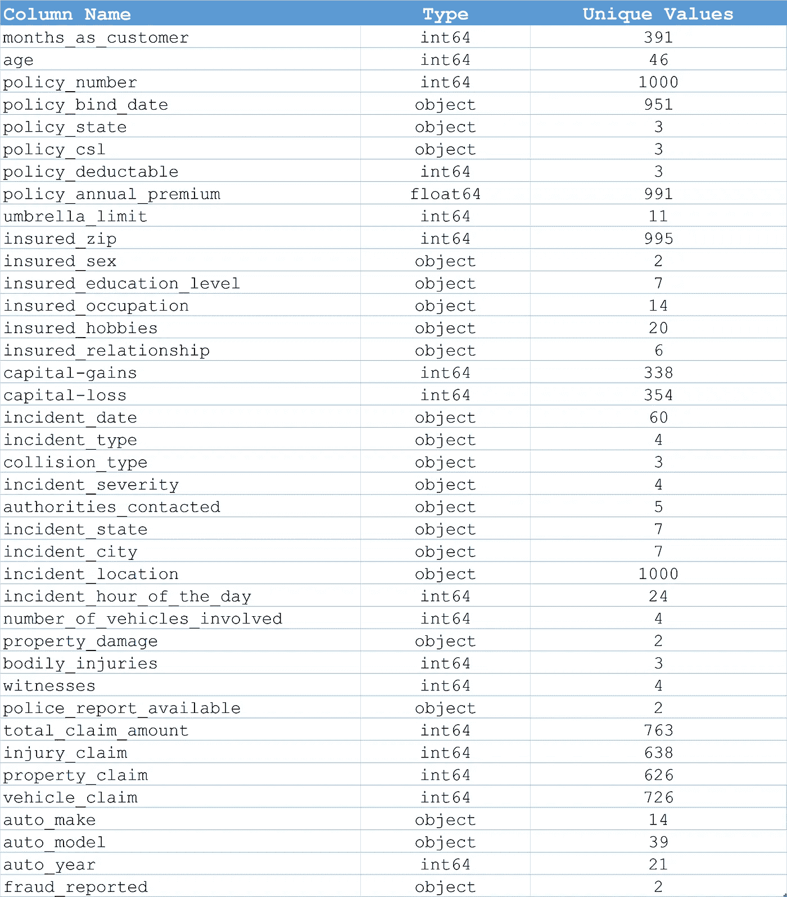*

## *3.探索性数据分析*

*导入 python 库并打印数据集的样本。*

*数据集没有空值，但是，很少有要素有“？”作为应该被适当对待的价值观。*

```
*# Replace the ‘?’ with mode of collision_type feature as it is categorical and we are unaware of the type.
train[‘collision_type’].fillna(train[‘collision_type’].mode()[0], inplace = True)# Replace missing information as ‘No’ for property_damage. Feature can have only 2 possibles values. Either Yes or No. 
# If information is nor available we will assume it was not reported.
train[‘property_damage’].fillna(‘NO’, inplace = True)# USe the assumption above to replace missing information as ‘No’ for police_report_available
train[‘police_report_available’].fillna(‘NO’, inplace = True)train.isnull().any().any()*
```

*让我们做一些基本的数据可视化来分析特征关系。*

```
*# Let’s start with some basic plots to analyze relationship between different features
fig = px.scatter(train, x = ‘months_as_customer’, y = ‘age’, color = ‘fraud_reported’, marginal_x = ‘rug’,
 marginal_y = ‘histogram’)
fig.show()*
```

*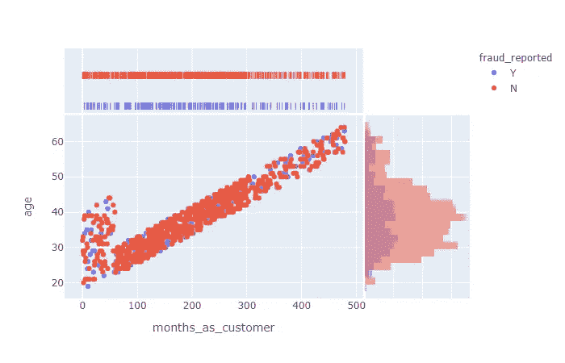*

*年龄、客户月份和报告的欺诈之间的关系*

```
*fig = px.scatter(train, x = ‘months_as_customer’, y = ‘policy_annual_premium’, color = ‘fraud_reported’,
 marginal_x = ‘rug’, marginal_y = ‘histogram’)
fig.show()*
```

*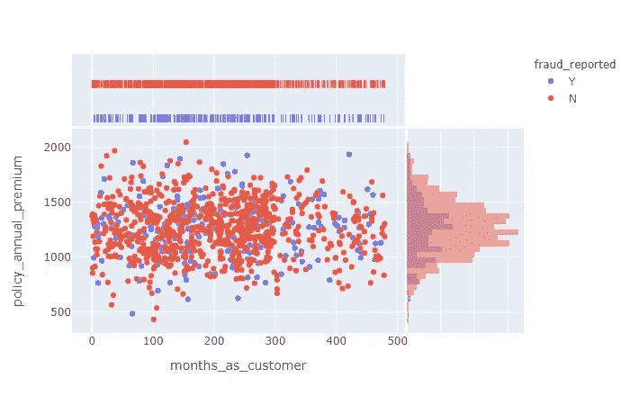*

*保单保费、月客户和欺诈报告之间的关系*

```
*fig = px.scatter(train, x = ‘months_as_customer’, y = ‘total_claim_amount’, color = ‘fraud_reported’, marginal_x = ‘rug’, marginal_y = ‘histogram’)
fig.show()*
```

*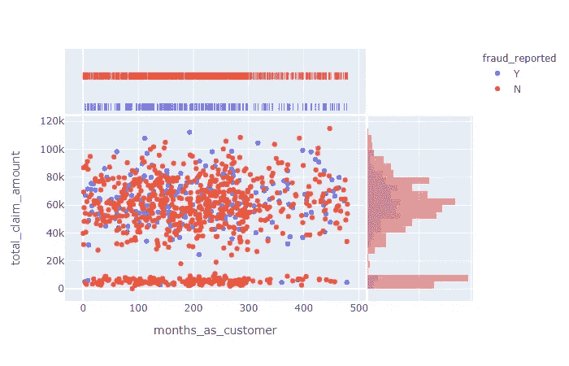*

*索赔总额、客户月份和报告的欺诈之间的关系*

*我们来看看总索赔、伤害索赔、财产索赔、车辆索赔与欺诈 _ 报告有什么关系。*

```
*fig = px.scatter_matrix(train, dimensions=[“total_claim_amount”, “injury_claim”, “property_claim”, “vehicle_claim”], color = “fraud_reported”)
fig.show()*
```

*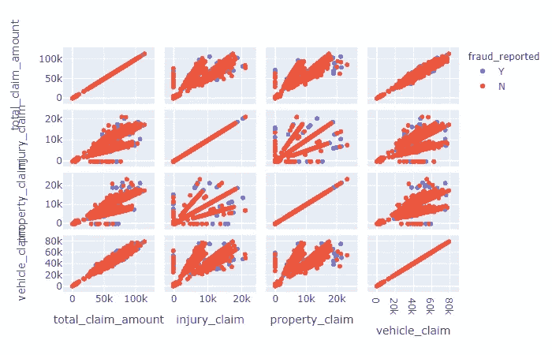*

```
*fig, axes = joypy.joyplot(train,
 column = [‘incident_hour_of_the_day’,’number_of_vehicles_involved’, ‘witnesses’],
 by = ‘incident_city’,
 ylim = ‘own’,
 figsize = (20, 10),
 alpha = 0.5, 
 legend = True)plt.title(‘Incident hour, No. of vehicles, witnesses vs Incident City’, fontsize = 20)
plt.show()*
```

*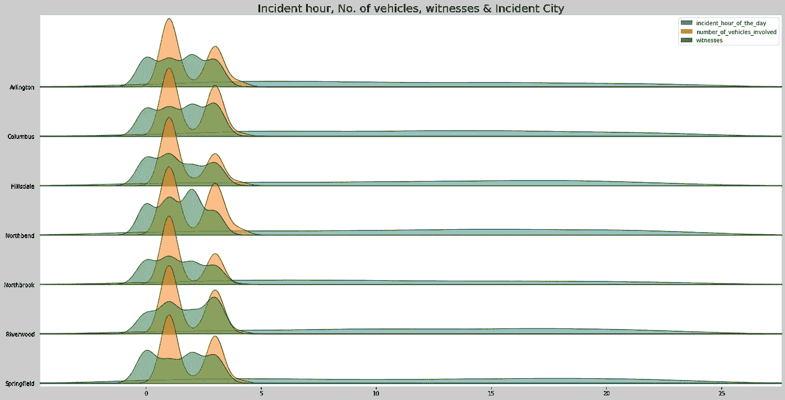*

*让我们将欺诈报告编码成数字值，并创建一些额外的图表。我喜欢老学校的“分组”方法来快速查看分布。*

*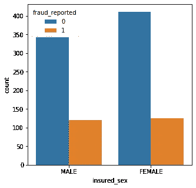*

*性别分布与目标变量*

```
*# **Count the fraudulent transactions by gender**
ax = sns.countplot(x=”insured_sex”, hue=”fraud_reported”, data=train)# Analyze fraudulent transactions by gender
train[[“insured_sex”, “fraud_reported”]].groupby([‘insured_sex’]).count().sort_values(by=’fraud_reported’, ascending=False)*
```

*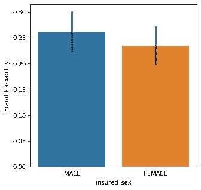*

*按性别划分的平均欺诈概率*

```
*# **Analyze the Probability of fraud by Gender**
g = sns.barplot(x=”insured_sex”,y=”fraud_reported”,data=train)
g = g.set_ylabel(“Fraud Probability”)
train[[“insured_sex”, “fraud_reported”]].groupby([‘insured_sex’]).mean().sort_values(by=’fraud_reported’, ascending=False)*
```

*让我们探索另一种方法来分析年龄分布的反应变量(欺诈报告)*

```
*fig = plt.figure(figsize=(10,8),)
axis = sns.kdeplot(train.loc[(train[‘fraud_reported’] == 1),’age’] , color=’g’,shade=True, label=’Fraudulent Claims’)
axis = sns.kdeplot(train.loc[(train[‘fraud_reported’] == 0),’age’] , color=’b’,shade=True,label=’Nonfraudulent Claims’)
plt.title(‘Age Distribution — Fraud V.S. Non Fraud Claims’, fontsize = 20)
plt.xlabel(“Age”, fontsize = 12)
plt.ylabel(‘Frequency’, fontsize = 12);*
```

*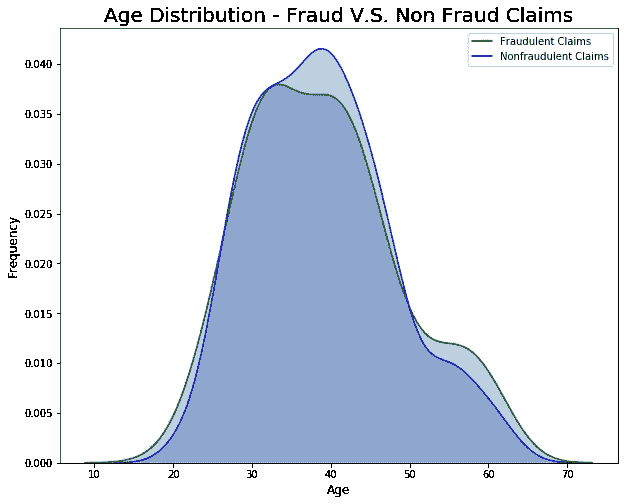*

*我们来按教育程度分析一下造假的概率*

```
*# Analyze the Probability of fraud by education level
fig, ax = plt.subplots(figsize=(12,6))
g = sns.barplot(x=”insured_education_level”,y=”fraud_reported”,data=train)
g = g.set_ylabel(“Fraud Probability”)
train[[“insured_education_level”, “fraud_reported”]].groupby([‘insured_education_level’]).mean().sort_values(by=’fraud_reported’, ascending=False)*
```

*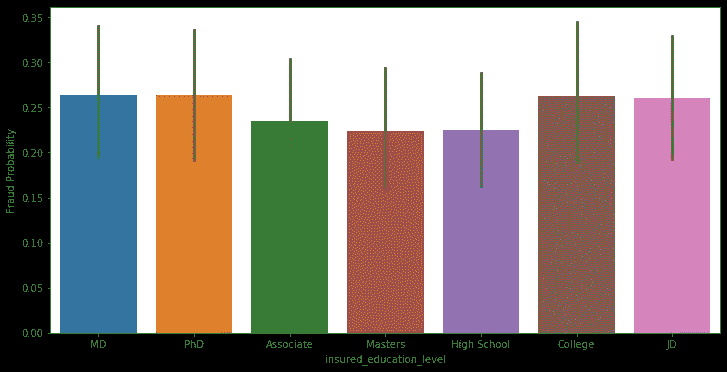*

*按教育水平划分的平均欺诈概率*

*通过被保险人关系分析欺诈的可能性。*

*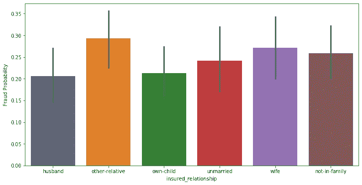*

*按投保关系列出的平均欺诈概率*

*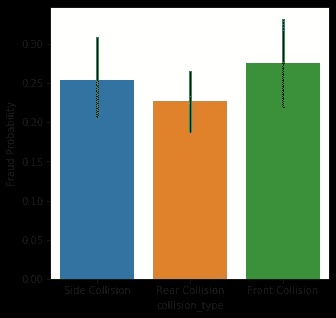*

*按冲突类型列出的平均欺诈概率*

```
*g = sns.barplot(x=”collision_type”,y=”fraud_reported”,data=train)
g = g.set_ylabel(“Fraud Probability”)
train[[“collision_type”, “fraud_reported”]].groupby([‘collision_type’]).mean().sort_values(by=’fraud_reported’, ascending=False)*
```

*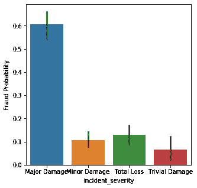*

*按事件严重性划分的平均欺诈概率*

*让我们用泡泡图来看看一些趋势*

```
*import warnings
warnings.filterwarnings(‘ignore’)figure = bubbleplot(dataset = train, x_column = ‘policy_annual_premium’, y_column = ‘total_claim_amount’,
 bubble_column = ‘fraud_reported’, time_column = ‘auto_year’, size_column = ‘months_as_customer’,
 color_column = ‘fraud_reported’, x_title = “Annual Policy Premium”, y_title = “Total Claim Amount”,
 title = ‘Total Claim Amount, Annual Premium and Months as Customer’,
 x_logscale = False, scale_bubble = 3, height = 650)py.iplot(figure, config={‘scrollzoom’: True})*
```

*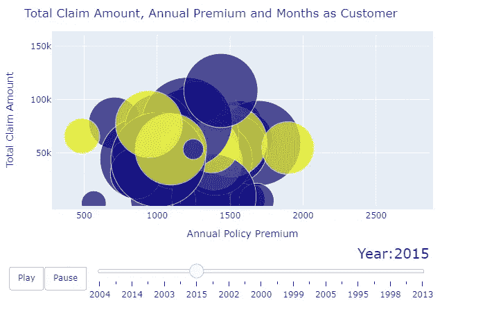*

## ***4。包括特征工程在内的数据准备***

*让我们使用“一天中的某个时刻”功能来创建一些类别*

```
*bins = [-1, 3, 6, 9, 12, 17, 20, 24] 
catg = [“past_midnight”, “early_morning”, “morning”, ‘fore-noon’, ‘afternoon’, ‘evening’, ‘night’]
train[‘incident_period’] = pd.cut(train.incident_hour_of_the_day, bins, labels=catg).astype(object)
train[[‘incident_hour_of_the_day’, ‘incident_period’]].head(20)*
```

*很少有数字特征可以用作离散的类别*

```
*#Transforming some numerical variables that are really categorical
train[‘number_of_vehicles_involved’] = train[‘number_of_vehicles_involved’].apply(str)
train[‘witnesses’] = train[‘witnesses’].apply(str)
train[‘bodily_injuries’] = train[‘bodily_injuries’].apply(str)*
```

*为所有分类特征创建虚拟变量。将父变量和其他从建模角度来看无用的变量一起删除。*

```
*dummies = pd.get_dummies(train[[‘policy_state’, ‘insured_sex’, ‘insured_education_level’, ‘insured_occupation’, 
 ‘insured_hobbies’, ‘insured_relationship’, ‘incident_type’,
 ‘collision_type’, ‘incident_severity’, ‘authorities_contacted’, ‘incident_state’,
 ‘incident_city’, ‘number_of_vehicles_involved’, ‘property_damage’, ‘bodily_injuries’,
 ‘witnesses’, ‘police_report_available’, ‘auto_make’, ‘auto_model’, ‘incident_period’]])dummies.head(5)*
```

*让我们将数据集分成训练和测试子集，以便进行训练和测试*

```
*x_train, x_test, y_train, y_test = train_test_split(x_unscaled, y, test_size = 0.2, random_state = 0)print(“Shape of x_train :”, x_train.shape)
print(“Shape of x_test :”, x_test.shape)
print(“Shape of y_train :”, y_train.shape)
print(“Shape of y_test :”, y_test.shape)Shape of x_train : (800, 168)
Shape of x_test : (200, 168)
Shape of y_train : (800,)
Shape of y_test : (200,)*
```

*训练和测试数据集需要使用标准标量方法进行标准化，因为索赔额等少数特征具有高值，可能会扭曲预测。*

```
*scaler = StandardScaler(with_mean=False)
X_train = scaler.fit_transform(x_train)
x_test = scaler.fit_transform(x_test)
Y_train= y_train*
```

***5。开发模型***

*使用 Kfold 分层交叉验证方法拟合一些快速模型，并评估不同模型的表现。*参考 GitHub 代码**

*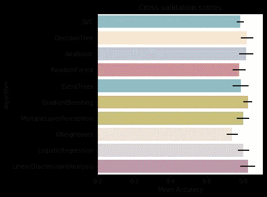*

*6。模型评估*

*用网格搜索法测试算法的参数优化。*

```
*# Adaboost
DTC = DecisionTreeClassifier()
adaDTC = AdaBoostClassifier(DTC, random_state=7)
ada_param_grid = {“base_estimator__criterion” : [“gini”, “entropy”],
 base_estimator__splitter”: [“best”, “random”],
 “algorithm” : [“SAMME”,”SAMME.R”],
 “n_estimators” :[1,2],
 “learning_rate”: [0.0001, 0.001, 0.01, 0.1, 0.2, 0.3,1.5]}gsadaDTC = GridSearchCV(adaDTC,param_grid = ada_param_grid, cv=kfold, scoring=”accuracy”, n_jobs= 4, verbose = 1)
gsadaDTC.fit(X_train,Y_train)ada_best = gsadaDTC.best_estimator_
gsadaDTC.best_score_*
```

*Adaboost 最好成绩— **82.87%***

```
*#ExtraTrees 
ExtC = ExtraTreesClassifier()
## Search grid for optimal parameters
ex_param_grid = {“max_depth”: [None],
 “max_features”: [1, 3, 10],
 “min_samples_split”: [2, 3, 10],
 “min_samples_leaf”: [1, 3, 10],
 “bootstrap”: [False],
 “n_estimators” :[100,300],
 “criterion”: [“gini”]}gsExtC = GridSearchCV(ExtC,param_grid = ex_param_grid, cv=kfold, scoring=”accuracy”, n_jobs= 4, verbose = 1)
gsExtC.fit(X_train,Y_train)
ExtC_best = gsExtC.best_estimator_# Best score
gsExtC.best_score_*
```

*树外最高分— **78.99%***

```
*# RFC Parameters tunning 
RFC = RandomForestClassifier()
## Search grid for optimal parameters
rf_param_grid = {“max_depth”: [None],
 “max_features”: [1, 3, 10],
 “min_samples_split”: [2, 3, 10],
 “min_samples_leaf”: [1, 3, 10],
 “bootstrap”: [False],
 “n_estimators” :[100,300],
 “criterion”: [“gini”]}gsRFC = GridSearchCV(RFC,param_grid = rf_param_grid, cv=kfold, scoring=”accuracy”, n_jobs= 4, verbose = 1)
gsRFC.fit(X_train,Y_train)
RFC_best = gsRFC.best_estimator_# Best score
gsRFC.best_score_*
```

*随机森林分类器最佳得分— **78.25%***

```
*# Gradient boosting 
GBC = GradientBoostingClassifier()
gb_param_grid = {‘loss’ : [“deviance”],
 ‘n_estimators’ : [100,200,300],
 ‘learning_rate’: [0.1, 0.05, 0.01],
 ‘max_depth’: [4, 8],
 ‘min_samples_leaf’: [100,150],
 ‘max_features’: [0.3, 0.1]}gsGBC = GridSearchCV(GBC,param_grid = gb_param_grid, cv=kfold, scoring=”accuracy”, n_jobs= 4, verbose = 1)
gsGBC.fit(X_train,Y_train)
GBC_best = gsGBC.best_estimator_# Best score
gsGBC.best_score_*
```

*梯度推进最佳得分— **79.25%***

```
*### SVC classifier
SVMC = SVC(probability=True)
svc_param_grid = {‘kernel’: [‘rbf’], 
 ‘gamma’: [ 0.001, 0.01, 0.1, 1],
 ‘C’: [1, 10, 50, 100,200,300, 1000]}gsSVMC = GridSearchCV(SVMC,param_grid = svc_param_grid, cv=kfold, scoring=”accuracy”, n_jobs= 4, verbose = 1)
gsSVMC.fit(X_train,Y_train)
SVMC_best = gsSVMC.best_estimator_# Best score
gsSVMC.best_score_*
```

*让我们使用 SVC 预测打印一个混淆矩阵。该模型的训练精度为 **94.75%** ，测试精度为 **83%** 。我们可以使用 **SMOTE** 进一步改进吗？*

```
*Training Accuracy:  0.9475
Testing Accuarcy:  0.83
              precision    recall  f1-score   support

           0       0.84      0.94      0.89       143
           1       0.79      0.54      0.65        57

    accuracy                           0.83       200
   macro avg       0.82      0.74      0.77       200
weighted avg       0.83      0.83      0.82       200*
```

## *SMOTE——合成少数过采样技术*

*与索赔相关的分析受到不平衡的阶级数据的影响，这意味着多数阶级和少数阶级之间可能存在显著差异。换句话说，少数类的例子太少，模型无法有效地学习决策边界。*

*解决这种情况的一种方法是对少数类进行过采样(本例中欺诈= 1)。这种方法包括简单地复制少数民族类的例子。这是一种针对少数类的数据处理，称为**合成少数过采样技术**或简称 SMOTE。*

```
*from imblearn.over_sampling import SMOTE
x_resample, y_resample  = SMOTE().fit_sample(x_unscaled, y.values.ravel())
print("Shape of x_resample :",x_resample.shape)
print("Shape of y_resample :",y_resample.shape)***Shape of x_resample : (1506, 168)
Shape of y_resample : (1506,)**** 
```

*创建一个训练和测试分割。*

```
*x_train2, x_test2, y_train2, y_test2 = train_test_split(x_resample, y_resample, test_size = 0.2, random_state = 0)
print(“Shape of x_train2 :”, x_train2.shape)
print(“Shape of y_train2 :”, y_train2.shape)
print(“Shape of x_test2 :”, x_test2.shape)
print(“Shape of y_test2 :”, y_test2.shape)***Shape of x_train2 : (1204, 168)
Shape of y_train2 : (1204,)
Shape of x_test2 : (302, 168)
Shape of y_test2 : (302,)****
```

*标准化数据集*

```
*# standardization
from sklearn.preprocessing import StandardScaler
sc = StandardScaler()
x_train2 = sc.fit_transform(x_train2)
x_test2 = sc.transform(x_test2)*
```

*让我们在重新采样的数据集上训练和测试 SVC 模型，并打印一个混淆矩阵。*

```
*Training Accuracy:  1.0
Testing Accuarcy:  0.8576158940397351
              precision    recall  f1-score   support

           0       0.83      0.91      0.87       154
           1       0.89      0.80      0.85       148

    accuracy                           0.86       302
   macro avg       0.86      0.86      0.86       302
weighted avg       0.86      0.86      0.86       302*
```

*我们可以看到，使用 SMOTE 的过采样有助于使用相同的 SVC 算法将预测一直提高到 **85.7%** 。*

## ***7。结论***

*为了保持文章简短，我没有加入太多的情节和分析。在分析索赔数据时，可以根据业务和数据的可用性做出一些决策。*

*说到这里，我想给你留下一些思考的素材！！！*

1.  ***做客户的几个月**——老客户是不是更忠诚、更真实？保单签发日期和事故日期之间的微小差异是否表明存在欺诈？*
2.  ***年龄** —年龄可能是表明欺诈性索赔的重要因素吗？与老一代人相比，年轻人更有可能实施欺诈吗？如果是，如何定义阈值？*
3.  *性别——男人更容易出轨吗？*
4.  ***投保职业** —蓝领工人比白领工人更容易卷入诈骗吗？*
5.  ***爱好和关系** —爱好和与被保险人的关系有影响吗？*
6.  *年度保费——高额保费会诱使索赔人夸大事故后的维修费用吗？*
7.  ***投保的邮政编码和州名** —您是否观察到邮政编码和州名的任何特定模式？与其他人相比，来自特定邮政编码或州的人更有可能提出索赔吗？*
8.  ***事故、碰撞和严重程度类型** —欺诈索赔与特定事故或碰撞类型相关联的可能性有多大？*
9.  ***证人** —证人的在场与否与欺诈有何关联？目击者的出现是否意味着一场精心策划的事故？或者没有证人可能是欺诈的潜在迹象？*
10.  ***总索赔与伤害和车辆索赔** —伤害与车辆索赔的比率反映了什么吗？假设发生了一次严重的事故，造成了大范围的身体伤害，但只有一次轻微的伤害被主观诊断为需要很少或不需要医疗处理。这对索赔调查员或数据科学家意味着什么？*

*如果你喜欢这篇文章，请分享并鼓掌。请在 [LinkedIn](https://www.linkedin.com/in/rajeshpanthri/) 和 [Kaggle](https://www.kaggle.com/rp1611) 上关注我，如果有任何问题，请留言。我将非常乐意回答你的问题。*

*敬请关注更多内容。快乐阅读！！！*