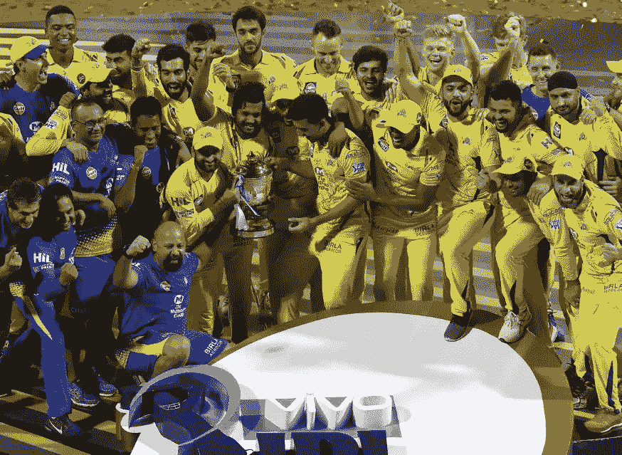

# 预测 IPL-2020 冠军

> 原文：<https://medium.com/analytics-vidhya/predicting-ipl-2020-winner-5c95f6cb338c?source=collection_archive---------8----------------------->

分类和回归是机器学习领域中监督学习的两个分支。这些是开始机器学习之旅时应该学习的基本主题。做项目是学习和掌握这些主题的唯一途径。

在我之前的博客中，我做了一个分类项目。学了一些分类的概念，时间到了…