# 用多元线性回归预测金县房价

> 原文：<https://medium.com/analytics-vidhya/predicting-king-county-house-prices-with-multiple-linear-regression-84de5feeafb2?source=collection_archive---------2----------------------->

照片由马克西米利安·康纳奇拍摄

# 介绍

[**金县房屋数据集**](https://www.kaggle.com/harlfoxem/housesalesprediction) 包含大量关于华盛顿州金县房屋的价格、大小、位置、状况和各种其他特征的信息。在本文中，我将展示如何用 Python 构建多元线性回归模型来预测房价。

[**这里的**](https://gist.github.com/AvonleaFisher/e29ecbe25ec7a7a48d4ee4e1f77ecd9c) 是我在这个分析中使用的模块的完整列表。下面嵌入的代码中包含了许多，但不是全部。您可能会发现有些变量名不明确，所以下面是对每个变量名的简要描述:

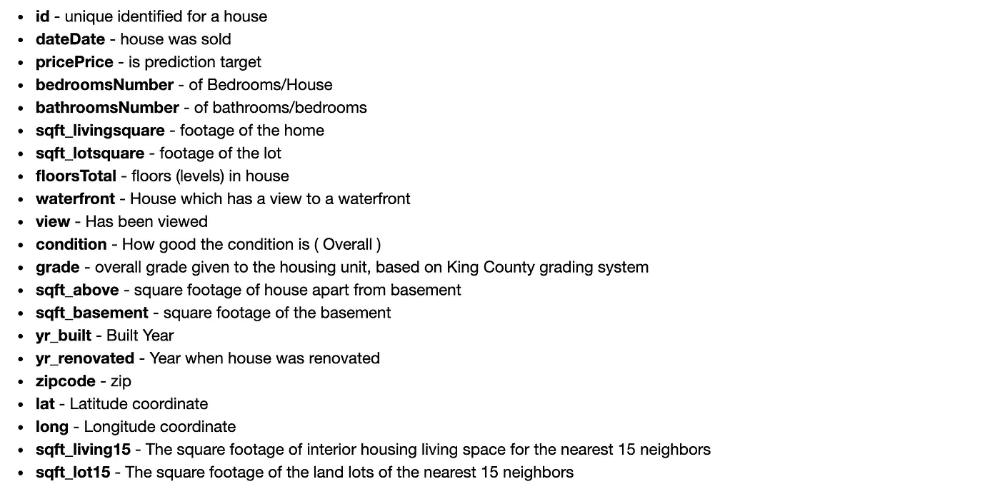

首先，我将数据读入 pandas dataframe 并运行 df.info()来了解形状、列和数据类型。

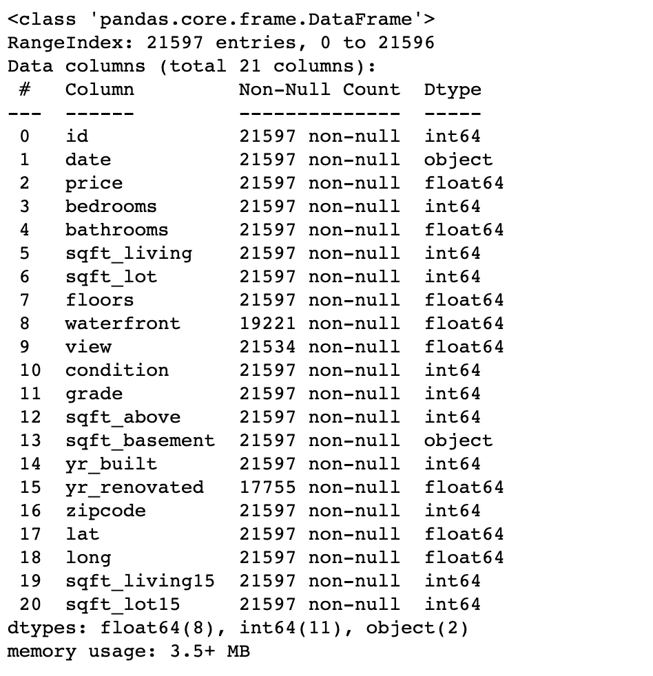

我们可以看到这是一个大型数据集，包含 21，000 多个条目和 20 个列。几乎所有的列都包含数值数据，方便线性回归！

# 缺少值

接下来，我查看了每一列中缺失值的比例。

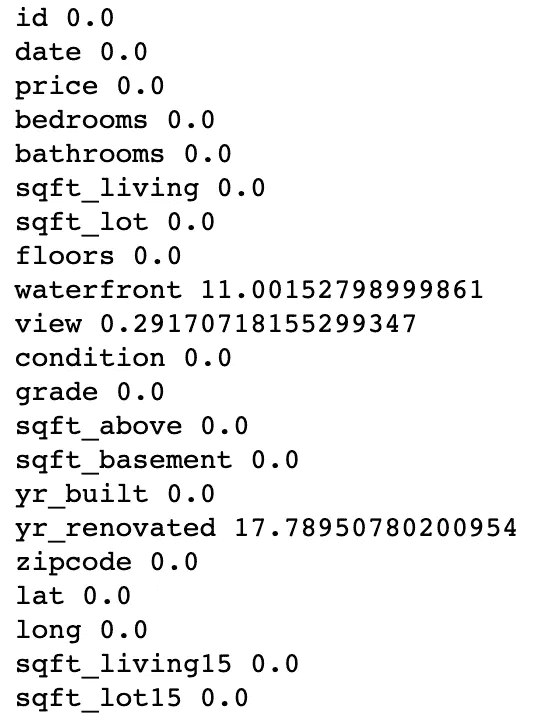

接下来，我查看了有缺失值的 3 个变量的值计数。由于缺少值的比例很高，我决定删除“yr _ renovated”，用 0 填充“water front”NAs(它与列中的大多数其他值匹配，表示“no waterfront”)，并用列的平均值填充少量缺少的“view”值。

# 极端值

为了排除可能不是独户住宅的建筑，我使用以下代码格式检查了卧室和浴室列中的异常值:

浴室的异常值是 187，卧室是 47(不包括重叠)。上面的代码将任何偏离平均值超过 3 个标准偏差的值视为异常值，并删除所有包含异常值的行。

# 一键编码

数据集中有一个变量，我们预计它与价格高度相关，但没有明确的线性关系:条件。该列的 [**值描述**](https://info.kingcounty.gov/assessor/esales/Glossary.aspx?type=r) 表示该列以 1-5 的线性标度进行编码，1 表示“差”，5 表示“非常好”

有趣的是，下面的散点图显示，就价格而言,“普通”房屋往往表现最佳:

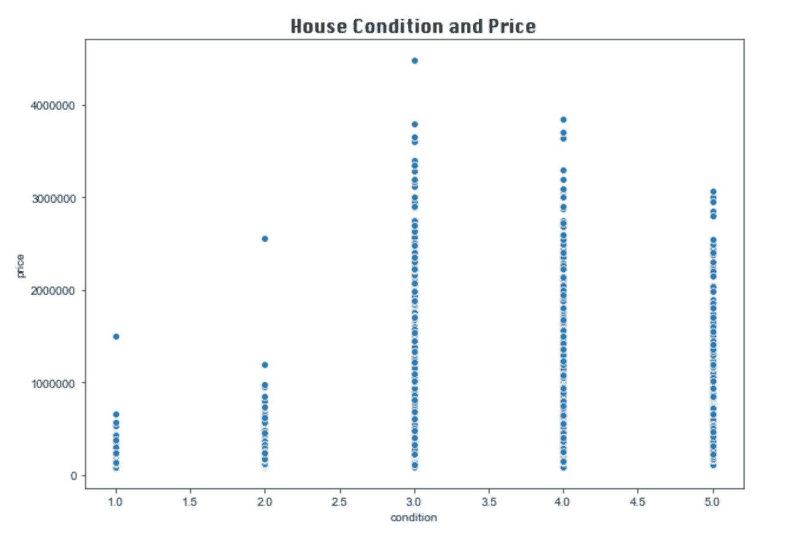

这可能是因为条件值与年龄和等级(指建筑的设计/质量，而不是建筑的实用性/功能性)相关。一座新的、设计优秀的、非常昂贵的建筑，如果需要一些功能性维修，可以被评为“一般”状况。正如我们在下面的散点图中所看到的，条件一般的房子往往也有最高的评级。

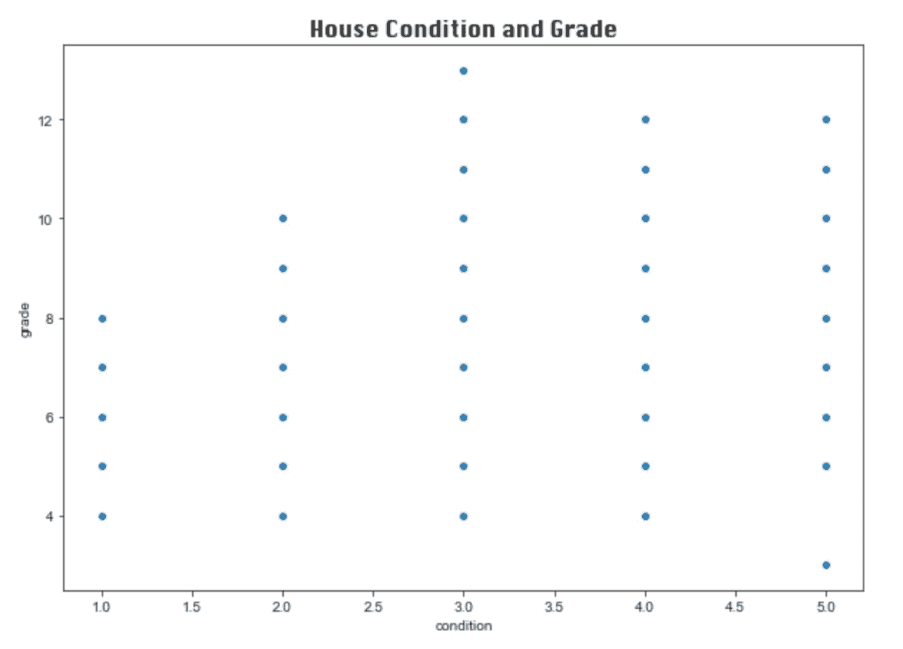

价格和特定条件值之间可能存在更清晰的线性关系，我们可以通过对变量进行一次性编码来更有效地探索这种关系。以下代码为每个条件值创建一个虚拟变量，删除第一个值以避免 [**虚拟变量陷阱**](https://stattrek.com/multiple-regression/dummy-variables.aspx) ，删除原始列，并将新变量连接到数据框。

现在，我们可以在散点图上可视化每个条件评级和房价之间的关系。值为 1 表示房屋具有对应于每一列的条件评级，而值为 0 表示不具有:

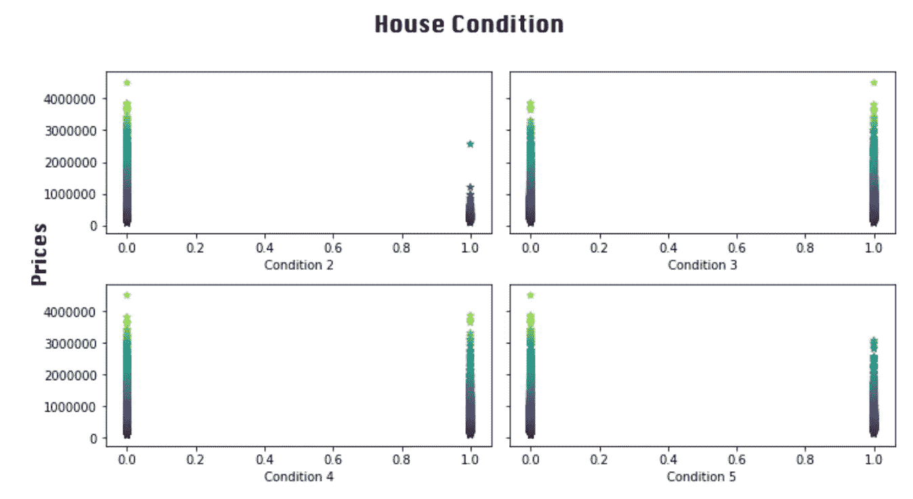

现在，每一列都有线性关系，条件等级 2 和 3 具有最显著的关系。

# 多重线性回归假设

作为多元线性回归分析过程的一部分，必须检查四个假设:

*   **无多重共线性**
*   **解释变量和响应变量之间的线性关系**
*   **误差项的同方差**
*   **模型残差的正态分布**

当我们检查这些假设时，我们将更深入地研究它们。

## 多重共线性

利用 seaborn，我创建了一个每个变量和所有其他变量之间相关性的热图。计算相关性的绝对值是因为只有线性关系的强度，而不是方向，才能满足这一假设。

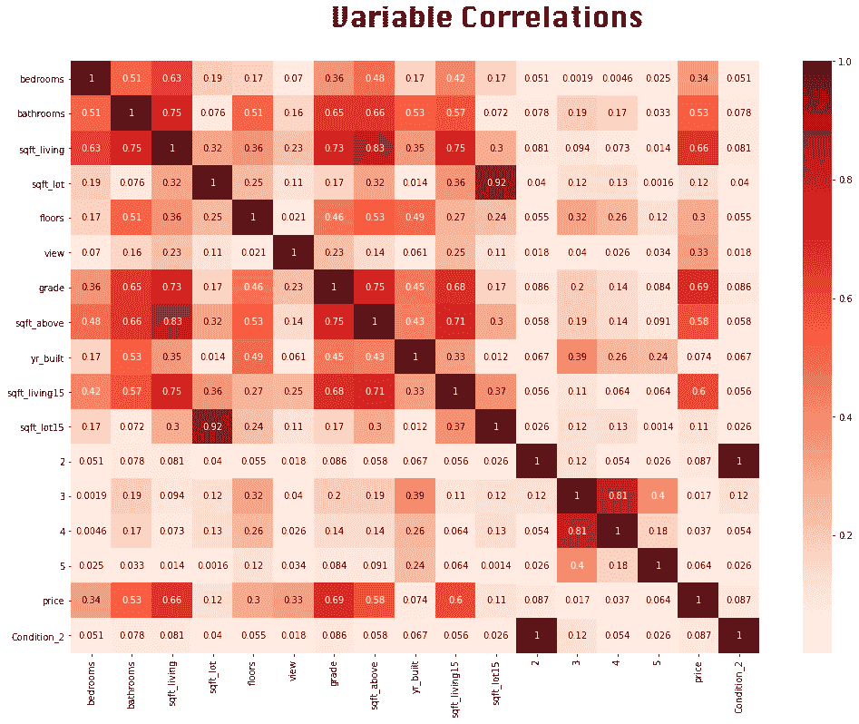

正如我们所料，许多与房屋大小相关的变量(如平方英尺、房间数量)彼此高度相关。一般情况下，我们不希望在同一个模型中包含任何两个相关性超过. 80 的 x 变量。然而，我们确实想包含与 y 变量相关的变量。下面，我创建并显示了两个小数据框，它们缩小了我们最感兴趣的相关性。

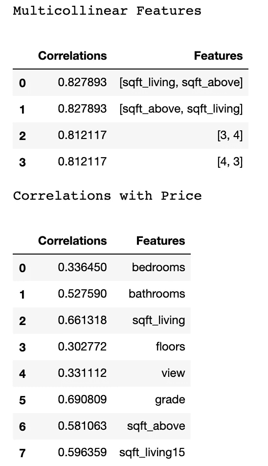

虽然 sqft_living 和 sqft_above 都与价格高度相关，但由于它们之间也高度相关，因此只能将其中一个包含在多元回归模型中。幸运的是，其相关性违反这一假设的其他两个变量(条件评级 3 和 4)与价格的相关性相对较弱。

## 线性关系

散点图是检查解释变量和响应变量之间的关系是否是线性的一种简单方法。在为与价格相关性最强的变量创建对象后，我制作了以下散点图。

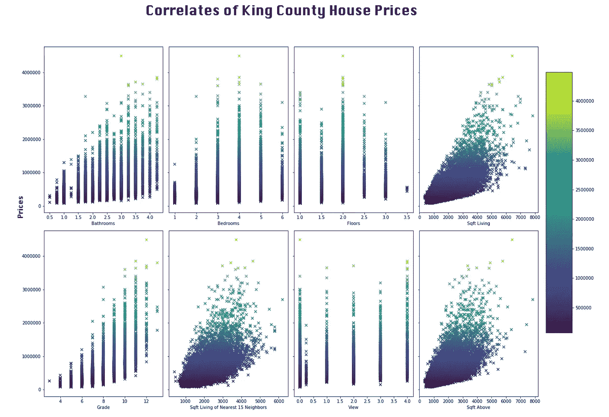

“景观”、“楼层”和“卧室”变量与房价没有明显的线性关系。Sqft_living 与价格的线性关系比 sqft_above 更强，因此将在多元回归模型中使用。由于它与上面的 sqft 多重共线性，上面的 sqft 将被排除。

# 构建多元回归模型

接下来的两个假设——正态性和同方差性——要求我们首先创建一个回归模型，因为它们指的是模型的*残差*而不是其特征。在线性回归中，残差是实际值和回归线估计值之间的垂直距离。在创建多元回归模型之前，我完成了对浴室、等级、sqft_living 和 sqft_living15 的简单线性回归分析。在这个过程中，我发现 sqft 变量的残差并不完全满足正态性和同方差性。为了解决这个问题，我使用`np.log()`将 price 和 sqft 值更新到它们的自然日志中。

对于多元回归模型，我在不违反多重共线性假设的情况下，包含了与价格相关性最高的四个变量:

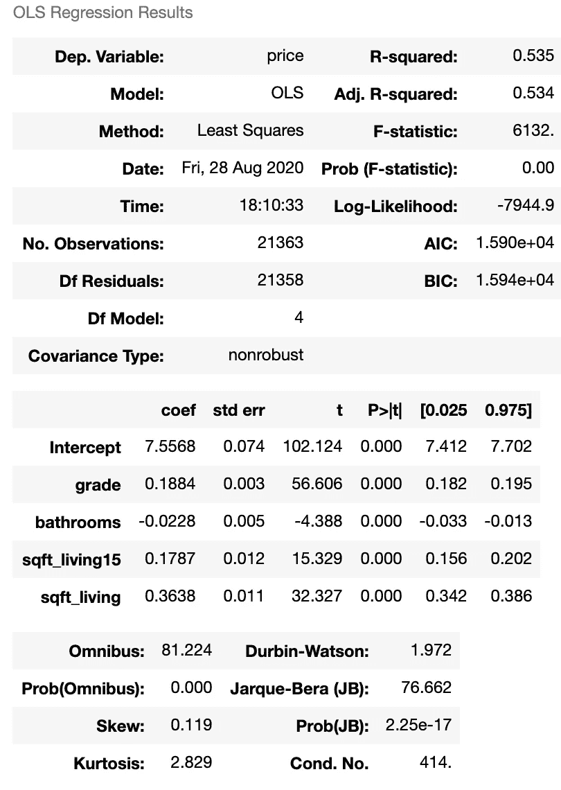

r 平方值为 0.535，表明该模型可以解释其均值附近约 53%的价格可变性。多元回归的零假设是*所选解释变量和响应变量之间没有关系。*所有的 p 值舍入到 0，这意味着我们可以拒绝零假设。现在我们可以确认该模型满足正态性和同方差性的假设。

## 残差正态性

分位数-分位数图是检验正态性假设的一种方法。如果残差呈正态分布，它们的点将主要落在一条直线上。下面是模型残差的 Q-Q 图。

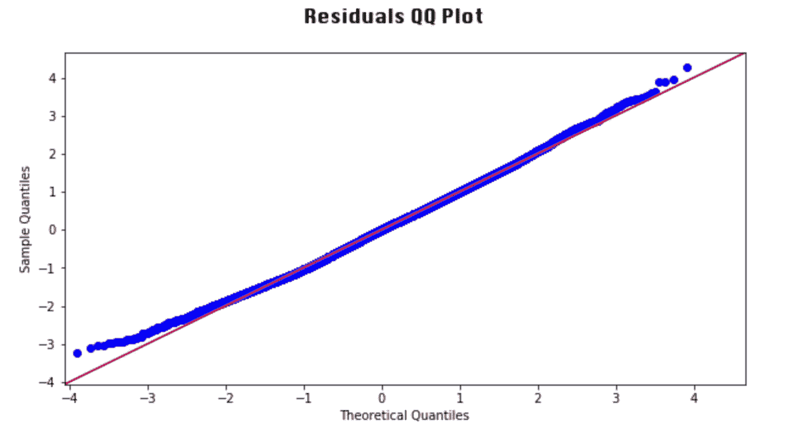

由于几乎所有的数据点都落在这个 QQ 图的直线上，我们可以认为满足了正态假设。

## **同方差**

同方差假设指出，对于任何 x 值，残差的方差大致相同。为了形象化，我做了一个散点图，y 轴是模型的残差，x 轴是拟合值。为了满足同方差假设，点的形状应该在 y=0 的直线上大致对称。

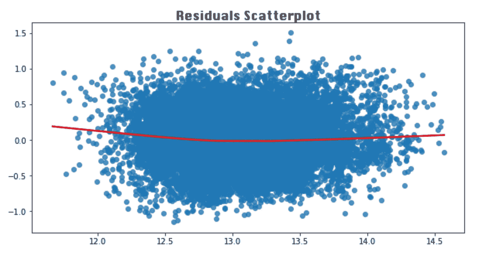

我们可以看到，这些点具有大致对称的水滴状形状，在 x 轴上是一致的。该模型满足——最后但并非最不重要的——同方差假设。

# 模型验证

评估模型质量的最后一步是交叉验证，它让我们了解对于相同的变量，使用新数据时模型的表现如何。我使用 sklearn 的 train_test_split 函数将数据分成两个子集:一个子集将用于训练模型，另一个子集将用于测试模型。默认情况下，该函数将 75%的数据作为定型子集，将另外 25%的数据作为测试子集。

**均方误差**

下面的代码为 x 和 y 变量创建训练和测试数据，使用 x 子集预测新的 y 值，然后计算这些值与实际 y 值之间的距离。最后，我们使用均方误差函数来计算两个子集的 MSE。

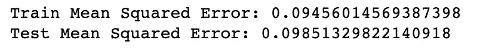

训练和测试子集的 MSEs 是相似的，这表明该模型在不同的数据上表现相似。

# 结论

总的来说，面积、等级、浴室数量和邻居房屋的大小是金县房价的最佳预测指标。该模型确实有一些局限性:考虑到一些变量需要进行对数转换以满足回归假设，任何用于该模型的新数据都必须经过类似的预处理。此外，考虑到房价的地区差异，该模型对其他县数据的适用性可能有限。

所以，如果你正在寻找一个不会倾家荡产的房子，明智的做法是节省面积，和另外三个人共用一个浴室。但是我们大多数城市居民不是已经在这么做了吗？

完整代码可在 [**GitHub**](https://github.com/AvonleaFisher/dsc-mod-2-project-v2-1-onl01-dtsc-ft-070620) 上获得