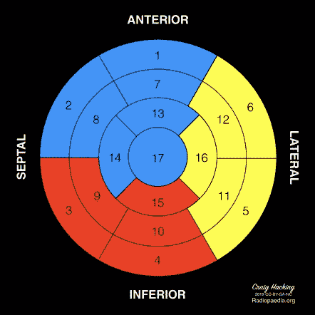

# 利用机器学习预测左心室舒张末期容积

> 原文：<https://medium.com/analytics-vidhya/predicting-left-ventricular-end-diastolic-volume-d7d3059d6be0?source=collection_archive---------15----------------------->

在我沉浸于大会的数据科学期间，我参与了许多不同的项目，从预测爱荷华州埃姆斯的房价到用神经网络对手写数字进行分类。

数据是我的激情所在，但我的目标是让数据为每个人服务。我在这个项目中考虑到了人的因素:我想要一个能以积极的方式影响人们的想法，但也想要一个我能找到数据的想法。

幸运的是，我得到了一组数据，包括心脏病患者的心脏核磁共振数据。别担心，数据在我收到之前就被取消识别了。

在数据中的所有 48 个特征中，最突出的是左心室舒张末期容积(从这里开始是 EDV)，这是左心室完成充血时的容积。左心室(LV)是心脏的腔室，负责将氧合血推入体循环。


心脏跳动的 GIF 插图。心脏是镜像的，所以左心室在右侧。

## **问题**

左心室不能像气球一样膨胀:为了增加体积，肌肉壁必须变薄。一旦肌肉壁变薄，左心室就不能有效地泵血，这将导致一系列的问题。左心室的功能也是整体心脏功能的指标。如果一个模型可以准确预测 EDV，它可以帮助心脏病学家确定谁最需要帮助，并提高医疗保健系统的效率。

## **预处理**

在我能够直接进入建模之前，我必须处理数据。对我来说幸运的是，数据是*非常*干净的:只有四列有重要的缺失值。我花了很多时间阅读关于数据插补的内容，因为这是一个非常敏感的话题:如果你做得不正确，你可能会极大地扭曲你的数据(这是未来博客文章的主题)。我最终使用了 fancyimpute 的 KNN 估算器，因为缺失的数据是离散的和有序的。

除了输入数据之外，我只需要确保序数文本在数字范围内。

我的数据有 48 个特征，包括目标变量 EDV。这些特征中的 34 个表示心脏的 17 个部分中的每一个中的划痕或局部缺血(血流减少)。



克雷格·哈金博士提供的案例，Radiopaedia.org，rID: 68467

因为有太多的功能，我想看看能否通过功能工程减少它们的数量。使用如上图，我基于环形层和编号部分规划了交互列。然而，我创建交互列的能力受到了限制，因为我的绝大多数值都是 0，表示没有损坏。也就是说，我能够创建三个“summary”列，包括基底、中间和间隔区域的总和(分别是心室的顶部、中间和底部)。一旦我做到了这一点，我就可以开始建模了。

## **建模**

```
**import** **pandas**                **as** **pd**
**import** **numpy**                 **as** **np**
**import** **matplotlib.pyplot**     **as** **plt**
**import** **seaborn**               **as** **sns**
**import** **xgboost**               **as** **xgb**
**from** **math**                    **import** sqrt
**from** **sklearn.linear_model**    **import** LinearRegression, LassoCV
**from** **sklearn.linear_model**    **import** RidgeCV, ElasticNetCV
**from** **sklearn.metrics**         **import** r2_score, mean_squared_error
**from** **sklearn.metrics**         **import** mean_absolute_error
**from** **sklearn.model_selection** **import** train_test_split, GridSearchCV
**from** **sklearn.model_selection** **import** cross_val_score
**from** **sklearn.preprocessing**   **import** StandardScaler
**from** **sklearn.ensemble**        **import** RandomForestRegressor
**from** **sklearn.pipeline**        **import** Pipeline
```

我的导入相当标准&我包含了三种模型类型:线性、树和 boosting 模型。

由于我设计特征的方式，我必须创建两组数据:一组是原始特征，另一组是设计特征。当我建模时，每个模型都在两组数据上运行。在模型评估方面，我比较了每组特性的模型性能。

我从线性回归开始，因为这是最简单的回归模型。我知道，如果这个模型表现不佳，我将不得不转换到不同的模型类型。然而，线性回归做得出奇的好。

从线性模型，我决定我的下一步是尝试正则化模型。正则化模型的好处在于，它们通过将算法确定为不重要的特征向 0 缩小或实际上缩小到 0 来减少这些特征。我运行了三个正则化模型:山脊，套索和弹性网。令人惊讶的是，所有模型的表现都比线性回归差。


黄点是最容易看到的，因为实际上所有的预测都是相互叠加的。

很容易看出线性模型失败的地方:具有原始特征的模型过度预测低值，并且其方差随着实际值的增加而增加，而具有工程特征的模型对低值和高值预测不足。

因此，我决定转向其他两种型号。

随机森林是一个树模型:它使用决策树来确定预测值。然而，它是对标准决策树的一个改进，因为它包含了两个层次的随机性:它引导(随机选择替换)行&然后选择一组随机的特性。我选择这个模型而不是其他树类型，因为特征的选择是随机的:数据集中有 48 个特征是原始特征。随机森林建立方式的一个缺点是，我运行了一个网格搜索来搜索超参数(我设置的参数)的许多组合，但是这样做不允许提取特征重要性&因此删除了解释。

XGBoost 回归模型或极端梯度增强模型是一种增强模型，它拟合初始弱线性模型，然后迭代地将弱模型拟合到残差上。然而，XGBoost 将正则化与 L1 *和* L2 算法相结合，以帮助最小化过拟合。考虑到这两个模型的性能，我选择不对 XGBoost 模型运行 GridSearch。


显而易见，这两个模型比任何线性模型都*好得多。此外，他们使用工程特征表现得更好。*

我们最好的模型是随机森林回归，因为它有最好的度量分数，尽管 XGBoost 模型紧随其后。此外，我们能够从模型中提取特征重要性，这允许我们了解数据中最重要的特征是什么。


*   **lvesv_log** 为收缩末期容积(收缩末期容积)的记录值；
*   **lvef** 是射血分数或泵出多少血；
*   **性别**是主体的性别；
*   **主动脉调节**是通过主动脉瓣的血液回流的量度
*   **心尖缺血**是对心尖区域血流量的测量

收缩期容积与舒张期容积的关系接近 1:1，因此该系数的大小并不令人惊讶。此外，射血分数是心脏舒张和收缩容积的比值，所以射血分数第二强并不奇怪。令人惊讶的是，接下来的三个最重要的特征是多么的微不足道:它们甚至在图上都看不到。这让我特别惊讶，因为具有工程特性的 XGBoost 模型具有更多、更强的系数。

## **结论&展望**

非线性模型是迄今为止最好的，但仍有更多的工作要做。这是与健康相关的数据，所以我仍然对模型的预测不完全满意，但这将随着模型的进一步调整而出现。同样，特征工程需要被进一步清除，因为它提高了模型的性能。

我想改进的另一个方面是数据本身。从核磁共振数据中预测 EDV 固然很好，但要真正提高系统的效率，我需要从患者病历中预测数据。也就是说，HIPAA 将使获取这类数据变得困难。

我希望我没有对这个项目漫谈太久！我喜欢从事这项工作，因为它对我来说很有意义&有现实世界的应用。

这个项目的存储库可以在这里找到[。](https://github.com/a-bergman/DSI-Capstone)

也可以通过 LinkedIn 联系到我。