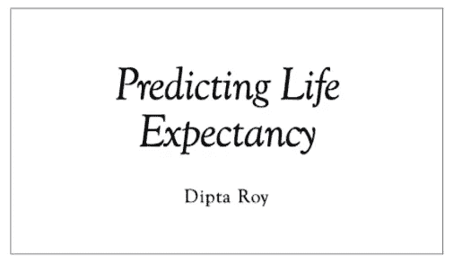
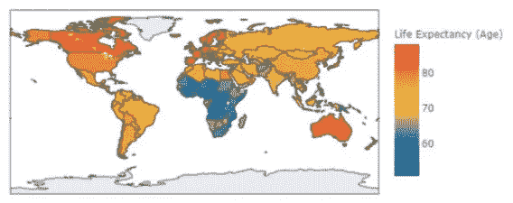
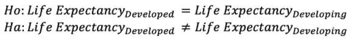
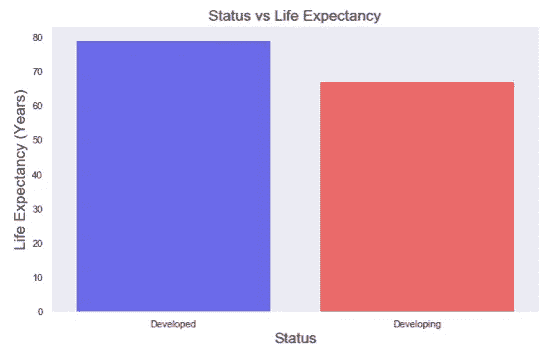
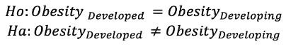

# 预测预期寿命，第 1 部分:使用统计数据获得洞察力

> 原文：<https://medium.com/analytics-vidhya/predicting-life-expectancies-part-1-using-statistics-to-gain-insight-654cb13a9866?source=collection_archive---------21----------------------->



这个博客是我的项目“预测预期寿命”的预演。如果你想进行回购或更详细地遵循这些步骤，请查看[https://github.com/roydipta/life_expectancy](https://github.com/roydipta/life_expectancy)

**试图预测预期寿命的重要性是什么？**

这个项目的目的不仅仅是预测一个人能活多久，更重要的是观察他们生活的哪些方面会导致更高或更低的预期寿命。如果我们能够找出影响预期寿命的因素；这有助于指导政策制定者制定更好的法律，有助于指导人们做出更好的生活决定，等等…

首先，我们需要数据！有三组数据被提取。来自世界卫生组织(世卫组织)的预期寿命(2000-2015 年)，来自世卫组织的各国成人肥胖率(1975-2016 年)，以及来自联合国开发计划署、世界银行和世卫组织的自杀率概览(1985-2016 年)。

我们已经有了数据，让我们开始吧！我们需要导入我们将使用的所有包，并将数据放入三个数据框中(我们稍后将解析所有内容):

```
**import** **pandas** **as** **pd**
pd.set_option('display.max_columns', 300)
pd.set_option('display.max_rows', 100)

**import** **numpy** **as** **np**
**import** **matplotlib.pyplot** **as** **plt**
%matplotlib inline
**import** **seaborn** **as** **sns**

**import** **statsmodels.api** **as** **sm**
**from** **statsmodels.formula.api** **import** ols
**from** **sklearn** **import** linear_model
**from** **sklearn.linear_model** **import** LinearRegression
**from** **sklearn.model_selection** **import** train_test_split
**from** **sklearn** **import** metrics
**from** **sklearn.preprocessing** **import** PolynomialFeatures
**from** **sklearn.preprocessing** **import** StandardScalerlife = pd.read_csv('data\life_expectancy_data.csv')
suicide = pd.read_csv('data\suicide_rates.csv')
obesity = pd.read_csv('data\obesity_data.csv', index_col=0)
```

为了让数据变得“漂亮”和可用，必须完成一大堆数据清理步骤和特征工程步骤。请查看 github 中的/data _ cleaning _ engineering . ipynb 文件，了解完整的分步数据准备。

一旦数据被清除，数据帧就被合并。这三个表合并了“国家”和“年份”列。

```
df1 = pd.merge(life, obesity, how='left', on=['country', 'year'])df = suicide.groupby(['country', 'year', 'gdp_per_capita ($)']).suicides_no.sum()
df = df.to_frame()
df = df.reset_index(level=['country',"year", 'gdp_per_capita ($)'])df2 = pd.merge(df1, df, how='left', on=['country', 'year'])
```

我们需要一个起点，所以让我们看看每个国家预期寿命的实际分布。在这一点上，我们将利用 plotly 的帮助:

```
**import** **plotly** 
plotly.offline.init_notebook_mode()
**import** **plotly.graph_objs** **as** **go**

x = df_2015.groupby("country")["life_expectancy"].mean().sort_values()
data = dict(type = 'choropleth',
            locations = x.index,
            locationmode = 'country names',
            colorscale= 'Portland',
            text= x.index,
            z=x,
            colorbar = {'title':'Life Expectancy (Age)', 'len':200,'lenmode':'pixels' })
layout = dict(geo = {'scope':'world'},title="Life Expectancy around the world in 2015")
col_map = go.Figure(data = [data],layout = layout)
col_map.show()
```



我们可以看到某种模式。乍一看，似乎越发达的国家预期寿命越长。如果你关注红色区域的国家(意味着最高的生活费用),你会注意到这些国家(加拿大、欧洲、澳大利亚)都有免费医疗。

这是一个好的开始！所以我们提到，看起来越发达的国家预期寿命越长。让我们来检验这个假设。我们可以进行两样本 T 检验来检验它。在这种情况下，我们的零假设是发达国家的预期寿命等于发展中国家的预期寿命。我们的另一个假设是，发达国家的预期寿命不等于发展中国家的预期寿命



在:

```
developed = df[df['status']== 'Developed']
developing = df[df['status']== 'Developing']
developing.life_expectancy.dropna(inplace=**True**)stats.ttest_ind(developed['life_expectancy'], developing['life_expectancy'])
```

出局:

```
Ttest_indResult(statistic=29.76836505889292, pvalue=2.4650861700062064e-170)
```

那么这意味着什么呢？我们的 p 值远低于 0.05，这是我们的置信区间，这意味着我们可以拒绝我们的零假设。如果我们看一下柱状图，我们会发现发达国家的平均预期寿命比发展中国家至少多 15 年。



嗯，现在我在想为什么会这样。在更发达的国家，应该有更好的医疗保健服务。此外，在更发达的国家，必须更好地获得食物和基本必需品。我们确实有一张肥胖表，也许我们可以看看越发达的国家是否有越多的肥胖人口。好了，让我们开始统计测试。我们的无效假设是，发达国家的肥胖与发展中国家的肥胖是一样的。我们的另一个假设是发达国家的肥胖和发展中国家的肥胖不一样。



```
developing.obesity.dropna(inplace=**True**)
developed.obesity.dropna(inplace=**True**)stats.ttest_ind(developed['obesity'], developing['obesity'])
```

出局:

```
Ttest_indResult(statistic=8.718160546902753, pvalue=4.985541604428258e-18)
```

同样，我们的 P 值是 wayyy 小于 0.05，所以我们可以拒绝我们的零假设！这是有道理的，我们能得到的食物越多，肥胖率就越高。我想我们得到了一些很好的数据。现在，我们可以实际运行一个回归，看看在预测预期寿命方面还有哪些重要的特征。寻找第二部分！:)