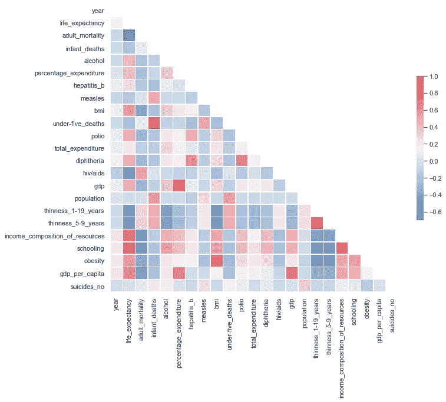
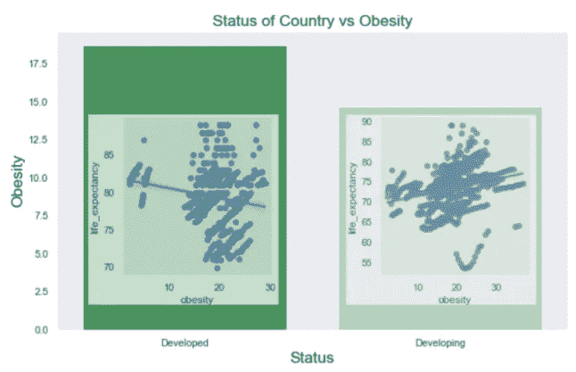

# 预测预期寿命，第 2 部分:使用线性回归

> 原文：<https://medium.com/analytics-vidhya/predicting-life-expectancy-part-2-using-linear-regression-98d1d95473?source=collection_archive---------15----------------------->


这篇博客是我上一篇博客 [*预测预期寿命，第一部分:使用统计数据获得洞察力*](https://roydipta.medium.com/predicting-life-expectancies-part-1-using-statistics-to-gain-insight-654cb13a9866) 的延续。如果你想通过 github repo 获得更详细的代码，请查看:【https://github.com/roydipta/life_expectancy。

**重述:**

在上一篇博客中，我们探讨了如何使用统计学来深入了解我们所拥有的数据。要点是:

*   较发达国家的预期寿命高于发展中国家
*   发达国家的肥胖率高于发展中国家

这些似乎是非常基本的发现，但我们可以进一步调查这些说法，看看我们是否能学到任何新的东西。

## 开始:查看相关矩阵和散点图

我们有很多功能，那么我们如何确定使用哪些功能呢？我们可以看到哪些要素相互关联，这样我们就可以避免多重共线性。为此，我们可以创建一个相关矩阵。

我们也可以通过散点图来了解每个特征与预期寿命的关系。

```
**def** CorrMtx(df, dropDuplicates = **True**):

    **if** dropDuplicates:    
        mask = np.zeros_like(df, dtype=np.bool)
        mask[np.triu_indices_from(mask)] = **True**

    *# Set background color / chart style*
    sns.set_style(style = 'white')

    *# Set up  matplotlib figure*
    f, ax = plt.subplots(figsize=(11, 9))

    *# Add diverging colormap from red to blue*
    cmap = sns.diverging_palette(250, 10, as_cmap=**True**)

    *# Draw correlation plot with or without duplicates*
    **if** dropDuplicates:
        sns.heatmap(df, mask=mask, cmap=cmap, 
                square=**True**,
                linewidth=.5, cbar_kws={"shrink": .5}, ax=ax)
    **else**:
        sns.heatmap(df, cmap=cmap, 
                square=**True**,
                linewidth=.5, cbar_kws={"shrink": .5}, ax=ax)

CorrMtx(df.corr(), dropDuplicates = **True**)
```



```
features = ['year', 'adult_mortality',
       'infant_deaths', 'alcohol', 'percentage_expenditure', 'hepatitis_b',
       'measles', 'bmi', 'under-five_deaths', 'polio', 'total_expenditure',
       'diphtheria', 'hiv/aids', 'gdp', 'population', 'thinness_1-19_years',
       'thinness_5-9_years', 'income_composition_of_resources', 'schooling', 'obesity', 'suicides_no']
n = 4
row_groups= [features[i:i+n] **for** i **in** range(0, len(features), n) ]
**for** i **in** row_groups:
    pp = sns.pairplot(data=df, y_vars=['life_expectancy'],x_vars=i, kind="reg", height=3)
```


从这些图中我们可以看出，散点图中有一些突出的特征。具体来说:学校教育、肥胖、酒精、资源的收入构成、白喉、支出百分比和发展状况。因此，我们可以对这些特征进行基线回归，看看我们做得如何。

```
ols('life_expectancy~schooling+obesity+alcohol+income_composition_of_resources+percentage_expenditure+diphtheria+status',data=df).fit().summary()
```


看起来我们的 R 平方还不错。它是 0.68，这意味着因变量的方差可以用 68%的自变量来解释。但是结果中有一些有趣的东西。如果你看看 OLS 摘要的系数标签，你会发现肥胖有正相关。这实际上没有意义，这种正相关意味着一个国家的肥胖程度越高，他们的预期寿命就越高。嗯，为什么会这样呢？这可能意味着更发达的国家更容易获得食物资源。让我们进一步研究这个问题。如果我们是对的，发达国家应该有更高的肥胖人数。我们必须拿出我们信任的 T-test！


在[13]中:

```
stats.ttest_ind(developed['obesity'], developing['obesity'])
```

Out[13]:

```
Ttest_indResult(statistic=8.718160546902753, pvalue=4.985541604428258e-18)
```

在[74]:

```
y = df.groupby(['status']).obesity.mean().fillna(0)
x = y.index;
figure, ax = plt.subplots(figsize = (10,6));
sns.barplot(x,y, palette="Greens_r");
sns.set(style='dark')
ax.set_title('Status of Country vs Obesity', fontdict={'fontsize':'x-large'});
ax.set_xlabel('Status', fontdict={'fontsize':'x-large'});
ax.set_ylabel('Obesity', fontdict={'fontsize':'x-large'});
```



这里的图像叠加了回归分析

由于我们的 P 值远低于 0.05 的置信度，我们可以拒绝零假设。因此，我们可以自信地说，平均而言，发达国家的肥胖率高于非发展中国家。但是有件有趣的事。将发达国家和发展中国家的肥胖和预期寿命的相关性分开，我们可以看到，在发展中国家，随着肥胖指数的增加，预期寿命也增加。而在更发达的国家，随着肥胖症的增加，预期寿命降低。