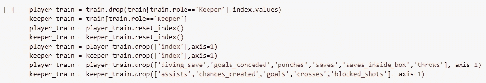

# 利用机器学习预测足球运动员的比赛评分

> 原文：<https://medium.com/analytics-vidhya/predicting-match-ratings-of-football-players-using-machine-learning-51bf7a5ab6ad?source=collection_archive---------12----------------------->

利用机器学习技术，借助比赛数据预测足球运动员的比赛评分。

演职员表:【https://all-free-download.com/ 

**足球**或**英式足球**(美国人称之为足球)是一项深受全世界数百万人喜爱的游戏。一天，在检查玩家表演时，我突然想到**玩家评分**可以借助**机器学习**技术**预测**。因此，我查阅了公共数据集，但找不到我要找的那种数据。因此，我做了一些网络搜集，从各种联赛收集了 2019-20 赛季的数据，如**英超、西甲、德甲、意甲、欧冠**等。在 ka ggle([https://www . ka ggle . com/sanjit 1105/soccer-players-stats-and-ratings-match wise](https://www.kaggle.com/sanjit1105/soccer-players-stats-and-ratings-matchwise))上可以找到。所以，让我们开始吧！

功能描述

数据集有 47 个特征，我们的**目标变量**是**“评级”**，范围从 0 到 10。如果我们看一下我们的数据集特征，我们会发现大多数特征都是数值特征，其中值的增加或减少会极大地影响结果或预测。我们将缩放一些值，但有些值并不完全可缩放，因此我们将保持不变。存在分类特征，例如 is_a_sub、was_subbed、黄牌和红牌。

# **数据探索**

让我们从导入。csv 文件和库，如 **pandas** 、 **seaborn** 、 **matplotlib** 和 **numpy** ，因为它们在以后可能会有用。

导入库

导入数据集

如果我们检查数据集的维度，它的形状是(22555，47)

火车形状

让我们检查数据集中的目标变量分布。这看起来几乎像一个**正态/高斯**分布。

目标变量分布

让我们检查训练数据集的**关联图**，这将使我们了解这些特征以及它们对**目标特征(“评级”)**的**种影响**。

代码实现见 train.corr()

目标变量的相关图

相关图表明，对于**目标特征(“等级”)**，大多数特征与**正**相关，但是诸如**、【失球】、【天线】**的特征与**负**相关。此外，诸如**“射击 _ 开 _ 目标”**之类的特征比**“射击 _ 关 _ 目标”**更相关。诸如**“进球”、“机会 _ 创造”、“假摔 _ 扑救”、“关键 _ 传球”**和**“助攻”**的特征比其他特征具有更高的相关性。对于一个对足球有基本了解的人来说，所有这些特征都具有更高的重要性这一事实将会有明确的意义。

我们来看看**按照**玩家**角色的数据**分布。

数据中的角色分布

好的，所以数据集中的**门将**的数量是其他角色中最少的**，这是可以理解的，因为考虑到换人，每场比赛只能有一到两名门将。现在，让我们看看数据集中的空值。**

具有空值的要素

因此，我们观察到有许多具有空值的要素。让我们检查属于**保管员**的记录数和其余的记录数。我们稍后将回到这一点。

属于守门员和其他人的号码记录(例如，中场、后卫和前锋)

# 特征工程

如果我们用 **train.describe()** 检查数据的分布，我们会注意到特征**“acted _ as _ sweeper”**和**“shots _ women”**都有零值。因此，我们可以安全地删除这些列。

丢弃不相关的功能

如果我们检查一下 **train.info()** 我们可以看到有些特性的数据类型为 **float** 但实际上是特性(*像* ***进球 _ 失球*** *，* ***助攻*** *和* ***有些*******分类特性【T58 在继续之前，让我们将它们转换成 int。****

将只能包含整数数据的列(包括分类列)转换为 int

回到空值，我们可以看到在一些特性中，空值的计数与作为**保存者**和非保存者的记录的计数相同。这同样适用于一些特征，如“**假摔 _ 扑救”、“扑救”、“出拳**次数”等。是守门员专属的，而“**进球”、“机会 _ 创造”**是进攻者、中场和防守者专属的(或者至少是训练数据集)。此外，具有空值的诸如 was_subbed、yellow_card 和 red_card 之类的特征可以被认为是如描述中所述的 0。因此，我们可以将所有这些值填充为零。在特性“**role”**中有 6 个空值，我只是通过谷歌搜索它们的名字来填充，但是如果愿意的话，可以完全删除它们。

对于特性，**“通过 _ 成功”**如果我们看一下**“准确 _ 通过”**和**“通过”**列，我们可以观察到**“通过 _ 成功”**基本上是**“准确 _ 通过”**和**“通过”**的**百分比。**

检查 pass _ success = accurate _ passes/passes

此外，如果我们查看一下 **"pass_success"** 的 NA 值，则**" accurate _ passes "****" passes "**(如上所述)的**有效**和**不为空**的值可以很容易地计算出来。

在填充值时，我们需要删除列**“pass _ success”**中的“%”符号。还有一个特征**“shot _ accuracy”**，其中有“%”符号。我们移除符号并将值除以 100。对于 **"pass_success"** 中的空值，我们收集具有 **"passes" > 0** 的索引，因为我们想要**防止 **"passes" = 0 的值被零除**。**我们还将其余特征的 NA 值填充为 0。

通过将精确次数除以次数来填充“成功次数”列

将其余列(目标变量除外)的 NA 值填写为 0

现在，我们只剩下目标变量，它仍然有空值。让我们来看看**“Rating”**的空值数据的记录，并检查**“minutes _ played”**与其计数之间的**关系**。

空评分值的分钟数分布

因此，**记录**中的**大部分**来自游戏时间不到 10 分钟的玩家。现在，这种模式也是有意义的，因为在球场上待了不到 10 分钟的**球员****几乎没有机会**对比赛产生任何影响，并且可能以很少的统计数据结束。因此，我们可以删除所有记录并继续。但是，一些足球爱好者可能会争辩说，有时是替补球员决定了比赛的胜负，无论是进球、助攻还是最后一分钟的精彩扑救，除了替补球员，可能还有球员在比赛的前几分钟被红牌罚下，或者受伤，不得不被替换。

在剩余的 1332 个零评级值中，13 个被替换，1320 个被替换

**玩 10 分钟以上**且**空评分值**的玩家**数量**极少，那些**记录**被**删除**。

删除评分和播放分钟数大于 10 的空值记录

对于剩下的记录(利用我在足球领域的知识)，我决定**根据那些球员的**关键表现**和**是否被裁判出示**(**红牌或黄牌**)来填写评分**的 NA 值。以下是我使用的标准:

填写 NA 评级值的标准

现在，让我们用代码实现以上内容。

评级调整的实施

现在，特性已经准备好了，我们需要做的最后一件事就是**缩放**特性中的值。如果你还记得，我们谈到过这样一个事实，即我们不能缩放所有的数字特征，因为诸如**【进球】****【助攻】****【扑救】**或**【创造的机会】**等特征没有这样的上限。任何球员都可以在一场比赛中得分或提供任意次数的传球或助攻。因此，**根据训练数据缩放**值将是一个可怕的想法，特别是如果你想通过将它集成到网络平台或 Android 平台来制作实时预测器。但是，有一个我们可以调整的功能，那就是**“minutes _ played”**，因为一个玩家可以玩的分钟数只能在 0-120 之间(考虑到平局情况下的加时赛)。让我们继续使用 **sklearn 来缩放列**“minutes _ played”**。最小最大缩放器**。

使用 MinMaxScaler 计算“已播放的分钟数”

# 特征抽出

在进行数据探索和特征工程时，我们注意到**只有一些特征**对**管理员**来说是**重要的**。对于守门员角色，诸如**【进球】****【助攻】****【扑救】**或**【创造机会】**的特征无论如何都被填充为 0。所以，我觉得把训练数据拆分成**守门员 _ 模型(守门员)**和**球员 _ 模型(进攻者、防守者和中场)**会更好。因此，我们可以**移除与**保管员**和**非保管员**和**不相关的**特征**，并根据这些数据训练模型**。让我们用代码实现它。**

训练数据分为球员训练和守门员训练

现在，我们已经为**守门员**和**球员(非守门员)**准备了**两个独立的训练数据文件**，我们还需要处理分类特征**“角色”**。因为在 **keeper_train** 中只能有一个值，即 keeper，所以我们可以完全删除该列。但是，在 **player_train** 的情况下，我们需要在前进之前对**“role”**列进行编码。我这里用了 **pandas.get_dummies()** 。我们还需要从两个数据集中移除**“player _ id”**和**“name”**特征，因为唯一值在训练期间是不相关的。

删除不相关的列，对 player_train 的“角色”特性进行编码

# **模型准备和培训**

现在让我们**将**数据集分割成**数据，并为**玩家 _ 训练**和**看守 _ 训练**标注**。

将每个训练数据集分割成数据和标签(目标变量)

*我没有将数据集分为训练数据集和测试数据集，因为我的目的是对这个项目进行端到端的实现*。我确实创建了一个测试数据集来测量准确性。但是，我的目的是建立一个模型，通过从互联网上收集球员统计数据，可以用来预测任何足球比赛的收视率。

因此，如果您愿意，可以将此数据集分为训练和测试两部分。使用我使用的测试数据集， **XGBoost 回归**为**玩家 _ 训练**提供了最佳结果，而**支持向量回归**为**看守者 _ 训练**模型提供了最佳结果。此外，测试数据集可以很容易地收集，因为足球比赛每隔一天举行。*这只是为数不多的可行方法之一，我们总是可以以不同的方式预处理数据，或者收集更多的训练数据。*

我在 Heroku Cloud 上用 React 和 Flask 集成了这个。随意尝试一下(【https://player-match-rating-predictor.herokuapp.com/[)。](https://player-match-rating-predictor.herokuapp.com/)

我希望这对刚接触数据科学的人有所帮助，并且足够简单。我知道我可能错过了很多东西。因此，任何类型的建议或改进是赞赏的。 ***快乐编码！***