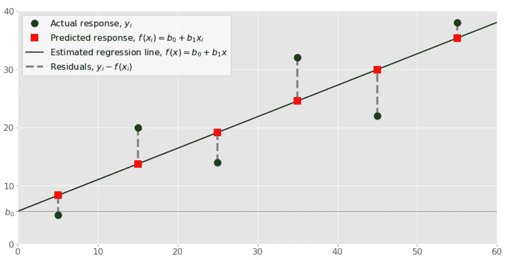

# 预测医疗保险成本—机器学习

> 原文：<https://medium.com/analytics-vidhya/predicting-medical-insurance-costs-machine-learning-e1e4e7c4e8ed?source=collection_archive---------0----------------------->

## 在本文中，我们将应用机器学习的基本算法:**线性回归**，来预测医疗保险费用。


在进入我们的会议之前，让我们快速看几个机器学习最常用的应用。

➡️推荐引擎
➡️模式和图像识别
➡️预测房价
➡️预测设备故障
➡️在线欺诈检测
➡️智能呼叫路由
➡️员工监控…

在我们的日常生活中，还有很多我们有时甚至不会注意到的事情..，如在特定时间设置闹钟、估计优步乘车费用、安排乘车时间、主要电子邮件和垃圾邮件过滤、网络搜索结果、在智能手机上获取通知和提醒、购物推荐通知等。

让我们开始我们的课程，看看我们能涵盖哪些内容:

*   我们将通过一个简短的介绍来理解机器学习的基础。
*   机器学习的类型。
*   了解线性回归算法。
*   将线性回归模型应用于医疗保险数据集，以预测个人的未来保险成本。


> 机器学习是一种数据分析方法，它向计算机发送指令(可编程代码)，以便它们可以从数据中学习。然后，基于学习到的数据，他们为我们提供预测的结果/模式。在机器学习的帮助下，我们可以开发能够自主决策的智能系统。

## **机器学习的类型:**

机器学习可以分为以下 3 种类型

> ***监督学习*** *当我们已经标记了数据，并试图根据已知特征(输入变量)预测一个标签(目标)时，使用算法。这通常用于历史数据预测未来可能事件的应用程序中。*

例如，它可以尝试根据我们有历史价格数据的产品的不同特性来预测产品/汽车/房子的价格。

> ***无监督学习*** *当我们拥有未标记的数据，并试图根据特征将相似的数据点组合在一起时，会使用算法。这主要用于探索数据和发现其中的一些结构。*

例如，它可以基于不同的输入来识别图像(猫或狗),这些输入将相似的片段分组在一起，然后尝试正确地识别图像。这是一种无监督的学习，机器不是被教授，而是从数据中学习(在这种情况下，是关于狗或猫的数据)

> ***强化学习*** *当计算机系统在特定环境中接收数据，然后学习如何使其结果最大化时，就会发生强化学习。这意味着该模型继续学习，直到达到最佳可能行为*。*强化学习经常用于机器人、游戏和导航。*


机器学习的类型

## 线性回归算法:

线性回归是第一个基于'**监督学习'**'的机器学习算法。线性回归执行的任务是根据给定的自变量(x)预测因变量值(y)。

当只有一个输入变量(x)时，该方法称为'**简单线性回归'**。当有多个输入变量时，该方法称为**‘多元线性回归’。**

> 简单回归方程:Y = A + B * X
> 
> X →输入变量(训练数据)
> B→X 的系数
> A →截距(常数)
> Y →预测值(由 A、B、X 计算)



简单线性回归的例子

> ***让我们通过下面的练习更清楚地理解这个模型，在这个练习中，我们对数据集应用线性回归。***

“医疗保险”的数据集(insurance.csv)可以从 [Kaggle 下载。](https://www.kaggle.com/mirichoi0218/insurance)

## 列描述:

**-年龄:**第一受益人年龄
**-性别:**第一受益人性别
**-身体质量指数:**身体质量指数(提供对身体的了解，体重相对于身高是高是低)
**-儿童:**健康保险覆盖的儿童人数/受抚养人人数
**-吸烟者:**吸烟(是，否)
**-地区:【地区**

## 理解数据:

```
import pandas as pd
**insurance** = pd.read_csv("insurance.csv")
insurance.head()
```

****

```
# Replacing string values to numbers
**insurance['sex']** = insurance['sex'].apply({'male':0,      'female':1}.get) **insurance['smoker']** = insurance['smoker'].apply({'yes':1, 'no':0}.get)**insurance['region']** = insurance['region'].apply({'southwest':1, 'southeast':2, 'northwest':3, 'northeast':4}.get)
```

**现在让我们看看数据集，**

****

**所有特征变量现在都是数字格式**

## **探索性数据分析**

**让我们创建一些简单的图表来检查数据。**

```
import seaborn as sns# Correlation betweeen 'charges' and 'age' 
sns.jointplot(x=insurance['age'],y=insurance['charges'])
```

****

***这里我们看到，随着年龄的增长，健康保险的费用也呈上升趋势***

```
# Correlation betweeen 'charges' and 'smoker' 
sns.jointplot(x=insurance['age'],y=insurance['charges'])
```

****

**0:不吸烟，1:吸烟**

**这里我们看到吸烟者的费用比不吸烟者高**

## **训练线性回归模型**

**现在，让我们按照以下步骤开始训练我们的回归模型**

****步骤 1:** 首先，我们将把数据分成包含特征的“X”数组和包含目标变量的“y”数组。**

****

```
# features
**X** = insurance[['age', 'sex', 'bmi', 'children','smoker','region']]# predicted variable
**y** = insurance['charges']
```

****

****步骤 2:** 接下来，我们将把数据集(insurance.csv)分成训练集和测试集。我们将在训练集上训练我们的模型，然后使用测试集来评估模型(预测“y”变量)。*请注意，我们还会将测试集的预测结果与实际结果进行比较。***

**首先，我们将导入所需的库**

```
# importing train_test_split model
from sklearn.model_selection import train_test_split# splitting train and test data
X_train, X_test, y_train, y_test = train_test_split(X, y, test_size=0.4)
```

**“test_size”表示 30%的数据用于测试数据，其余的用于训练集。**

**我们可以快速检查训练数据集和测试数据集的记录数量**

```
len(X_test) # 402
len(X_train) # 936
len(insurance) # 1338
```

****第三步:训练和测试模型****

**现在我们有了训练和测试数据集，我们可以使用线性回归来评估模型，如下所示**

```
# importing the model
from sklearn.linear_model import LinearRegressionmodel = LinearRegression()
# Fit linear model by passing training dataset
model.fit(X_train,y_train)
```

****第四步:我们模型的预测****

```
# Predicting the target variable for test datset
predictions = model.predict(X_test)
```

**这里我们将“X_test”传递给我们的模型来预测“y_test”**

****

**预测值**

****步骤 5:比较结果****

**让我们通过绘制图表来比较这些“预测”结果和实际结果。**

```
import matplotlib.pyplot as pltplt.scatter(y_test,predictions)
plt.xlabel('Y Test')
plt.ylabel('Predicted Y')
```

****

**预测结果和实际结果之间的相关性。**

**我们可以计算“均方根误差”来检查模型性能，使用回归评估指标来查看模型行为并决定哪个模型最适合。**

**现在让我们继续我们的基础知识，并尝试预测新客户的保险费用**

```
# Predict charges for new customer : Name- Frank
data = {'age' : 40,
        'sex' : 1,
        'bmi' : 45.50,
        'children' : 4,
        'smoker' : 1,
        'region' : 3}
index = [1]
frank_df = pd.DataFrame(data,index)
frank_df
```

****

```
prediction_frank = model.predict(frank_df)
print("Medical Insurance cost for Frank is : ",prediction_frank)
```

****

****结论****

**在本文中，我们探讨了线性回归模型的基本原理，并将其应用于预测费用，了解了预测结果和实际结果之间的相关性。我希望这篇文章对你有用，并对线性回归模型有一些基本的了解。**

****

**请在下面的评论区留下您的评论/反馈。**