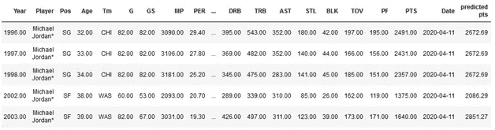
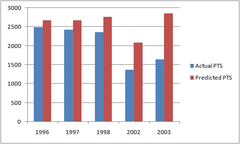

# 用机器学习预测迈克尔·乔丹的得分

> 原文：<https://medium.com/analytics-vidhya/predicting-michael-jordons-scoring-with-machine-learning-2dea898b9e5b?source=collection_archive---------14----------------------->

我从 Kushagramati Analytics 开始了我在浩瀚的数据世界中的旅程。至少可以说，这份工作给我提供了非同寻常的培训途径，学习的自由也极大地鼓舞了我。我从学习 Python、Pandas 和 Numpy 开始，随后转向 ML 概念。由于我对篮球运动的热情，以及除了预测乔丹的得分，还有什么更好的方式来开始我的预测分析之旅，我决定使用 NBA 数据集(截至 2017 年，在 [Kaggle](https://www.kaggle.com/drgilermo/nba-players-stats) 上找到的)作为我学习的一部分。

我从数据的标准探索开始了我的项目。我把他 15 个赛季的职业生涯分成 10 个赛季作为 ML 模型的训练集，5 个赛季作为测试集。我使用的 ML 模型是线性回归。

使用线性回归，我得到了下面的等式:

```
The equation yielded was PTS = -178.5739 + 34.7715*G and fitting without intercept was PTS = 32.4790*GPTS = 34.7715*G + pos_coef
```

SG pos coeff =-178.57——迈克尔作为得分后卫，这是我为他得到的系数。

与该模型相关的错误有:

```
MSE is 432839.0, RMSE is 657.9
```

这是我最终得到的:



***测试数据集与预测点***



预测点与实际点

看起来我的模型高估了乔丹的平均得分，但我可以原谅它在山羊身上犯的那个错误。目前，我正在研究如何提高精确度，我已经学习了很多关于各种 ML 模型的知识。

在我在大联盟的下一个小尝试中，我将着眼于预测洛杉矶湖人队季后赛的结果。