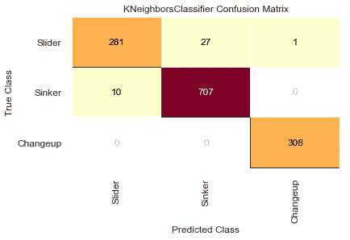

# 预测 MLB 音高等级

> 原文：<https://medium.com/analytics-vidhya/predicting-mlb-pitch-classes-8c8163cd6c41?source=collection_archive---------14----------------------->

## 错过了比赛？构建 K-最近邻分类器。

最近，我在做一个涉及棒球数据的项目——特别是投球数据——遇到了一个问题。这些数据是在[棒球专家](http://baseballsavant.com)获得的，包括克里斯·塞尔(当时是芝加哥白袜队的)在 2015 年和 2016 年投掷的每一个球，总计超过 6500 个球。然而，其中大约有 75 个丢失了音高类型分类标签。

换句话说，我可以检索一个俯仰观察值，并知道它以 6.396 英尺的释放距离向本垒板投掷，或者它在轨迹中以每分钟 2093 转的速度从左向右移动了 1.161 英尺；但是我不能确定那是快速球、变速球还是滑球——这些信息对我预测投手疲劳和受伤危险信号的最终目标非常重要。

虽然我不能回到 2015-2016 年观看这些比赛，但我可以做的是建立一个 K-最近邻模型，为我生成球场类型标签。尽管我在我的棒球项目中使用了它，但是当你打算使用机器学习来快速解决像我这样的多类问题时，也可以采取类似的方法。


图片来自 [Pixabay](https://pixabay.com/?utm_source=link-attribution&amp;utm_medium=referral&amp;utm_campaign=image&amp;utm_content=1499783) 的[基思·约翰斯顿](https://pixabay.com/users/KeithJJ-2328014/?utm_source=link-attribution&amp;utm_medium=referral&amp;utm_campaign=image&amp;utm_content=1499783)

答在尽可能彻底地清理完我的数据后，下一步是只收集对预测`Pitch_Name`有用的特征，然后从没有`Pitch_Name`值缺失的行中筛选出`Pitch_Name`值缺失的行。当我说*有用的*时，我指的是合理描述或表征特定类型音高的信息。例如，我不需要`Inning`(因为任何类型的投球都可以在任何一局中进行)，但我确实想引入`Release_Speed`，因为每种类型的投球在速度方面都有自己的均值和标准差。

```
# data subset to be used in KNNpitch_metrics = data[['Release_Speed', 'Release_Point_X',
                      'Release_Point_Z', 'Horizontal_Movement',
                      'Vertical_Movement', 'Velocity_X',
'Velocity_Y','Velocity_Z', 'Acceleration_X', 'Acceleration_Y', 'Acceleration_Z', 'Perceived_Speed', 'Release_Spin_Rate',
'Release_Extension', 'Release_Point_Y',
'Pitch_Name']]
```

然后我想把缺少`Pitch_Name`的行和没有缺少的行分开:

```
# make subset of data where labels are not missing
pitchname_notnull = pitch_metrics[pitch_metrics['Pitch_Name'].notnull()]# make subset of data where labels are missing
pitchname_isnull = pitch_metrics[pitch_metrics['Pitch_Name'].isnull()]
```

接下来，使用`pitchname_notnull`，我将我的目标(`Pitch_Name`)从剩余的数据中分离出来，然后将它们分别划分为训练集和测试集。

```
# data, with target dropped (X)
pitchname_notnull_data = pitchname_notnull.drop(columns='Pitch_Name')# labels, or target (y)
pitchname_notnull_labels = pitchname_notnull['Pitch_Name']# split into train and test sets
X_train, X_test, y_train, y_test = train_test_split(pitchname_notnull_data,
pitchname_notnull_labels, test_size=0.20, random_state=55)
```

因为 KNN 是一个基于距离的分类器，如果数据的各种特征在不同的尺度上(像我一样)，那么更大尺度的特征将对点之间的距离产生更大的影响。

对此的补救方法是对数据进行归一化，即确保所有数据都以相同的比例表示。(注意，这只能在将数据分成训练集和测试集之后*进行，以避免“数据泄漏”，当测试集的信息泄漏到训练集或使训练集失真时，就会发生“数据泄漏”。)*

为了缩放我的数据，我使用了`sklearn.preprocessing`模块中的`StandardScaler`。

```
# Instantiate StandardScaler
scaler = StandardScaler()# Transform the train and test sets
scaled_data_train = scaler.fit_transform(X_train)
scaled_data_test = scaler.transform(X_test)# Convert into a DataFrame
scaled_df_train = pd.DataFrame(scaled_data_train,
                               columns=X_train.columns)
```

现在，对数据进行适当的预处理后，就可以训练 KNN 分类器并验证其准确性了。在每次迭代中，我下面使用的自定义函数将…

*   搜索“K”的最佳值，
*   将分类器安装到训练数据中，然后…
*   为`X_test`(现在的`scaled_data_test`)生成预测。

使用最佳 K 值生成预测后，该函数将计算并打印评估指标和混淆矩阵。(这个自定义`find_best_k`函数的完整代码可以在本文的底部找到。)

```
find_best_k(scaled_data_train, y_train, scaled_data_test, y_test)
```



使用 Yellowbrick 的[混淆矩阵](https://www.scikit-yb.org/en/latest/api/classifier/confusion_matrix.html)可视化工具制作

结果相当令人鼓舞，正如你可能已经从上面的图表中收集到的那样。具体的评估指标如下:

```
Best Value for k: 9
Accuracy: 0.972
Precision: 0.975
Recall: 0.965
F1-Score: 0.974
```

使用 9 的“K ”,是时候继续为缺少这些标签的 76 行生成`Pitch_Name`预测了。

```
# set data apart from empty labels
pitchname_isnull_data = pitchname_isnull.drop(columns=’Pitch_Name’)# make array of the empty labels
pitchname_isnull_labels = pitchname_isnull[‘Pitch_Name’]# Instantiate StandardScaler
scaler = StandardScaler()# Transform the data
scaled_data = scaler.fit_transform(pitchname_isnull_data)# Convert into a DataFrame
scaled_df_data = pd.DataFrame(scaled_data,
columns=pitchname_isnull_data.columns,
index=pitchname_isnull_data.index)
```

然后，终于到了生成预测来替换`Pitch_Name`下的空值的时候了。

```
# Instantiate KNeighborsClassifier
knn = KNeighborsClassifier(n_neighbors=9)
# Fit the classifier
knn.fit(scaled_data_train, y_train)
# Predict on the data
data_preds = knn.predict(scaled_df_data)
```

结果是一个类似这样的数组…

```
array(['Sinker', 'Sinker', 'Slider', 'Sinker', 'Sinker', 'Sinker',
       'Sinker', 'Sinker', 'Sinker', 'Sinker', 'Changeup', 'Sinker',
       'Sinker', 'Changeup', 'Sinker', ...], dtype=object)
```

然后我把它变成了一个相框:

```
# Convert new predictions into DataFrame
# Set index to match original DataFrame (`data`) where ‘Pitch_Name’ values are missingpredictions = pd.DataFrame(data_preds,
 columns=[‘Pitch_Name’], index=pitchname_isnull_labels.index)
```

此时，我终于准备好用我生成的新预测值替换原始数据帧的`Pitch_Name`列中的空值。

```
data['Pitch_Name'].fillna(value=predictions['Pitch_Name'], inplace=True)
```

这样，数据框就没有了缺失的标签，我也能够避免丢弃 76 个完全可弥补的观察结果。

上面使用的“find_best_k”函数的完整代码