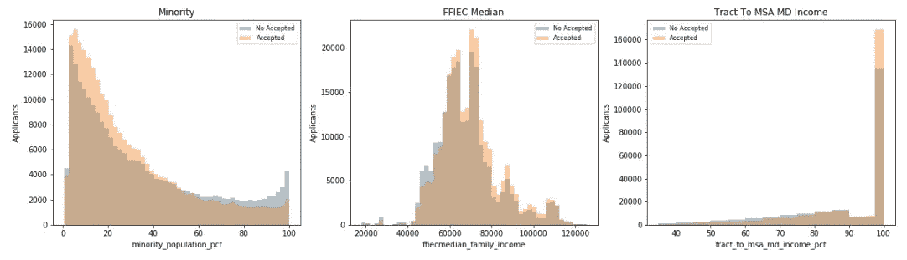
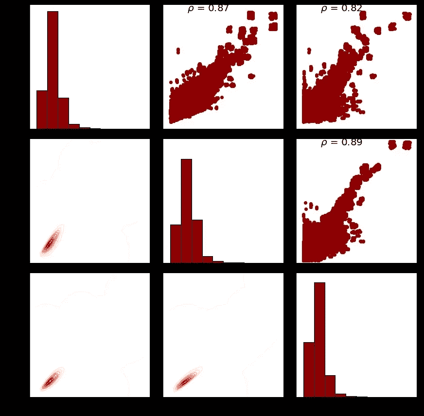

# 预测抵押贷款批准:使用 Azure ML Studio 进行数据分析和预测

> 原文：<https://medium.com/analytics-vidhya/predicting-mortgage-approvals-data-analysis-and-prediction-with-azure-ml-studio-part-1-8629d2f938a8?source=collection_archive---------6----------------------->

## 第一部分

图片由来自 Pixabay 的 Alexander Stein 提供

这是“预测抵押贷款批准”的第 1 部分，在第 2 部分中，我将向您展示 Azure Machine Learning Studio 上的分类模型。

# 面向初学 Python 的数据科学家的简单快速 EDA

这篇文章是一个 EDA(探索性数据分析)的介绍和例子。我们的目标是探索和分析数据。最后，我们将设计一个模型，根据给定的数据集预测抵押贷款申请是被接受还是被拒绝，该数据集改编自联邦金融机构考试委员会(FFIEC)的数据集。这个模型将在下一篇文章中描述。

数据包含申请人、贷款特征和金额、地点和人口等变量。基本上，我们探索、分析数据，并寻找数据变量之间的洞察力和关系。然后我们将其转换为更强大的预测形式，如果有必要的话，并建立一个机器学习模型来预测我们的目标变量。我们可以评论一些结论和想法:

*   许多数值中存在异常值(或数据错误)。
*   我们可以看到，购房贷款比住房再融资贷款更容易被接受
*   贷款受理不受贷款类型或房产类型的影响。无论是常规贷款还是政府担保贷款。
*   大多数申请人是白人，而不是西班牙裔和男性，其录取率是积极的。但来自黑人、西班牙裔人或女性的请求会被略微拒绝。
*   贷款人是一个有太多不同值的分类变量，使用一个与贷款人接受率相关的新变量是一个更好的预测选项。
*   贷款金额低于 10 万的申请更容易被拒绝。当高于 15 万英镑时，他们更有可能被接受。
*   收入在 75，000 英镑以上的申请者更有可能被录取。
*   来自超过 60%的人口是少数民族的地方的申请人可能会被拒绝。即使在少数民族比例较低的地区，收入相对较高的申请人也可能被拒绝

## 数据探索

我们的第一步是对所提供的数据集进行一个简短的探索，我们希望获得一些关于数据集的快速见解或想法。首先，我们列出所有的列、数据类型、行数…

数据集的列

因此，我们有 500，000 条数据记录，分组在 23 个数据列中，其中大部分是数字，一些列有缺失值，一个变量是布尔型的。将数据与问题描述进行比较，我们实际上可以定义两组变量:

*   分类(数字，但不是“数字”或定量值):贷款类型、财产类型、占用、预批准、msa_md、州代码、县代码、申请人种族、申请人种族、申请人性别、贷款人、共同申请人
*   Numerical:贷款金额、人口、少数民族人口百分比、ffiecmedian 家庭收入、业主自住单元数、1 至 4 个家庭单元数……
*   标签:接受，这是我们的目标变量

因此，接下来我们应该检查数据集的简短描述性摘要，显示主要的统计特征。对于分类变量:

描述数据集上的命令

这一简短的数据分析给了我们一些有用的信息:

*   许多分类变量几乎对每一行都采用相同的值:propery _ type、occupancy 和 preapproval。
*   几乎每一行的批准值“不适用”。
*   申请人的种族、民族和性别主要有两个值，我们稍后将深入探讨。
*   很多行中没有关于位置的完整信息，这个变量应该是一个重要的变量。
*   大多数数字特征中存在大量异常值(或数据错误)。尤其是贷款金额和申请人收入。Loan_amount 平均值约为 200，但最大值高于 100，000，标准差接近 600。看起来数据中有一些错误值。
*   总的来说，数据集在被接受和未被接受的申请之间似乎是平衡的

让我们深入研究我们拥有的每一种数据，寻找更多有用的信息。

## 探索分类数据

首先，用一个基本的箱线图来确定值是如何沿其范围分布的:

我们使用箱线图来查看值是如何沿范围分布的，许多图显示大多数行都有唯一的值，我们应该探究标签变量分布是否受这些特征的影响。让我们绘制一些比前面更丰富的图形:

现在展示一些想法:

*   我们可以看到，购房贷款(贷款目的= 1)比住房再融资贷款(贷款目的= 3)更容易被接受。
*   贷款受理不受贷款类型或房产类型的影响。无论是传统贷款还是政府担保贷款，他们都有相同的机会。但是大多数申请是传统贷款(贷款类型= 1)和一至四户家庭的房产(房产类型= 1)
*   业主的主要住宅(入住率= 1)是最常见的应用

对于与申请人相关的特征，我们进行相同的分析:

*   大多数申请人是白人(5 人)，而不是拉丁裔(2 人)和男性(1 人)，其接受率是积极的
*   而黑人(3)、西班牙裔(1)或女性(2)的要求则略有拒绝。但是差异太小，我们不能确认它是一个判别因素
*   我们意识到，不提供这类信息的申请人往往不会被接受，因此这些信息似乎与贷方相关。

贷方变量是一个特殊的特性，有许多不同的值，如下图所示:

贷方变量直方图

当我们仅定义 10 个箱时，显示出某种线性增加趋势。但是当箱的数量增加时，趋势变平，正如所假设的那样，但是一些峰值出现了。我们需要转换这些数据，以便获得任何种类的信息。我们认为贷款人的接受率是一个很好的信息，所以对于每个贷款人，计算其接受率，我们还需要减少类别的数量:6100 对于分类变量来说是不可接受的。然后我们决定定义接受比率的级别:0 级表示 0%，1 级表示 0-12.5%比率接受，2 级表示 12.5%-25%，依此类推。

大多数贷款人的接受率在 0.5 到 0.9 之间，中位数约为 0.7。所以在接受贷款方面有一些积极的趋势。

目前等级的数量还没有确定，但是 8 级看起来是个不错的选择

## 位置特征

*   这些列中有许多记录缺少值(-1)，其中许多记录不被接受。
*   所有这些都是缺失值的记录(每列都为-1):这些行中有许多缺失值，可能无法推断出它们的更多信息。

state 变量的值介于 0 和 52 之间，但是没有值为 51 的记录，因此它缺少的值可以用值 51 替换。也许在数据处理过程中出现了某种错误，或者它们只是丢失了。申请人平均分布在所有 MSA MD 值上，因此州可能是表示位置的最佳特征。

## 探索数字变量

要分析的下一组特征是数字特征，我们绘制了一些图表来显示它们的分布:

*   我们在箱线图上几乎看不到四分位数之间的范围，因此存在许多异常值/误差。接受和不接受的应用程序分布之间没有显著差异，即使在异常值之间也是如此。
*   贷款额在 5 万以下的申请可能会被拒绝，5 万到 10 万之间的也有可能。当贷款金额高于 15 万英镑时，申请更有可能被接受。
*   当申请人收入低于 75，000 英镑时，他们更有可能被拒绝。

我们对其他数字特征重复相同的过程:

*   在少数民族人口比例较低的地方，他们的申请人往往会被接受。当 60%的人口来自少数民族时，被拒申请的人数会增加。
*   正如我们之前发现的，申请人收入的中位数越低，接受贷款的可能性就越小。低于 55，000 美元，拒绝贷款的比例更大。

有两个特征呈现正态分布，但我们无法从中发现任何显著的事实。

## 分析数值变量之间的关系

此时，我们对这些特性以及接受率如何依赖于这些特性有了一些了解。下一步，分析这些特性之间的关系。所以散点图是我们获得这种洞察力的工具:

所有数字特征的散点图矩阵

*   变量贷款金额和申请人收入之间的关系，相对于其余变量，使我们能够确定接受和不接受的贷款。
*   人口、1-4 个家庭单元的数量和自有住房单元的数量之间有很强的线性相关性。

我们想重点介绍一些似乎揭示了一些非凡想法的功能:

*   贷款金额的高值和申请人的低收入很可能会被拒绝。
*   在少数民族人口比例很高的地方，没有高贷款额的申请，也没有被接受或不被接受。
*   在少数民族比例高的地区，即使收入相对较高的申请人也会被拒绝

下一步将是根据刚才分析的特征设计和建立一个预测模型。在下一篇文章中，我们将描述一个在 Azure Machine Learning Studio 中设计的模型。

然后[我们可以使用 Azure Machine Learning Studio 建立一个预测模型](/@edumunozsala/predicting-mortgage-approvals-data-analysis-and-prediction-with-azure-ml-studio-part-2-2c190e83c9f4)，点击链接即可访问。